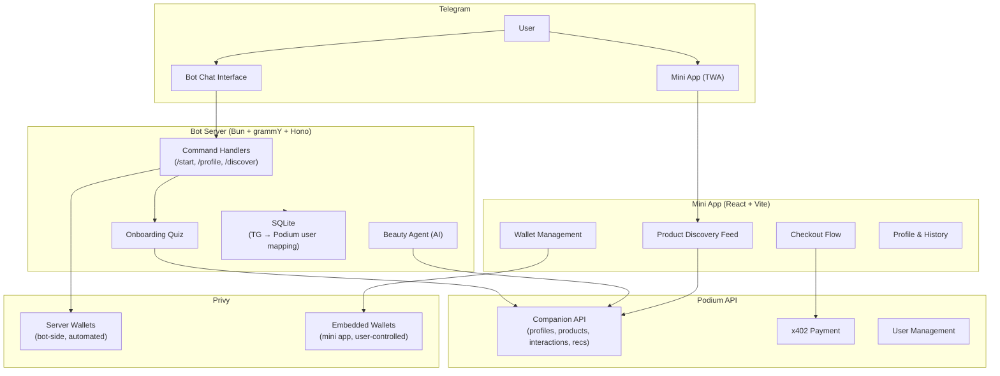

## What We're Building

The Beauty Companion is a **personal shopping agent** delivered as a Telegram bot with an accompanying mini app. It demonstrates how to compose Podium's generalized Companion API into a complete consumer experience for a specific vertical (skincare and beauty).

The same architecture works for any product domain — fashion, food, supplements, electronics. The Podium primitives are vertical-agnostic; only the profile fields and product catalog change.

<Info>
  The Beauty Companion source code will be published as an open-source reference app soon. Stay tuned!
</Info>

## Architecture



### Key Design Choice: Thin Client

The companion stores almost nothing locally — just a Telegram-to-Podium user mapping in SQLite. All user data, product data, interactions, orders, and points live in Podium. This makes the companion a **thin agentic client** that orchestrates Podium's API into a coherent experience.

## Podium Primitives Used

| Primitive | Endpoint | How the Companion Uses It |
|-----------|----------|--------------------------|
| User Management | `POST /user` | Creates org-scoped users with Privy DIDs |
| Intent Profiles | `GET/POST/PATCH /companion/profile/{userId}` | Stores skin type, concerns, price range, brand preferences |
| Points | `POST /companion/profile/{userId}/points` | Awards points with metadata (source, action, step) |
| Product Catalog | `GET /companion/products` | Filterable listing with category, brand, price range |
| Interactions | `POST /companion/interactions` | Records RANK_UP, RANK_DOWN, SKIP, PURCHASED, PURCHASE_INTENT |
| Recommendations | `GET /companion/recommendations/{userId}` | AI-ranked products based on profile + interaction history |
| Orders | `POST /companion/orders` | Creates concierge orders with shipping details |
| x402 Payment | `POST /x402/orders/{orderId}/pay` | USDC payment via HTTP 402 protocol |
| User Linking | `GET /companion/user/by-telegram/{telegramId}` | Maps external identity to Podium user |

## The User Journey

### 1. Onboarding (Bot)

The `/start` command triggers a 4-step conversational quiz that builds the user's intent profile:

| Step | Profile Field | UX | Points |
|------|-------------|-----|--------|
| 1 | `skinType` | Single-select buttons (Dry, Oily, Combination, Sensitive, Normal) | 10 |
| 2 | `concerns` | Multi-select with toggle, max 3 (Anti-aging, Hydration, Brightening, Acne, SPF, Redness) | 15 |
| 3 | `priceRange` | Single-select ranges (Under $25, $25–75, $75–150, $150+) | 10 |
| 4 | `brands` | Multi-select (Tatcha, The Ordinary, La Mer, Drunk Elephant, CeraVe) | 10 |

Each answer immediately patches the Podium intent profile via `PATCH /companion/profile/{userId}` and awards points. Total onboarding: 45 points.

### 2. Discovery (Mini App)

The mini app opens as a Telegram Web App (TWA). The discovery feed:

1. Authenticates via Privy (Telegram login method)
2. Links the Privy user to the Podium user via `/companion/user/by-telegram/{telegramId}`
3. Fetches recommendations from `GET /companion/recommendations/{userId}`
4. Displays products as swipeable cards with three actions:
   - **Love** → records `RANK_UP` interaction
   - **Skip** → records `SKIP` interaction
   - **Buy** → navigates to checkout

### 3. AI Recommendation (Bot-side)

The bot includes a local AI-powered recommendation agent:

1. Fetches three things in parallel from Podium: user profile, product catalog, interaction history
2. Filters out already-seen products
3. Constructs a prompt with the full user context (skin type, concerns, avoidances, recent interactions)
4. The AI returns a ranked list of product IDs sorted by relevance
5. Fallback: if the AI fails, returns products in catalog order

This demonstrates a hybrid approach — Podium provides the AI-ranked `recommendations` endpoint server-side, and the companion can optionally layer its own AI-based ranking on top.

### 4. Checkout (Mini App)

A 4-step wizard:

<Steps>
  <Step title="Product details">
    View product info and current USDC wallet balance
  </Step>
  <Step title="Shipping address">
    Collect email and full shipping address
  </Step>
  <Step title="Review and confirm">
    Order summary with balance check. Option to fund wallet if insufficient.
  </Step>
  <Step title="Payment">
    Creates a `CompanionOrder` via `POST /companion/orders`, then attempts x402 payment. On success: records `PURCHASED` interaction + 25 points. On failure: records `PURCHASE_INTENT` interaction + 10 points with a link to manual checkout.
  </Step>
</Steps>

### 5. Points Gamification

Points are awarded at every touchpoint, creating engagement loops:

| Action | Points | Condition |
|--------|--------|-----------|
| Quiz step | 10–15 each | Per step completion |
| First product rank | 5 | First-ever interaction |
| Milestone interaction | 10 | Every 5th interaction |
| Purchase | 25 | Completed x402 payment |
| Purchase intent | 10 | Payment failed but intent recorded |

## Wallet Strategy

The companion uses a **dual wallet approach** via Privy:

### Bot-Side: Server Wallets

For automated purchases where the user doesn't need to sign anything:

```typescript
const wallet = await privy.wallets().create({ chain_type: 'ethereum' });
// Wallet ID + address cached in SQLite
// Used for automated x402 payments
```

### Mini App: Embedded Wallets

For user-controlled purchases with full visibility and funding options:

- Auto-created on first Privy login (`createOnLogin: 'all-users'`)
- User can fund via Apple Pay, Google Pay, Coinbase, or direct transfer
- Balance checked on-chain via viem: `balanceOf()` on Base USDC contract
- Used for client-side x402 payment signing

## Adapting for Your Vertical

To build a companion for a different product domain:

<Steps>
  <Step title="Define your intent profile fields">
    Replace skin type, concerns, and brand preferences with your domain's preference dimensions. The `IntentProfile` schema is flexible — use whatever fields describe your user's preferences.
  </Step>
  <Step title="Curate your product catalog">
    Populate `ProductCatalogItem` records with your products. Include images, prices, and external URLs.
  </Step>
  <Step title="Design your onboarding quiz">
    Map quiz questions to profile fields. Each answer should patch the intent profile and award points.
  </Step>
  <Step title="Configure enrichment sources">
    Register data sources relevant to your vertical in the enrichment pipeline. Different verticals need different review sites, APIs, and community sources.
  </Step>
  <Step title="Build your agent's recommendation logic">
    Use the Companion API's `recommendations` endpoint, the agentic product feed, or your own LLM-based ranking — or a combination.
  </Step>
  <Step title="Connect payments">
    Integrate Privy wallets and x402 for USDC payments, or use Stripe for card-based checkout.
  </Step>
</Steps>

## Tech Stack Reference

| Layer | Technology | Purpose |
|-------|-----------|---------|
| Bot runtime | Bun | JavaScript execution |
| Bot framework | grammY | Telegram Bot API with session middleware |
| Bot HTTP | Hono | Lightweight webhook server |
| Mini app | React 18 + Vite 6 | Single-page application |
| Mini app styling | Tailwind CSS v4 | Utility-first CSS |
| Telegram integration | @twa-dev/sdk | Mini app ↔ Telegram bridge |
| AI | LLM (configurable) | Product recommendation ranking |
| Wallets | Privy | Server + embedded wallet infrastructure |
| Payments | x402 (@x402/fetch) | USDC on Base |
| State | React Query (TanStack) | Server state management |
| Local storage | SQLite (bun:sqlite) | Telegram → Podium user mapping |
