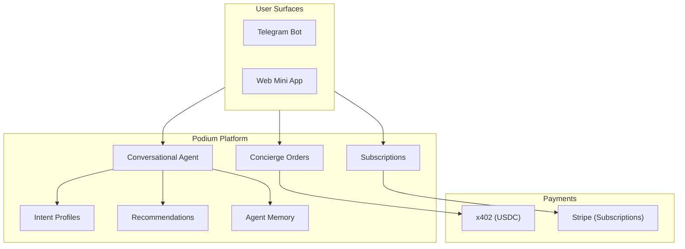
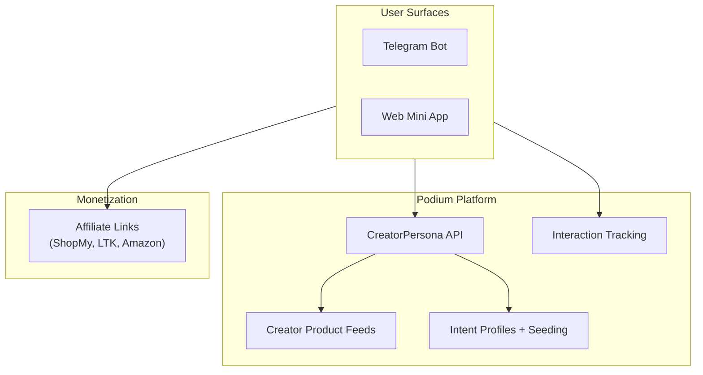

## Overview

Podium's Companion API, subscription system, and intelligence layer are designed to support radically different agent experiences on the same infrastructure. These two production apps demonstrate the range — from conversation-first with deep memory to browse-first with creator taste profiles.

| | Beauty Companion (Sage) | Clone Agents (Familiar) |
|---|---|---|
| **Core experience** | Personal skincare agent | Creator-based shopping agent |
| **Entry point** | Conversational quiz onboarding | Pick a creator, browse their picks |
| **Monetization** | Subscription (Stripe billing) | Affiliate links (ShopMy, LTK, Amazon) |
| **Intelligence** | Deep memory + personalization | Creator taste profile seeding |
| **Surfaces** | Web + Telegram | Web + Telegram |

---

## Beauty Companion (Sage)

A personal skincare agent: quiz onboarding → conversational discovery → personalized recommendations → checkout → subscription monetization.

### User Journey

<Steps>
  <Step title="Onboarding quiz">
    New users complete a 4-step conversational quiz that builds their intent profile. Questions are experiential rather than clinical — "How does your skin feel by early afternoon?" instead of "What is your skin type?"

    Each answer patches the user's [intent profile](/api-reference/companion#intent-profiles) and awards points.
  </Step>
  <Step title="Conversational discovery">
    The [Conversational Agent](/agentic/conversational-agent) uses the profile to deliver personalized recommendations with streaming SSE responses. Users see quick-reply chips for common follow-ups and reason tags explaining why each product was suggested.
  </Step>
  <Step title="Purchase">
    Two purchase modes depending on the product source:
    - **Platform products** — x402 USDC checkout via [concierge orders](/api-reference/companion#orders)
    - **Affiliate products** — redirect to retailer with affiliate tracking

    Spend confirmation cards show the product, price, and daily spending limit before the user commits.
  </Step>
  <Step title="Subscription monetization">
    Free users get 25 messages/month and basic recommendations. Sage+ subscribers get unlimited messages and memory-aware personalization — the agent loads accumulated intelligence into every conversation turn.

    See [Subscriptions](/platform/subscriptions) for the full billing integration.
  </Step>
  <Step title="Ongoing engagement">
    Returning subscribers receive personalized greetings that reference their last conversation. Chat history is durable with full pagination support.
  </Step>
</Steps>

### Platform Features Used

| Feature | How Sage Uses It |
|---------|-----------------|
| [Intent Profiles](/api-reference/companion#intent-profiles) | Stores skin type, concerns, price range, brand preferences, avoidances |
| [Conversational Agent](/agentic/conversational-agent) | Streaming SSE chat with tool-use, quick-reply chips, reason tags |
| [Recommendations](/api-reference/companion#recommendations) | AI-ranked products based on profile + interaction history |
| [x402 Payments](/agentic/x402-payments) | USDC checkout for platform products |
| [Subscriptions](/platform/subscriptions) | Sage+ billing with Stripe, memory gating, usage tracking |
| [Chat History](/api-reference/companion#chat-history) | Durable conversation history with cursor-based pagination |
| Wallet Integration | Privy embedded wallets, USDC on Base, Apple Pay / Google Pay funding |
| Points Gamification | Points awarded at every touchpoint — quiz steps, interactions, purchases |

### Architecture

### Key Design: Thin Client

Sage stores almost nothing locally — just a Telegram-to-Podium user mapping. All user data, product data, interactions, orders, and subscription state live in Podium. This makes the companion a **thin agentic client** that orchestrates the platform API into a coherent experience.

---

## Clone Agents (Familiar)

A creator-based shopping agent: pick a creator → browse their curated products → buy what they'd buy. The agent surfaces products through the lens of a creator's taste rather than the user's own profile.

### User Journey

<Steps>
  <Step title="Creator discovery">
    Users browse active creator personas via the [CreatorPersona discovery](/api-reference/companion#creator-products) endpoint. Each persona has a display name, avatar, platform affiliation, and curated product catalog.
  </Step>
  <Step title="Browse creator picks">
    Selecting a creator loads their resolved product catalog. Products are displayed as swipeable cards with Love, Skip, and Buy actions — each recorded as an [interaction](/api-reference/companion#interactions).
  </Step>
  <Step title="Profile seeding">
    When a user selects a creator, the creator's taste profile (preferred brands, price ranges, product concerns) is [merged into the user's intent profile](/api-reference/companion#profile-seeding-from-creator). User-set fields from a completed onboarding quiz are never overwritten.
  </Step>
  <Step title="Purchase via affiliate">
    Buy actions redirect to the product's affiliate URL (ShopMy, Amazon Associates, or LTK). The platform handles URL resolution and tracking.
  </Step>
  <Step title="Guest mode">
    Unauthenticated users can browse up to 5 products before hitting an auth gate. All interactions during guest mode are replayed to the user's profile on sign-in — no engagement is lost.
  </Step>
</Steps>

### Platform Features Used

| Feature | How Familiar Uses It |
|---------|---------------------|
| [CreatorPersona Discovery](/api-reference/companion#creator-products) | Browse active creators with resolved product catalogs |
| [Profile Seeding](/api-reference/companion#profile-seeding-from-creator) | Merge creator taste data into user profiles |
| [Interactions](/api-reference/companion#interactions) | Love / Skip / Buy tracking with profile page stats |
| [Intent Profiles](/api-reference/companion#intent-profiles) | User preferences seeded from creator data |
| Affiliate URLs | ShopMy, Amazon Associates, LTK link resolution |
| Guest Mode | 5-swipe preview with interaction replay on auth |

### Architecture

---

## What This Demonstrates

Both apps share the same Podium infrastructure but deliver radically different experiences:

| Dimension | Sage | Familiar |
|-----------|------|----------|
| **Discovery model** | Conversation-first — the agent suggests products through dialogue | Browse-first — users explore a creator's curated feed |
| **Monetization** | Subscription — Sage+ unlocks memory-aware personalization | Affiliate — revenue from retailer redirects |
| **Intelligence** | Deep memory — extracts preferences, goals, concerns, avoidances across conversations | Creator taste profiles — seeds user preferences from a creator's curation patterns |
| **User model** | Same `IntentProfile` and `Interaction` models | Same `IntentProfile` and `Interaction` models |

The takeaway: Podium's primitives are **vertical-agnostic and experience-agnostic**. The same user model, interaction system, and enrichment pipeline support both a deeply personalized AI companion and a social commerce discovery tool.

## Adapting for Your Vertical

To build a companion for a different product domain or experience model:

<Steps>
  <Step title="Define your intent profile fields">
    Replace skin type, concerns, and brand preferences with your domain's preference dimensions. The profile schema is flexible — use whatever fields describe your user's preferences.
  </Step>
  <Step title="Choose your discovery model">
    Conversation-first (like Sage), browse-first (like Familiar), or a hybrid. The same API endpoints support all patterns.
  </Step>
  <Step title="Curate your product catalog">
    Populate product records with your inventory, or use CreatorPersona to let creators curate for you. Include images, prices, and external URLs.
  </Step>
  <Step title="Pick your monetization">
    [Subscriptions](/platform/subscriptions) for recurring revenue, affiliate links for commission-based monetization, [x402](/agentic/x402-payments) for direct USDC checkout, or any combination.
  </Step>
  <Step title="Deploy to your surfaces">
    Both apps use the same pattern: one codebase, deployed to web and Telegram. The app detects its surface and renders accordingly.
  </Step>
</Steps>
