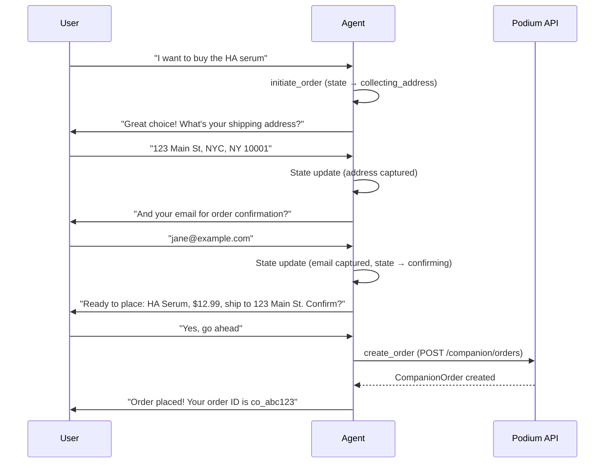

## Overview

The Conversational Agent is Podium's AI-powered shopping companion engine. It gives developers two endpoints — synchronous and streaming — that turn a user message into an intelligent, context-aware conversation with access to the full commerce stack.

The agent:

- **Knows the user** — loads their intent profile, interaction history, and conversation memory before every turn
- **Uses tools** — can search products, get recommendations, record interactions, update profiles, and create orders mid-conversation
- **Streams responses** — delivers progressive text deltas, tool execution events, and product cards over Server-Sent Events
- **Remembers everything** — persistent conversation history with automatic summarization keeps context across sessions
- **Is configurable** — persona, tone, rules, enabled tools, and model are all overridable per request

## Endpoints

| Method | Path | Description |
|--------|------|-------------|
| `POST` | `/companion/agent/chat` | Synchronous chat — returns a complete response |
| `POST` | `/companion/agent/chat/stream` | Streaming chat — returns SSE events as the agent thinks |

Both endpoints share the same request body.

## Request Schema

```json
{
  "userId": "clxyz1234567890",
  "message": "I need a hydrating serum under $50, no parabens",
  "config": {
    "persona": {
      "name": "Scout",
      "vertical": "skincare",
      "tone": "warm and knowledgeable"
    },
    "rules": [
      "Always check the user's avoidance list before recommending",
      "Include price in every product mention"
    ],
    "enabledTools": ["search_products", "get_recommendations", "record_interaction"],
    "maxHistory": 20
  }
}
```

| Field | Type | Required | Description |
|-------|------|----------|-------------|
| `userId` | string (CUID) | Yes | The Podium user to converse with |
| `message` | string (1–4000 chars) | Yes | The user's message |
| `config` | object | No | Override default agent behavior |
| `config.persona` | object | No | Agent identity — `name`, `vertical`, `tone` |
| `config.rules` | string[] | No | Additional behavioral rules injected into the system prompt |
| `config.enabledTools` | string[] | No | Restrict which tools the agent can use (defaults to all) |
| `config.maxHistory` | number | No | Max conversation turns to include in context |

## Synchronous Response

`POST /companion/agent/chat` returns a complete JSON response after the agent finishes thinking, executing tools, and composing its reply.

```json
{
  "message": "I found some great options for you! Based on your dry skin and hydration focus, here are my top picks...",
  "products": [
    {
      "id": "clprod_abc123",
      "name": "Hyaluronic Acid Serum",
      "brand": "The Ordinary",
      "price": 12.99,
      "currency": "USD",
      "imageUrl": "https://cdn.example.com/ha-serum.jpg",
      "productUrl": "https://example.com/products/ha-serum"
    }
  ],
  "profileUpdated": true,
  "orderInitiated": false
}
```

| Field | Type | Description |
|-------|------|-------------|
| `message` | string | The agent's text response |
| `products` | ProductCard[] | Products the agent surfaced during tool use (if any) |
| `profileUpdated` | boolean | Whether the agent updated the user's intent profile |
| `orderInitiated` | boolean | Whether the agent started a purchase flow |
| `orderId` | string | The companion order ID (if an order was created) |

## Streaming Response

`POST /companion/agent/chat/stream` returns a `text/event-stream` with progressive events as the agent works.

### Event Types

| Event | Payload | When |
|-------|---------|------|
| `text` | `{ type: "text", content: "..." }` | Each text delta as the agent writes |
| `tool_start` | `{ type: "tool_start", tool: "search_products" }` | When the agent begins a tool call |
| `tool_result` | `{ type: "tool_result", tool: "search_products", products: [...] }` | When a tool returns results |
| `done` | `{ type: "done", message: "...", products: [...], ... }` | Final event with complete response |
| `error` | `{ type: "error", error: "..." }` | On failure |

### SSE Client Example

```typescript
async function chatWithAgent(userId: string, message: string) {
  const response = await fetch(
    "https://api.podiumcommerce.xyz/api/v1/companion/agent/chat/stream",
    {
      method: "POST",
      headers: {
        "Authorization": "Bearer YOUR_API_KEY",
        "Content-Type": "application/json",
      },
      body: JSON.stringify({ userId, message }),
    }
  );

  const reader = response.body!.getReader();
  const decoder = new TextDecoder();
  let buffer = "";

  while (true) {
    const { done, value } = await reader.read();
    if (done) break;

    buffer += decoder.decode(value, { stream: true });
    const lines = buffer.split("\n");
    buffer = lines.pop()!;

    for (const line of lines) {
      if (line.startsWith("data: ")) {
        const event = JSON.parse(line.slice(6));

        switch (event.type) {
          case "text":
            process.stdout.write(event.content);
            break;
          case "tool_start":
            console.log(`\n[Using ${event.tool}...]`);
            break;
          case "tool_result":
            if (event.products?.length) {
              console.log(`\n[Found ${event.products.length} products]`);
            }
            break;
          case "done":
            console.log("\n--- Complete ---");
            return event;
          case "error":
            throw new Error(event.error);
        }
      }
    }
  }
}
```

## Built-in Tools

The agent has access to 7 commerce tools that map directly to Podium API operations. Each tool is callable by the AI during conversation — no developer code needed.

| Tool | Description | Maps To |
|------|-------------|---------|
| `search_products` | Search the product catalog by keyword, category, brand, or price range | `GET /companion/products` |
| `get_recommendations` | Get AI-ranked products based on the user's profile and interaction history | `GET /companion/recommendations/{userId}` |
| `update_profile` | Update the user's intent profile (preferences, constraints, avoidances) | `PATCH /companion/profile/{userId}` |
| `record_interaction` | Record a product interaction (`RANK_UP`, `RANK_DOWN`, `SKIP`, `PURCHASED`, `PURCHASE_INTENT`) | `POST /companion/interactions` |
| `initiate_order` | Begin a purchase flow — collects shipping and payment details conversationally | State machine (multi-turn) |
| `get_order_history` | Retrieve the user's recent orders | `GET /companion/orders` |
| `create_order` | Create a companion order with collected shipping details | `POST /companion/orders` |

### Tool Selection

By default, all tools are enabled. Restrict the tool set per request to control what the agent can do:

```json
{
  "userId": "clxyz123",
  "message": "What should I try next?",
  "config": {
    "enabledTools": ["search_products", "get_recommendations"]
  }
}
```

This is useful for:
- **Browse-only mode**: Enable only `search_products` and `get_recommendations`
- **Profile-building mode**: Enable `update_profile` and `record_interaction`
- **Full commerce mode**: Enable all tools including `create_order`

## Conversational Order Flow

When a user expresses purchase intent, the agent uses a multi-turn state machine to collect the required information:



The order state persists across messages, so the user can provide information across multiple turns naturally.

## Memory & Context

### Persistent History

Every conversation turn (user message + agent response) is stored in persistent memory. On each new message, the agent loads:

1. **Intent profile** — the user's preferences, constraints, avoidances, and behavioral signals
2. **Conversation history** — recent messages (up to `maxHistory` turns)
3. **Conversation summary** — a compressed summary of older conversations
4. **Agent state** — any in-progress workflows (e.g., pending orders)

### Automatic Summarization

When conversation history exceeds a threshold, Podium automatically:

1. Generates a summary of older messages
2. Trims the history to keep only recent turns
3. Stores the summary for future context

This keeps the agent's context window efficient while preserving long-term knowledge about the user.

### Agent Summary → Intent Profile

Summaries are also stored on the user's intent profile (`agentSummary` field), making conversation insights available to other parts of the platform — recommendations, the agentic product feed, and downstream analytics.

## Personas

Configure the agent's identity and behavior per request:

```json
{
  "config": {
    "persona": {
      "name": "Scout",
      "vertical": "skincare",
      "tone": "warm, knowledgeable, concise"
    },
    "rules": [
      "Never recommend products with parabens",
      "Always mention the user's skin type when giving advice",
      "If the user seems unsure, suggest a quiz to build their profile"
    ]
  }
}
```

| Field | Effect |
|-------|--------|
| `persona.name` | The agent's name (used in the system prompt) |
| `persona.vertical` | Product domain expertise (skincare, fashion, food, etc.) |
| `persona.tone` | Communication style |
| `rules` | Hard behavioral rules injected into every system prompt |

Different verticals can share the same agent infrastructure with entirely different personalities and expertise.

## Proactive Nudges

Beyond reactive conversations, Podium's agent can proactively re-engage users through scheduled nudges. The nudge system runs as a background cron job and generates personalized outreach based on user signals.

### Nudge Types

| Type | Trigger | Example |
|------|---------|---------|
| `re_engagement` | User hasn't chatted in several days | "Hey! I noticed some new serums from The Ordinary that match your hydration goals — want me to show you?" |
| `purchase_follow_up` | Recent purchase completed | "How's the HA serum working for you? Let me know and I can adjust your recommendations." |
| `profile_deepening` | Incomplete preference profile | "I noticed you haven't told me about your SPF preferences — want to do a quick quiz?" |
| `seasonal` | Seasonal product relevance | "Winter's here — time to switch up your moisturizer. Want me to find something heavier-duty?" |

### How It Works

1. **User selection** — the system identifies users eligible for nudges based on activity signals (days since last conversation, profile completeness, recent purchases)
2. **Signal gathering** — for each eligible user, the system collects their profile, loved products, recent purchases, conversation summary, and profile gaps
3. **Nudge generation** — AI generates a personalized, contextual message using the user's full signal set
4. **Delivery** — the nudge is published to configured channels (Telegram, email, push) and logged
5. **History integration** — nudge messages are appended to the conversation history so the agent has full context if the user replies

Nudges are logged and rate-limited to prevent over-messaging. Each nudge includes the `nudgeType` for analytics.

## Example: Full Integration

```typescript
import { createPodiumClient } from "@podium-sdk/node-sdk";

const client = createPodiumClient({ apiKey: "podium_live_..." });

// 1. Create a user with an intent profile
const user = await client.user.create({
  requestBody: { email: "jane@example.com" },
});

await client.companion.createProfile({
  userId: user.id,
  requestBody: {
    skinType: "DRY",
    concerns: ["HYDRATION", "ANTI_AGING"],
    priceRange: { min: 10, max: 75 },
    avoidances: ["parabens", "sulfates"],
  },
});

// 2. Start a conversation
const response = await fetch(
  "https://api.podiumcommerce.xyz/api/v1/companion/agent/chat",
  {
    method: "POST",
    headers: {
      Authorization: `Bearer ${apiKey}`,
      "Content-Type": "application/json",
    },
    body: JSON.stringify({
      userId: user.id,
      message: "What serums should I try for winter dryness?",
      config: {
        persona: {
          name: "Scout",
          vertical: "skincare",
          tone: "friendly and expert",
        },
      },
    }),
  }
);

const result = await response.json();
console.log(result.message);
console.log(`Products found: ${result.products?.length ?? 0}`);

// 3. Follow up — the agent remembers the conversation
const followUp = await fetch(
  "https://api.podiumcommerce.xyz/api/v1/companion/agent/chat",
  {
    method: "POST",
    headers: {
      Authorization: `Bearer ${apiKey}`,
      "Content-Type": "application/json",
    },
    body: JSON.stringify({
      userId: user.id,
      message: "I like the first one. Can you order it for me?",
    }),
  }
);

const orderResult = await followUp.json();
if (orderResult.orderInitiated) {
  console.log(`Order created: ${orderResult.orderId}`);
}
```

## Endpoint Summary

| Method | Path | Description |
|--------|------|-------------|
| `POST` | `/companion/agent/chat` | Synchronous AI chat with tools |
| `POST` | `/companion/agent/chat/stream` | Streaming AI chat via SSE |
