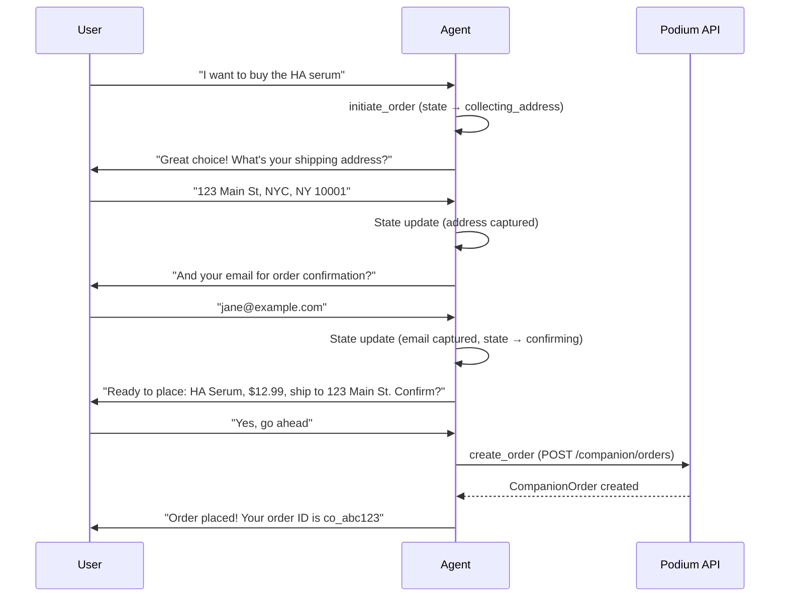

## Overview

The Conversational Agent is Podium's AI-powered shopping companion engine. It gives developers two endpoints — synchronous and streaming — that turn a user message into an intelligent, context-aware conversation with access to the full commerce stack.

The agent:

- **Knows the user** — loads their intent profile, interaction history, conversation memory, and active product usage before every turn
- **Uses tools** — can search products, get recommendations, record interactions, update profiles, and create orders mid-conversation
- **Streams responses** — delivers progressive text deltas, tool execution events, product cards, and quick-reply chips over Server-Sent Events
- **Remembers everything** — persistent conversation history with automatic summarization keeps context across sessions
- **Handles concurrency** — serializes requests per user to prevent duplicate responses during rapid messaging
- **Onboards conversationally** — new users can build their profile through natural conversation instead of a structured quiz
- **Is configurable** — persona, tone, rules, enabled tools, and model are all overridable per request

## Endpoints

| Method | Path | Description |
|--------|------|-------------|
| `POST` | `/companion/agent/chat` | Synchronous chat — returns a complete response |
| `POST` | `/companion/agent/chat/stream` | Streaming chat — returns SSE events as the agent thinks |

Both endpoints share the same request body.

## Request Schema

```json
{
  "userId": "clxyz1234567890",
  "message": "I need a hydrating serum under $50, no parabens",
  "config": {
    "persona": {
      "name": "Scout",
      "vertical": "skincare",
      "tone": "warm and knowledgeable"
    },
    "rules": [
      "Always check the user's avoidance list before recommending",
      "Include price in every product mention"
    ],
    "enabledTools": ["search_products", "get_recommendations", "record_interaction"],
    "maxHistory": 20
  }
}
```

| Field | Type | Required | Description |
|-------|------|----------|-------------|
| `userId` | string (CUID) | Yes | The Podium user to converse with |
| `message` | string (1–4000 chars) | Yes | The user's message |
| `config` | object | No | Override default agent behavior |
| `config.persona` | object | No | Agent identity — `name`, `vertical`, `tone` |
| `config.rules` | string[] | No | Additional behavioral rules injected into the system prompt |
| `config.enabledTools` | string[] | No | Restrict which tools the agent can use (defaults to all) |
| `config.maxHistory` | number | No | Max conversation turns to include in context |

## Synchronous Response

`POST /companion/agent/chat` returns a complete JSON response after the agent finishes thinking, executing tools, and composing its reply.

```json
{
  "message": "I found some great options for you! Based on your dry skin and hydration focus, here are my top picks...",
  "products": [
    {
      "id": "clprod_abc123",
      "name": "Hyaluronic Acid Serum",
      "brand": "The Ordinary",
      "price": 12.99,
      "currency": "USD",
      "imageUrl": "https://cdn.example.com/ha-serum.jpg",
      "productUrl": "https://example.com/products/ha-serum"
    }
  ],
  "profileUpdated": true,
  "orderInitiated": false
}
```

| Field | Type | Description |
|-------|------|-------------|
| `message` | string | The agent's text response |
| `products` | ProductCard[] | Products the agent surfaced during tool use (if any) |
| `profileUpdated` | boolean | Whether the agent updated the user's intent profile |
| `orderInitiated` | boolean | Whether the agent started a purchase flow |
| `orderId` | string | The companion order ID (if an order was created) |

## Streaming Response

`POST /companion/agent/chat/stream` returns a `text/event-stream` with progressive events as the agent works.

### Event Types

| Event | Payload | When |
|-------|---------|------|
| `text` | `{ type: "text", content: "..." }` | Each text delta as the agent writes |
| `tool_start` | `{ type: "tool_start", tool: "search_products" }` | When the agent begins a tool call |
| `tool_result` | `{ type: "tool_result", tool: "search_products", products: [...] }` | When a tool returns results |
| `done` | `{ type: "done", message: "...", products: [...], quickReplies?: [...] }` | Final event with complete response |
| `memory_queued` | `{ type: "memory_queued" }` | When the system queues a memory extraction job |
| `confirmation_required` | `{ type: "confirmation_required", productId, productName, productBrand, amount, currency, imageUrl?, spendSummary }` | When a purchase needs user confirmation |
| `spend_limit_exceeded` | `{ type: "spend_limit_exceeded", reason, spendSummary, resetInfo? }` | When a purchase exceeds spend limits |
| `error` | `{ type: "error", error: "..." }` | On failure |

Where `spendSummary` is: `{ dailySpent: number, dailyLimit: number, txMax: number }`

### SSE Client Example

```typescript
async function chatWithAgent(userId: string, message: string) {
  const response = await fetch(
    "https://api.podium.build/api/v1/companion/agent/chat/stream",
    {
      method: "POST",
      headers: {
        "Authorization": "Bearer YOUR_API_KEY",
        "Content-Type": "application/json",
      },
      body: JSON.stringify({ userId, message }),
    }
  );

  const reader = response.body!.getReader();
  const decoder = new TextDecoder();
  let buffer = "";

  while (true) {
    const { done, value } = await reader.read();
    if (done) break;

    buffer += decoder.decode(value, { stream: true });
    const lines = buffer.split("\n");
    buffer = lines.pop()!;

    for (const line of lines) {
      if (line.startsWith("data: ")) {
        const event = JSON.parse(line.slice(6));

        switch (event.type) {
          case "text":
            process.stdout.write(event.content);
            break;
          case "tool_start":
            console.log(`\n[Using ${event.tool}...]`);
            break;
          case "tool_result":
            if (event.products?.length) {
              console.log(`\n[Found ${event.products.length} products]`);
            }
            break;
          case "memory_queued":
            console.log("[Memory extraction queued]");
            break;
          case "confirmation_required":
            console.log(`\nConfirm purchase: ${event.productName} (${event.productBrand}) — $${event.amount} ${event.currency}`);
            console.log(`Daily spend: $${event.spendSummary.dailySpent}/$${event.spendSummary.dailyLimit}`);
            break;
          case "spend_limit_exceeded":
            console.log(`\nSpend limit exceeded: ${event.reason}`);
            if (event.resetInfo) console.log(`Resets: ${event.resetInfo}`);
            break;
          case "done":
            if (event.quickReplies?.length) {
              console.log("\nSuggested replies:", event.quickReplies);
            }
            console.log("\n--- Complete ---");
            return event;
          case "error":
            throw new Error(event.error);
        }
      }
    }
  }
}
```

### Concurrency Handling

The agent enforces a per-user concurrency lock to prevent duplicate responses during rapid messaging. If a second request arrives while the first is still being processed:

```json
{
  "type": "busy",
  "message": "I'm still working on your previous message. Please wait a moment."
}
```

The lock uses a unique token per request and releases automatically when the response stream completes. If the lock mechanism is temporarily unavailable, the system fails open and allows the request through.

<Tip>
Handle the `busy` response in your frontend by showing a "still thinking" indicator and disabling the send button until the current response completes.
</Tip>

## Built-in Tools

The agent has access to 7 commerce tools that map directly to Podium API operations. Each tool is callable by the AI during conversation — no developer code needed.

| Tool | Description | Maps To |
|------|-------------|---------|
| `search_products` | Search the product catalog by keyword, category, brand, or price range | `GET /companion/products` |
| `get_recommendations` | Get AI-ranked products based on the user's profile and interaction history | `GET /companion/recommendations/{userId}` |
| `update_profile` | Update the user's intent profile (preferences, constraints, avoidances) | `PATCH /companion/profile/{userId}` |
| `record_interaction` | Record a product interaction (`RANK_UP`, `RANK_DOWN`, `SKIP`, `PURCHASED`, `PURCHASE_INTENT`) | `POST /companion/interactions` |
| `initiate_order` | Begin a purchase flow — collects shipping and payment details conversationally | State machine (multi-turn) |
| `get_order_history` | Retrieve the user's recent orders | `GET /companion/orders` |
| `create_order` | Create a companion order with collected shipping details | `POST /companion/orders` |

### Tool Selection

By default, all tools are enabled. Restrict the tool set per request to control what the agent can do:

```json
{
  "userId": "clxyz123",
  "message": "What should I try next?",
  "config": {
    "enabledTools": ["search_products", "get_recommendations"]
  }
}
```

This is useful for:
- **Browse-only mode**: Enable only `search_products` and `get_recommendations`
- **Profile-building mode**: Enable `update_profile` and `record_interaction`
- **Full commerce mode**: Enable all tools including `create_order`

### Reason Tags

Every product recommendation includes a human-readable **reason tag** that explains *why* the agent chose it. Reason tags are derived from the scoring pipeline and the user's profile:

| Signal Source | Example Tag |
|---|---|
| Enrichment data | "Highly rated for sensitive skin" |
| User skin type match | "Matches your dry skin type" |
| User concern match | "Targets your hydration concerns" |
| Memory goal match | "Aligns with your anti-aging goal" |
| Budget alignment | "Within your $50 budget" |
| Brand affinity | "From The Ordinary — a brand you love" |
| Ingredient match | "Contains hyaluronic acid — a top ingredient for you" |

Reason tags appear alongside product cards in both synchronous and streaming responses, giving users (and downstream UIs) transparency into why each recommendation was made.

### Domain-Aware Search

The `search_products` tool supports domain and category filtering to improve result relevance:

- **Domain filter** — restrict results to beauty, wellness, fashion, or home
- **Category enrichment** — the agent maps user intent to canonical categories (e.g., "eye cream for dark circles" → `eye_care` category, not generic "eye" substring matching)
- **Intelligent fallback** — when no domain or category matches, the system falls back to length-sorted token matching, skipping short generic tokens that produce noisy results

## Conversational Order Flow

When a user expresses purchase intent, the agent uses a multi-turn state machine to collect the required information:



The order state persists across messages, so the user can provide information across multiple turns naturally.

## Memory & Context

### Persistent History

Every conversation turn (user message + agent response) is stored in persistent memory. On each new message, the agent loads:

1. **Intent profile** — the user's preferences, constraints, avoidances, and behavioral signals
2. **Conversation history** — recent messages (up to `maxHistory` turns)
3. **Conversation summary** — a compressed summary of older conversations
4. **Agent state** — any in-progress workflows (e.g., pending orders)

History is persisted across sessions — not just held in memory. When a user returns hours or days later, the agent has full context from previous conversations.

### Automatic Summarization

Summary extraction happens automatically at conversation milestones:

| Trigger | Condition | Purpose |
|---------|-----------|---------|
| **Early capture** | Turns 3–5, no existing memory | Capture initial preferences quickly |
| **Regular cadence** | Every 10 user turns | Keep memory current as conversation evolves |
| **Session gap** | >2 hours since last message | Summarize before context goes cold |

When summarization triggers, Podium:

1. Generates a summary of older messages
2. Trims the history to keep only recent turns
3. Stores the summary for future context

This keeps the agent's context window efficient while preserving long-term knowledge about the user.

### Agent Summary → Intent Profile

Summaries are stored on the user's intent profile (`agentSummary` field), making conversation insights available to other parts of the platform — recommendations, the agentic product feed, and downstream analytics.

Memory is also stored as a structured [AgentMemory](/agentic/memory-intelligence#agentmemory) object on the user's profile. This structured memory — preferences, goals, concerns, avoidances, products tried, and category-aware price ranges — feeds directly into recommendation scoring, reason tag generation, and proactive nudges. See [Memory & Intelligence](/agentic/memory-intelligence) for the full schema and scoring details.

## Personas

Configure the agent's identity and behavior per request:

```json
{
  "config": {
    "persona": {
      "name": "Scout",
      "vertical": "skincare",
      "tone": "warm, knowledgeable, concise"
    },
    "rules": [
      "Never recommend products with parabens",
      "Always mention the user's skin type when giving advice",
      "If the user seems unsure, suggest a quiz to build their profile"
    ]
  }
}
```

| Field | Effect |
|-------|--------|
| `persona.name` | The agent's name (used in the system prompt) |
| `persona.vertical` | Product domain expertise (skincare, fashion, food, etc.) |
| `persona.tone` | Communication style |
| `rules` | Hard behavioral rules injected into every system prompt |

Different verticals can share the same agent infrastructure with entirely different personalities and expertise.

### Domain-Expert Context

The agent's system prompt adapts based on the product domain, loading domain-specific expertise, vocabulary, and recommendation criteria. A beauty-focused conversation receives skincare science context, while a wellness conversation gets supplement formulation guidance. This happens automatically based on the user's profile and conversation context.

## Conversational Onboarding

New users who haven't completed a structured quiz can build their profile through natural conversation. When no quiz data exists (`quizCompletedAt` is null), the agent's system prompt switches to an onboarding mode that naturally collects:

- Skin type or product preferences
- Key concerns or goals
- Brand preferences and budget range
- Product avoidances or sensitivities

The agent weaves these questions into the conversation rather than presenting a formal questionnaire, creating a more natural first-time experience. Once enough data is captured, the system marks onboarding as complete and transitions to standard recommendation mode.

### Surface-Aware Prompts

The system prompt adapts to the client surface — web, Telegram mini app, or embedded widget. Each surface has different UI capabilities (image rendering, inline buttons, link handling), and the agent tailors its response format accordingly.

## User Context: Current Actives

The agent has access to the user's currently active products (populated during onboarding or updated via profile). When a user reports what they're currently using, the agent:

- Avoids recommending products they already have
- Can assess potential ingredient interactions
- References current products when making complementary suggestions

For example, if a user reports using retinol and vitamin C, the agent knows to suggest time-of-day separation and won't redundantly recommend another retinol product.

## Proactive Nudges

Beyond reactive conversations, Podium's agent can proactively re-engage users through scheduled nudges. The nudge system runs as a background cron job and generates personalized outreach based on user signals.

### Nudge Types

| Type | Trigger | Example |
|------|---------|---------|
| `re_engagement` | User hasn't chatted in several days | "Hey! I noticed some new serums from The Ordinary that match your hydration goals — want me to show you?" |
| `purchase_follow_up` | Recent purchase completed | "How's the HA serum working for you? Let me know and I can adjust your recommendations." |
| `profile_deepening` | Incomplete preference profile | "I noticed you haven't told me about your SPF preferences — want to do a quick quiz?" |
| `seasonal` | Seasonal product relevance | "Winter's here — time to switch up your moisturizer. Want me to find something heavier-duty?" |
| `price_drop` | Price decreased on a product the user interacted with | "Good news — that CeraVe moisturizer you liked dropped 20% in price. Want to grab it?" |
| `reorder_reminder` | Enough time has passed since a consumable purchase | "You bought that vitamin C serum about 6 weeks ago — running low? I can reorder for you." |

### How It Works

1. **User selection** — the system identifies users eligible for nudges based on activity signals (days since last conversation, profile completeness, recent purchases)
2. **Signal gathering** — for each eligible user, the system collects their profile, loved products, recent purchases, conversation summary, and profile gaps
3. **Nudge generation** — AI generates a personalized, contextual message using the user's full signal set
4. **Delivery** — the nudge is published to configured channels (Telegram, email, push) and logged
5. **History integration** — nudge messages are appended to the conversation history so the agent has full context if the user replies

Nudges are logged and rate-limited to prevent over-messaging. Each nudge includes the `nudgeType` for analytics.

## Quick-Reply Chips

The agent can suggest contextual quick-reply options to keep the conversation flowing. Chips are returned in the `done` event:

```json
{
  "type": "done",
  "message": "I found some great hydrating serums for you!",
  "products": [...],
  "quickReplies": ["Yes, show me serums", "What about moisturizers?", "Skip for now"]
}
```

Quick replies are contextually generated based on:

| Factor | Behavior |
|--------|----------|
| **Warm vs cold start** | New users get onboarding-oriented chips ("Take the skin quiz", "Tell me your budget"). Returning users get product-oriented chips. |
| **Session saturation** | Max 3 chip sets per session to avoid overwhelming the user |
| **Conversation state** | Chips adapt to context — quiz mode offers answer options, browsing mode offers category pivots, checkout mode offers confirmation/cancel |

Quick replies are suggestions, not constraints — the user can always type a freeform message instead.

## Durable Chat History

Conversations are persisted to durable storage. You can retrieve a user's full chat history for display in your UI or for analytics:

```
GET /api/v1/companion/agent/chat/history/:userId?limit=50&before=cursor_id
```

### Response

```json
[
  {
    "id": "msg_abc123",
    "role": "user",
    "content": "I need a hydrating serum under $50",
    "timestamp": "2026-03-18T14:30:00Z"
  },
  {
    "id": "msg_abc124",
    "role": "assistant",
    "content": "I found some great options for you!",
    "timestamp": "2026-03-18T14:30:02Z",
    "products": [...]
  }
]
```

| Parameter | Type | Default | Description |
|-----------|------|---------|-------------|
| `limit` | integer | 50 | Max messages to return (1–100) |
| `before` | string | — | Cursor-based pagination — pass a message `id` to fetch older messages |

History is ordered newest-first. Page backward through the conversation by passing the last message's `id` as the `before` parameter.

## Purchase Mode & Spend Controls

The agent classifies each product by purchase mode, determining how the transaction is executed:

| Mode | Behavior | Example |
|------|----------|---------|
| `x402_platform` | Full agent checkout via [x402 payments](/agentic/x402-payments) | Products from Podium-integrated merchants |
| `affiliate` | Opens retailer link for the user | Sephora, Ulta, Nordstrom, etc. |
| `external` | Opens direct retailer link | Brand DTC sites |

### Spend Controls

For `x402_platform` purchases, the agent enforces spend limits to protect users:

| Limit | Value | Description |
|-------|-------|-------------|
| Per-transaction max | $200 | No single purchase can exceed this amount |
| Daily spend cap | $100 | Rolling 24-hour limit across all agent-initiated purchases |

**Purchase flow:**

1. User expresses purchase intent
2. Agent resolves the product's purchase mode
3. For `x402_platform` — agent checks spend limits and emits `confirmation_required` with product details and current spend summary
4. User confirms → agent executes the purchase
5. If limits would be exceeded → agent emits `spend_limit_exceeded` with the reason and reset timing

```json
{
  "type": "confirmation_required",
  "productId": "prod_abc123",
  "productName": "Hyaluronic Acid Serum",
  "productBrand": "The Ordinary",
  "amount": 12.99,
  "currency": "USD",
  "imageUrl": "https://cdn.example.com/ha-serum.jpg",
  "spendSummary": {
    "dailySpent": 45.00,
    "dailyLimit": 100.00,
    "txMax": 200.00
  }
}
```

## First-Return Greeting

For returning subscribers, the agent can generate a personalized greeting that references their history, preferences, and recent activity. This creates a warm re-engagement experience instead of a generic "How can I help you?"

Send a greeting request:

```json
{
  "userId": "clxyz1234567890",
  "message": "__greeting__",
  "config": {
    "greeting": true
  }
}
```

The agent uses the user's [AgentMemory](/agentic/memory-intelligence#agentmemory) to generate the greeting — referencing products they've tried, concerns they've mentioned, and goals they're working toward. The response arrives through the standard streaming or synchronous endpoint.

<Tip>
Use first-return greetings when your app detects a returning user. The `__greeting__` message is a special trigger — it's not displayed to the user, it just signals the agent to generate a personalized welcome.
</Tip>

## Example: Full Integration

```typescript
import { createPodiumClient } from "@podium-sdk/node-sdk";

const client = createPodiumClient({ apiKey: "podium_live_..." });

// 1. Create a user with an intent profile
const user = await client.user.create({
  requestBody: { email: "jane@example.com" },
});

await client.companion.createProfile({
  userId: user.id,
  requestBody: {
    skinType: "DRY",
    concerns: ["HYDRATION", "ANTI_AGING"],
    priceRange: { min: 10, max: 75 },
    avoidances: ["parabens", "sulfates"],
  },
});

// 2. Start a conversation
const response = await fetch(
  "https://api.podium.build/api/v1/companion/agent/chat",
  {
    method: "POST",
    headers: {
      Authorization: `Bearer ${apiKey}`,
      "Content-Type": "application/json",
    },
    body: JSON.stringify({
      userId: user.id,
      message: "What serums should I try for winter dryness?",
      config: {
        persona: {
          name: "Scout",
          vertical: "skincare",
          tone: "friendly and expert",
        },
      },
    }),
  }
);

const result = await response.json();
console.log(result.message);
console.log(`Products found: ${result.products?.length ?? 0}`);

// 3. Follow up — the agent remembers the conversation
const followUp = await fetch(
  "https://api.podium.build/api/v1/companion/agent/chat",
  {
    method: "POST",
    headers: {
      Authorization: `Bearer ${apiKey}`,
      "Content-Type": "application/json",
    },
    body: JSON.stringify({
      userId: user.id,
      message: "I like the first one. Can you order it for me?",
    }),
  }
);

const orderResult = await followUp.json();
if (orderResult.orderInitiated) {
  console.log(`Order created: ${orderResult.orderId}`);
}
```

## Endpoint Summary

| Method | Path | Description |
|--------|------|-------------|
| `POST` | `/companion/agent/chat` | Synchronous AI chat with tools |
| `POST` | `/companion/agent/chat/stream` | Streaming AI chat via SSE |
| `GET` | `/companion/agent/chat/history/:userId` | Retrieve durable chat history (paginated) |
