## What It Does

The Enrichment Pipeline transforms raw external market data into structured, scored, provenanced product attributes. It solves the cold-start problem: even before users vote or interact, agents have meaningful product intelligence to work with.

The pipeline ingests from multiple data source types, extracts attributes via AI-powered methods, resolves entities against your product catalog, normalizes everything into a canonical schema, and aggregates signals into queryable baselines at three different levels.

```mermaid
graph LR
    subgraph sources ["Data Sources"]
        API["Structured APIs"]
        Web["Web Intelligence"]
        Community["Community Signals"]
        Discovery["Product Discovery"]
    end

    subgraph process ["Processing"]
        Raw["Raw Records<br/>(immutable audit log)"]
        Extract["AI-Powered Extraction"]
        Resolve["Entity Resolution<br/>(fuzzy + semantic)"]
        Normalize["Normalization<br/>(canonical types + values)"]
    end

    subgraph output ["Output"]
        Signals["EnrichmentSignals<br/>(typed, scored, provenanced)"]
        Baselines["Multi-Level Baselines<br/>(product / category / market)"]
        Feed["Agentic Product Feed"]
    end

    sources --> Raw --> Extract --> Resolve --> Normalize --> Signals --> Baselines --> Feed
```



## Why It Matters

Agents need more than product titles and prices to make informed recommendations. The enrichment pipeline provides:

- **Rich product attributes** — texture, effectiveness, sentiment, ingredient analysis, certifications, and more — extracted from real-world data
- **Provenance on every signal** — agents and users always know *where* a data point came from and how confident it is
- **Cold-start intelligence** — new platforms have useful product data from day one, without waiting for user interactions
- **Multi-level baselines** — understand a product's attributes in context: how it compares to its category and the broader market
- **Continuous discovery** — Podium automatically discovers and enriches new products from multiple sources, keeping your catalog fresh

As users interact (vote in campaigns, rank products, purchase), `USER_DECLARED` signals naturally dominate the intent score. Market-derived enrichment data gracefully steps back to a supplementary validation role.

## Schema Overview

The pipeline uses five core data models. These form a reusable blueprint — you can adapt this schema for any product vertical.

### EnrichmentSource

Defines where data comes from. Each source has a type and a JSON configuration:

| Field | Type | Purpose |
|-------|------|---------|
| `name` | string | Human-readable source name |
| `sourceType` | enum | `STRUCTURED_API`, `WEB_PAGE`, `COMMUNITY`, `DISCOVERY` |
| `config` | JSON | Source-specific configuration |
| `lastRunAt` | datetime | Last ingestion timestamp |
| `lastRunStatus` | string | `SUCCESS` or `FAILED` with error details |

### RawEnrichmentRecord

Immutable audit log of every piece of ingested data. Raw records are never modified after creation — they serve as the provenance trail.

| Field | Type | Purpose |
|-------|------|---------|
| `sourceId` | FK | Which source produced this record |
| `externalId` | string | Barcode, URL, or post ID for deduplication |
| `rawData` | JSON | Exact response as received |
| `processed` | boolean | Whether signals have been extracted |

### EnrichmentSignal

The core output — individual attribute-value pairs extracted from raw records, resolved to products, and tagged with confidence and provenance.

| Field | Type | Purpose |
|-------|------|---------|
| `sourceId` | FK | Source that produced this signal |
| `rawRecordId` | FK | Raw record it was extracted from |
| `productId` | FK (nullable) | Resolved product, or null if unresolved |
| `externalName` | string | Product name as seen in the source |
| `attributeType` | string | Canonical attribute type (see taxonomy below) |
| `attributeValue` | string | Normalized value |
| `confidence` | float | 0–1 confidence score |
| `signalSource` | enum | `MARKET_DERIVED` for enrichment data |
| `metadata` | JSON | Evidence: text snippets, URLs, ratings, context |

A unique constraint on `[sourceId, externalName, attributeType, attributeValue]` ensures idempotent re-processing.

### AttributeBaseline

Aggregated top values per product (or category, or market) per attribute type. This is what the agentic product feed queries.

| Field | Type | Purpose |
|-------|------|---------|
| `productId` | FK (nullable) | Product this baseline describes (null for category/market baselines) |
| `scope` | enum | `PRODUCT`, `CATEGORY`, or `MARKET` |
| `attributeType` | string | Attribute type (e.g., `texture`, `sentiment`) |
| `topValues` | JSON | Array of `{ value, score, signalCount }` |
| `signalCount` | int | Total signals contributing to this baseline |
| `signalSource` | enum | `BASELINE_INFERRED` |
| `computedAt` | datetime | When this baseline was computed |
| `validUntil` | datetime | TTL — recompute after this timestamp |

### ProductEmbedding

Vector embeddings for semantic product matching during entity resolution.

| Field | Type | Purpose |
|-------|------|---------|
| `productId` | FK | Product this embedding represents |
| `embedding` | vector(1536) | AI-generated embedding for similarity matching |

## Multi-Level Baselines

Baselines are computed at three scopes, giving agents and developers graduated context for every product attribute:

| Scope | What It Tells You | Example |
|-------|-------------------|---------|
| **Product** | This specific product's attributes | "CeraVe Moisturizing Cream has texture: creamy (0.92), sentiment: positive (0.88)" |
| **Category** | Norms for this product category | "Moisturizers typically have texture: lightweight (0.75), key_ingredient: hyaluronic acid (0.68)" |
| **Market** | Broad market trends | "Across all skincare, sentiment: positive (0.71), certification: cruelty-free (0.54)" |

This lets agents make contextual comparisons: "This serum's effectiveness score is 0.91, which is significantly above the category average of 0.67."

### Scoring Formula

```
score = average_confidence × log1p(signal_count)
```

This balances signal quality (confidence) with signal volume (count), using logarithmic scaling to prevent high-volume sources from dominating.

### Recomputation Modes

| Mode | Trigger | Scope |
|------|---------|-------|
| **Single product** | New enrichment data ingested | One product's baselines |
| **Category** | Scheduled recompute | All products in a category |
| **Stale baselines** | Scheduled cron job | All baselines past their `validUntil` |
| **Full recompute** | Admin action | Every product with any enrichment signals |

## Attribute Taxonomy

The pipeline extracts 13 attribute types. This taxonomy is extensible — add new types by updating the canonical type mapping in the normalization layer.

| Attribute Type | Example Values | Typical Sources |
|---------------|---------------|-----------------|
| `category` | face, serums, lip products | APIs, web data |
| `effectiveness` | highly effective, moderate results | Reviews, community |
| `texture` | lightweight, creamy, gel | Reviews, descriptions |
| `sentiment` | positive, negative, mixed | Reviews, community |
| `key_ingredient` | hyaluronic acid, retinol, niacinamide | APIs, descriptions |
| `skin_type_suitability` | oily, dry, sensitive, combination | Reviews, APIs |
| `finish` | matte, dewy, natural | Reviews, descriptions |
| `scent` | fragrance-free, floral, citrus | Reviews, APIs |
| `longevity` | 8+ hours, all day, fades quickly | Reviews |
| `certification` | organic, cruelty-free, vegan | APIs, labels |
| `packaging` | pump bottle, tube, jar | Reviews, descriptions |
| `color` | sheer, full coverage, tinted | Reviews, descriptions |
| `brand_tier` | 1 (prestige), 2 (enthusiast), 3 (mainstream), 4 (mass market) | Computed from brand positioning |
| `price_tier` | budget, mid-range, luxury | Computed from price |

## Domain Taxonomy

Products are organized into a two-level `domain:subcategory` system. This taxonomy drives domain-specific scoring weights, expert personas, and brand tier calibration across the platform.

| Domain | Subcategories |
|--------|--------------|
| **beauty** | moisturizer, serum, cleanser, sunscreen, toner, mask, exfoliant, eye cream, lip, makeup, hair care, body care, tools, fragrance |
| **wellness** | supplements, probiotics, protein, greens, vitamins, minerals, adaptogens, nootropics, collagen, sleep, longevity, fitness |
| **fashion** | clothing, shoes, accessories, bags, jewelry, watches |
| **home** | decor, kitchen, bedding, bath, storage, lighting, furniture |

Each product is tagged with a domain and subcategory at ingestion time. The domain determines which scoring weights, [expert personas](/agentic/memory-intelligence#domain-specific-expert-personas), and brand tier thresholds are applied during recommendation ranking.

## Data Sources

### Structured APIs

Structured product databases provide high-quality, deterministic data. Extraction is rule-based (no AI cost):

- Certifications from label tags (organic, cruelty-free, vegan) — confidence 0.95
- Categories from category tags — confidence 0.9
- Key ingredients from ingredient text via pattern matching — confidence 0.9
- Scent profile from fragrance-free/unscented patterns — confidence 0.85

**URL Resolution.** The enrichment pipeline resolves product URLs through multiple strategies:

1. **Structured product APIs** — retailer URL resolution via direct API lookups
2. **Web search** — discovering retailer URLs for products without direct API coverage
3. **Affiliate platform resolution** — resolving intermediate redirect URLs (e.g., affiliate tracking links) to real retailer pages

This ensures every product in the catalog has a valid, purchasable URL regardless of how it was originally discovered.

### Web Intelligence

Podium ingests product data from the web, extracting structured attributes via configurable schemas. The pipeline processes:

- Product descriptions → AI-powered attribute extraction
- Individual reviews → AI extraction with per-review confidence
- Product images → stored as image signals for catalog display

### Community Sources

Community forums and discussion platforms provide unfiltered consumer sentiment:

- Searches configured communities with product-name queries
- Fetches qualifying posts and comments
- Extracts attributes from real user discussions
- Provides a sentiment layer that complements structured data

### Product Discovery

Podium continuously discovers new products relevant to your vertical from multiple sources. Discovered products are automatically:

1. Matched against your existing catalog via entity resolution
2. Added as new `ProductCatalogItem` records if they're novel
3. Enriched with the full attribute extraction pipeline

This means your companion's product catalog grows organically without manual curation.

### Creator Storefronts

Source type: `CREATOR_STOREFRONT`. Podium discovers creators from affiliate platforms, ingests their curated product collections, and enriches the catalog with their selections. Each discovered creator becomes a `CreatorPersona` with:

- Resolved product IDs linked to your catalog
- Creator metadata (handle, display name, platform, avatar)
- Product count and resolution status

Creator storefronts are a high-signal data source — a creator's curation reflects expert taste and audience trust, which feeds into recommendation quality.

### Wellness Vertical

The pipeline covers wellness products (supplements, probiotics, adaptogens, etc.) with a specialized category taxonomy and domain-specific enrichment. Wellness brand tiers are calibrated differently from beauty:

| Tier | Examples | Positioning |
|------|----------|-------------|
| 1 (prestige) | Thorne, Pure Encapsulations | Clinical-grade, practitioner-recommended |
| 2 (enthusiast) | Seed, AG1 | Science-forward, premium DTC |
| 3 (mainstream) | Nature Made | Widely available, trusted |
| 4 (mass market) | Kirkland | Value-focused, bulk |

Wellness enrichment emphasizes formulation data — bioavailability, clinical evidence, third-party testing, and ingredient sourcing — rather than the texture and finish attributes that dominate beauty.

## Attribute Extraction

### Rule-Based Path

For structured sources with well-defined fields, extraction uses deterministic pattern matching. Zero AI cost, high consistency.

### AI-Powered Path

For unstructured text (reviews, posts, descriptions), extraction uses AI with a structured prompt:

- Target: 12 attribute types with expected value formats
- Input: product name + text content + text type
- Output: JSON array of `{ attributeType, attributeValue, confidence, evidence }`
- Hard confidence floor: signals below 0.6 are discarded
- Batch processing available for multiple texts per raw record

## Entity Resolution

External product names ("CeraVe Moisturizing Cream 16oz") must be matched to products in your catalog. The resolver uses a two-tier strategy:

### Tier 1: Fuzzy Text Match

- Compares external names against all product names using trigram similarity
- Similarity > 0.75 → immediate match
- Similarity 0.4–0.75 → candidate for Tier 2
- Cost: zero external API calls

### Tier 2: Semantic Embedding Match

- Triggered only when Tier 1 doesn't find a strong match
- Cosine similarity search against pre-computed product embeddings
- Threshold: 0.82 cosine similarity for acceptance

When resolution fails, the `EnrichmentSignal` is stored with `productId: null`. Unresolved signals aren't lost — they can be retroactively linked when entity resolution improves or when the matching product is added to the catalog.

## Normalization

All extracted attributes pass through a multi-phase normalization:

1. **Type canonicalization**: Maps variant names to canonical types (e.g., `fragrance` → `scent`, `skin_type` → `skin_type_suitability`, `shade` → `color`)
2. **Value canonicalization**: Maps common aliases to standard values (e.g., `light weight` → `lightweight`, `cruelty free` → `cruelty-free`)
3. **Confidence clamping**: Forces all values to [0, 1]
4. **Deduplication**: Removes exact `type:value` duplicates within a batch

## Consuming Enrichment Data

After the pipeline processes enrichment data, agents query the agentic product feed to access enriched product attributes. The feed includes baselines for each product with attribute type, top values, and confidence scores.

```typescript
import { createPodiumClient } from '@podiumcommerce/node-sdk';
const client = createPodiumClient({ apiKey: process.env.PODIUM_API_KEY });

const feed = await client.agentic.listProductsFeed({
  limit: 20,
  categories: 'skincare',
});

for (const product of feed.products) {
  console.log(product.name, product.intentScore);
  if (product.attributes?.baselines) {
    for (const baseline of product.attributes.baselines) {
      console.log(`  ${baseline.attributeType}: ${baseline.topValues[0]?.value} (${baseline.scope})`);
    }
  }
}
```

The companion recommendations API leverages enrichment data to filter and rank products:

```typescript
const recs = await client.companion.listRecommendations({
  userId: 'user_123',
  count: 5,
  category: 'skincare',
});
```

## Async Pipeline Orchestration

The pipeline runs asynchronously via Podium's event system:

| Queue | Trigger | Action |
|-------|---------|--------|
| `enrichment-crawl` | Admin endpoint or scheduled job | Runs data source ingestion, stores raw records |
| `enrichment-extract` | Published after ingestion completes | AI extraction from raw records, creates signals |
| `enrichment-baseline` | Admin endpoint or scheduled cron | Recomputes baselines from accumulated signals |

All handlers are idempotent — safe to retry on failure. Raw records track a `processed` flag to prevent duplicate extraction.

## Admin Endpoints

| Method | Path | Purpose |
|--------|------|---------|
| `POST` | `/admin/enrichment/run` | Trigger ingestion for a specific source |
| `POST` | `/admin/enrichment/baseline/recompute` | Trigger baseline computation |
| `GET` | `/admin/enrichment/status` | Dashboard: all sources with last run status and counts |
| `POST` | `/admin/enrichment/sources` | Register a new enrichment source |
| `GET` | `/admin/enrichment/sources` | List all configured sources |
| `POST` | `/admin/enrichment/crawl-domain` | Ingest products from a domain |
| `POST` | `/admin/enrichment/map-domain` | Discover product URLs on a domain |
| `POST` | `/admin/enrichment/discover` | Trigger product discovery |

Trigger ingestion for a specific source:

```bash
curl -X POST https://api.podium.build/api/v1/admin/enrichment/run \
  -H "Authorization: Bearer $PODIUM_API_KEY" \
  -H "Content-Type: application/json" \
  -d '{ "sourceId": "clsource_sephora" }'
```

Check pipeline status:

```bash
curl https://api.podium.build/api/v1/admin/enrichment/status \
  -H "Authorization: Bearer $PODIUM_API_KEY"
```

## Building Your Own Pipeline

The enrichment architecture is designed to be extensible across verticals. To adapt it for your domain:

1. **Define your attribute taxonomy** — what product attributes matter in your vertical?
2. **Register data sources** — structured APIs for your domain, review platforms, community forums
3. **Configure extraction** — rule-based for structured sources, AI-powered for unstructured text
4. **Generate product embeddings** — pre-compute embeddings for your catalog to enable entity resolution
5. **Set baseline thresholds** — minimum signal count, confidence floor, and TTL for your data freshness requirements

The schema patterns (source → raw record → signal → baseline) and the two-lane provenance model (user-declared vs market-derived) are vertical-agnostic. The taxonomy and data sources are where you customize.

A database schema that follows the enrichment pattern:

```sql
CREATE TABLE enrichment_source (
  id         TEXT PRIMARY KEY,
  name       TEXT NOT NULL,
  source_type TEXT NOT NULL,  -- STRUCTURED_API, WEB_PAGE, COMMUNITY, DISCOVERY
  config     JSONB,
  last_run_at TIMESTAMPTZ
);

CREATE TABLE enrichment_signal (
  id              TEXT PRIMARY KEY,
  source_id       TEXT REFERENCES enrichment_source(id),
  product_id      TEXT,  -- nullable for unresolved signals
  attribute_type  TEXT NOT NULL,
  attribute_value TEXT NOT NULL,
  confidence      REAL NOT NULL CHECK (confidence BETWEEN 0 AND 1),
  signal_source   TEXT DEFAULT 'MARKET_DERIVED',
  metadata        JSONB,
  UNIQUE (source_id, attribute_type, attribute_value)
);

CREATE TABLE attribute_baseline (
  id             TEXT PRIMARY KEY,
  product_id     TEXT,  -- nullable for category/market baselines
  scope          TEXT NOT NULL,  -- PRODUCT, CATEGORY, MARKET
  attribute_type TEXT NOT NULL,
  top_values     JSONB NOT NULL,
  signal_count   INTEGER NOT NULL,
  computed_at    TIMESTAMPTZ DEFAULT NOW(),
  valid_until    TIMESTAMPTZ NOT NULL,
  UNIQUE (product_id, scope, attribute_type)
);
```
