## What It Does

The Enrichment Pipeline transforms raw external market data into structured, scored, provenanced product attributes. It solves the cold-start problem: even before users vote or interact, agents have meaningful product intelligence to work with.

The pipeline ingests from three source types, extracts attributes via LLM and rule-based methods, resolves entities against your product catalog, normalizes everything into a canonical schema, and aggregates signals into queryable baselines.

```mermaid
graph LR
    subgraph sources ["Data Sources"]
        OBF["Structured APIs<br/>(Open Beauty Facts)"]
        FC["Web Scraping<br/>(Firecrawl)"]
        RD["Community<br/>(Reddit)"]
    end

    subgraph process ["Processing"]
        Raw["RawEnrichmentRecord<br/>(immutable audit log)"]
        Extract["Attribute Extraction<br/>(Rule-based + Claude LLM)"]
        Resolve["Entity Resolution<br/>(pg_trgm + pgvector)"]
        Normalize["Normalization<br/>(canonical types + values)"]
    end

    subgraph output ["Output"]
        Signals["EnrichmentSignal<br/>(typed, scored, provenanced)"]
        Baselines["AttributeBaseline<br/>(aggregated top values per product)"]
        Feed["Agentic Product Feed"]
    end

    sources --> Raw --> Extract --> Resolve --> Normalize --> Signals --> Baselines --> Feed
```



## Schema Overview

The pipeline uses five data models. These form a reusable blueprint — you can adapt this schema for any product vertical.

### EnrichmentSource

Defines where data is crawled from. Each source has a type and a JSON configuration:

| Field | Type | Purpose |
|-------|------|---------|
| `name` | string | Human-readable source name |
| `sourceType` | enum | `STRUCTURED_API`, `FIRECRAWL_PAGE`, or `REDDIT` |
| `config` | JSON | Source-specific config: URLs, categories, subreddits, queries |
| `lastRunAt` | datetime | Last crawl timestamp |
| `lastRunStatus` | string | `SUCCESS` or `FAILED` with error details |

### RawEnrichmentRecord

Immutable audit log of every piece of ingested data. Raw records are never modified after creation — they serve as the provenance trail.

| Field | Type | Purpose |
|-------|------|---------|
| `sourceId` | FK | Which source produced this record |
| `externalId` | string | Barcode, URL, or post ID for deduplication |
| `rawData` | JSON | Exact API/scrape response as received |
| `processed` | boolean | Whether signals have been extracted |

### EnrichmentSignal

The core output — individual attribute-value pairs extracted from raw records, resolved to products, and tagged with confidence and provenance.

| Field | Type | Purpose |
|-------|------|---------|
| `sourceId` | FK | Source that produced this signal |
| `rawRecordId` | FK | Raw record it was extracted from |
| `productId` | FK (nullable) | Resolved product, or null if unresolved |
| `externalName` | string | Product name as seen in the source |
| `attributeType` | string | Canonical attribute type (see taxonomy below) |
| `attributeValue` | string | Normalized value |
| `confidence` | float | 0–1 confidence score |
| `signalSource` | enum | `MARKET_DERIVED` for enrichment data |
| `metadata` | JSON | Evidence: text snippets, URLs, ratings, subreddit context |

A unique constraint on `[sourceId, externalName, attributeType, attributeValue]` ensures idempotent re-processing.

### AttributeBaseline

Aggregated top values per product per attribute type. This is what the agentic product feed queries.

| Field | Type | Purpose |
|-------|------|---------|
| `productId` | FK | Product this baseline describes |
| `attributeType` | string | Attribute type (e.g., `texture`, `sentiment`) |
| `topValues` | JSON | Array of `{ value, score, signalCount }` |
| `signalCount` | int | Total signals contributing to this baseline |
| `signalSource` | enum | `BASELINE_INFERRED` |
| `computedAt` | datetime | When this baseline was computed |
| `validUntil` | datetime | TTL — recompute after this timestamp |

### ProductEmbedding

Vector embeddings for semantic product matching during entity resolution.

| Field | Type | Purpose |
|-------|------|---------|
| `productId` | FK | Product this embedding represents |
| `embedding` | vector(1536) | OpenAI text-embedding-3-small output |
| `model` | string | Embedding model identifier |

Requires the `pgvector` PostgreSQL extension.

## Attribute Taxonomy

The pipeline extracts 13 attribute types. This taxonomy is extensible — add new types by updating the canonical type mapping in the normalization layer.

| Attribute Type | Example Values | Typical Sources |
|---------------|---------------|-----------------|
| `category` | face, serums, lip products | APIs, scraping |
| `effectiveness` | highly effective, moderate results | Reviews, community |
| `texture` | lightweight, creamy, gel | Reviews, descriptions |
| `sentiment` | positive, negative, mixed | Reviews, community |
| `key_ingredient` | hyaluronic acid, retinol, niacinamide | APIs, descriptions |
| `skin_type_suitability` | oily, dry, sensitive, combination | Reviews, APIs |
| `finish` | matte, dewy, natural | Reviews, descriptions |
| `scent` | fragrance-free, floral, citrus | Reviews, APIs |
| `longevity` | 8+ hours, all day, fades quickly | Reviews |
| `certification` | organic, cruelty-free, vegan | APIs, labels |
| `packaging` | pump bottle, tube, jar | Reviews, descriptions |
| `color` | sheer, full coverage, tinted | Reviews, descriptions |
| `price_tier` | budget, mid-range, luxury | Computed from price |

## Data Sources

### Structured APIs

Structured product databases like Open Beauty Facts provide high-quality, deterministic data. Extraction is rule-based (no LLM cost):

- Certifications from label tags (organic, cruelty-free, vegan) — confidence 0.95
- Categories from category tags — confidence 0.9
- Key ingredients from ingredient text via regex matching — confidence 0.9
- Scent profile from fragrance-free/unscented patterns — confidence 0.85

### Web Scraping (Firecrawl)

Firecrawl scrapes product pages from retailer sites, extracting structured data via configurable JSON schemas. The pipeline processes:

- Product descriptions → LLM attribute extraction
- Individual reviews → LLM attribute extraction with per-review confidence
- Open Graph images → stored as `og_image` signals

### Community Sources (Reddit)

Reddit provides unfiltered consumer sentiment. The pipeline:

- Searches configurable subreddits with product-name queries
- Fetches posts and qualifying comments (minimum 30 chars, score >= 2)
- Extracts attributes from combined post title + selftext and individual comments
- Built-in rate limiting (1.1s delay between API calls)

## Attribute Extraction

### Rule-Based Path

For structured API sources with well-defined fields, extraction uses deterministic pattern matching. No LLM calls, zero cost, high consistency.

### LLM-Based Path

For unstructured text (reviews, posts, descriptions), extraction uses Claude with a structured prompt:

- System prompt defines 12 target attribute types with expected value formats
- Input: product name + text content (truncated to 2000 chars) + text type
- Output: JSON array of `{ attributeType, attributeValue, confidence, evidence }`
- Hard confidence floor: signals below 0.6 are discarded
- Batch processing available for multiple texts per raw record

## Entity Resolution

External product names ("CeraVe Moisturizing Cream 16oz") must be matched to products in your catalog. The resolver uses a two-tier strategy:

### Tier 1: Fuzzy Text Match (pg_trgm)

- Uses PostgreSQL's `pg_trgm` extension and `similarity()` function
- Compares lowercased external name against all product names
- Similarity > 0.75 → immediate match
- Similarity 0.4–0.75 → candidate for Tier 2
- Cost: zero external API calls, single SQL query

### Tier 2: Semantic Embedding Match (pgvector)

- Triggered only when Tier 1 doesn't find a strong match
- Embeds the external name using OpenAI `text-embedding-3-small`
- Cosine similarity search against pre-computed `ProductEmbedding` vectors
- Threshold: 0.82 cosine similarity for acceptance
- Requires `pgvector` extension and pre-computed product embeddings

When resolution fails, the `EnrichmentSignal` is stored with `productId: null`. Unresolved signals aren't lost — they can be retroactively linked when entity resolution improves or when the matching product is added to the catalog.

## Normalization

All extracted attributes pass through a two-phase normalization:

1. **Type canonicalization**: Maps variant names to canonical types (e.g., `fragrance` → `scent`, `skin_type` → `skin_type_suitability`, `shade` → `color`, `efficacy` → `effectiveness`)
2. **Value canonicalization**: Maps common aliases to standard values (e.g., `light weight` → `lightweight`, `cruelty free` → `cruelty-free`)
3. **Confidence clamping**: Forces all values to [0, 1]
4. **Deduplication**: Removes exact `type:value` duplicates within a batch

## Baseline Computation

Baselines aggregate enrichment signals into the per-product summaries that the agentic product feed queries.

### Scoring Formula

```
score = average_confidence × log1p(signal_count)
```

This balances signal quality (confidence) with signal volume (count), using logarithmic scaling to prevent high-volume sources from dominating.

### Computation Process

1. Fetch all `EnrichmentSignal` records for the product with confidence >= 0.6
2. Group signals by `attributeType`
3. Skip attribute types with fewer than 5 signals (configurable threshold)
4. For each qualifying group, compute value scores using the formula above
5. Keep top 10 values per attribute type
6. Upsert `AttributeBaseline` with a configurable TTL (default 48 hours)

### Recomputation Modes

| Mode | Trigger | Scope |
|------|---------|-------|
| **Single product** | New enrichment data ingested | One product's baselines |
| **Stale baselines** | Scheduled cron job | All baselines past their `validUntil` |
| **Full recompute** | Admin action | Every product with any enrichment signals |

## Consuming Enrichment Data

After the pipeline processes enrichment data, agents query the agentic product feed to access enriched product attributes. The feed includes baselines for each product with attribute type, top values, and confidence scores.

```typescript
import { createPodiumClient } from '@podium-sdk/node-sdk';
const client = createPodiumClient({ apiKey: process.env.PODIUM_API_KEY });

const feed = await client.agentic.listProductsFeed({
  limit: 20,
  categories: 'skincare',
});

for (const product of feed.products) {
  console.log(product.name, product.intentScore);
  if (product.attributes?.baselines) {
    for (const baseline of product.attributes.baselines) {
      console.log(`  ${baseline.attributeType}: ${baseline.topValues[0]?.value}`);
    }
  }
}
```

The companion recommendations API leverages enrichment data to filter and rank products:

```typescript
const recs = await client.companion.listRecommendations({
  userId: 'user_123',
  count: 5,
  category: 'skincare',
});
```

## Async Pipeline Orchestration

The pipeline runs asynchronously via QStash event queues:

| Queue | Trigger | Action |
|-------|---------|--------|
| `enrichment-crawl` | Admin endpoint or scheduled job | Runs data source ingestion, stores raw records |
| `enrichment-extract` | Published after crawl completes | LLM extraction from raw records, creates signals |
| `enrichment-baseline` | Admin endpoint or scheduled cron | Recomputes baselines from accumulated signals |

All queue handlers are idempotent — safe to retry on failure. Raw records track a `processed` flag to prevent duplicate extraction.

## Admin Endpoints

| Method | Path | Purpose |
|--------|------|---------|
| `POST` | `/admin/enrichment/run` | Trigger a crawl for a specific source |
| `POST` | `/admin/enrichment/baseline/recompute` | Trigger baseline computation |
| `GET` | `/admin/enrichment/status` | Dashboard: all sources with last run status and counts |
| `POST` | `/admin/enrichment/sources` | Register a new enrichment source |
| `GET` | `/admin/enrichment/sources` | List all configured sources |

Trigger a crawl for a specific source:

```bash
curl -X POST https://podium-staging.up.railway.app/api/v1/admin/enrichment/run \
  -H "Authorization: Bearer $PODIUM_API_KEY" \
  -H "Content-Type: application/json" \
  -d '{ "sourceId": "clsource_sephora" }'
```

Check pipeline status:

```bash
curl https://podium-staging.up.railway.app/api/v1/admin/enrichment/status \
  -H "Authorization: Bearer $PODIUM_API_KEY"
```

## Building Your Own Pipeline

The enrichment architecture is designed to be extensible across verticals. To adapt it for your domain:

1. **Define your attribute taxonomy** — what product attributes matter in your vertical?
2. **Register data sources** — structured APIs for your domain, review sites, community forums
3. **Configure extraction** — rule-based for structured sources, LLM for unstructured text
4. **Generate product embeddings** — pre-compute embeddings for your catalog to enable entity resolution
5. **Set baseline thresholds** — minimum signal count, confidence floor, and TTL for your data freshness requirements

The schema patterns (source → raw record → signal → baseline) and the two-lane provenance model (user-declared vs market-derived) are vertical-agnostic. The taxonomy and data sources are where you customize.

A Prisma schema that follows the enrichment pattern:

```prisma
model EnrichmentSource {
  id         String   @id @default(cuid())
  name       String
  sourceType SourceType
  config     Json
  lastRunAt  DateTime?
  signals    EnrichmentSignal[]
}

model EnrichmentSignal {
  id             String  @id @default(cuid())
  source         EnrichmentSource @relation(fields: [sourceId], references: [id])
  sourceId       String
  productId      String?
  attributeType  String
  attributeValue String
  confidence     Float
  signalSource   SignalSource @default(MARKET_DERIVED)
  metadata       Json?
  
  @@unique([sourceId, attributeType, attributeValue])
}

model AttributeBaseline {
  id            String   @id @default(cuid())
  productId     String
  attributeType String
  topValues     Json
  signalCount   Int
  computedAt    DateTime @default(now())
  validUntil    DateTime
  
  @@unique([productId, attributeType])
}
```
