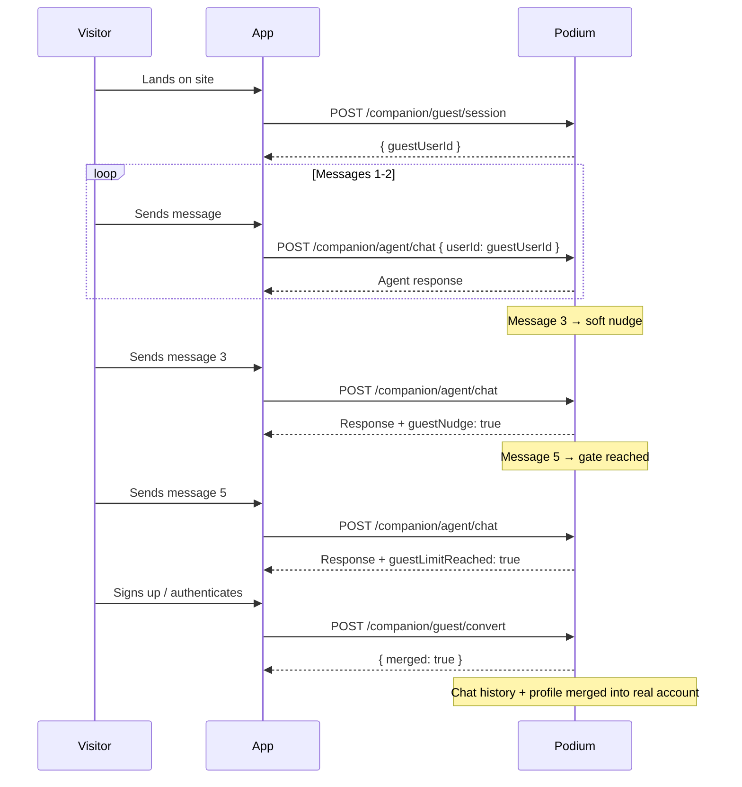

The guest experience lets potential users interact with your conversational agent without creating an account. Visitors get a taste of personalized recommendations and agent interaction, then convert to a full account with all their chat history and preferences preserved.

## How It Works



## Creating a Guest Session

Create a temporary anonymous user that can interact with the agent without authentication.

```
POST /api/v1/companion/guest/session
```

**Response:**

```json
{
  "guestUserId": "clxyz1234567890abcdef"
}
```

Use the returned `guestUserId` as the `userId` parameter when calling the [Conversational Agent](/agentic/conversational-agent) endpoints. The guest user functions identically to a regular user within the message gate limits.

## Message Gating

Guest sessions enforce a configurable message limit to encourage sign-up while still giving visitors a meaningful experience. The cap is controlled by the `GUEST_MESSAGE_LIMIT` environment variable on the platform (default: `5`). The soft-nudge always fires one turn before the gate (constant `GUEST_SOFT_NUDGE_AT = 4` with the default cap).

| Threshold | Behavior | Wire signal |
|---|---|---|
| **Message 4 (one before the cap)** | Soft nudge. The agent hints that signing up unlocks more. | `guestNudge: true` on the `done` event (and on the sync response). |
| **Message 5 (the cap)** | Hard gate. The agent stops responding with new content. | `guestLimitReached: true` on the `done` event (and on the sync response). |

There is no `isGuest` field on the wire. Whether a `userId` belongs to a guest session is something your client already knows from the session-creation step. Keep the guest id in client state (cookie, localStorage, in-memory) and treat the agent endpoints exactly the same way you would for an authenticated user.

<Info>
`GUEST_MESSAGE_LIMIT` is configured on the platform per-deployment. The values above reflect the default of `5`. If your organization runs a custom limit, the nudge always fires one turn before the gate.
</Info>

### Handling the Nudge

When `guestNudge: true` appears on the `done` SSE event, your frontend can render a non-blocking conversion prompt: a banner, inline CTA, or subtle callout. The agent continues responding normally.

### Handling the Gate

When `guestLimitReached: true` appears, the agent has reached the message cap for this guest. Your frontend should present a sign-up flow. Once the user authenticates, call the convert endpoint to merge their history.

```typescript
const eventSource = new EventSource(streamUrl);

eventSource.addEventListener('done', (event) => {
  const data = JSON.parse(event.data);

  if (data.guestNudge) {
    showSignUpBanner();
  }

  if (data.guestLimitReached) {
    showSignUpModal();
  }
});
```

## Converting a Guest

When a visitor signs up or authenticates, merge their guest experience into their real account:

```
POST /api/v1/companion/guest/convert
```

**Request body:**

```json
{
  "guestUserId": "clxyz1234567890abcdef",
  "realUserId": "clxyz0987654321fedcba"
}
```

**Response:**

```json
{
  "merged": true
}
```

### What Gets Merged

`POST /companion/guest/convert` runs a single Prisma transaction with these effects:

- **Chat history is re-keyed.** Every `agentConversation` and `agentMessage` row owned by the guest is updated to point at `realUserId`, so the merged history surfaces in `GET /companion/agent/chat/history/:userId`.
- **Intent profile is first-write-wins.** If the real user has no `userIntentProfile`, the guest's profile (including `agentSummary`) is re-keyed onto the real user. If the real user already has a profile, the guest profile is deleted and the real user's profile is preserved as-is. There is no deep field-level merge.
- **Usage counters are dropped.** The guest's `companionUsage` row is deleted; the real user keeps theirs.
- **The guest is deleted.** The guest's `privyUser` row and the guest `user` row are removed at the end of the transaction. The endpoint returns `{ merged: true }`.

The merge is safe to retry. Calling convert twice with the same pair returns `404 "Invalid guest user"` on the second call (the guest is already gone).

### SDK Example

```typescript
import { createPodiumClient } from '@podium-sdk/node-sdk';

const client = createPodiumClient({ apiKey: process.env.PODIUM_API_KEY });

// 1. Create guest session (companion-scoped guest, not the standalone /guest orders flow)
const { guestUserId } = await client.companion.companionGuestSession();

// 2. Chat as guest (uses standard agent chat with guest userId)
const response = await client.companion.createAgent({
  requestBody: {
    userId: guestUserId,
    message: "What's a good vitamin C serum for sensitive skin?",
  },
});

// 3. After user signs up, merge their session.
// The convert endpoint shares the companionGuestSession method today
// (POST /companion/guest/session and POST /companion/guest/convert
// are both reachable through the same generated SDK surface).
await fetch(`${API_BASE}/api/v1/companion/guest/convert`, {
  method: 'POST',
  headers: {
    'Authorization': `Bearer ${process.env.PODIUM_API_KEY}`,
    'Content-Type': 'application/json',
  },
  body: JSON.stringify({ guestUserId, realUserId: authenticatedUser.id }),
});
```

<Note>
`client.guests` is the standalone `/guest` orders flow (for guest checkout on the commerce API), not the companion-guest session. Companion guest endpoints live under `client.companion.*` or HTTP `POST /companion/guest/*`.
</Note>

## Automatic Cleanup

Unconverted guest sessions are automatically purged after **7 days**. This prevents stale guest records from accumulating in your database. The cleanup runs as a scheduled background job -- no action needed on your part.

<Info>
Guest cleanup only deletes guest users who never converted. If a guest converts to a real user via the `/convert` endpoint, their data lives on as part of the authenticated user's account.
</Info>

## Integration Patterns

### Try-Before-You-Buy Landing Page

Embed a lightweight chat widget on your marketing site. Visitors interact with the agent immediately, and the conversion CTA appears at the nudge threshold.

### Telegram / Mini App Onboarding

In a mini app context, create a guest session on first load and let users browse products through the agent. When they tap "Save my recommendations," trigger the auth flow and convert.

### Embedded Playground

Combine the guest flow with the [Playground API](/guides/integrations#playground-api) for a zero-auth product discovery experience on your homepage.

## Related

- [Conversational Agent](/agentic/conversational-agent) -- the chat endpoints that power guest and authenticated interactions
- [Voice Transcription](/api-reference/voice) -- accept voice input from guests
- [Reference Apps](/agentic/beauty-companion) - see guest mode in action in a worked example
