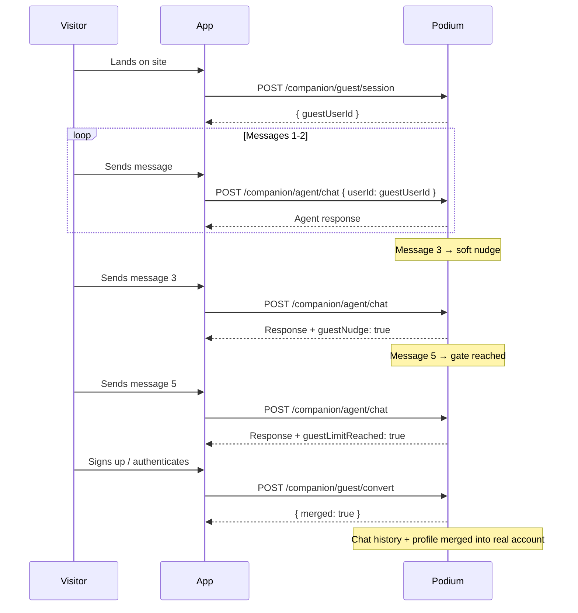

The guest experience lets potential users interact with your conversational agent without creating an account. Visitors get a taste of personalized recommendations and agent interaction, then seamlessly convert to a full account with all their chat history and preferences preserved.

## How It Works



## Creating a Guest Session

Create a temporary anonymous user that can interact with the agent without authentication.

```
POST /api/v1/companion/guest/session
```

**Response:**

```json
{
  "guestUserId": "clxyz1234567890abcdef"
}
```

Use the returned `guestUserId` as the `userId` parameter when calling the [Conversational Agent](/agentic/conversational-agent) endpoints. The guest user functions identically to a regular user within the message gate limits.

## Message Gating

Guest sessions enforce a configurable message limit to encourage sign-up while still giving visitors a meaningful experience:

| Threshold | Behavior | SSE Event Field |
|---|---|---|
| **Message 3** | Soft nudge -- agent hints that signing up unlocks more | `guestNudge: true` on the `done` event |
| **Message 5** | Hard gate -- agent stops responding with new content | `guestLimitReached: true` on the `done` event |

### Handling the Nudge

When `guestNudge: true` appears on the `done` SSE event, your frontend can render a non-blocking conversion prompt -- a banner, inline CTA, or subtle callout. The agent continues responding normally.

### Handling the Gate

When `guestLimitReached: true` appears, the agent has reached the message cap for this guest. Your frontend should present a sign-up flow. Once the user authenticates, call the convert endpoint to merge their history.

```typescript
// Listening for guest events in an SSE stream
const eventSource = new EventSource(streamUrl);

eventSource.addEventListener('done', (event) => {
  const data = JSON.parse(event.data);
  
  if (data.guestNudge) {
    showSignUpBanner(); // soft prompt
  }
  
  if (data.guestLimitReached) {
    showSignUpModal(); // conversion gate
  }
});
```

## Converting a Guest

When a visitor signs up or authenticates, merge their guest experience into their real account:

```
POST /api/v1/companion/guest/convert
```

**Request body:**

```json
{
  "guestUserId": "clxyz1234567890abcdef",
  "realUserId": "clxyz0987654321fedcba"
}
```

**Response:**

```json
{
  "merged": true
}
```

### What Gets Merged

- **Chat history** -- all messages from the guest session are re-attributed to the real user
- **Intent profile data** -- any preferences or interaction signals recorded during the guest session
- **Agent memory** -- conversation summaries and insights carry over
- The guest user record is deleted after a successful merge

### SDK Example

```typescript
import { createPodiumClient } from '@podium-sdk/node-sdk';

const client = createPodiumClient({ apiKey: process.env.PODIUM_API_KEY });

// 1. Create guest session
const { guestUserId } = await client.guests.createSession();

// 2. Chat as guest (uses standard agent chat with guest userId)
const response = await client.companion.chat({
  userId: guestUserId,
  message: "What's a good vitamin C serum for sensitive skin?",
});

// 3. After user signs up, merge their session
await client.guests.convert({
  guestUserId,
  realUserId: authenticatedUser.id,
});
```

## Automatic Cleanup

Unconverted guest sessions are automatically purged after **7 days**. This prevents stale guest records from accumulating in your database. The cleanup runs as a scheduled background job -- no action needed on your part.

<Info>
Guest cleanup only deletes guest users who never converted. If a guest converts to a real user via the `/convert` endpoint, their data lives on as part of the authenticated user's account.
</Info>

## Integration Patterns

### Try-Before-You-Buy Landing Page

Embed a lightweight chat widget on your marketing site. Visitors interact with the agent immediately, and the conversion CTA appears naturally at the nudge threshold.

### Telegram / Mini App Onboarding

In a mini app context, create a guest session on first load and let users browse products through the agent. When they tap "Save my recommendations," trigger the auth flow and convert.

### Embedded Playground

Combine the guest flow with the [Playground API](/guides/integrations#playground-api) for a zero-friction product discovery experience on your homepage.

## Related

- [Conversational Agent](/agentic/conversational-agent) -- the chat endpoints that power guest and authenticated interactions
- [Voice Transcription](/api-reference/voice) -- accept voice input from guests
- [Beauty Companion](/agentic/beauty-companion) -- see guest mode in action in the Sage reference app
