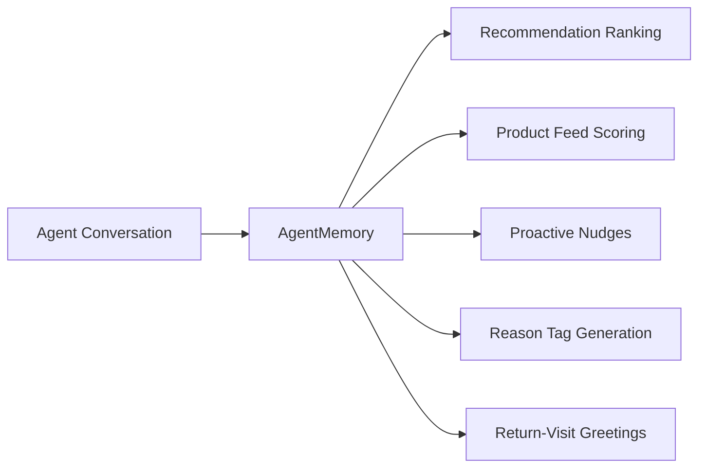

## Overview

Podium's memory and intelligence system gives agents a deep, evolving understanding of each user. Instead of treating every conversation as stateless, the agent accumulates structured knowledge — preferences, goals, concerns, products tried, price sensitivity — and uses that knowledge to score and explain recommendations.

The system covers three capabilities:

1. **Structured user memory** — a versioned schema that captures everything the agent learns about a user
2. **ML scoring layer** — popularity signals, temporal decay, and domain-specific weights that rank products intelligently
3. **Reason tags** — human-readable explanations attached to every recommendation

## AgentMemory

The agent builds and evolves a structured memory for each user. Memory is stored on the user's intent profile and persists across sessions, channels, and devices.

### Schema

```typescript
interface AgentMemory {
  schemaVersion: 2
  attributes: Record<string, {
    value: string
    confidence: "high" | "medium" | "low"
    source: "quiz" | "declared" | "inferred"
    lastConfirmed: string
  }>
  goals: MemorySignal[]
  concerns: MemorySignal[]
  avoidances: MemorySignal[]
  productsTried: ProductMemory[]
  priceRange: {
    overall: { min: number, max: number, lastUpdated: string } | null
    byCategory: Record<string, { min: number, max: number, lastUpdated: string }>
  } | null
  lastConversationDate: string
}

interface MemorySignal {
  text: string
  confidence: "high" | "medium" | "low"
  firstMentioned: string
  lastConfirmed: string
  mentionCount: number
}

interface ProductMemory {
  name: string
  brand: string
  productId: string | null
  sentiment: "positive" | "negative" | "neutral"
  outcome: string | null
  dateSurfaced: string
}
```

### Key Design Decisions

**Category-aware price ranges.** A user might spend up to $50 on serums but cap moisturizers at $30. The `priceRange.byCategory` map captures this naturally — the agent uses the most specific range available when filtering products.

**Confidence-tracked signals.** Every goal, concern, and avoidance carries a `confidence` level, `mentionCount`, and timestamps. Signals the user mentions repeatedly are weighted higher than one-off statements. Signals that haven't been confirmed recently decay in influence.

**Multi-source attributes.** User attributes can originate from three sources:

| Source | How It's Set | Confidence |
|--------|-------------|------------|
| `quiz` | Onboarding or profile-building quiz | High — explicit answers |
| `declared` | User states something directly in conversation | High — explicit statement |
| `inferred` | Agent deduces from context or product choices | Medium to low — requires confirmation |

**Products tried with outcome tracking.** The agent records not just which products a user has tried, but their sentiment and outcome. "Broke me out" vs "holy grail" is critical context for future recommendations.

## Automatic Summarization

The agent extracts and updates memory at three trigger points:

| Trigger | Condition | Purpose |
|---------|-----------|---------|
| **Early capture** | Turns 3–5, no existing memory | Capture initial preferences quickly |
| **Regular cadence** | Every 10 user turns | Keep memory current as conversation evolves |
| **Session gap** | >2 hours since last conversation | Summarize before context goes cold |

Summaries are stored on the user's intent profile (`agentSummary` field), making conversation-derived intelligence available to recommendations, the [agentic product feed](/agentic/product-feed), and downstream analytics.

<Note>
Memory extraction runs as a background job — it does not add latency to the agent's response. The user sees no delay.
</Note>

## Domain Taxonomy

Products are organized into a two-level `domain:subcategory` system. This taxonomy drives scoring weights, expert personas, and brand tier calibration.

### Domains

<AccordionGroup>
  <Accordion title="Beauty">
    moisturizer, serum, cleanser, sunscreen, toner, mask, exfoliant, eye cream, lip, makeup, hair care, body care, tools, fragrance
  </Accordion>
  <Accordion title="Wellness">
    supplements, probiotics, protein, greens, vitamins, minerals, adaptogens, nootropics, collagen, sleep, longevity, fitness
  </Accordion>
  <Accordion title="Fashion">
    clothing, shoes, accessories, bags, jewelry, watches
  </Accordion>
  <Accordion title="Home">
    decor, kitchen, bedding, bath, storage, lighting, furniture
  </Accordion>
</AccordionGroup>

Each product is tagged with a domain and subcategory. When the agent scores and re-ranks recommendations, it loads the appropriate domain configuration — weights, persona, and brand tier thresholds.

## Domain-Specific Expert Personas

When re-ranking recommendations, the system activates a domain-specific expert persona. This shapes the language, evaluation criteria, and recommendation style:

| Domain | Persona | Evaluation Focus |
|--------|---------|-----------------|
| **Beauty** | Curated beauty recommendation expert | Ingredients, skin compatibility, texture, routine fit |
| **Wellness** | Formulation science advisor | Bioavailability, clinical evidence, dosage, sourcing |
| **Fashion** | Premium personal stylist | Fit, occasion, wardrobe coherence, brand positioning |
| **Home** | Design-forward specialty buyer | Aesthetics, materials, space fit, value per dollar |

Personas are applied during the re-ranking step — after initial retrieval and scoring, but before final product selection. The persona influences both which products surface and how the agent describes them.

## ML Scoring Layer

Beyond profile matching, the intelligence system uses machine learning signals to rank products:

### Impression Logging

Every product shown to a user is logged with its position. This creates a feedback loop: the system knows which products were *seen* (not just clicked), enabling proper conversion-rate estimation and position-bias correction.

### Popularity Scoring

Product popularity is computed from weighted user interactions:

| Interaction | Weight |
|-------------|--------|
| `PURCHASED` | 10 |
| `PURCHASE_INTENT` | 5 |
| `AFFILIATE_CLICK` | 3 |
| `RANK_UP` | 2 |
| `NUDGE_OPENED` | 1 |
| `RANK_DOWN` | −2 |
| `SKIP` | −1 |

The raw score is normalized: `popularityScore = weightedSum / sqrt(totalInteractions)`. This prevents products with many low-quality interactions from outscoring products with fewer but stronger signals.

### Temporal Decay

Interaction signals decay over time with a **720-hour half-life** (approximately 30 days). A purchase from yesterday weighs more than one from three months ago. This keeps recommendations responsive to shifting user interests and seasonal trends.

### Feature Cache

For each product, the system maintains a pre-computed feature vector:

| Feature | Description |
|---------|-------------|
| `qualityScore` | Aggregated quality signal from enrichment data |
| `brandTier` | 1 (prestige) through 4 (mass market) |
| `popularityScore` | Normalized weighted interaction score |
| `pricePercentile` | Where this product sits in its category's price distribution |
| `enrichmentDepth` | How many enrichment signals back this product |

These features are cached for fast retrieval during scoring — no recomputation on every request.

## Reason Tags

Every recommended product can include a `reasonTag` — a concise, human-readable explanation of why it was selected. Reason tags build user trust by making the agent's logic transparent.

### Tag Types

| Tag | Example | Triggered By |
|-----|---------|-------------|
| Skin type match | `"For oily skin"` | User's declared skin type matches product suitability |
| Profile concern | `"Hydration"` | Product addresses a user concern from memory |
| Budget | `"Under your $50 budget"` | Product price fits the user's category price range |
| Brand affinity | `"Matches your taste"` | User has positive history with this brand |
| Compound | `"For oily skin · Hydration"` | Multiple reasons combined with `·` separator |

Reason tags are generated during the re-ranking step and returned alongside product data in both the [conversational agent](/agentic/conversational-agent) responses and the [companion recommendations endpoint](/agentic/product-feed).

## Signal Scoring with Polarity

The scoring system handles negation and avoidances intelligently — a common pitfall in keyword-based matching.

### How It Works

When computing signal scores, the system applies domain-specific weights and checks polarity:

- **Avoidance-aware matching**: If a user lists "fragrance" as an avoidance, a product described as "fragrance-free" is treated as a **positive signal**, not penalized. Similarly, "paraben-free" is not penalized when "parabens" is in the user's avoidance list.
- **Negative descriptor detection**: Terms like "greasy", "harsh", and "irritating" carry negative weight regardless of user preferences. These are universally undesirable product attributes.
- **Domain-specific weighting**: A "lightweight texture" signal carries more weight in beauty (where texture is critical) than in wellness (where formulation matters more).

This polarity-aware scoring prevents the classic failure mode where an agent penalizes products for *not* containing an avoided ingredient — the exact opposite of what the user wants.

## How Memory Feeds Into the Platform

Memory is not isolated to conversations. It flows into multiple platform capabilities:



| Consumer | How It Uses Memory |
|----------|--------------------|
| [Conversational Agent](/agentic/conversational-agent) | Personalizes responses, remembers past products and preferences |
| [Product Feed](/agentic/product-feed) | Memory-aware intent scoring and domain-specific weights |
| [Enrichment Pipeline](/agentic/enrichment-pipeline) | Domain taxonomy aligns enrichment attributes with scoring |
| Recommendations | Reason tags, avoidance filtering, price range enforcement |
| Proactive Nudges | Targets re-engagement based on memory gaps and product outcomes |
