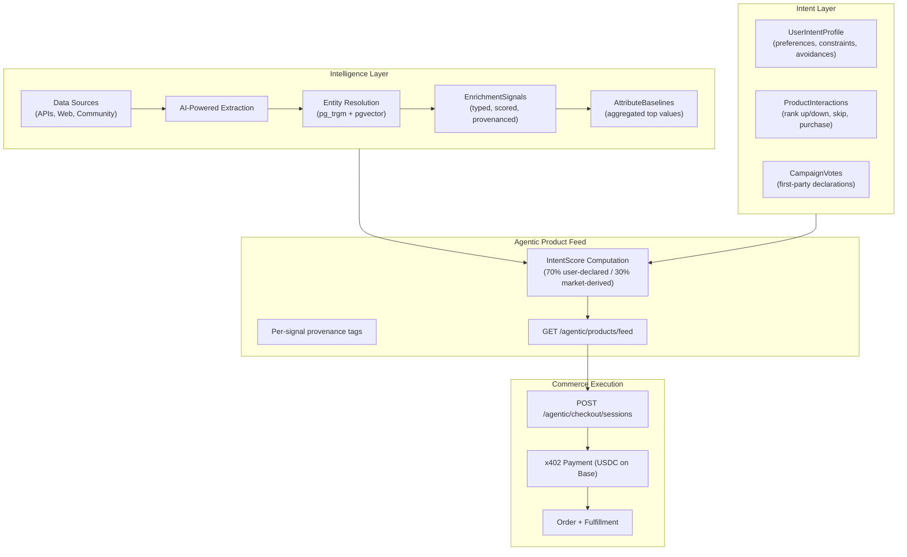

## The Thesis

Commerce is shifting from search-and-browse to **agent-mediated**. A user tells their agent what they want. The agent discovers options, evaluates them against the user's declared preferences, and executes a purchase — all with the user's trust.

That trust requires three things traditional commerce infrastructure doesn't provide:

1. **Transparent product intelligence** — Agents need structured, scored product attributes with explicit provenance. They need to know *why* a product is recommended, not just *that* it's recommended.
2. **User-owned intent profiles** — Preferences, constraints, and avoidances that the user controls and the agent consults — never sold to advertisers.
3. **Machine-native payments** — Agents need to pay for things programmatically, without card forms or browser sessions. USDC over HTTP 402 gives agents a payment rail that works like an API call.

Podium provides all three.

## Architecture



## The Two-Lane Provenance Model

Every signal in Podium carries an explicit `SignalSource`:

| Source | Origin | Weight in Feed |
|--------|--------|---------------|
| `USER_DECLARED` | Campaign votes, quiz answers, explicit preferences | **70%** |
| `MARKET_DERIVED` | Enrichment pipeline — product reviews, structured APIs, community data | **30%** |
| `BASELINE_INFERRED` | Computed aggregates from enrichment signals | Used in attribute baselines |

This is a deliberate architectural choice. Enrichment data is **not synthetic intent** — it's structured market intelligence that makes the platform useful during cold-start while first-party user data grows organically.

As users interact (vote in campaigns, rank products, purchase), `USER_DECLARED` signals naturally dominate the intent score. Market-derived data gracefully steps back to a supplementary validation role.

Agents consuming the product feed receive provenance metadata on every item:

```json
{
  "intentScore": 0.42,
  "intentProvenance": {
    "USER_DECLARED": { "voteCount": 12, "weight": 0.7 },
    "MARKET_DERIVED": { "signalCount": 87, "weight": 0.3 }
  }
}
```

The agent — and the user — always know what's driving a recommendation.

## Key Components

<CardGroup cols={2}>
  <Card title="Enrichment Pipeline" icon="flask" href="/agentic/enrichment-pipeline">
    Multi-source product intelligence: ingest, extract, resolve, normalize, baseline. The data engine behind informed agent decisions.
  </Card>
  <Card title="Agentic Product Feed" icon="rss" href="/agentic/product-feed">
    The endpoint agents call to discover products — scored, provenanced, and filterable. No auth required.
  </Card>
  <Card title="x402 Payments" icon="credit-card" href="/agentic/x402-payments">
    Machine-native USDC payments over HTTP 402. Agents pay for products (or API access) with a single fetch call.
  </Card>
  <Card title="Beauty Companion" icon="wand-magic-sparkles" href="/agentic/beauty-companion">
    A complete reference implementation: a personal shopping agent built on these primitives with Telegram, AI recommendations, and Privy wallets.
  </Card>
</CardGroup>

## Companion API

The Companion API (`/companion/*`) provides generalized infrastructure for building personal agents:

| Endpoint | Purpose |
|----------|---------|
| `GET/POST/PATCH /companion/profile/{userId}` | Intent profile CRUD — preferences, constraints, avoidances |
| `GET /companion/products` | Filterable product catalog with category, brand, price range, and search |
| `POST /companion/interactions` | Record typed interactions: `RANK_UP`, `RANK_DOWN`, `SKIP`, `PURCHASED`, `PURCHASE_INTENT`, `NUDGE_OPENED` |
| `GET /companion/recommendations/{userId}` | AI-ranked product recommendations based on profile + interaction history |
| `POST /companion/orders` | Create a concierge order (the agent handles fulfillment) |
| `GET /companion/user/by-telegram/{telegramId}` | Link external identities to Podium users |

The Companion API is **vertical-agnostic**. The Beauty Companion uses it for skincare; you could build the same pattern for fashion, food, supplements, or any product domain. The schema fields (skin type, concerns, etc.) are profile-specific — the infrastructure (interactions, recommendations, orders) is generic.

## For Developers

If you're building an agent on Podium, the typical integration path is:

<Steps>
  <Step title="Create user and intent profile">
    Use the Companion API to create a user and build their preference profile through conversational onboarding, quiz mechanics, or direct input.
  </Step>
  <Step title="Discover products">
    Query the agentic product feed for scored, provenanced product listings. Filter by category, price range, or attribute baselines.
  </Step>
  <Step title="Record interactions">
    As the user expresses preferences (likes, dislikes, skips), record interactions. These feed back into recommendation ranking and intent scoring.
  </Step>
  <Step title="Execute commerce">
    Create checkout sessions and pay via x402 (USDC) or Stripe. The concierge order model handles fulfillment on the user's behalf.
  </Step>
  <Step title="Earn trust over time">
    The more the user interacts, the better the recommendations. First-party signals naturally overtake market-derived data in the intent score.
  </Step>
</Steps>
