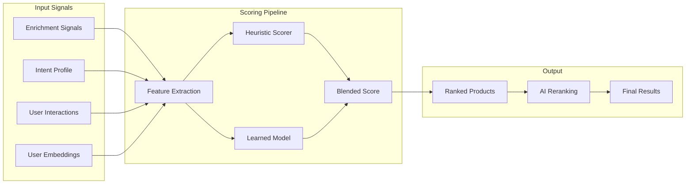

Ranking Intelligence is the system that decides **which products appear first** when your agent makes recommendations. It combines hand-tuned heuristics, a learned model trained on real user behavior, and per-user preference embeddings to produce rankings that improve over time.

## How Ranking Works

Every recommendation request flows through a multi-stage scoring pipeline:

### Stage 1: Feature Extraction

For every candidate product, the system extracts a feature vector from multiple data sources:

| Feature Category | Examples | Source |
|---|---|---|
| **Item features** | Quality score, popularity, brand tier, price position, certification count | [Enrichment Pipeline](/agentic/enrichment-pipeline) |
| **User features** | Saved brands count, interaction diversity, category breadth, budget alignment | [Intent Profile](/api-reference/companion#intent-profiles) |
| **Context features** | Position in list, pre-rank score, domain match, user-product embedding similarity | Real-time computation |
| **Interaction features** | View count, rank-up/rank-down ratio, purchase history overlap | [Interaction History](/api-reference/companion#interactions) |

### Stage 2: Dual Scoring

Every product receives two scores in parallel:

**Heuristic scorer** -- a hand-tuned formula combining enrichment signals, profile affinity, and domain-specific weights. This is the baseline that has been refined over months of production use.

**Learned scorer** -- a model trained on real click and purchase data. It discovers patterns that hand-tuning misses, such as the relationship between brand tier and user engagement or the impact of position bias on perceived quality.

### Stage 3: Blended Output

The two scores are blended using configurable traffic allocation. This allows safe rollout of model improvements: start at 0% learned traffic, gradually increase as the model proves itself, and instantly revert if quality drops.

### Stage 4: AI Reranking

For the top candidates, an AI reranking pass considers the full conversation context -- what the user asked for, their stated preferences, brands they've explicitly liked or avoided -- to produce the final ordering. This step has access to the user's full [Agent Memory](/agentic/memory-intelligence) for personalization.

## User Preference Embeddings

Every user builds a **preference embedding** -- a mathematical representation of their taste profile derived from their interaction history.

### How Embeddings Are Built

Each interaction updates the user's embedding vector:

| Interaction | Weight | Effect |
|---|---|---|
| Purchase | 5x | Strong pull toward this product's characteristics |
| Rank Up / Save | 2x | Moderate positive signal |
| View / Click | 0.5x | Weak exploratory signal |
| Rank Down / Dismiss | -2x | Pushes away from this product's characteristics |

The weighted product embeddings are averaged and normalized into a single vector stored on the user's intent profile. This vector is recomputed on high-signal interactions (purchases, rank-ups, rank-downs) to stay current.

### Similarity Scoring

When ranking products, the system computes the **cosine similarity** between the user's preference embedding and each candidate product's embedding. Products whose characteristics align with the user's demonstrated preferences score higher, creating a personalization signal that's independent of explicit filters or stated preferences.

<Tip>
User embeddings start empty and accumulate organically. For new users, the ranking falls back to population-level signals (popularity, quality score, brand tier) until enough interactions build a meaningful preference vector.
</Tip>

## Domain-Specific Scoring

Podium supports multiple product domains, each with its own scoring profile:

| Domain | Key Signals | Emphasis |
|---|---|---|
| **Beauty** | Ingredient quality, certification count, texture signals, skin-type match | Safety and efficacy |
| **Wellness** | Clinical evidence, dosage clarity, purity signals | Trust and transparency |
| **Fashion** | Brand tier, style coherence, seasonal relevance | Aesthetic alignment |
| **Home** | Material quality, durability signals, design awards | Longevity and craftsmanship |

Each domain applies different weight multipliers to enrichment signals, so a "high quality" wellness supplement and a "high quality" fashion item are evaluated on criteria appropriate to their category.

## A/B Testing Infrastructure

Ranking improvements are rolled out through a built-in experimentation framework:

1. **Traffic allocation** -- control what percentage of recommendation requests use the learned model vs. heuristic baseline
2. **Arm tracking** -- every recommendation impression records which scoring method was used (`heuristic` or `blended`)
3. **Engagement comparison** -- measure click-through, rank-up, and purchase rates across scoring arms
4. **Regression alerting** -- automatic detection if the learned model underperforms the baseline by more than a configurable threshold

This infrastructure means your agent's recommendations get measurably better over time without manual intervention.

## Exploration vs. Exploitation

To prevent recommendation bubbles, the system balances showing products the user is likely to enjoy (exploitation) with introducing products they haven't seen before (exploration):

| User Type | Exploration Rate | Rationale |
|---|---|---|
| **New users** | 25% | Cast a wide net to learn preferences quickly |
| **Moderate users** | 15% | Balance discovery with personalization |
| **Power users** | 8% | Mostly serve refined preferences, occasionally surprise |

Exploration rates adapt automatically based on interaction volume. The contextual bandit approach ensures that even exploration slots are informed by population-level signals rather than purely random.

## Quality Evaluation

Podium continuously evaluates ranking quality through automated eval harnesses:

- **Extraction quality** -- precision, recall, and F1 scores for enrichment signal extraction, measured against a curated golden dataset
- **Ranking quality** -- NDCG (normalized discounted cumulative gain) scores comparing learned vs. heuristic ordering
- **Prompt regression testing** -- automated gates that catch quality drops when extraction prompts are updated

These evaluations run as part of the deployment pipeline, ensuring that ranking quality is maintained across releases.

## For Builders

As a builder, ranking intelligence works automatically -- you don't need to configure or train anything. The system improves as your users interact with products. Here's what you can leverage:

**Record interactions faithfully** -- the more interaction data flows through [the interaction API](/api-reference/companion#interactions), the better the ranking becomes for each user.

**Use domain tags** -- when creating products or enriching your catalog, ensure domain and category fields are populated so domain-specific scoring activates.

**Trust the feed** -- the [Agentic Product Feed](/agentic/product-feed) and recommendation endpoints already incorporate ranking intelligence. Products returned by the API are pre-sorted by relevance for the requesting user.

## Related

- [Enrichment Pipeline](/agentic/enrichment-pipeline) -- the data that feeds ranking features
- [Product Feed](/agentic/product-feed) -- how ranked products are served
- [Memory Intelligence](/agentic/memory-intelligence) -- the memory context used in AI reranking
- [Conversational Agent](/agentic/conversational-agent) -- where rankings surface in agent responses
