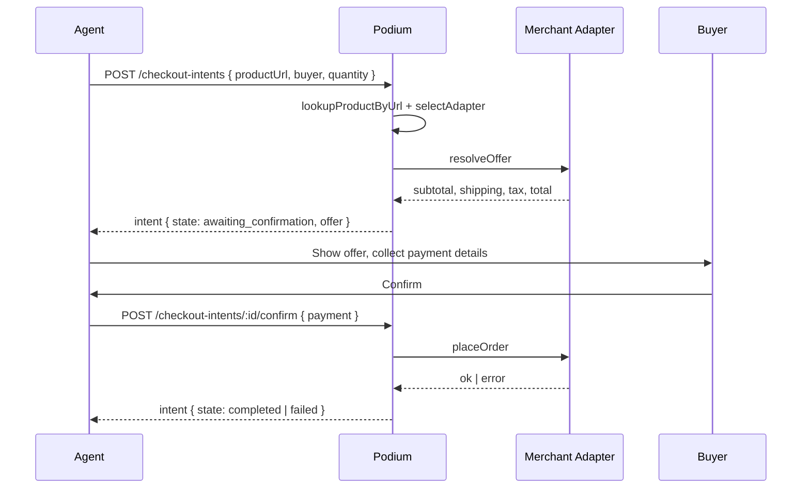

## Overview

Universal Checkout is a two-phase intent primitive that lets your agent buy from supported merchant URLs. You submit a product URL, Podium resolves the live offer through the right merchant adapter, the buyer confirms with verified contact details, and the order settles in USDC or by card. One contract for every supported merchant.

The API name for the primitive is **Checkout Intents**. The two phases are:

1. **Create.** `POST /checkout-intents` resolves the URL, picks the adapter, and returns the resolved offer (subtotal, shipping, tax, total) with the intent in `awaiting_confirmation`.
2. **Confirm.** `POST /checkout-intents/:id/confirm` accepts payment and shipping details, transitions through `confirming`, and lands on `completed` or `failed`.

Coverage expands automatically as [Merchant Intelligence](/platform/merchant-intelligence) classifies new storefronts. Unsupported merchants return a precise `422 merchant_unsupported` so your agent can fall back gracefully.

## Lifecycle



## Intent state machine

| State | What it means | Reached by |
|---|---|---|
| `processing` | Intent created, offer resolution in flight | `POST /checkout-intents` |
| `awaiting_confirmation` | Offer resolved, ready for buyer confirmation | Adapter returned a valid offer |
| `confirming` | Confirm received, placing the order | `POST /checkout-intents/:id/confirm` |
| `completed` | Terminal. Order placed on the merchant. | Adapter `placeOrder` succeeded |
| `failed` | Terminal. Order rejected. See `failureReason`. | Adapter `placeOrder` failed |

`completed` and `failed` are terminal. Poll `GET /checkout-intents/:id` until you reach one.

<Warning>
**Breaking change (May 2026):** `buyer.phone` is now required on `POST /checkout-intents` and on `POST /checkout-intents/:id/confirm`. The field accepts E.164-ish input (digits, spaces, parentheses, hyphens, optional leading `+`) and must contain at least 7 digits after stripping formatting. Requests missing or malformed return a `400` with a Zod validation error on `path: ["buyer", "phone"]`. Update your client to collect a phone number during the buyer-details step.
</Warning>

## How coverage works

Universal Checkout routes every intent through a merchant adapter selected at create time. The platform decides which adapter owns the intent based on the product URL, the resolved catalog item, your org settings, and the user cohort.

When no adapter can fulfill the URL, the platform returns `422 merchant_unsupported` with a message naming the URL and the enablement paths available. Your agent should treat this as a graceful fallback signal, not a hard error. Common pattern: tell the user the merchant is not covered yet and share the merchant link directly so they can buy on the merchant's site.

Coverage expands automatically as [Merchant Intelligence](/platform/merchant-intelligence) classifies new storefronts. High-confidence Shopify-class domains become eligible for the agentic adapter without manual onboarding.

<Note>
The 422 response body uses the standard envelope:

```json
{
  "errors": [
    {
      "message": "merchant_unsupported: no adapter can fulfill https://example.com/products/widget. Enable Rye on this org or onboard the merchant via Shopify to proceed.",
      "path": []
    }
  ]
}
```

HTTP status is conveyed by the response code (`422`). There is no machine-readable `error.code` field today. Match on the `merchant_unsupported:` prefix in `errors[0].message`. The message tail is informational and may change.
</Note>

## When to use it vs Commerce API orders

Universal Checkout and the [Commerce API](/api-reference/orders) solve different problems.

| Use Universal Checkout when | Use the Commerce API when |
|---|---|
| The product lives on an external merchant URL | The product lives in your own Podium catalog |
| You want one contract across many merchants | You control the storefront and want first-party order objects |
| The buyer is verified at the moment of purchase | The buyer is already authenticated in your app |
| You want phone-verified buyers and card or USDC settlement | You want full control of variants, inventory, fulfillment |

You can mix both in a single agent. Catalog products go through the Commerce API; pasted URLs and recommendations from intermediaries go through Checkout Intents.

## Server-derived buyability

Companion `ProductCard` responses include a `buyableInChat` boolean that mirrors the adapter selection logic. When `buyableInChat` is `true`, the same product URL would be picked up by a Universal Checkout adapter at intent-create time given the current org settings and user cohort.

**Server-derived. Do not re-derive on the client.** `buyableInChat` mirrors live adapter selection. See [Product Feed](/agentic/product-feed#buyableinchat) for the full contract, including which surfaces stamp the field (companion endpoints and agent tool results, not `/agentic/*` discovery endpoints).

## Streaming integration

The [Conversational Agent](/agentic/conversational-agent) emits a `checkout_intent_created` SSE event whenever the agent's `create_order` tool produces a new intent. Your frontend can show the resolved offer breakdown in the chat surface, then call `POST /checkout-intents/:id/confirm` when the buyer accepts.

```json
{
  "type": "checkout_intent_created",
  "intentId": "cm3int123abc",
  "adapter": "rye",
  "state": "awaiting_confirmation",
  "productUrl": "https://www.amazon.com/dp/B0CWXNS552",
  "productName": "Example Product",
  "merchantHostname": "amazon.com",
  "offer": {
    "subtotal": 2499,
    "shipping": 599,
    "tax": 250,
    "total": 3348,
    "currency": "USD"
  }
}
```

## Related

<CardGroup cols={2}>
  <Card title="Checkout Intents API" icon="code" href="/api-reference/checkout-intents">
    Full request and response schemas with breaking-change notes.
  </Card>
  <Card title="Merchant Intelligence" icon="brain" href="/platform/merchant-intelligence">
    How storefronts get classified and how coverage expands.
  </Card>
  <Card title="Product Feed" icon="grid" href="/agentic/product-feed">
    The `buyableInChat` signal on every product card.
  </Card>
  <Card title="Conversational Agent" icon="message" href="/agentic/conversational-agent">
    The `create_order` tool and `checkout_intent_created` SSE event.
  </Card>
</CardGroup>
