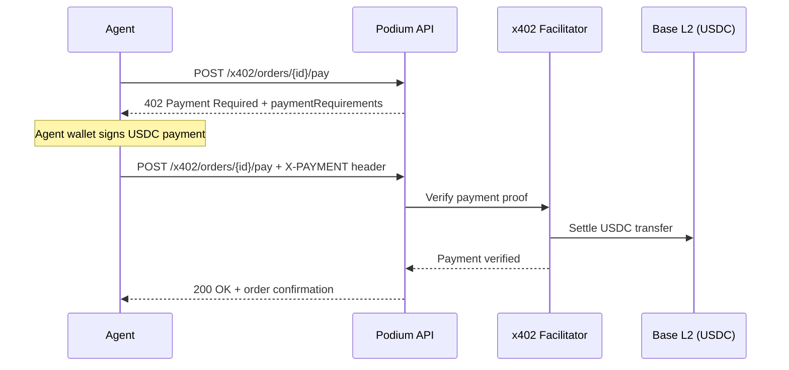

## What is x402?

x402 is a payment protocol that uses the HTTP `402 Payment Required` status code to enable machine-to-machine payments. When an agent hits a paywalled endpoint, the server responds with payment requirements; the agent's wallet signs a USDC payment, and the request is retried with the payment proof attached.

This gives AI agents a payment rail that works like an API call — no card forms, no browser sessions, no human in the loop.

## How It Works



### Payment Requirements

The 402 response includes everything the agent needs to construct a payment:

```json
{
  "x402Version": 1,
  "accepts": [{
    "scheme": "exact",
    "network": "base",
    "maxAmountRequired": "25000000",
    "resource": "https://api.podiumcommerce.xyz/api/v1/x402/orders/ord_abc/pay",
    "payToAddress": "0x...",
    "validUntil": "2026-03-08T00:00:00Z"
  }]
}
```

| Field | Description |
|-------|-------------|
| `scheme` | Payment scheme (`exact` for fixed amount) |
| `network` | Blockchain network (`base` for Base mainnet) |
| `maxAmountRequired` | Amount in USDC atomic units (6 decimals, so `25000000` = $25.00) |
| `payToAddress` | Merchant's receiving address |
| `validUntil` | Payment window expiration |

### Payment Execution

The agent signs a USDC payment using its wallet and includes the proof in the `X-PAYMENT` header:

```typescript
import { wrapFetchWithPayment } from '@x402/fetch';

const response = await wrapFetchWithPayment(
  fetch,
  `${API_BASE}/api/v1/x402/orders/${orderId}/pay`,
  {}, // fetch options
  {
    wallet,                    // Privy embedded or server wallet
    maxValue: priceInUSDC,     // Max USDC willing to spend
    facilitatorUrl: 'https://facilitator.x402.org'
  }
);
```

## Two Use Cases

### 1. Commerce Payments

Agents pay for physical products on behalf of users:

```typescript
import { createPodiumClient } from '@podium-sdk/node-sdk'
const client = createPodiumClient({ apiKey: process.env.PODIUM_API_KEY })

const { data: order } = await client.companion.createOrders({
  requestBody: {
    userId: 'user_xyz',
    productId: 'prod_abc',
    shippingAddress: { street: '123 Main St', city: 'San Francisco', state: 'CA', zip: '94102' },
    email: 'user@example.com',
  },
})

// Pay via x402
const payment = await wrapFetchWithPayment(
  fetch,
  `https://api.podiumcommerce.xyz/api/v1/x402/order/${order.id}/pay`,
  {},
  { wallet, maxValue: order.amountUsdc }
)
```

### 2. Pay-Per-Call API Access

Podium's x402 middleware can gate any endpoint behind a crypto paywall. Agents pay per-request in USDC to access premium data or services:

```typescript
// The middleware responds with 402 + payment requirements
// x402/fetch handles the payment negotiation automatically
const enrichedData = await wrapFetchWithPayment(
  fetch,
  `${API_BASE}/api/v1/premium/enrichment-data`,
  {},
  { wallet, maxValue: '100000' } // $0.10 per call
);
```

The x402 middleware is configured per-endpoint in the Podium API. When enabled, it intercepts requests before the route handler and requires a valid payment proof.

## Wallet Options

### Privy Server Wallets (Automated)

For bots and backend agents that need to pay without user interaction:

```typescript
import { PrivyClient } from '@privy-io/node';

const privy = new PrivyClient(appId, appSecret);
const wallet = await privy.wallets().create({ chain_type: 'ethereum' });
// Use wallet for automated x402 payments
```

### Privy Embedded Wallets (User-Controlled)

For consumer-facing apps where the user funds and controls the wallet:

```typescript
import { usePrivy, useX402Fetch } from '@privy-io/react-auth';

const { user } = usePrivy();
const x402Fetch = useX402Fetch();

// User sees balance, can fund via Apple Pay / Google Pay / Coinbase
const response = await x402Fetch(
  `${API_BASE}/api/v1/x402/orders/${orderId}/pay`,
  { maxValue: priceInUSDC }
);
```

## USDC on Base

All x402 payments settle in **USDC on Base L2**:

| Network | USDC Address |
|---------|-------------|
| Base Mainnet | `0x833589fCD6eDb6E08f4c7C32D4f71b54bdA02913` |
| Base Sepolia | Deployed MockUSDC per environment |

The facilitator at `https://facilitator.x402.org` (Coinbase) handles payment verification and settlement.

## Payment States

| State | Description |
|-------|-------------|
| `PENDING` | Payment requirements sent, awaiting proof |
| `VERIFIED` | Facilitator confirmed the payment proof |
| `SETTLED` | USDC transferred on-chain |
| `FAILED` | Payment verification or settlement failed |

## Graceful Fallback

When x402 payment fails (insufficient balance, network issues, wallet not configured), applications should fall back gracefully:

```typescript
try {
  const result = await wrapFetchWithPayment(fetch, payUrl, {}, { wallet, maxValue });
  // Record PURCHASED interaction + full points
} catch (error) {
  // Record PURCHASE_INTENT interaction + partial points
  // Show user a link to the product page for manual checkout
}
```

The Beauty Companion reference implementation demonstrates this pattern — it awards 25 points for successful x402 purchases and 10 points for purchase intents where payment failed.
