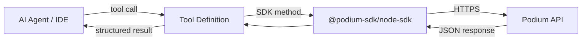

Podium is designed to be consumed by agents. Every API endpoint works with bearer-token auth, returns structured JSON, and follows consistent patterns — making it straightforward to expose Podium as tools for any AI system.

This section covers how to integrate Podium with the most popular agent clients, coding assistants, and frameworks.

## MCP Clients

Model Context Protocol (MCP) clients connect to a Podium MCP server you build once and reuse everywhere. See the [Build a Claude MCP Server](/recipes/mcp-server) recipe for the full server implementation.

<CardGroup cols={3}>
<Card title="Cursor" icon="arrow-pointer" href="/ai-tools/cursor">
  MCP server config and `.cursor/rules` for building on Podium inside Cursor.
</Card>

<Card title="Claude Desktop" icon="message-bot" href="/ai-tools/claude-desktop">
  The canonical MCP setup — configure Claude Desktop to search, buy, and manage with Podium tools.
</Card>

<Card title="Windsurf" icon="wind" href="/ai-tools/windsurf">
  MCP config and workspace rules for Podium development in Windsurf.
</Card>
</CardGroup>

## CLI Agents

Terminal-based coding agents that can scaffold Podium integrations, build features, and run SDK code.

<CardGroup cols={2}>
<Card title="Claude Code" icon="terminal" href="/ai-tools/claude-code">
  CLAUDE.md context file and MCP config for Anthropic's terminal agent.
</Card>

<Card title="Codex" icon="robot" href="/ai-tools/codex">
  OpenAI's Codex CLI — instructions file and Podium project scaffolding.
</Card>
</CardGroup>

## Agent Frameworks

Native tool definitions for building autonomous agents that use Podium as their commerce backend.

<CardGroup cols={3}>
<Card title="OpenClaw" icon="paw-claws" href="/ai-tools/openclaw">
  Plugin and skill integration for the open-source personal AI assistant.
</Card>

<Card title="LangChain" icon="link" href="/ai-tools/langchain">
  DynamicStructuredTool wrappers and LangGraph workflow nodes.
</Card>

<Card title="Vercel AI SDK" icon="triangle" href="/ai-tools/vercel-ai">
  Tool definitions with Zod schemas for Next.js streaming AI apps.
</Card>
</CardGroup>

## Common Pattern

Regardless of which client or framework you use, the integration pattern is the same:

1. **Define tools** that wrap Podium SDK methods
2. **Register them** in your agent client or framework
3. **Provide your API key** via environment variable
4. The agent calls tools through natural conversation or autonomous workflows
