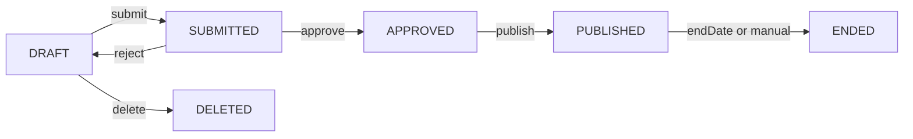

## Overview

Campaigns capture structured user intent through interactive mechanics. They generate first-party preference signals (`USER_DECLARED`) that feed into the [agentic product feed's](/agentic/product-feed) intent scoring. Campaigns belong to a creator within your organization and follow a defined lifecycle from draft to completion.

## Campaign Types

| Type | Mechanic | Intent Signal |
|------|---------|--------------|
| `SWIPE` | Binary preference (like/dislike on product images) | Product preference direction |
| `MULTIVARIANT` | Vote between attribute options (e.g., "Which shade?") | Attribute value preference |
| `SURVEY` | Structured question-and-answer | Explicit preference declarations |
| `UGC` | User-generated content submission | Content creation + implicit preference |

## Create a Campaign

<CodeGroup>

```bash cURL
curl -X POST https://api.podium.build/api/v1/campaign \
  -H "Authorization: Bearer $PODIUM_API_KEY" \
  -H "Content-Type: application/json" \
  -d '{
    "creatorId": "clcreator_abc",
    "type": "MULTIVARIANT"
  }'
```

```typescript SDK
import { createPodiumClient } from '@podiumcommerce/node-sdk'
const client = createPodiumClient({ apiKey: process.env.PODIUM_API_KEY })
const campaign = await client.campaigns.create({
  requestBody: {
    creatorId: "clcreator_abc",
    type: "MULTIVARIANT"
  }
});
```

</CodeGroup>

| Field | Type | Required | Description |
|-------|------|----------|-------------|
| `creatorId` | string | Yes | CUID of the owning creator |
| `type` | enum | Yes | `SWIPE`, `MULTIVARIANT`, `SURVEY`, or `UGC` |

This creates a campaign in `DRAFT` status. Configure it with a PUT before publishing.

## Configure a Draft Campaign

Use `PUT /campaign/{id}` to set up the campaign content, timing, and reward structure:

<CodeGroup>

```bash cURL
curl -X PUT https://api.podium.build/api/v1/campaign/clcamp_xyz \
  -H "Authorization: Bearer $PODIUM_API_KEY" \
  -H "Content-Type: application/json" \
  -d '{
    "title": "Which shade is your vibe?",
    "description": "Vote on your favorite lip shade and earn 50 points!",
    "hero": [{ "url": "https://cdn.example.com/campaign-hero.jpg", "type": "image" }],
    "startDate": "2026-04-01T00:00:00.000Z",
    "endDate": "2026-04-30T23:59:59.000Z",
    "maxParticipants": 5000,
    "showInstructions": true,
    "showLeaderboard": true,
    "rateLimit": 1,
    "reward": {
      "points": 50,
      "maxSupply": 10000
    },
    "attributes": [
      {
        "title": "Lip Shade",
        "hasImages": true,
        "options": [
          { "value": "Berry Bliss" },
          { "value": "Nude Glow" },
          { "value": "Crimson Night" },
          { "value": "Coral Dream" }
        ]
      }
    ]
  }'
```

```typescript SDK
const updated = await client.campaigns.replace({
  id: "clcamp_xyz",
  requestBody: {
    title: "Which shade is your vibe?",
    description: "Vote on your favorite lip shade and earn 50 points!",
    hero: [{ url: "https://cdn.example.com/campaign-hero.jpg", type: "image" }],
    startDate: "2026-04-01T00:00:00.000Z",
    endDate: "2026-04-30T23:59:59.000Z",
    maxParticipants: 5000,
    showInstructions: true,
    showLeaderboard: true,
    rateLimit: 1,
    reward: { points: 50, maxSupply: 10000 },
    attributes: [
      {
        title: "Lip Shade",
        hasImages: true,
        options: [
          { value: "Berry Bliss" },
          { value: "Nude Glow" },
          { value: "Crimson Night" },
          { value: "Coral Dream" }
        ]
      }
    ]
  }
});
```

</CodeGroup>

### Configuration Fields

| Field | Type | Description |
|-------|------|-------------|
| `title` | string | Campaign title |
| `description` | string | Campaign description |
| `hero` | MediaAsset[] | Hero images/videos |
| `logo` | string | Campaign logo URL |
| `video` | string | Video URL |
| `startDate` | datetime | When campaign goes live |
| `endDate` | datetime | When campaign closes |
| `maxParticipants` | integer | Max participants (null = unlimited) |
| `showInstructions` | boolean | Show instruction card |
| `showLeaderboard` | boolean | Show participation leaderboard |
| `rateLimit` | integer | Max participations per user (0 = unlimited) |
| `reward` | object | `{ points, maxSupply }` — points per completion |
| `attributes` | array | Voting attributes for MULTIVARIANT campaigns |
| `questions` | array | Questions for SURVEY campaigns |

## Campaign Lifecycle



| Status | Description |
|--------|-------------|
| `DRAFT` | Being configured — editable via `PUT` |
| `SUBMITTED` | Awaiting admin review |
| `APPROVED` | Approved, ready to publish |
| `PUBLISHED` | Live, accepting participation |
| `ENDED` | Participation closed, analytics available |

### Submit for Review

```bash
curl -X PATCH https://api.podium.build/api/v1/campaign/clcamp_xyz/submit \
  -H "Authorization: Bearer $PODIUM_API_KEY"
```

### Publish

```bash
curl -X PATCH https://api.podium.build/api/v1/campaign/clcamp_xyz/publish \
  -H "Authorization: Bearer $PODIUM_API_KEY" \
  -H "Content-Type: application/json" \
  -d '{ "requiresReview": false }'
```

Set `requiresReview: false` to skip the SUBMITTED → APPROVED step and publish directly.

### Update a Published Campaign

Only a subset of fields can be changed after publishing:

```bash
curl -X PATCH https://api.podium.build/api/v1/campaign/clcamp_xyz \
  -H "Authorization: Bearer $PODIUM_API_KEY" \
  -H "Content-Type: application/json" \
  -d '{
    "title": "Updated Campaign Title",
    "description": "Revised description",
    "hero": [{ "url": "https://cdn.example.com/new-hero.jpg", "type": "image" }],
    "showInstructions": false,
    "showLeaderboard": true
  }'
```

Editable after publish: `title`, `description`, `hero`, `showInstructions`, `showLeaderboard`, `status`.

## Participation

### Cast Votes (MULTIVARIANT)

<CodeGroup>

```bash cURL
curl -X POST https://api.podium.build/api/v1/campaign/clcamp_xyz/vote \
  -H "Authorization: Bearer $PODIUM_API_KEY" \
  -H "Content-Type: application/json" \
  -d '{
    "userId": "clxyz1234567890",
    "votes": [
      { "attributeId": 1, "optionId": 3 },
      { "attributeId": 2, "optionId": [1, 4] }
    ]
  }'
```

```typescript SDK
await client.campaigns.vote({
  id: "clcamp_xyz",
  requestBody: {
    userId: "clxyz1234567890",
    votes: [
      { attributeId: 1, optionId: 3 },
      { attributeId: 2, optionId: [1, 4] }
    ]
  }
});
```

</CodeGroup>

| Field | Type | Required | Description |
|-------|------|----------|-------------|
| `userId` | string | Yes | Participating user's CUID |
| `votes` | array | Yes | Array of vote objects |
| `votes[].attributeId` | number | Yes | Campaign attribute ID |
| `votes[].optionId` | number \| number[] | Yes | Selected option(s) — single or multi-select |

Voting creates a `CampaignJourney` record linking the user to the campaign and records individual `CampaignVote` entries. If a reward is configured, points are awarded automatically.

### Submit Survey (SURVEY)

<CodeGroup>

```bash cURL
curl -X POST https://api.podium.build/api/v1/campaign/clcamp_survey/survey \
  -H "Authorization: Bearer $PODIUM_API_KEY" \
  -H "Content-Type: application/json" \
  -d '{
    "userId": "clxyz1234567890",
    "responses": [
      { "questionId": 1, "answer": "Hydrating serums" },
      { "questionId": 2, "answer": ["Sensitive", "Dry"] },
      { "questionId": 3, "answer": "I prefer fragrance-free products" }
    ]
  }'
```

```typescript SDK
await client.campaigns.createSurvey({
  id: "clcamp_survey",
  requestBody: {
    userId: "clxyz1234567890",
    responses: [
      { questionId: 1, answer: "Hydrating serums" },
      { questionId: 2, answer: ["Sensitive", "Dry"] },
      { questionId: 3, answer: "I prefer fragrance-free products" }
    ]
  }
});
```

</CodeGroup>

| Field | Type | Required | Description |
|-------|------|----------|-------------|
| `userId` | string | Yes | Participating user's CUID |
| `responses` | array | Yes | Array of response objects |
| `responses[].questionId` | number | Yes | Campaign question ID |
| `responses[].answer` | string \| string[] | Yes | Answer — single or multi-choice |

Survey responses are stored as `CampaignResponse` records and feed into the enrichment pipeline as `USER_DECLARED` preference data.

### Get Survey Report

```bash
curl https://api.podium.build/api/v1/campaign/clcamp_survey/survey/report \
  -H "Authorization: Bearer $PODIUM_API_KEY"
```

Returns aggregated response distributions per question.

## Configure a Campaign Reward

Link an on-chain reward to a campaign:

```bash
curl -X PUT https://api.podium.build/api/v1/campaign/clcamp_xyz/nft \
  -H "Authorization: Bearer $PODIUM_API_KEY" \
  -H "Content-Type: application/json" \
  -d '{
    "name": "Shade Voter Badge",
    "description": "Awarded for participating in the Lip Shade vote",
    "imageUrl": "https://cdn.example.com/badge.png",
    "points": 100,
    "externalUrl": "https://brand.com/campaign/shade-vote"
  }'
```

| Field | Type | Description |
|-------|------|-------------|
| `name` | string | Reward token name |
| `description` | string | Reward description |
| `imageUrl` | string | Static image URL |
| `animationUrl` | string | Animated media URL |
| `points` | integer | Points cost to redeem |
| `externalUrl` | string | External link |

At least one of `imageUrl` or `animationUrl` is required.

## Analytics

### Campaign Overview

```bash
curl https://api.podium.build/api/v1/campaign/clcamp_xyz/analytics \
  -H "Authorization: Bearer $PODIUM_API_KEY"
```

### Available Analytics Endpoints

| Endpoint | Returns |
|----------|---------|
| `/campaign/{id}/analytics` | Overall participation and response metrics |
| `/campaign/{id}/analytics/participants` | Paginated participant list |
| `/campaign/{id}/analytics/participants/count` | Total participant count |
| `/campaign/{id}/analytics/participants/growth` | Participation growth over time |
| `/campaign/{id}/analytics/responses` | Response data breakdown |
| `/campaign/{id}/analytics/responses/growth` | Response growth over time |
| `/campaign/{id}/attributes` | Vote distributions per attribute/option |

### Attribute Vote Distribution

```bash
curl https://api.podium.build/api/v1/campaign/clcamp_xyz/attributes \
  -H "Authorization: Bearer $PODIUM_API_KEY"
```

```json
[
  {
    "id": 1,
    "title": "Lip Shade",
    "options": [
      { "id": 1, "value": "Berry Bliss", "voteCount": 1247 },
      { "id": 2, "value": "Nude Glow", "voteCount": 982 },
      { "id": 3, "value": "Crimson Night", "voteCount": 1534 },
      { "id": 4, "value": "Coral Dream", "voteCount": 887 }
    ]
  }
]
```

## Campaign Model

| Field | Type | Description |
|-------|------|-------------|
| `id` | string | CUID2 identifier |
| `type` | enum | `SWIPE`, `MULTIVARIANT`, `SURVEY`, `UGC` |
| `status` | enum | Lifecycle status |
| `title` | string | Campaign title |
| `description` | string | Campaign description |
| `startDate` | datetime | Go-live timestamp |
| `endDate` | datetime | End timestamp |
| `maxParticipants` | integer | Participant cap |
| `showInstructions` | boolean | Show instruction card |
| `showLeaderboard` | boolean | Show leaderboard |
| `rateLimit` | integer | Max participations per user |
| `creatorId` | string | Owning creator CUID |
| `publishedAt` | datetime | When campaign was published |
| `createdAt` | datetime | Creation timestamp |

## Related Models

| Model | Purpose |
|-------|---------|
| `CampaignAttribute` | Voting dimensions for MULTIVARIANT (title, hasImages) |
| `CampaignAttributeOption` | Individual vote options within an attribute |
| `CampaignQuestion` | Survey questions for SURVEY campaigns |
| `CampaignResponse` | Individual survey answers |
| `CampaignJourney` | A user's participation record (links user, campaign, votes/responses) |
| `CampaignVote` | Individual vote on an attribute option |
| `CampaignReward` | Points reward configuration per campaign |
| `CampaignRewardTransaction` | Points awarded for campaign completion |

## Endpoint Summary

| Method | Path | Description |
|--------|------|-------------|
| `POST` | `/campaign` | Create campaign |
| `GET` | `/campaign/{id}` | Get campaign |
| `PUT` | `/campaign/{id}` | Update draft |
| `PATCH` | `/campaign/{id}` | Update published |
| `DELETE` | `/campaign/{id}` | Delete campaign |
| `PATCH` | `/campaign/{id}/submit` | Submit for review |
| `PATCH` | `/campaign/{id}/publish` | Publish |
| `PUT` | `/campaign/{id}/nft` | Configure reward |
| `GET` | `/campaign/{id}/attributes` | Attribute distributions |
| `POST` | `/campaign/{id}/vote` | Cast votes |
| `POST` | `/campaign/{id}/survey` | Submit survey |
| `GET` | `/campaign/{id}/survey/report` | Survey report |
| `GET` | `/campaign/{id}/analytics` | Analytics overview |
| `GET` | `/campaign/{id}/analytics/participants` | Participants |
| `GET` | `/campaign/{id}/analytics/participants/count` | Participant count |
| `GET` | `/campaign/{id}/analytics/participants/growth` | Growth |
| `GET` | `/campaign/{id}/analytics/responses` | Response data |
| `GET` | `/campaign/{id}/analytics/responses/growth` | Response growth |
