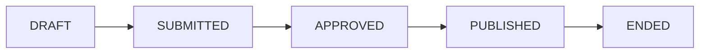

## Overview

Campaigns capture structured user intent through interactive mechanics. They generate first-party preference signals (`USER_DECLARED`) that feed into the agentic product feed's intent scoring.

## Campaign Types

| Type | Mechanic | Intent Signal |
|------|---------|--------------|
| `SWIPE` | Binary preference (like/dislike) | Product preference direction |
| `MULTIVARIANT` | Vote between attribute options | Attribute value preference |
| `SURVEY` | Structured Q&A | Explicit preference declarations |
| `UGC` | User-generated content | Content + implicit preference |

## Endpoints

### Campaign CRUD

| Method | Path | Description |
|--------|------|-------------|
| `POST` | `/campaign` | Create a campaign |
| `GET` | `/campaign/{id}` | Get campaign details |
| `PATCH` | `/campaign/{id}` | Update campaign |
| `DELETE` | `/campaign/{id}` | Delete campaign |

### Lifecycle

| Method | Path | Description |
|--------|------|-------------|
| `POST` | `/campaign/{id}/submit` | Submit for review |
| `POST` | `/campaign/{id}/publish` | Publish (make live) |

### Participation

| Method | Path | Description |
|--------|------|-------------|
| `POST` | `/campaign/{id}/vote` | Cast a vote (MULTIVARIANT) |
| `POST` | `/campaign/{id}/survey` | Submit survey response |
| `GET` | `/campaign/{id}/survey/report` | Survey results report |

### Analytics

| Method | Path | Description |
|--------|------|-------------|
| `GET` | `/campaign/{id}/analytics` | Participant and response analytics |
| `GET` | `/campaign/{id}/attributes` | Attribute vote distributions |

### NFT Rewards

| Method | Path | Description |
|--------|------|-------------|
| `GET` | `/campaign/{id}/nft` | Campaign's associated NFT reward |

## Campaign Lifecycle

| Status | Description |
|--------|-------------|
| `DRAFT` | Being configured |
| `SUBMITTED` | Awaiting admin review |
| `APPROVED` | Approved, ready to publish |
| `PUBLISHED` | Live, accepting participation |
| `ENDED` | Participation closed |

## Campaign Model

| Field | Type | Description |
|-------|------|-------------|
| `id` | string | CUID2 identifier |
| `type` | enum | SWIPE, MULTIVARIANT, SURVEY, UGC |
| `status` | enum | Lifecycle status |
| `title` | string | Campaign title |
| `description` | string | Campaign description |
| `startsAt` | datetime | Go-live timestamp |
| `endsAt` | datetime | End timestamp |

## Related Models

| Model | Purpose |
|-------|---------|
| `CampaignAttribute` / `CampaignAttributeOption` | Voting options for MULTIVARIANT |
| `CampaignQuestion` / `CampaignResponse` | Survey Q&A |
| `CampaignJourney` | User's participation record |
| `CampaignVote` | Individual votes |
| `CampaignReward` | Points allocated per campaign |
