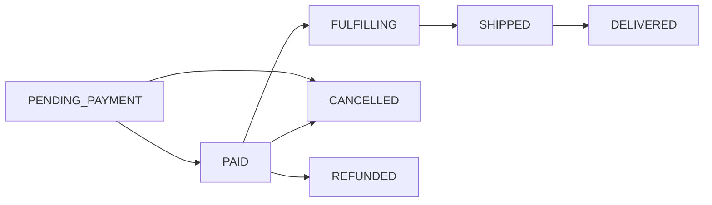

The Companion API provides the building blocks for personal shopping agents. It is **vertical-agnostic** — the [Beauty Companion](/agentic/beauty-companion) uses it for skincare, but the same endpoints power agents for any product domain.

## Base Path

All endpoints are prefixed with `/api/v1/companion`.

## Intent Profiles

An intent profile stores what a user wants — their preferences, constraints, and behavioral signals. Agents read and write profiles to personalize recommendations and execute purchases on a user's behalf.

### Create a Profile

<CodeGroup>

```bash cURL
curl -X POST https://api.podiumcommerce.xyz/api/v1/companion/profile/{userId} \
  -H "Authorization: Bearer YOUR_API_KEY" \
  -H "Content-Type: application/json" \
  -d '{
    "skinType": "Sensitive",
    "concerns": ["Anti-aging", "Hydration"],
    "priceRange": { "min": 75, "max": 150 },
    "brands": ["La Mer", "Drunk Elephant"],
    "avoidances": ["fragrance", "parabens"]
  }'
```

```typescript SDK
import { createPodiumClient } from '@podiumcommerce/node-sdk'
const client = createPodiumClient({ apiKey: process.env.PODIUM_API_KEY })

const { data: profile } = await client.companion.createProfile({
  userId,
  requestBody: {
    skinType: "Sensitive",
    concerns: ["Anti-aging", "Hydration"],
    priceRange: { min: 75, max: 150 },
    brands: ["La Mer", "Drunk Elephant"],
    avoidances: ["fragrance", "parabens"],
  },
})
```

</CodeGroup>

**Response:**

```json
{
  "id": "clx9abc123def456",
  "userId": "clx7user789",
  "skinType": "Sensitive",
  "concerns": ["Anti-aging", "Hydration"],
  "priceRange": { "min": 75, "max": 150 },
  "brands": ["La Mer", "Drunk Elephant"],
  "avoidances": ["fragrance", "parabens"],
  "purchaseHistory": [],
  "podiumPoints": 0,
  "enrichmentVec": [],
  "quizCompletedAt": null,
  "createdAt": "2026-03-07T10:00:00Z",
  "updatedAt": "2026-03-07T10:00:00Z"
}
```

### Get a Profile

```bash
curl https://api.podiumcommerce.xyz/api/v1/companion/profile/{userId} \
  -H "Authorization: Bearer YOUR_API_KEY"
```

### Update a Profile (Partial)

`PATCH` merges fields into the existing profile. Omitted fields are unchanged.

```bash
curl -X PATCH https://api.podiumcommerce.xyz/api/v1/companion/profile/{userId} \
  -H "Authorization: Bearer YOUR_API_KEY" \
  -H "Content-Type: application/json" \
  -d '{
    "concerns": ["Anti-aging", "Hydration", "Dark spots"],
    "priceRange": { "min": 50, "max": 200 }
  }'
```

### Award Points

Points are stored on the intent profile and can be used for gamification, tier gating, or reward eligibility.

```bash
curl -X POST https://api.podiumcommerce.xyz/api/v1/companion/profile/{userId}/points \
  -H "Authorization: Bearer YOUR_API_KEY" \
  -H "Content-Type: application/json" \
  -d '{
    "amount": 25,
    "details": { "reason": "quiz_completed", "quizId": "onboarding_v2" }
  }'
```

### Endpoints

| Method | Path | Description |
|--------|------|-------------|
| `GET` | `/companion/profile/{userId}` | Get user's intent profile |
| `POST` | `/companion/profile/{userId}` | Create or replace intent profile |
| `PATCH` | `/companion/profile/{userId}` | Partial update (merge fields) |
| `POST` | `/companion/profile/{userId}/points` | Award points with metadata |

### Profile Schema

| Field | Type | Description |
|-------|------|-------------|
| `id` | string | CUID2 identifier |
| `userId` | string | CUID2 — the Podium user this profile belongs to |
| `skinType` | string? | Free-text preference dimension (use whatever fits your vertical) |
| `concerns` | string[] | Array of preference tags |
| `priceRange` | object? | `{ min: number, max: number }` — budget constraints |
| `brands` | string[] | Preferred brands |
| `avoidances` | string[] | Things to exclude (ingredients, materials, etc.) |
| `purchaseHistory` | json[] | Server-managed purchase records |
| `podiumPoints` | integer | Current point balance |
| `enrichmentVec` | float[] | Embedding vector for similarity matching (populated server-side) |
| `quizCompletedAt` | datetime? | When the user completed an onboarding quiz |

<Note>
Profile fields like `skinType`, `concerns`, and `avoidances` are flexible string fields — they work for any product domain. A fashion agent might use `bodyType`, `stylePreferences`, and `fabricAvoidances` with the same schema structure.
</Note>

---

## Products

The Companion has its own product catalog (`ProductCatalogItem`) separate from the main commerce `Product` model. This lets agents curate a focused catalog from external sources without requiring products to exist in the core Podium commerce system.

### List Products

```bash
curl "https://api.podiumcommerce.xyz/api/v1/companion/products?category=moisturizer&minPrice=20&maxPrice=100&limit=10" \
  -H "Authorization: Bearer YOUR_API_KEY"
```

**Query Parameters:**

| Parameter | Type | Default | Description |
|-----------|------|---------|-------------|
| `category` | string | — | Filter by category |
| `brand` | string | — | Filter by brand |
| `minPrice` | number | — | Minimum price |
| `maxPrice` | number | — | Maximum price |
| `inStock` | boolean | — | Filter by availability |
| `search` | string | — | Full-text search across name, brand, category |
| `limit` | number | 20 | Results per page |
| `offset` | number | 0 | Pagination offset |

**Response:**

```json
[
  {
    "id": "clx9prod001",
    "name": "Hydrating Serum with Hyaluronic Acid",
    "brand": "The Ordinary",
    "category": "serum",
    "price": 12.90,
    "currency": "USD",
    "imageUrl": "https://cdn.example.com/products/serum.jpg",
    "productUrl": "https://theordinary.com/products/ha-serum",
    "openGraphData": { "title": "...", "description": "..." },
    "inStock": true,
    "createdAt": "2026-03-01T00:00:00Z"
  }
]
```

### Get Product by ID

```bash
curl https://api.podiumcommerce.xyz/api/v1/companion/products/{productId} \
  -H "Authorization: Bearer YOUR_API_KEY"
```

### Create a Product

Agents or backend services can add products to the companion catalog:

```bash
curl -X POST https://api.podiumcommerce.xyz/api/v1/companion/products \
  -H "Authorization: Bearer YOUR_API_KEY" \
  -H "Content-Type: application/json" \
  -d '{
    "name": "CeraVe Moisturizing Cream",
    "brand": "CeraVe",
    "category": "moisturizer",
    "price": 18.99,
    "imageUrl": "https://cdn.example.com/cerave-cream.jpg",
    "productUrl": "https://cerave.com/moisturizing-cream"
  }'
```

### Batch Create Products

Add up to 100 products in a single request:

```bash
curl -X POST https://api.podiumcommerce.xyz/api/v1/companion/products/batch \
  -H "Authorization: Bearer YOUR_API_KEY" \
  -H "Content-Type: application/json" \
  -d '{
    "items": [
      {
        "name": "CeraVe Moisturizing Cream",
        "brand": "CeraVe",
        "category": "moisturizer",
        "price": 18.99,
        "productUrl": "https://cerave.com/moisturizing-cream"
      },
      {
        "name": "La Roche-Posay Toleriane",
        "brand": "La Roche-Posay",
        "category": "cleanser",
        "price": 15.99,
        "productUrl": "https://laroche-posay.com/toleriane"
      }
    ]
  }'
```

### Product Schema

| Field | Type | Required | Description |
|-------|------|----------|-------------|
| `name` | string | Yes | Product name (max 500 chars) |
| `brand` | string | Yes | Brand name |
| `category` | string | Yes | Product category |
| `price` | number | Yes | Price as a decimal (e.g., `18.99`) |
| `currency` | string | No | ISO currency code (default: `USD`) |
| `imageUrl` | string | No | Product image URL |
| `productUrl` | string | Yes | Canonical product page URL |
| `openGraphData` | object | No | OpenGraph metadata from the product page |
| `inStock` | boolean | No | Availability (default: `true`) |

### Endpoints

| Method | Path | Description |
|--------|------|-------------|
| `GET` | `/companion/products` | List products (filterable, paginated) |
| `GET` | `/companion/products/{productId}` | Get single product |
| `POST` | `/companion/products` | Create one product |
| `POST` | `/companion/products/batch` | Batch create (1–100 items) |

---

## Interactions

Interactions record how a user engages with products. They power the recommendation engine and form the behavioral signal layer of the intent profile.

### Record an Interaction

<CodeGroup>

```bash cURL
curl -X POST https://api.podiumcommerce.xyz/api/v1/companion/interactions \
  -H "Authorization: Bearer YOUR_API_KEY" \
  -H "Content-Type: application/json" \
  -d '{
    "userId": "clx7user789",
    "productId": "clx9prod001",
    "action": "RANK_UP",
    "score": 0.9
  }'
```

```typescript SDK
import { createPodiumClient } from '@podiumcommerce/node-sdk'
const client = createPodiumClient({ apiKey: process.env.PODIUM_API_KEY })

await client.companion.createInteractions({
  requestBody: {
    userId: "clx7user789",
    productId: "clx9prod001",
    action: "RANK_UP",
    score: 0.9,
  },
})
```

</CodeGroup>

### Get User Interactions

```bash
curl https://api.podiumcommerce.xyz/api/v1/companion/interactions/{userId} \
  -H "Authorization: Bearer YOUR_API_KEY"
```

### Interaction Types

| Action | Meaning | Signal Strength |
|--------|---------|-----------------|
| `RANK_UP` | User likes/loves the product | Strong positive |
| `RANK_DOWN` | User dislikes the product | Strong negative |
| `SKIP` | User skipped (neutral) | Weak negative |
| `PURCHASED` | User completed a purchase | Strongest positive |
| `PURCHASE_INTENT` | User started but didn't complete | Moderate positive |
| `NUDGE_OPENED` | User opened a proactive notification | Weak positive |

### Interaction Schema

| Field | Type | Required | Description |
|-------|------|----------|-------------|
| `userId` | string | Yes | The user performing the action |
| `productId` | string | Yes | The product being acted on |
| `action` | enum | Yes | One of the six interaction types above |
| `score` | number | No | Optional 0–1 confidence score |

### Endpoints

| Method | Path | Description |
|--------|------|-------------|
| `POST` | `/companion/interactions` | Record an interaction |
| `GET` | `/companion/interactions/{userId}` | Get all interactions for a user |

---

## Recommendations

The recommendation engine uses Claude to rank products based on a user's intent profile and interaction history. It returns products the user hasn't interacted with, scored by relevance to their declared preferences and behavioral signals.

### Get Recommendations

<CodeGroup>

```bash cURL
curl "https://api.podiumcommerce.xyz/api/v1/companion/recommendations/{userId}?count=5&category=serum" \
  -H "Authorization: Bearer YOUR_API_KEY"
```

```typescript SDK
import { createPodiumClient } from '@podiumcommerce/node-sdk'
const client = createPodiumClient({ apiKey: process.env.PODIUM_API_KEY })

const { data: recs } = await client.companion.listRecommendations({
  userId,
  count: 5,
  category: "serum",
})
```

</CodeGroup>

**Query Parameters:**

| Parameter | Type | Default | Description |
|-----------|------|---------|-------------|
| `count` | number | 5 | Number of recommendations to return |
| `category` | string | — | Optional category filter |

**Response:**

```json
[
  {
    "id": "clx9prod042",
    "name": "Drunk Elephant Protini Polypeptide Cream",
    "brand": "Drunk Elephant",
    "category": "moisturizer",
    "price": 68.00,
    "imageUrl": "https://cdn.example.com/de-protini.jpg",
    "productUrl": "https://drunkelephant.com/protini",
    "inStock": true
  }
]
```

<Note>
Recommendations exclude products the user has already interacted with (any action type). The engine considers `RANK_UP` and `PURCHASED` interactions as positive signals for similar products, and `RANK_DOWN` as negative signals for similar attributes.
</Note>

### Endpoints

| Method | Path | Description |
|--------|------|-------------|
| `GET` | `/companion/recommendations/{userId}` | AI-ranked product recommendations |

---

## Orders

Companion orders use a **concierge fulfillment model** — the platform handles purchasing from the retailer and shipping to the user. This enables agents to execute purchases from any catalog source, not just products that exist in Podium's core commerce system.

### Create a Concierge Order

<CodeGroup>

```bash cURL
curl -X POST https://api.podiumcommerce.xyz/api/v1/companion/orders \
  -H "Authorization: Bearer YOUR_API_KEY" \
  -H "Content-Type: application/json" \
  -d '{
    "userId": "clx7user789",
    "productId": "clx9prod042",
    "shippingAddress": {
      "street": "123 Main St",
      "city": "San Francisco",
      "state": "CA",
      "zip": "94102",
      "country": "US"
    },
    "email": "user@example.com"
  }'
```

```typescript SDK
import { createPodiumClient } from '@podiumcommerce/node-sdk'
const client = createPodiumClient({ apiKey: process.env.PODIUM_API_KEY })

const { data: order } = await client.companion.createOrders({
  requestBody: {
    userId: "clx7user789",
    productId: "clx9prod042",
    shippingAddress: {
      street: "123 Main St",
      city: "San Francisco",
      state: "CA",
      zip: "94102",
      country: "US",
    },
    email: "user@example.com",
  },
})
```

</CodeGroup>

**Response:**

```json
{
  "id": "clx9order001",
  "userId": "clx7user789",
  "productId": "clx9prod042",
  "status": "PENDING_PAYMENT",
  "shippingAddress": {
    "street": "123 Main St",
    "city": "San Francisco",
    "state": "CA",
    "zip": "94102",
    "country": "US"
  },
  "email": "user@example.com",
  "productSnapshot": {
    "name": "Drunk Elephant Protini Polypeptide Cream",
    "brand": "Drunk Elephant",
    "price": 68.00,
    "imageUrl": "https://cdn.example.com/de-protini.jpg"
  },
  "amountUsdc": "68.00",
  "createdAt": "2026-03-07T12:00:00Z"
}
```

### List User Orders

```bash
curl https://api.podiumcommerce.xyz/api/v1/companion/orders/{userId} \
  -H "Authorization: Bearer YOUR_API_KEY"
```

### Get Order Detail

```bash
curl https://api.podiumcommerce.xyz/api/v1/companion/orders/detail/{orderId} \
  -H "Authorization: Bearer YOUR_API_KEY"
```

### Update Order Status

```bash
curl -X PATCH https://api.podiumcommerce.xyz/api/v1/companion/orders/{orderId}/status \
  -H "Authorization: Bearer YOUR_API_KEY" \
  -H "Content-Type: application/json" \
  -d '{
    "status": "SHIPPED",
    "fulfillmentNotes": "USPS tracking: 9400111899223456789012"
  }'
```

### Order Status Flow



| Status | Description |
|--------|-------------|
| `PENDING_PAYMENT` | Order created, awaiting payment (x402 or Stripe) |
| `PAID` | Payment confirmed |
| `FULFILLING` | Platform purchasing from retailer |
| `SHIPPED` | Shipped to user |
| `DELIVERED` | Delivery confirmed |
| `CANCELLED` | Order cancelled |
| `REFUNDED` | Payment refunded |

### Order Schema

| Field | Type | Description |
|-------|------|-------------|
| `id` | string | CUID2 identifier |
| `userId` | string | The user who placed the order |
| `productId` | string | Companion catalog product |
| `status` | enum | Current order status |
| `shippingAddress` | object | `{ street, city, state, zip, country }` |
| `email` | string | Notification email |
| `productSnapshot` | object | Frozen product data at time of order |
| `amountUsdc` | string | Order amount in USDC (string for precision) |
| `fulfillmentNotes` | string? | Tracking numbers, notes |
| `podiumOrderId` | string? | Linked core Podium order (if bridged) |

### Endpoints

| Method | Path | Description |
|--------|------|-------------|
| `POST` | `/companion/orders` | Create a concierge order |
| `GET` | `/companion/orders/{userId}` | List user's orders (newest first) |
| `GET` | `/companion/orders/detail/{orderId}` | Order detail with product |
| `PATCH` | `/companion/orders/{orderId}/status` | Update status and fulfillment notes |

---

## User Linking

Connect external platform users (e.g., Telegram) to Podium users. The companion looks up users by a synthetic email pattern.

```bash
curl "https://api.podiumcommerce.xyz/api/v1/companion/user/by-telegram/{telegramId}?privyId=did:privy:abc123" \
  -H "Authorization: Bearer YOUR_API_KEY"
```

| Parameter | Type | Description |
|-----------|------|-------------|
| `telegramId` | string (path) | Telegram user ID |
| `privyId` | string (query, optional) | Privy DID to link to the user |

The lookup uses a synthetic email pattern: `tg_{telegramId}@beauty-companion.podium.app`. If a matching user exists, it's returned. If `privyId` is provided, the Privy DID is linked to the user record.

---

## Building an Agent: End-to-End Flow

Here's the typical lifecycle of a companion agent interaction:

<Steps>
  <Step title="Onboard the User">
    Create an intent profile with the user's stated preferences. This can come from a quiz, conversation, or imported data.

    ```typescript
    import { createPodiumClient } from '@podiumcommerce/node-sdk'
    const client = createPodiumClient({ apiKey: process.env.PODIUM_API_KEY })

    const { data: profile } = await client.companion.createProfile({
      userId,
      requestBody: {
        concerns: ["Hydration", "Anti-aging"],
        priceRange: { min: 30, max: 100 },
        avoidances: ["fragrance"],
      },
    })
    ```
  </Step>
  <Step title="Get Recommendations">
    The engine uses the profile + interaction history to rank products via Claude.

    ```typescript
    const { data: recs } = await client.companion.listRecommendations({
      userId,
      count: 5,
    })
    ```
  </Step>
  <Step title="Present and Record Feedback">
    Show recommendations to the user. Record their reactions as interactions.

    ```typescript
    await client.companion.createInteractions({
      requestBody: {
        userId,
        productId: recs[0].id,
        action: "RANK_UP",
      },
    })
    ```
  </Step>
  <Step title="Execute Purchase">
    When the user approves, create a concierge order. Payment can be processed via x402 (USDC) or linked to a Stripe checkout.

    ```typescript
    const { data: order } = await client.companion.createOrders({
      requestBody: {
        userId,
        productId: recs[0].id,
        shippingAddress: userAddress,
        email: userEmail,
      },
    })
    ```
  </Step>
  <Step title="Refine Over Time">
    Each interaction improves future recommendations. The `enrichmentVec` on the profile is updated server-side as the user's pattern emerges. Award points for engagement to drive retention.

    ```typescript
    await client.companion.createProfilePoints({
      userId,
      requestBody: {
        amount: 10,
        details: { reason: "feedback_given" },
      },
    })
    ```
  </Step>
</Steps>
