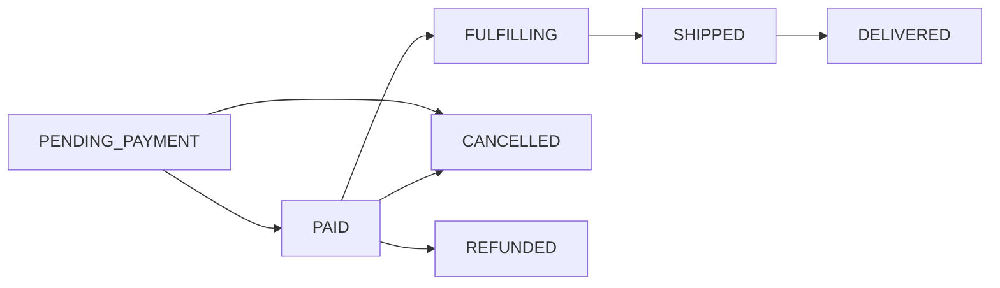

The Companion API provides the building blocks for personal shopping agents. It is **vertical-agnostic**. The same endpoints power agents for any product domain. See [Reference Apps](/agentic/beauty-companion) for worked examples.

<Info>
  Looking for the conversational AI agent? See [Conversational Agent](/agentic/conversational-agent) for the chat and streaming endpoints that combine these primitives into a full AI shopping companion with tool-use, memory, and proactive nudges.
</Info>

## Base Path

All endpoints are prefixed with `/api/v1/companion`.

## Intent Profiles

An intent profile stores what a user wants. Their preferences, constraints, and behavioral signals. Agents read and write profiles to personalize recommendations and execute purchases on a user's behalf.

### Create a Profile

<CodeGroup>

```bash cURL
curl -X POST https://api.podium.build/api/v1/companion/profile/{userId} \
  -H "Authorization: Bearer YOUR_API_KEY" \
  -H "Content-Type: application/json" \
  -d '{
    "skinType": "Sensitive",
    "concerns": ["Anti-aging", "Hydration"],
    "priceRange": { "min": 75, "max": 150 },
    "brands": ["La Mer", "Drunk Elephant"],
    "avoidances": ["fragrance", "parabens"]
  }'
```

```typescript SDK
import { createPodiumClient } from '@podium-sdk/node-sdk'
const client = createPodiumClient({ apiKey: process.env.PODIUM_API_KEY })

const { data: profile } = await client.companion.createProfile({
  userId,
  requestBody: {
    skinType: "Sensitive",
    concerns: ["Anti-aging", "Hydration"],
    priceRange: { min: 75, max: 150 },
    brands: ["La Mer", "Drunk Elephant"],
    avoidances: ["fragrance", "parabens"],
  },
})
```

</CodeGroup>

**Response:**

```json
{
  "id": "clx9abc123def456",
  "userId": "clx7user789",
  "skinType": "Sensitive",
  "concerns": ["Anti-aging", "Hydration"],
  "priceRange": { "min": 75, "max": 150 },
  "brands": ["La Mer", "Drunk Elephant"],
  "avoidances": ["fragrance", "parabens"],
  "purchaseHistory": [],
  "podiumPoints": 0,
  "enrichmentVec": [],
  "quizCompletedAt": null,
  "createdAt": "2026-03-07T10:00:00Z",
  "updatedAt": "2026-03-07T10:00:00Z"
}
```

### Get a Profile

```bash
curl https://api.podium.build/api/v1/companion/profile/{userId} \
  -H "Authorization: Bearer YOUR_API_KEY"
```

### Update a Profile (Partial)

`PATCH` merges fields into the existing profile. Omitted fields are unchanged.

```bash
curl -X PATCH https://api.podium.build/api/v1/companion/profile/{userId} \
  -H "Authorization: Bearer YOUR_API_KEY" \
  -H "Content-Type: application/json" \
  -d '{
    "concerns": ["Anti-aging", "Hydration", "Dark spots"],
    "priceRange": { "min": 50, "max": 200 }
  }'
```

### Award Points

Points are stored on the intent profile and can be used for gamification, tier gating, or reward eligibility.

```bash
curl -X POST https://api.podium.build/api/v1/companion/profile/{userId}/points \
  -H "Authorization: Bearer YOUR_API_KEY" \
  -H "Content-Type: application/json" \
  -d '{
    "amount": 25,
    "details": { "reason": "quiz_completed", "quizId": "onboarding_v2" }
  }'
```

### Endpoints

| Method | Path | Description |
|--------|------|-------------|
| `GET` | `/companion/profile/{userId}` | Get user's intent profile |
| `POST` | `/companion/profile/{userId}` | Create or replace intent profile |
| `PATCH` | `/companion/profile/{userId}` | Partial update (merge fields) |
| `POST` | `/companion/profile/{userId}/points` | Award points with metadata |

### Profile Schema

| Field | Type | Description |
|-------|------|-------------|
| `id` | string | CUID2 identifier |
| `userId` | string | CUID2. The Podium user this profile belongs to |
| `skinType` | string? | Free-text preference dimension (use whatever fits your vertical) |
| `concerns` | string[] | Array of preference tags |
| `priceRange` | object? | `{ min: number, max: number }`. Budget constraints |
| `brands` | string[] | Preferred brands |
| `avoidances` | string[] | Things to exclude (ingredients, materials, etc.) |
| `purchaseHistory` | json[] | Server-managed purchase records |
| `podiumPoints` | integer | Current point balance |
| `enrichmentVec` | float[] | Embedding vector for similarity matching (populated server-side) |
| `quizCompletedAt` | datetime? | When the user completed an onboarding quiz |

<Note>
Profile fields like `skinType`, `concerns`, and `avoidances` are flexible string fields. They work for any product domain. A fashion agent might use `bodyType`, `stylePreferences`, and `fabricAvoidances` with the same schema structure.
</Note>

---

## Products

The Companion has its own product catalog (`ProductCatalogItem`) separate from the main commerce `Product` model. This lets agents curate a focused catalog from external sources without requiring products to exist in the core Podium commerce system.

### List Products

```bash
curl "https://api.podium.build/api/v1/companion/products?category=moisturizer&minPrice=20&maxPrice=100&limit=10" \
  -H "Authorization: Bearer YOUR_API_KEY"
```

**Query Parameters:**

| Parameter | Type | Default | Description |
|-----------|------|---------|-------------|
| `category` | string |. | Filter by subcategory (e.g., `serum`, `moisturizer`, `supplements`) |
| `domain` | string |. | Filter by product domain: `beauty`, `wellness`, `fashion`, `home` |
| `brand` | string |. | Filter by brand |
| `minPrice` | number |. | Minimum price |
| `maxPrice` | number |. | Maximum price |
| `inStock` | boolean |. | Filter by availability |
| `search` | string |. | Full-text search across name, brand, category |
| `sort` | string |. | Sort order: `popular` (by interaction-weighted popularity score), default is relevance |
| `limit` | number | 20 | Results per page |
| `offset` | number | 0 | Pagination offset |

**Response:**

```json
[
  {
    "id": "clx9prod001",
    "name": "Hydrating Serum with Hyaluronic Acid",
    "brand": "The Ordinary",
    "category": "serum",
    "price": 12.90,
    "currency": "USD",
    "imageUrl": "https://cdn.example.com/products/serum.jpg",
    "productUrl": "https://theordinary.com/products/ha-serum",
    "openGraphData": { "title": "...", "description": "..." },
    "inStock": true,
    "buyableInChat": true,
    "createdAt": "2026-03-01T00:00:00Z"
  }
]
```

**Server-derived. Do not re-derive on the client.** `buyableInChat` mirrors live adapter selection. See [Product Feed](/agentic/product-feed#buyableinchat) for the full contract.

### Get Product by ID

```bash
curl https://api.podium.build/api/v1/companion/products/{productId} \
  -H "Authorization: Bearer YOUR_API_KEY"
```

### Create a Product

Agents or backend services can add products to the companion catalog:

```bash
curl -X POST https://api.podium.build/api/v1/companion/products \
  -H "Authorization: Bearer YOUR_API_KEY" \
  -H "Content-Type: application/json" \
  -d '{
    "name": "CeraVe Moisturizing Cream",
    "brand": "CeraVe",
    "category": "moisturizer",
    "price": 18.99,
    "imageUrl": "https://cdn.example.com/cerave-cream.jpg",
    "productUrl": "https://cerave.com/moisturizing-cream"
  }'
```

### Batch Create Products

Add up to 100 products in a single request:

```bash
curl -X POST https://api.podium.build/api/v1/companion/products/batch \
  -H "Authorization: Bearer YOUR_API_KEY" \
  -H "Content-Type: application/json" \
  -d '{
    "items": [
      {
        "name": "CeraVe Moisturizing Cream",
        "brand": "CeraVe",
        "category": "moisturizer",
        "price": 18.99,
        "productUrl": "https://cerave.com/moisturizing-cream"
      },
      {
        "name": "La Roche-Posay Toleriane",
        "brand": "La Roche-Posay",
        "category": "cleanser",
        "price": 15.99,
        "productUrl": "https://laroche-posay.com/toleriane"
      }
    ]
  }'
```

### Product Schema

| Field | Type | Required | Description |
|-------|------|----------|-------------|
| `name` | string | Yes | Product name (max 500 chars) |
| `brand` | string | Yes | Brand name |
| `category` | string | Yes | Product category |
| `price` | number | Yes | Price as a decimal (e.g., `18.99`) |
| `currency` | string | No | ISO currency code (default: `USD`) |
| `imageUrl` | string | No | Product image URL |
| `productUrl` | string | Yes | Canonical product page URL |
| `openGraphData` | object | No | OpenGraph metadata from the product page |
| `inStock` | boolean | No | Availability (default: `true`) |

### Endpoints

| Method | Path | Description |
|--------|------|-------------|
| `GET` | `/companion/products` | List products (filterable, paginated) |
| `GET` | `/companion/products/{productId}` | Get single product |
| `POST` | `/companion/products` | Create one product |
| `POST` | `/companion/products/batch` | Batch create (1-100 items) |

---

## Interactions

Interactions record how a user engages with products. They power the recommendation engine and form the behavioral signal layer of the intent profile.

### Record an Interaction

<CodeGroup>

```bash cURL
curl -X POST https://api.podium.build/api/v1/companion/interactions \
  -H "Authorization: Bearer YOUR_API_KEY" \
  -H "Content-Type: application/json" \
  -d '{
    "userId": "clx7user789",
    "productId": "clx9prod001",
    "action": "RANK_UP",
    "score": 0.9
  }'
```

```typescript SDK
import { createPodiumClient } from '@podium-sdk/node-sdk'
const client = createPodiumClient({ apiKey: process.env.PODIUM_API_KEY })

await client.companion.createInteractions({
  requestBody: {
    userId: "clx7user789",
    productId: "clx9prod001",
    action: "RANK_UP",
    score: 0.9,
  },
})
```

</CodeGroup>

### Get User Interactions

```bash
curl https://api.podium.build/api/v1/companion/interactions/{userId} \
  -H "Authorization: Bearer YOUR_API_KEY"
```

### Interaction Types

| Action | Meaning | Signal Strength |
|--------|---------|-----------------|
| `RANK_UP` | User likes/loves the product | Strong positive |
| `RANK_DOWN` | User dislikes the product | Strong negative |
| `SKIP` | User skipped (neutral) | Weak negative |
| `PURCHASED` | User completed a purchase | Strongest positive |
| `PURCHASE_INTENT` | User started but didn't complete | Moderate positive |
| `NUDGE_OPENED` | User opened a proactive notification | Weak positive |

### Interaction Schema

| Field | Type | Required | Description |
|-------|------|----------|-------------|
| `userId` | string | Yes | The user performing the action |
| `productId` | string | Yes | The product being acted on |
| `action` | enum | Yes | One of the six interaction types above |
| `score` | number | No | Optional 0-1 confidence score |

### Endpoints

| Method | Path | Description |
|--------|------|-------------|
| `POST` | `/companion/interactions` | Record an interaction |
| `GET` | `/companion/interactions/{userId}` | Get all interactions for a user |

---

## Recommendations

The recommendation engine uses AI-powered ranking to score products based on a user's intent profile and interaction history. It returns products the user hasn't interacted with, scored by relevance to their declared preferences and behavioral signals.

### Get Recommendations

<CodeGroup>

```bash cURL
curl "https://api.podium.build/api/v1/companion/recommendations/{userId}?count=5&category=serum" \
  -H "Authorization: Bearer YOUR_API_KEY"
```

```typescript SDK
import { createPodiumClient } from '@podium-sdk/node-sdk'
const client = createPodiumClient({ apiKey: process.env.PODIUM_API_KEY })

const { data: recs } = await client.companion.listRecommendations({
  userId,
  count: 5,
  category: "serum",
})
```

</CodeGroup>

**Query Parameters:**

| Parameter | Type | Default | Description |
|-----------|------|---------|-------------|
| `count` | number | 5 | Number of recommendations to return |
| `category` | string |. | Optional category filter |

**Response:**

```json
[
  {
    "id": "clx9prod042",
    "name": "Drunk Elephant Protini Polypeptide Cream",
    "brand": "Drunk Elephant",
    "category": "moisturizer",
    "price": 68.00,
    "imageUrl": "https://cdn.example.com/de-protini.jpg",
    "productUrl": "https://drunkelephant.com/protini",
    "inStock": true,
    "buyableInChat": false
  }
]
```

**Server-derived. Do not re-derive on the client.** `buyableInChat` mirrors live adapter selection. See [Product Feed](/agentic/product-feed#buyableinchat) for the full contract.

<Note>
Recommendations exclude products the user has already interacted with (any action type). The engine considers `RANK_UP` and `PURCHASED` interactions as positive signals for similar products, and `RANK_DOWN` as negative signals for similar attributes.
</Note>

### Endpoints

| Method | Path | Description |
|--------|------|-------------|
| `GET` | `/companion/recommendations/{userId}` | AI-ranked product recommendations |

---

## Orders

Companion orders use a **concierge fulfillment model**. The user pays Podium (via [x402 USDC](/agentic/x402-payments) or Stripe), and the platform handles purchasing from the retailer and shipping to the user. This enables agents to execute purchases from any catalog source, not just products that exist in Podium's core commerce system.

The conversational agent's `create_order` tool uses these endpoints automatically during chat. See [Conversational Agent](/agentic/conversational-agent) for the full flow.

### Create a Concierge Order

<CodeGroup>

```bash cURL
curl -X POST https://api.podium.build/api/v1/companion/orders \
  -H "Authorization: Bearer YOUR_API_KEY" \
  -H "Content-Type: application/json" \
  -d '{
    "userId": "clx7user789",
    "productId": "clx9prod042",
    "shippingAddress": {
      "street": "123 Main St",
      "city": "San Francisco",
      "state": "CA",
      "zip": "94102",
      "country": "US"
    },
    "email": "user@example.com"
  }'
```

```typescript SDK
import { createPodiumClient } from '@podium-sdk/node-sdk'
const client = createPodiumClient({ apiKey: process.env.PODIUM_API_KEY })

const { data: order } = await client.companion.createOrders({
  requestBody: {
    userId: "clx7user789",
    productId: "clx9prod042",
    shippingAddress: {
      street: "123 Main St",
      city: "San Francisco",
      state: "CA",
      zip: "94102",
      country: "US",
    },
    email: "user@example.com",
  },
})
```

</CodeGroup>

**Response:**

```json
{
  "id": "clx9order001",
  "userId": "clx7user789",
  "productId": "clx9prod042",
  "status": "PENDING_PAYMENT",
  "shippingAddress": {
    "street": "123 Main St",
    "city": "San Francisco",
    "state": "CA",
    "zip": "94102",
    "country": "US"
  },
  "email": "user@example.com",
  "productSnapshot": {
    "name": "Drunk Elephant Protini Polypeptide Cream",
    "brand": "Drunk Elephant",
    "price": 68.00,
    "imageUrl": "https://cdn.example.com/de-protini.jpg"
  },
  "amountUsdc": "68.00",
  "createdAt": "2026-03-07T12:00:00Z"
}
```

### List User Orders

```bash
curl https://api.podium.build/api/v1/companion/orders/{userId} \
  -H "Authorization: Bearer YOUR_API_KEY"
```

### Get Order Detail

```bash
curl https://api.podium.build/api/v1/companion/orders/detail/{orderId} \
  -H "Authorization: Bearer YOUR_API_KEY"
```

### Update Order Status

```bash
curl -X PATCH https://api.podium.build/api/v1/companion/orders/{orderId}/status \
  -H "Authorization: Bearer YOUR_API_KEY" \
  -H "Content-Type: application/json" \
  -d '{
    "status": "SHIPPED",
    "fulfillmentNotes": "USPS tracking: 9400111899223456789012"
  }'
```

### Order Status Flow



| Status | Description |
|--------|-------------|
| `PENDING_PAYMENT` | Order created, awaiting payment via [x402 USDC](/agentic/x402-payments) or Stripe |
| `PAID` | Payment confirmed |
| `FULFILLING` | Platform purchasing from retailer |
| `SHIPPED` | Shipped to user |
| `DELIVERED` | Delivery confirmed |
| `CANCELLED` | Order cancelled |
| `REFUNDED` | Payment refunded |

### Order Schema

| Field | Type | Description |
|-------|------|-------------|
| `id` | string | CUID2 identifier |
| `userId` | string | The user who placed the order |
| `productId` | string | Companion catalog product |
| `status` | enum | Current order status |
| `shippingAddress` | object | `{ street, city, state, zip, country }` |
| `email` | string | Notification email |
| `productSnapshot` | object | Frozen product data at time of order |
| `amountUsdc` | string | Order amount in USDC (string for precision) |
| `fulfillmentNotes` | string? | Tracking numbers, notes |
| `podiumOrderId` | string? | Linked core Podium order (if bridged) |

### Endpoints

| Method | Path | Description |
|--------|------|-------------|
| `POST` | `/companion/orders` | Create a concierge order |
| `GET` | `/companion/orders/{userId}` | List user's orders (newest first) |
| `GET` | `/companion/orders/detail/{orderId}` | Order detail with product |
| `PATCH` | `/companion/orders/{orderId}/status` | Update status and fulfillment notes |

---

## Agent Chat

The synchronous and streaming chat endpoints. For the full conceptual model (memory, tool use, personas, nudges), see [Conversational Agent](/agentic/conversational-agent).

### Send a Message (Synchronous)

```bash
POST /api/v1/companion/agent/chat
```

**Request body:**

| Field | Type | Required | Description |
|---|---|---|---|
| `userId` | string (CUID) | Yes | The Podium user. Can be a guest user from `POST /companion/guest/session`. |
| `message` | string (1-4000) | Yes | The user's message. |
| `config` | object | No | Per-request overrides. |
| `config.persona.name` | string | No | Agent display name. |
| `config.persona.vertical` | string | No | Product vertical for domain-expert context. |
| `config.persona.tone` | string | No | Communication style. |
| `config.rules` | string[] | No | Additional behavioral rules injected into the system prompt. |
| `config.enabledTools` | string[] | No | Restrict the tool set for this turn. |
| `config.maxHistory` | integer | No | Max conversation turns to include in context. |
| `config.model` | string | No | Override the default model. Default: `claude-sonnet-4-6`. |

**Response:**

```json
{
  "message": "I found a few options that fit your profile.",
  "products": [
    {
      "id": "clx9prod001",
      "name": "Hydrating Serum",
      "brand": "The Ordinary",
      "price": 12.99,
      "currency": "USD",
      "imageUrl": "https://cdn.example.com/serum.jpg",
      "productUrl": "https://example.com/products/serum",
      "buyableInChat": true
    }
  ],
  "profileUpdated": false,
  "orderInitiated": false,
  "guestNudge": false,
  "guestLimitReached": false
}
```

**Server-derived. Do not re-derive on the client.** Every `ProductCard` in `products` carries `buyableInChat`. See [Product Feed](/agentic/product-feed#buyableinchat) for the full contract.

When a chat turn is rejected by the paid-sessions paywall, the response body is `{ message, paywalled: true, sessionsExhausted: { nextFreeRefreshAt } }`. See [Conversational Agent → Paywall response](/agentic/conversational-agent#paywall-response).

### Stream a Message (SSE)

```bash
POST /api/v1/companion/agent/chat/stream
```

Same request body as synchronous chat. Returns a `text/event-stream` with the events documented in [Conversational Agent → Event Types](/agentic/conversational-agent#event-types). The relevant additions for this version:

- `checkout_intent_created` fires when the agent's `create_order` tool produces a Universal Checkout intent.
- `quiz_requested` fires when the agent summons an inline profile quiz.
- A dedicated `paywall` event precedes the final `done` when the user's paid-sessions balance is zero. See [Conversational Agent → Paywall response](/agentic/conversational-agent#paywall-response).
- The `done` event carries `guestNudge`, `guestLimitReached`, `nearLimit`, `milestone`, `paywalled`, `sessionsExhausted`, `profileUpdated`, `orderInitiated`, and `orderId`. See [Gate metadata on done](/agentic/conversational-agent#gate-metadata-on-done).

### Endpoints

| Method | Path | Description |
|--------|------|-------------|
| `POST` | `/companion/agent/chat` | Synchronous chat. |
| `POST` | `/companion/agent/chat/stream` | Streaming chat with SSE events. |

---

## Chat History

Retrieve durable conversation history for a user. Messages include role, content, timestamps, and any product cards that were shown during the conversation.

### Get Chat History

```bash
curl "https://api.podium.build/api/v1/companion/agent/chat/history/{userId}?limit=50" \
  -H "Authorization: Bearer YOUR_API_KEY"
```

**Query Parameters:**

| Parameter | Type | Default | Description |
|-----------|------|---------|-------------|
| `limit` | number | 50 | Number of messages to return |
| `before` | string |. | Message ID cursor for pagination (returns messages older than this ID) |

**Response:**

```json
[
  {
    "id": "msg_clxyz001",
    "role": "user",
    "content": "What's a good moisturizer for sensitive skin under $50?",
    "timestamp": "2026-03-07T14:30:00Z"
  },
  {
    "id": "msg_clxyz002",
    "role": "assistant",
    "content": "Based on your profile, I'd recommend the CeraVe Moisturizing Cream...",
    "timestamp": "2026-03-07T14:30:02Z",
    "products": [
      {
        "id": "clx9prod001",
        "name": "CeraVe Moisturizing Cream",
        "brand": "CeraVe",
        "price": 18.99,
        "imageUrl": "https://cdn.example.com/cerave-cream.jpg"
      }
    ]
  }
]
```

### Message Schema

| Field | Type | Description |
|-------|------|-------------|
| `id` | string | Unique message identifier (use as `before` cursor for pagination) |
| `role` | string | `user` or `assistant` |
| `content` | string | Message text |
| `timestamp` | string | ISO 8601 timestamp |
| `products` | object[]? | Product cards shown with this message (assistant messages only) |

### Endpoints

| Method | Path | Description |
|--------|------|-------------|
| `GET` | `/companion/agent/chat/history/{userId}` | Paginated chat history |

<Note>
  Pagination is cursor-based. Pass the `id` of the oldest message in your current page as the `before` parameter to fetch the next page. An empty array indicates no more history.
</Note>

---

## Creator Products

Retrieve the resolved product catalog for a creator persona. Creator personas are profiles that curate products based on a creator's taste, platform affiliation, and audience. See [Reference Apps](/agentic/beauty-companion) for worked examples.

### Get Creator Products

```bash
curl https://api.podium.build/api/v1/companion/creator/{handle}/products \
  -H "Authorization: Bearer YOUR_API_KEY"
```

**Response:**

```json
{
  "items": [
    {
      "id": "clx9prod042",
      "name": "Drunk Elephant Protini Polypeptide Cream",
      "brand": "Drunk Elephant",
      "category": "moisturizer",
      "price": 68.00,
      "imageUrl": "https://cdn.example.com/de-protini.jpg",
      "productUrl": "https://drunkelephant.com/protini",
      "inStock": true
    }
  ],
  "creatorHandle": "janedoe",
  "displayName": "Jane Doe"
}
```

| Field | Type | Description |
|-------|------|-------------|
| `items` | object[] | Array of resolved product catalog items |
| `creatorHandle` | string | The creator's unique handle |
| `displayName` | string | The creator's display name |

### Endpoints

| Method | Path | Description |
|--------|------|-------------|
| `GET` | `/companion/creator/{handle}/products` | Get a creator's curated product catalog |

---

## Profile Seeding from Creator

Merge a creator's taste profile. Preferred brands, price ranges, product concerns. Into a user's intent profile. This lets users bootstrap their preferences from a creator they trust, without going through a full onboarding quiz.

### Seed Profile from Creator

```bash
curl -X POST https://api.podium.build/api/v1/companion/profile/{userId}/seed-from-creator \
  -H "Authorization: Bearer YOUR_API_KEY" \
  -H "Content-Type: application/json" \
  -d '{
    "creatorHandle": "janedoe"
  }'
```

**Behavior:**

- Merges the creator's brand preferences, price range, and concern tags into the user's intent profile
- Does **not** overwrite user-set fields if the user has completed an onboarding quiz (i.e., `quizCompletedAt` is set)
- Safe to call multiple times. Subsequent calls merge additively

### Endpoints

| Method | Path | Description |
|--------|------|-------------|
| `POST` | `/companion/profile/{userId}/seed-from-creator` | Seed user profile from creator taste data |

---

## Guest Sessions

Let users try your agent before signing up. Guest sessions create a temporary anonymous user with full access to the conversational agent, subject to message limits. See the [Guest Experience](/agentic/guest-experience) guide for the full flow.

### Create a Guest Session

```bash
curl -X POST https://api.podium.build/api/v1/companion/guest/session \
  -H "Authorization: Bearer YOUR_API_KEY"
```

**Response:**

```json
{
  "guestUserId": "clxyz1234567890abcdef"
}
```

Use the `guestUserId` as the `userId` parameter in chat, interaction, and recommendation endpoints. The guest user is subject to a configurable message limit (default: 5 messages) with a soft nudge at message 3.

### Convert Guest to User

After authentication, merge the guest's session data into the real user account:

```bash
curl -X POST https://api.podium.build/api/v1/companion/guest/convert \
  -H "Authorization: Bearer YOUR_API_KEY" \
  -H "Content-Type: application/json" \
  -d '{
    "guestUserId": "clxyz1234567890abcdef",
    "realUserId": "clxyz0987654321fedcba"
  }'
```

**Response:**

```json
{
  "merged": true
}
```

Conversion runs as a single Prisma transaction with the following effects:

- **Chat history.** Every `agentConversation` and `agentMessage` row owned by the guest is re-keyed to `realUserId` and surfaces in `GET /companion/agent/chat/history/{userId}`.
- **Intent profile.** First-write-wins. If the real user has no `userIntentProfile`, the guest's profile (including `agentSummary`) is re-keyed onto the real user. If the real user already has a profile, the guest profile is deleted and the real user's profile is preserved as-is. There is no deep merge.
- **Usage counters.** The guest's `companionUsage` row is deleted; the real user keeps theirs.
- **Cleanup.** The guest's `privyUser` row and the guest `user` row are deleted at the end of the transaction.

Returns `404` if the guest id is not a guest, `404` if the target user does not exist, and `400` if you try to convert a guest into another guest. Unconverted guests are cleaned up after 7 days by a background job.

### Guest Endpoints

| Method | Path | Description |
|--------|------|-------------|
| `POST` | `/companion/guest/session` | Create an anonymous guest user |
| `POST` | `/companion/guest/convert` | Merge guest data into a real user account |

---

## World Sign-In Nonce

Server-issued nonce for World Mini App wallet authentication. The miniapp passes this nonce to `MiniKit.commands.walletAuth({ nonce })`; later SIWE-verify flows consume it server-side. Nonces are Redis-backed, single-use, and expire after 5 minutes.

### Issue a Nonce

```bash
POST /api/v1/companion/world/nonce
```

No request body. Returns:

```json
{
  "nonce": "a1b2c3d4e5f6a7b8c9d0e1f2a3b4c5d6",
  "expiresInSeconds": 300
}
```

| Field | Type | Description |
|---|---|---|
| `nonce` | string | 32-char hex nonce. Single-use, 5-minute TTL. |
| `expiresInSeconds` | integer | Always `300` today. |

<Info>
Nonces are issued and stored against a Redis key with a 5-minute TTL. If the Redis backing layer is briefly unavailable, the endpoint still returns a fresh nonce (server-side verification will reject it). Always treat the nonce as ephemeral; never persist it client-side beyond the auth handshake.
</Info>

### Endpoint

| Method | Path | Description |
|--------|------|-------------|
| `POST` | `/companion/world/nonce` | Issue a single-use SIWE nonce for World wallet auth. |

---

## Subscription Endpoints

The subscription system handles billing, usage tracking, and tier management for companion agents.

### Subscription Tiers

| Tier | Enum | Messages | Memory | Billing |
|------|------|----------|--------|---------|
| **Free** | `FREE` | 25/month | Limited | No charge |
| **Trialing** | `TRIALING` | Unlimited | Full | 14-day free trial |
| **Active** | `ACTIVE` | Unlimited | Full | Recurring Stripe billing |
| **Past Due** | `PAST_DUE` | Unlimited (grace) | Full | Payment retry in progress |
| **Canceled** | `CANCELED` | Reverts to Free | Limited | Subscription ended |

### Create Checkout Session

```bash
curl -X POST https://api.podium.build/api/v1/companion/subscription/checkout \
  -H "Authorization: Bearer YOUR_API_KEY" \
  -H "Content-Type: application/json" \
  -d '{
    "userId": "clxyz1234567890",
    "plan": "premium_monthly",
    "successUrl": "https://yourapp.com/success",
    "cancelUrl": "https://yourapp.com/cancel"
  }'
```

Plan IDs are configured per-app against your Stripe price catalog (e.g. `premium_monthly`, `pro_annual`). The example above is illustrative. Returns a Stripe checkout URL. On successful payment, the user's tier transitions to `TRIALING` (if trial eligible) or `ACTIVE`.

### Check Subscription Status

```bash
curl https://api.podium.build/api/v1/companion/subscription/{userId}/status \
  -H "Authorization: Bearer YOUR_API_KEY"
```

**Response:**

```json
{
  "tier": "ACTIVE",
  "messagesUsed": 42,
  "messagesLimit": null,
  "trialEndsAt": null,
  "currentPeriodEnd": "2026-05-01T00:00:00Z"
}
```

### Endpoints

| Method | Path | Description |
|--------|------|-------------|
| `POST` | `/companion/subscription/checkout` | Create a Stripe checkout session |
| `POST` | `/companion/subscription/portal` | Open Stripe customer portal for self-service management |
| `GET` | `/companion/subscription/{userId}/status` | Get subscription tier, usage, and billing dates |

For full documentation on subscription architecture, see [Subscriptions](/platform/subscriptions).

---

## User Linking

Connect external platform users (e.g., Telegram) to Podium users. The companion looks up users by a synthetic email pattern.

```bash
curl "https://api.podium.build/api/v1/companion/user/by-telegram/{telegramId}?privyId=did:privy:abc123" \
  -H "Authorization: Bearer YOUR_API_KEY"
```

| Parameter | Type | Description |
|-----------|------|-------------|
| `telegramId` | string (path) | Telegram user ID |
| `privyId` | string (query, optional) | Privy DID to link to the user |

The lookup uses a synthetic email pattern: `tg_{telegramId}@your-app-slug.podium.app`. Your app slug is configured per-org (see `app` query parameter for deterministic matching). If a matching user exists, it's returned. If `privyId` is provided, the Privy DID is linked to the user record.

---

## Building an Agent: End-to-End Flow

Here's the typical lifecycle of a companion agent interaction:

<Steps>
  <Step title="Onboard the User">
    Create an intent profile with the user's stated preferences. This can come from a quiz, conversation, or imported data.

    ```typescript
    import { createPodiumClient } from '@podium-sdk/node-sdk'
    const client = createPodiumClient({ apiKey: process.env.PODIUM_API_KEY })

    const { data: profile } = await client.companion.createProfile({
      userId,
      requestBody: {
        concerns: ["Hydration", "Anti-aging"],
        priceRange: { min: 30, max: 100 },
        avoidances: ["fragrance"],
      },
    })
    ```
  </Step>
  <Step title="Get Recommendations">
    The engine uses the profile + interaction history to rank products with AI-powered relevance scoring.

    ```typescript
    const { data: recs } = await client.companion.listRecommendations({
      userId,
      count: 5,
    })
    ```
  </Step>
  <Step title="Present and Record Feedback">
    Show recommendations to the user. Record their reactions as interactions.

    ```typescript
    await client.companion.createInteractions({
      requestBody: {
        userId,
        productId: recs[0].id,
        action: "RANK_UP",
      },
    })
    ```
  </Step>
  <Step title="Execute Purchase">
    When the user approves, create a concierge order. Payment can be processed via x402 (USDC) or linked to a Stripe checkout.

    ```typescript
    const { data: order } = await client.companion.createOrders({
      requestBody: {
        userId,
        productId: recs[0].id,
        shippingAddress: userAddress,
        email: userEmail,
      },
    })
    ```
  </Step>
  <Step title="Refine Over Time">
    Each interaction improves future recommendations. The `enrichmentVec` on the profile is updated server-side as the user's pattern emerges. Award points for engagement to drive retention.

    ```typescript
    await client.companion.createProfilePoints({
      userId,
      requestBody: {
        amount: 10,
        details: { reason: "feedback_given" },
      },
    })
    ```
  </Step>
</Steps>
