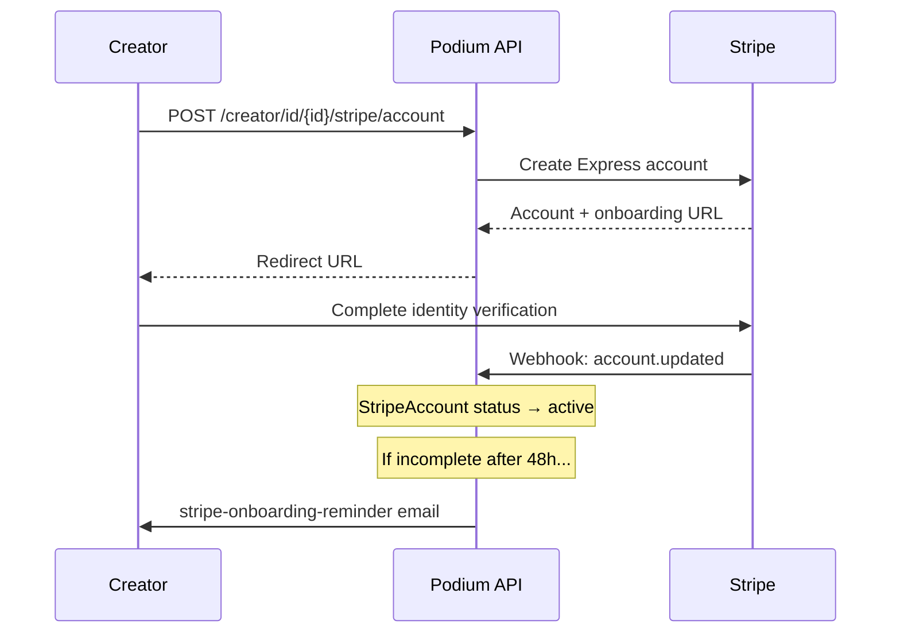

## Overview

Creators are merchants or brands within an organization. They manage products, fulfill orders, receive payouts, and run campaigns. Public-facing creator pages are accessed by slug; authenticated operations use creator ID.

A user creates a creator profile via `POST /user/{id}/creator`, and the creator is linked to the user through the `CreatorUser` join table. One user can own multiple creator profiles.

## Public Endpoints (by Slug)

Public endpoints don't require the user to own the creator.

### Get Creator Profile

<CodeGroup>

```bash cURL
curl https://api.podiumcommerce.xyz/api/v1/creator/clean-beauty-co \
  -H "Authorization: Bearer $PODIUM_API_KEY"
```

```typescript SDK
import { createPodiumClient } from "@podiumcommerce/node-sdk";

const client = createPodiumClient({ apiKey: process.env.PODIUM_API_KEY });
const creator = await client.merchant.getBySlug({ slug: "clean-beauty-co" });
```

</CodeGroup>

```json
{
  "id": "clcreator_abc",
  "slug": "clean-beauty-co",
  "displayName": "Clean Beauty Co",
  "description": "Sustainable skincare for mindful beauty",
  "avatarUrl": "https://cdn.example.com/avatar.jpg",
  "heroUrl": "https://cdn.example.com/hero.jpg",
  "flatShippingRate": 500,
  "socialProfiles": [
    { "platform": "INSTAGRAM", "url": "https://instagram.com/cleanbeautyco" }
  ],
  "createdAt": "2026-01-15T10:00:00.000Z"
}
```

### Public Stats

```bash
curl https://api.podiumcommerce.xyz/api/v1/creator/clean-beauty-co/stats \
  -H "Authorization: Bearer $PODIUM_API_KEY"
```

### Browse Products

```bash
curl https://api.podiumcommerce.xyz/api/v1/creator/clean-beauty-co/products \
  -H "Authorization: Bearer $PODIUM_API_KEY"
```

Returns only published products. For all products including drafts, use the authenticated endpoint.

### Public Collectibles & Rewards

| Endpoint | Returns |
|----------|---------|
| `/creator/{slug}/collectibles` | On-chain collectibles |
| `/creator/{slug}/collectibles/metadata` | Collectible metadata |
| `/creator/{slug}/rewards` | Available reward programs |

## Update Creator Profile

<CodeGroup>

```bash cURL
curl -X PATCH https://api.podiumcommerce.xyz/api/v1/creator/id/clcreator_abc \
  -H "Authorization: Bearer $PODIUM_API_KEY" \
  -H "Content-Type: application/json" \
  -d '{
    "displayName": "Clean Beauty Co.",
    "description": "Sustainable skincare for mindful beauty lovers",
    "avatarUrl": "https://cdn.example.com/new-avatar.jpg",
    "heroUrl": "https://cdn.example.com/new-hero.jpg",
    "flatShippingRate": 799,
    "socialProfiles": [
      { "platform": "INSTAGRAM", "url": "https://instagram.com/cleanbeautyco" },
      { "platform": "TIKTOK", "url": "https://tiktok.com/@cleanbeautyco" }
    ]
  }'
```

```typescript SDK
import { createPodiumClient } from "@podiumcommerce/node-sdk";

const client = createPodiumClient({ apiKey: process.env.PODIUM_API_KEY });
const updated = await client.merchant.updateByCreatorId({
  creatorId: "clcreator_abc",
  requestBody: {
    displayName: "Clean Beauty Co.",
    description: "Sustainable skincare for mindful beauty lovers",
    flatShippingRate: 799,
    socialProfiles: [
      { platform: "INSTAGRAM", url: "https://instagram.com/cleanbeautyco" },
      { platform: "TIKTOK", url: "https://tiktok.com/@cleanbeautyco" },
    ],
  },
});
```

</CodeGroup>

| Field | Type | Description |
|-------|------|-------------|
| `displayName` | string | Brand/creator name |
| `description` | string | Bio/description |
| `avatarUrl` | string | Profile image URL |
| `heroUrl` | string | Storefront banner image URL |
| `flatShippingRate` | integer | Default shipping rate in cents (e.g., 799 = $7.99) |
| `socialProfiles` | array | `{ platform, url }` pairs |

All fields are optional — include only what you want to change.

## Product Management

### Create a Product

```bash
curl -X POST https://api.podiumcommerce.xyz/api/v1/creator/id/clcreator_abc/product \
  -H "Authorization: Bearer $PODIUM_API_KEY" \
  -H "Content-Type: application/json" \
  -d '{
    "name": "Hydrating Face Serum",
    "slug": "hydrating-face-serum",
    "description": "Lightweight hyaluronic acid serum for all skin types",
    "price": 2900
  }'
```

See [Products API](/api-reference/products) for the full product create/update schema, variant management, and publish lifecycle.

### List All Products (Including Drafts)

```bash
curl https://api.podiumcommerce.xyz/api/v1/creator/id/clcreator_abc/products \
  -H "Authorization: Bearer $PODIUM_API_KEY"
```

### Product Sales & Analytics

| Endpoint | Returns |
|----------|---------|
| `/creator/id/{creatorId}/products/sales` | Sales data per product |
| `/creator/id/{creatorId}/products/analytics` | Aggregate product analytics |
| `/creator/id/{creatorId}/product/{productId}/analytics` | Single product analytics |

### Product Lifecycle

| Endpoint | Action |
|----------|--------|
| `POST /creator/id/{creatorId}/product/{productId}/publish` | Publish a draft product |
| `POST /creator/id/{creatorId}/product/{productId}/restore` | Restore an archived product |
| `DELETE /creator/id/{creatorId}/product/{productId}` | Archive (soft delete) |
| `DELETE /creator/id/{creatorId}/product/{productId}/purge` | Permanently delete |

## Order Management

### List Orders

```bash
curl https://api.podiumcommerce.xyz/api/v1/creator/id/clcreator_abc/orders \
  -H "Authorization: Bearer $PODIUM_API_KEY"
```

### Update Order Shipping Status

```bash
curl -X PATCH https://api.podiumcommerce.xyz/api/v1/creator/id/clcreator_abc/order/clord_xyz \
  -H "Authorization: Bearer $PODIUM_API_KEY" \
  -H "Content-Type: application/json" \
  -d '{ "shippingStatus": "SHIPPED" }'
```

| Shipping Status | Description |
|----------------|-------------|
| `PENDING` | Order placed, not yet shipped |
| `PROCESSING` | Being prepared for shipment |
| `SHIPPED` | In transit |
| `DELIVERED` | Delivered to recipient |
| `RETURNED` | Returned by customer |

### Generate Shipping Label

```bash
curl https://api.podiumcommerce.xyz/api/v1/creator/id/clcreator_abc/order/clord_xyz/shipping/label \
  -H "Authorization: Bearer $PODIUM_API_KEY"
```

Generates a Shippo shipping label for the order. Requires the creator to have a connected Shippo account.

## Stripe Connect Onboarding

Creators receive payouts through Stripe Connect. The onboarding flow creates a Stripe Express account linked to the creator.

### Initiate Stripe Connect

```bash
curl -X POST https://api.podiumcommerce.xyz/api/v1/creator/id/clcreator_abc/stripe/account \
  -H "Authorization: Bearer $PODIUM_API_KEY"
```

Returns a Stripe Connect onboarding URL. Redirect the creator to this URL to complete identity verification and bank account setup.

```json
{
  "url": "https://connect.stripe.com/setup/s/...",
  "accountId": "acct_1234567890"
}
```

### Onboarding Flow



### Onboarding Reminders

If a creator hasn't completed Stripe onboarding within 48 hours, the `stripe-onboarding-reminder` cron job sends an email reminder. The `stripeOnboardingReminderSentAt` and `stripeOnboardingReminderClaimedUntil` fields on the Creator model track this flow.

## Payout Lifecycle

When an order is paid, a `CreatorPayout` record is created to track the creator's share:


| Status | Description |
|--------|-------------|
| `PENDING` | Order paid, payout created. Funds held during review period |
| `ELIGIBLE` | Hold period complete, payout ready for transfer |
| `TRANSFERRED` | Funds sent to creator's Stripe Connect account |

### View Payouts

```bash
curl https://api.podiumcommerce.xyz/api/v1/creator/id/clcreator_abc/payouts \
  -H "Authorization: Bearer $PODIUM_API_KEY"
```

```json
[
  {
    "id": "clpayout_abc",
    "orderId": "clord_xyz",
    "amount": 2320,
    "currency": "usd",
    "status": "TRANSFERRED",
    "stripeTransferId": "tr_1234567890",
    "createdAt": "2026-03-01T10:00:00.000Z",
    "transferredAt": "2026-03-03T14:30:00.000Z"
  }
]
```

The `amount` is in cents and represents the creator's share after the platform application fee (`STRIPE_PLATFORM_APPLICATION_FEE_BPS`).

### Payout Sweep Cron

The `payouts-sweep` cron job runs periodically to:
1. Query all `ELIGIBLE` payouts
2. Execute Stripe Connect transfers to each creator's account
3. Update status to `TRANSFERRED` with the `stripeTransferId`

## Dashboard Analytics

| Endpoint | Returns |
|----------|---------|
| `/creator/id/{creatorId}/dashboard` | Overview dashboard |
| `/creator/id/{creatorId}/dashboard/rewards` | Reward program performance |
| `/creator/id/{creatorId}/dashboard/fans` | Fan/follower analytics |
| `/creator/id/{creatorId}/dashboard/campaigns` | Campaign performance |

## Campaigns

| Endpoint | Returns |
|----------|---------|
| `/creator/id/{creatorId}/campaigns` | All campaigns |
| `/creator/id/{creatorId}/campaigns/titles` | Campaign title list |
| `/creator/id/{creatorId}/campaigns/latest` | Most recent campaign |
| `/creator/id/{creatorId}/campaigns/analytics/participants/count` | Total participants |

### Archive / Restore / Purge Campaigns

| Endpoint | Action |
|----------|--------|
| `DELETE /creator/id/{creatorId}/campaign/{id}` | Archive |
| `POST /creator/id/{creatorId}/campaign/{id}/restore` | Restore |
| `DELETE /creator/id/{creatorId}/campaign/{id}/purge` | Permanent delete |

## Followers

| Endpoint | Returns |
|----------|---------|
| `/creator/id/{creatorId}/followers` | Follower list |
| `/creator/id/{creatorId}/followers/count` | Follower count |
| `/creator/followers/{id}` | Followers by creator (public) |
| `/creator/followers/{id}/top` | Top followers |
| `/creator/followers/{id}/growth` | Follower growth over time |

## Rewards & Airdrops

| Endpoint | Returns |
|----------|---------|
| `/creator/id/{creatorId}/nft-rewards` | Reward programs |
| `/creator/id/{creatorId}/nft-rewards/redeemed` | Redeemed rewards |
| `/creator/id/{creatorId}/latest-earned-reward` | Latest earned reward |
| `/creator/id/{creatorId}/latest-airdrop` | Latest airdrop |
| `/creator/id/{creatorId}/earned-rewards` | All earned rewards |
| `/creator/id/{creatorId}/airdrops` | Airdrop history |

## Groups

Creators can organize followers into groups for targeted campaigns and communications:

```bash
curl -X POST https://api.podiumcommerce.xyz/api/v1/creator/id/clcreator_abc/group \
  -H "Authorization: Bearer $PODIUM_API_KEY" \
  -H "Content-Type: application/json" \
  -d '{
    "groupName": "VIP Customers",
    "groupType": "MANUAL",
    "memberIds": ["cluser_1", "cluser_2", "cluser_3"]
  }'
```

| Endpoint | Action |
|----------|--------|
| `GET /creator/id/{creatorId}/groups` | List groups |
| `POST /creator/id/{creatorId}/group` | Create group |

## Token Presales

Creators can run token presale campaigns:

| Endpoint | Action |
|----------|--------|
| `GET /creator/id/{creatorId}/token-presales` | List presales |
| `POST /creator/id/{creatorId}/token-presales` | Create presale |
| `GET /creator/id/{creatorId}/token-presales/{id}` | Get presale |
| `PATCH /creator/id/{creatorId}/token-presales/{id}` | Update presale |
| `DELETE /creator/id/{creatorId}/token-presales/{id}` | Delete presale |

## Creator Model

| Field | Type | Description |
|-------|------|-------------|
| `id` | string | CUID2 identifier |
| `slug` | string | URL-friendly unique handle |
| `displayName` | string | Brand/creator name (unique) |
| `description` | string | Creator bio |
| `avatarUrl` | string | Profile image URL |
| `heroUrl` | string | Storefront banner image |
| `flatShippingRate` | integer | Default shipping rate in cents |
| `pointsAccepted` | enum | `SELF` (own points only) or `ALL` |
| `createdAt` | datetime | Creation timestamp |
| `organizationId` | string | Parent organization |

## CreatorPayout Model

| Field | Type | Description |
|-------|------|-------------|
| `id` | string | CUID2 identifier |
| `creatorId` | string | Owning creator |
| `orderId` | string | Source order (unique) |
| `amount` | integer | Payout amount in cents |
| `currency` | string | Currency code (default: `usd`) |
| `status` | enum | `PENDING`, `ELIGIBLE`, `TRANSFERRED` |
| `stripeTransferId` | string | Stripe transfer ID (when transferred) |
| `createdAt` | datetime | Creation timestamp |
| `transferredAt` | datetime | Transfer timestamp |

## Endpoint Summary

| Method | Path | Description |
|--------|------|-------------|
| `GET` | `/creator/{slug}` | Public profile |
| `GET` | `/creator/{slug}/products` | Published products |
| `GET` | `/creator/{slug}/product/{productSlug}` | Product by slug |
| `GET` | `/creator/{slug}/collectibles` | Collectibles |
| `GET` | `/creator/{slug}/collectibles/metadata` | Collectible metadata |
| `GET` | `/creator/{slug}/rewards` | Rewards |
| `GET` | `/creator/{slug}/stats` | Public stats |
| `GET` | `/creator/id/{creatorId}` | Get by ID |
| `PATCH` | `/creator/id/{creatorId}` | Update profile |
| `GET` | `/creator/id/{creatorId}/products` | All products |
| `GET` | `/creator/id/{creatorId}/products/sales` | Sales data |
| `GET` | `/creator/id/{creatorId}/products/analytics` | Product analytics |
| `POST` | `/creator/id/{creatorId}/product` | Create product |
| `GET` | `/creator/id/{creatorId}/product/{productId}` | Get product |
| `PATCH` | `/creator/id/{creatorId}/product/{productId}` | Update product |
| `DELETE` | `/creator/id/{creatorId}/product/{productId}` | Archive product |
| `POST` | `/creator/id/{creatorId}/product/{productId}/publish` | Publish |
| `POST` | `/creator/id/{creatorId}/product/{productId}/restore` | Restore |
| `DELETE` | `/creator/id/{creatorId}/product/{productId}/purge` | Purge |
| `GET` | `/creator/id/{creatorId}/orders` | Orders |
| `PATCH` | `/creator/id/{creatorId}/order/{id}` | Update order |
| `GET` | `/creator/id/{creatorId}/order/{id}/shipping/label` | Shipping label |
| `GET` | `/creator/id/{creatorId}/payouts` | Payouts |
| `POST` | `/creator/id/{creatorId}/stripe/account` | Stripe Connect |
| `GET` | `/creator/id/{creatorId}/dashboard` | Dashboard |
| `GET` | `/creator/id/{creatorId}/dashboard/rewards` | Rewards dash |
| `GET` | `/creator/id/{creatorId}/dashboard/fans` | Fan analytics |
| `GET` | `/creator/id/{creatorId}/dashboard/campaigns` | Campaign dash |
| `GET` | `/creator/id/{creatorId}/campaigns` | Campaigns |
| `GET` | `/creator/id/{creatorId}/campaigns/titles` | Campaign titles |
| `GET` | `/creator/id/{creatorId}/campaigns/latest` | Latest campaign |
| `GET` | `/creator/id/{creatorId}/followers` | Followers |
| `GET` | `/creator/id/{creatorId}/followers/count` | Follower count |
| `GET` | `/creator/id/{creatorId}/nft-rewards` | Rewards |
| `GET` | `/creator/id/{creatorId}/nft-rewards/redeemed` | Redeemed |
| `GET` | `/creator/id/{creatorId}/airdrops` | Airdrops |
| `GET` | `/creator/id/{creatorId}/groups` | Groups |
| `POST` | `/creator/id/{creatorId}/group` | Create group |
| `GET` | `/creator/id/{creatorId}/notifications` | Notifications |
| `POST` | `/creator/id/{creatorId}/chat` | Initialize chat |
