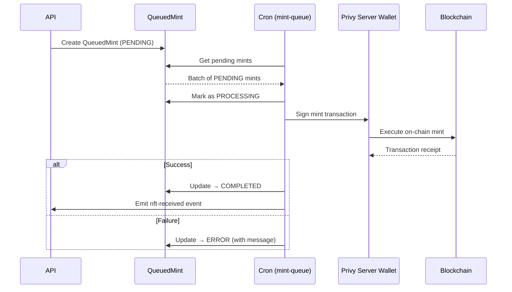

## Overview

Podium supports minting on-chain rewards on EVM chains (Base, Polygon, Arc Testnet) with a queued minting system via Privy server wallets. Rewards serve as verifiable, on-chain incentives with six distinct reward types.

Reward programs are created by creators, linked to campaigns or standalone, and minted to users as ERC-721 tokens. The entire lifecycle — from program creation through minting and redemption — is managed via the API.

## Create a Reward Program

<CodeGroup>

```bash cURL
curl -X POST https://api.podiumcommerce.xyz/api/v1/nft-reward \
  -H "Authorization: Bearer $PODIUM_API_KEY" \
  -H "Content-Type: application/json" \
  -d '{
    "creatorId": "clcreator_abc",
    "name": "Clean Beauty VIP Badge",
    "description": "Exclusive badge for loyal Clean Beauty Co customers",
    "type": "EXCLUSIVE_ACCESS",
    "imageUrl": "https://cdn.example.com/vip-badge.png",
    "points": 500,
    "maxSupply": 100
  }'
```

```typescript SDK
import { createPodiumClient } from '@podiumcommerce/node-sdk'
const client = createPodiumClient({ apiKey: process.env.PODIUM_API_KEY })
const reward = await client.nftRewards.createNftReward({
  requestBody: {
    creatorId: "clcreator_abc",
    type: "EXCLUSIVE_ACCESS",
    name: "Clean Beauty VIP Badge",
    description: "Exclusive badge for loyal Clean Beauty Co customers",
    imageUrl: "https://cdn.example.com/vip-badge.png",
    points: 500
  }
});
```

</CodeGroup>

### Response

```json
{
  "id": "clreward_xyz",
  "status": "DRAFT",
  "type": "EXCLUSIVE_ACCESS",
  "creatorId": "clcreator_abc",
  "contract": {
    "id": 42,
    "name": "Clean Beauty VIP Badge",
    "symbol": "CBVIP",
    "proxyAddress": null,
    "implementationAddress": null,
    "chainId": 8453,
    "maxSupply": 100,
    "points": 500,
    "transferable": true
  },
  "createdAt": "2026-03-07T12:00:00.000Z"
}
```

The contract addresses are `null` until the reward is published, at which point the smart contract is deployed on-chain.

## Reward Types

| Type | Description | Redemption Effect |
|------|-------------|-------------------|
| `POINTS` | Redeem for Podium points | Credits points to user's balance |
| `FREE_PRODUCT` | Redeem for a specific product | Creates a zero-cost order |
| `DISCOUNT_CODE` | Unlock a discount code | Returns a one-time discount code |
| `EVENT_PASS` | Access to an event or experience | Grants access token/ticket |
| `CUSTOM` | Custom reward defined by creator | Triggers custom webhook |
| `EXCLUSIVE_ACCESS` | Gated content or feature access | Unlocks gated content |

## Update and Publish

### Update Reward Details

```bash
curl -X PUT https://api.podiumcommerce.xyz/api/v1/nft-reward/clreward_xyz \
  -H "Authorization: Bearer $PODIUM_API_KEY" \
  -H "Content-Type: application/json" \
  -d '{
    "name": "Updated Badge Name",
    "description": "Updated description"
  }'
```

### Update On-Chain Metadata

```bash
curl -X PUT https://api.podiumcommerce.xyz/api/v1/nft-reward/clreward_xyz/nft \
  -H "Authorization: Bearer $PODIUM_API_KEY" \
  -H "Content-Type: application/json" \
  -d '{
    "name": "Clean Beauty VIP Badge",
    "description": "Exclusive badge for loyal customers",
    "imageUrl": "https://cdn.example.com/badge-v2.png",
    "animationUrl": "https://cdn.example.com/badge-v2.mp4",
    "externalUrl": "https://cleanbeautyco.com/vip",
    "points": 500
  }'
```

At least one of `imageUrl` or `animationUrl` is required.

### Publish

```bash
curl -X PUT https://api.podiumcommerce.xyz/api/v1/nft-reward/clreward_xyz/publish \
  -H "Authorization: Bearer $PODIUM_API_KEY"
```

Publishing deploys the ERC-721 contract on-chain and sets the reward status to `PUBLISHED`. A `nft-reward-published` QStash event is emitted.

### Disable

```bash
curl -X PATCH https://api.podiumcommerce.xyz/api/v1/nft-reward/clreward_xyz/disable \
  -H "Authorization: Bearer $PODIUM_API_KEY"
```

Disabling prevents new mints but doesn't affect already-minted tokens.

## Grant (Mint) a Reward

Mint a reward token to a specific user:

<CodeGroup>

```bash cURL
curl -X POST https://api.podiumcommerce.xyz/api/v1/nft-reward/clreward_xyz/grant \
  -H "Authorization: Bearer $PODIUM_API_KEY" \
  -H "Content-Type: application/json" \
  -d '{
    "userId": "clxyz1234567890",
    "creatorId": "clcreator_abc"
  }'
```

```typescript SDK
await client.nftRewards.createNftRewardGrant({
  id: "clreward_xyz",
  requestBody: {
    userId: "clxyz1234567890",
    creatorId: "clcreator_abc"
  }
});
```

</CodeGroup>

| Field | Type | Required | Description |
|-------|------|----------|-------------|
| `userId` | string | Yes | Recipient user CUID |
| `creatorId` | string | Yes | Creator who owns the reward |

## Mint Queue System

Mints go through a reliable queue to handle on-chain transaction latency and failures:



### QueuedMint Statuses

| Status | Description |
|--------|-------------|
| `PENDING` | Mint requested, waiting for cron |
| `PROCESSING` | Cron picked up, transaction in progress |
| `COMPLETED` | On-chain mint confirmed |
| `ERROR` | Mint failed (error stored in `message`) |

The `mint-queue` cron job runs frequently, batching pending mints and executing them via Privy server wallets.

## Redeem a Reward

Users redeem rewards they've earned:

<CodeGroup>

```bash cURL
curl -X POST https://api.podiumcommerce.xyz/api/v1/user/clxyz1234567890/nfts/base/0xContractAddr/42/redeem \
  -H "Authorization: Bearer $PODIUM_API_KEY"
```

```typescript SDK
await client.userNfTs.redeem({
  id: "clxyz1234567890",
  network: "base",
  address: "0xContractAddr",
  tokenId: "42"
});
```

</CodeGroup>

Path parameters: `/{network}/{contractAddress}/{tokenId}`

The redemption flow:

1. Verify the user owns the token
2. Check the reward type and eligibility
3. Process the reward (create order, grant points, generate code, etc.)
4. Record `NftRedemption` and emit `nft-redeemed` event
5. Deduct points if the reward has a point cost

### Check Redemption Status

```bash
curl https://api.podiumcommerce.xyz/api/v1/user/clxyz1234567890/nfts/base/0xContractAddr/42/status \
  -H "Authorization: Bearer $PODIUM_API_KEY"
```

```json
{
  "status": "REDEEMED",
  "redeemedAt": "2026-03-07T15:30:00.000Z",
  "rewardType": "FREE_PRODUCT",
  "rewardDetails": {
    "productId": "clprod_abc123",
    "orderId": "clord_reward_xyz"
  }
}
```

## Query User Rewards

### Full Collection

```bash
curl https://api.podiumcommerce.xyz/api/v1/user/clxyz1234567890/nfts \
  -H "Authorization: Bearer $PODIUM_API_KEY"
```

### Filtered Views

| Endpoint | Returns |
|----------|---------|
| `/user/{id}/nfts/earned` | Rewards earned through programs and campaigns |
| `/user/{id}/nfts/redeemable` | Available for redemption (earned but not yet redeemed) |
| `/user/{id}/nfts/redeemed` | Already redeemed rewards |

## Airdrops

Airdrops distribute rewards to multiple users at once.

### Get Airdrop Details

```bash
curl https://api.podiumcommerce.xyz/api/v1/airdrop/clairdrop_abc \
  -H "Authorization: Bearer $PODIUM_API_KEY"
```

```json
{
  "id": "clairdrop_abc",
  "airdropDate": "2026-04-01T00:00:00.000Z",
  "status": "COMPLETED",
  "eligible": 500,
  "nftReward": {
    "id": "clreward_xyz",
    "contract": {
      "name": "Spring Collection Badge",
      "proxyAddress": "0x..."
    }
  }
}
```

### Airdrop Status Flow

| Status | Description |
|--------|-------------|
| `PENDING` | Airdrop scheduled, waiting for processing |
| `PROCESSING` | `airdrop-monitor` cron is minting tokens |
| `COMPLETED` | All tokens minted successfully |
| `FAILED` | Airdrop failed (partial mints may exist) |

### Track Redemptions and Deliveries

| Endpoint | Returns |
|----------|---------|
| `/airdrop/{id}/redemption` | Redemption tracking for the airdrop |
| `/airdrop/{id}/delivered` | Users who received the airdrop |

### Creator Airdrops

| Endpoint | Returns |
|----------|---------|
| `/creator/id/{creatorId}/airdrops` | All airdrops for a creator |
| `/creator/id/{creatorId}/latest-airdrop` | Most recent airdrop |

## Supported Chains

| Network | Chain ID | Use Case |
|---------|----------|----------|
| Base Mainnet | 8453 | Production rewards |
| Base Sepolia | 84532 | Testnet rewards |
| Arc Testnet | — | Development/testing |

## Reward Contract Model

| Field | Type | Description |
|-------|------|-------------|
| `id` | integer | Auto-increment ID |
| `name` | string | Contract name |
| `symbol` | string | Token symbol |
| `proxyAddress` | string | Deployed proxy address |
| `implementationAddress` | string | Implementation address |
| `chainId` | integer | Deployment chain ID |
| `maxSupply` | integer | Maximum mintable tokens |
| `points` | integer | Points cost to redeem |
| `transferable` | boolean | Whether tokens can be transferred |

## Endpoint Summary

| Method | Path | Description |
|--------|------|-------------|
| `POST` | `/nft-reward` | Create reward program |
| `GET` | `/nft-reward/{id}` | Get reward details |
| `PUT` | `/nft-reward/{id}` | Update reward |
| `DELETE` | `/nft-reward/{id}` | Delete reward |
| `PUT` | `/nft-reward/{id}/publish` | Publish (deploy contract) |
| `PUT` | `/nft-reward/{id}/nft` | Update on-chain metadata |
| `POST` | `/nft-reward/{id}/grant` | Grant (mint) to user |
| `PATCH` | `/nft-reward/{id}/disable` | Disable reward |
| `GET` | `/user/{id}/nfts` | User's reward collection |
| `GET` | `/user/{id}/nfts/earned` | Earned rewards |
| `GET` | `/user/{id}/nfts/redeemable` | Redeemable rewards |
| `GET` | `/user/{id}/nfts/redeemed` | Redeemed rewards |
| `GET` | `/user/{id}/nfts/{network}/{address}/{tokenId}/status` | Redemption status |
| `POST` | `/user/{id}/nfts/{network}/{address}/{tokenId}/redeem` | Redeem reward |
| `GET` | `/airdrop/{id}` | Airdrop details |
| `GET` | `/airdrop/{id}/redemption` | Airdrop redemptions |
| `GET` | `/airdrop/{id}/delivered` | Delivered users |
| `GET` | `/creator/{slug}/collectibles` | Public collectibles |
| `GET` | `/creator/{slug}/collectibles/metadata` | Collectible metadata |
| `GET` | `/creator/id/{creatorId}/collectibles` | Manage collectibles |
| `GET` | `/creator/id/{creatorId}/nft-rewards` | Creator's rewards |
| `GET` | `/creator/id/{creatorId}/nft-rewards/redeemed` | Redeemed rewards |
| `GET` | `/creator/id/{creatorId}/latest-earned-reward` | Latest earned |
| `GET` | `/creator/id/{creatorId}/latest-airdrop` | Latest airdrop |
| `GET` | `/creator/id/{creatorId}/airdrops` | All airdrops |
