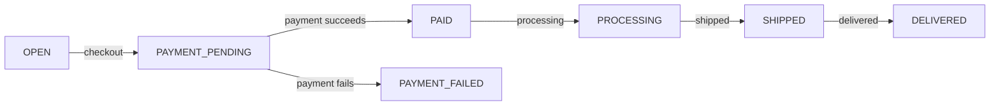

Orders capture purchase transactions from creation through fulfillment. Podium supports four checkout methods, each suited to different use cases — from traditional card payments to fully autonomous agent transactions.

## Choosing a Checkout Method

| Method | Best For | Currency | Auth Required | Human in Loop? |
|--------|----------|----------|---------------|----------------|
| **Stripe** | Consumer web/mobile checkout | USD (fiat) | Yes | Yes — card entry |
| **x402** | Agent-native autonomous payments | USDC on Base | No | No — programmatic |
| **Embedded Wallet** | Automated crypto checkout via Privy | USDC on Base | Yes | No — server-side |
| **Coinbase Commerce** | Multi-token crypto checkout | Various | Yes | Yes — Coinbase flow |

---

## Order Lifecycle

### Create an Order

Orders start as `OPEN` and can have products added to them. Creating an order with a product in a single call:

<CodeGroup>

```bash cURL
curl -X POST https://api.podium.build/api/v1/user/{userId}/order \
  -H "Authorization: Bearer YOUR_API_KEY" \
  -H "Content-Type: application/json" \
  -d '{
    "productId": "clx9prod001",
    "variantIds": ["clx9var001"],
    "quantity": 1
  }'
```

```typescript SDK
import { createPodiumClient } from '@podiumcommerce/node-sdk'

const client = createPodiumClient({ apiKey: process.env.PODIUM_API_KEY })

const order = await client.userOrders.create({
  id: userId,
  requestBody: {
    productId: "clx9prod001",
    variantIds: ["clx9var001"],
    quantity: 1,
  },
})
```

</CodeGroup>

**Response:**

```json
{
  "id": "clx9order001",
  "status": "OPEN",
  "shippingStatus": "PENDING",
  "points": 0,
  "shippingFee": 0,
  "items": [
    {
      "id": 1,
      "productId": "clx9prod001",
      "productName": "Organic Face Serum",
      "productSlug": "organic-face-serum",
      "quantity": 1,
      "price": 2500,
      "selectedAttributes": { "Size": "30ml" }
    }
  ],
  "createdAt": "2026-03-07T12:00:00Z"
}
```

### Get Open Order

Retrieve the current open order for a user (only one open order at a time):

```bash
curl https://api.podium.build/api/v1/user/{userId}/order \
  -H "Authorization: Bearer YOUR_API_KEY"
```

### Add Product to Order

```bash
curl -X POST https://api.podium.build/api/v1/user/{userId}/order/{orderId}/product/{productId} \
  -H "Authorization: Bearer YOUR_API_KEY"
```

### Remove Item from Order

```bash
curl -X DELETE https://api.podium.build/api/v1/user/{userId}/order/{orderId}/item/{orderItemId} \
  -H "Authorization: Bearer YOUR_API_KEY"
```

---

## Order Status Flow



| Status | Description |
|--------|-------------|
| `OPEN` | Order created, items being added |
| `PAYMENT_PENDING` | Checkout initiated, awaiting payment confirmation |
| `PAID` | Payment confirmed (via webhook or on-chain verification) |
| `PAYMENT_FAILED` | Payment attempt failed |
| `PROCESSING` | Being prepared for shipping |
| `SHIPPED` | Shipping label created, in transit |
| `DELIVERED` | Delivered to customer |

---

## Stripe Checkout

The most common flow for consumer-facing applications. Creates a Stripe PaymentIntent and returns a `clientSecret` for completing payment on the frontend.

<CodeGroup>

```bash cURL
curl -X POST https://api.podium.build/api/v1/user/{userId}/order/{orderId}/checkout \
  -H "Authorization: Bearer YOUR_API_KEY" \
  -H "Content-Type: application/json" \
  -d '{
    "points": 500
  }'
```

```typescript SDK
import { createPodiumClient } from '@podiumcommerce/node-sdk'

const client = createPodiumClient({ apiKey: process.env.PODIUM_API_KEY })

const checkout = await client.userOrder.checkout({
  id: userId,
  orderId,
  requestBody: { points: 500 },
})
```

</CodeGroup>

**Request Body:**

| Field | Type | Default | Description |
|-------|------|---------|-------------|
| `points` | integer | `0` | Points to apply as discount |

**Response:**

```json
{
  "intentId": "pi_3abc123",
  "clientSecret": "pi_3abc123_secret_xyz",
  "status": "requires_payment_method",
  "amount": 2000
}
```

### How It Works

<Steps>
  <Step title="Create PaymentIntent">
    `POST /checkout` creates a Stripe PaymentIntent for the order total (minus any points discount). If a PaymentIntent already exists and points haven't changed, the existing one is reused. If points changed, the old intent is cancelled and a new one is created.
  </Step>
  <Step title="Complete Payment">
    Use the `clientSecret` on the frontend with Stripe.js or Stripe Elements to collect payment. The user enters their card and confirms.
  </Step>
  <Step title="Webhook Confirmation">
    Stripe sends `payment_intent.succeeded` to `/webhooks/stripe/payment-intent/succeeded`. Podium updates the order to `PAID`, decrements inventory, and publishes an `OrderConfirmationEvent`.
  </Step>
  <Step title="Finalize Points">
    If points were applied, call `PUT /user/{userId}/order/{orderId}/points/finalize` to commit the point spend. If the payment failed, call `POST /user/{userId}/order/{orderId}/points/revert` to return the points.
  </Step>
</Steps>

---

## x402 Checkout (USDC)

Machine-native payment for autonomous agents. No authentication required — the agent pays with USDC on Base via the x402 protocol. See [x402 Payments](/agentic/x402-payments) for the full protocol spec.

```bash
# Step 1: Request payment requirements (returns HTTP 402)
curl -X POST https://api.podium.build/api/v1/x402/orders/{orderId}/pay

# Response: 402 Payment Required
# Headers include X-PAYMENT-REQUIREMENTS with amount, payTo address, and network

# Step 2: Submit payment with signed USDC transfer
curl -X POST https://api.podium.build/api/v1/x402/orders/{orderId}/pay \
  -H "X-PAYMENT: <base64-encoded-payment-payload>"
```

### How It Works

<Steps>
  <Step title="Request Requirements">
    Agent calls the pay endpoint without an `X-PAYMENT` header. The server returns `402 Payment Required` with the order amount in USDC, the `payTo` address, and the network (Base).
  </Step>
  <Step title="Sign and Send Payment">
    Agent constructs a USDC transfer, signs it, and re-calls the endpoint with the `X-PAYMENT` header containing the base64-encoded payment proof.
  </Step>
  <Step title="Verify and Settle">
    Podium decodes the payment, verifies the amount matches the order total, and confirms the on-chain transfer via the x402 facilitator. On success: creates/updates an `X402Payment` record, moves the order to `PAID`, and decrements inventory.
  </Step>
</Steps>

<Note>
x402 checkout requires the organization to have `x402PayToAddress` configured in their settings. The payment amount is converted from the order's cent-based total to USDC (6 decimal places).
</Note>

---

## Embedded Wallet Checkout

For automated crypto checkout using Privy server-managed wallets. The transaction is executed server-side — no user interaction required during payment.

```bash
curl -X PATCH https://api.podium.build/api/v1/user/{userId}/order/{orderId}/checkout/embedded-wallet \
  -H "Authorization: Bearer YOUR_API_KEY" \
  -H "Content-Type: application/json" \
  -d '{
    "txHash": "0xabc123...",
    "amount": "25.00",
    "email": "user@example.com",
    "shippingAddress": {
      "line1": "123 Main St",
      "city": "San Francisco",
      "state": "CA",
      "postalCode": "94102",
      "countryCode": "US"
    },
    "walletAddress": "0x1234567890abcdef...",
    "chain": "BASE",
    "asset": "USDC"
  }'
```

**Request Body:**

| Field | Type | Required | Description |
|-------|------|----------|-------------|
| `txHash` | string | Yes | On-chain transaction hash |
| `amount` | string | Yes | Payment amount |
| `email` | string | Yes | Notification email |
| `shippingAddress` | object? | No | Shipping address (nullable) |
| `walletAddress` | string | Yes | Ethereum address of the paying wallet |
| `chain` | enum | Yes | `BASE` |
| `asset` | enum | Yes | `USDC` |

### How It Works

1. Your backend initiates a USDC transfer from the user's Privy embedded wallet
2. After the transaction confirms on-chain, call this endpoint with the `txHash`
3. Podium verifies the wallet, creates a `CryptoPaymentIntent` (status `CONFIRMED`), updates the order to `PAID`, and decrements inventory
4. An `OrderConfirmationEvent` is published if an email is provided

---

## Coinbase Commerce Checkout

Multi-token crypto checkout via Coinbase Commerce:

```bash
curl -X PATCH https://api.podium.build/api/v1/user/{userId}/order/{orderId}/checkout/coinbase \
  -H "Authorization: Bearer YOUR_API_KEY" \
  -H "Content-Type: application/json" \
  -d '{
    "callsId": "coinbase_charge_abc123",
    "amount": "25.00",
    "customer": {
      "email": "user@example.com",
      "physicalAddress": {
        "address1": "123 Main St",
        "city": "San Francisco",
        "state": "CA",
        "postalCode": "94102",
        "countryCode": "US",
        "name": {
          "firstName": "Jane",
          "familyName": "Doe"
        }
      }
    }
  }'
```

---

## Discounts and Points

### Apply Points Discount

```bash
curl -X POST https://api.podium.build/api/v1/user/{userId}/order/{orderId}/points \
  -H "Authorization: Bearer YOUR_API_KEY" \
  -H "Content-Type: application/json" \
  -d '{ "points": 500 }'
```

Points are held in a pending state until finalized after payment or reverted on failure.

### Apply Discount Code

```bash
curl -X POST https://api.podium.build/api/v1/user/{userId}/order/{orderId}/discount \
  -H "Authorization: Bearer YOUR_API_KEY" \
  -H "Content-Type: application/json" \
  -d '{ "code": "SUMMER2026" }'
```

### Finalize Points

After successful payment, commit the point spend:

```bash
curl -X PUT https://api.podium.build/api/v1/user/{userId}/order/{orderId}/points/finalize \
  -H "Authorization: Bearer YOUR_API_KEY"
```

### Revert Points

On payment failure, return held points to the user:

```bash
curl -X POST https://api.podium.build/api/v1/user/{userId}/order/{orderId}/points/revert \
  -H "Authorization: Bearer YOUR_API_KEY"
```

---

## Shipping

Podium integrates with Shippo for shipping rate calculation and label generation.

### Get Shipping Quote

Returns available shipping rates and updates the Stripe PaymentIntent amount to include shipping:

```bash
curl -X POST https://api.podium.build/api/v1/order/{orderId}/shipping/quote \
  -H "Authorization: Bearer YOUR_API_KEY" \
  -H "Content-Type: application/json" \
  -d '{
    "firstName": "Jane",
    "lastName": "Doe",
    "address": {
      "line1": "123 Main St",
      "city": "San Francisco",
      "state": "CA",
      "postalCode": "94102",
      "countryCode": "US"
    }
  }'
```

### Generate Shipping Label

```bash
curl https://api.podium.build/api/v1/creator/id/{creatorId}/order/{orderId}/shipping/label \
  -H "Authorization: Bearer YOUR_API_KEY"
```

Creates a Shippo shipping label and sends a tracking email to the customer.

---

## Guest Checkout

Anonymous buyers can place orders without creating a Podium account.

### Create Guest Order

```bash
curl -X POST https://api.podium.build/api/v1/guest/order \
  -H "Content-Type: application/json" \
  -d '{
    "productId": "clx9prod001",
    "variantIds": ["clx9var001"],
    "quantity": 1
  }'
```

### Guest Stripe Checkout

```bash
curl -X POST https://api.podium.build/api/v1/guest/order/{orderId}/checkout
```

Returns a Stripe PaymentIntent `clientSecret` — same flow as authenticated checkout but without user context.

### Guest Coinbase Checkout

```bash
curl -X PATCH https://api.podium.build/api/v1/guest/order/{orderId}/checkout/coinbase \
  -H "Content-Type: application/json" \
  -d '{ "callsId": "...", "amount": "25.00", "customer": { ... } }'
```

---

## Record Payment Failure

If payment fails on the client side (before webhook), notify the server:

```bash
curl -X POST https://api.podium.build/api/v1/user/{userId}/order/{orderId}/payment-failed \
  -H "Authorization: Bearer YOUR_API_KEY"
```

---

## Order Model

| Field | Type | Description |
|-------|------|-------------|
| `id` | string | CUID2 identifier |
| `status` | enum | Order status (see flow above) |
| `shippingStatus` | enum | `PENDING`, `LABEL_CREATED`, `IN_TRANSIT`, `DELIVERED` |
| `points` | integer | Points applied as discount |
| `shippingFee` | integer | Shipping cost in cents |
| `shippingInfo` | object? | Shippo tracking data |
| `items` | array | Order items with product snapshots |
| `createdAt` | datetime | Creation timestamp |
| `updatedAt` | datetime | Last update timestamp |

## Endpoint Summary

| Method | Path | Description |
|--------|------|-------------|
| `GET` | `/user/{id}/order` | Get open order |
| `POST` | `/user/{id}/order` | Create order with product |
| `GET` | `/user/{id}/orders` | List user orders |
| `GET` | `/user/{id}/order/{orderId}` | Get order by ID |
| `POST` | `/user/{id}/order/{orderId}/product/{productId}` | Add product to order |
| `DELETE` | `/user/{id}/order/{orderId}/item/{orderItemId}` | Remove item |
| `POST` | `/user/{id}/order/{orderId}/checkout` | Stripe checkout |
| `PATCH` | `/user/{id}/order/{orderId}/checkout/embedded-wallet` | Embedded wallet checkout |
| `PATCH` | `/user/{id}/order/{orderId}/checkout/coinbase` | Coinbase checkout |
| `POST` | `/user/{id}/order/{orderId}/discount` | Apply discount code |
| `POST` | `/user/{id}/order/{orderId}/points` | Apply points |
| `PUT` | `/user/{id}/order/{orderId}/points/finalize` | Finalize points |
| `POST` | `/user/{id}/order/{orderId}/points/revert` | Revert points |
| `POST` | `/user/{id}/order/{orderId}/payment-failed` | Record payment failure |
| `POST` | `/x402/orders/{id}/pay` | x402 USDC payment |
| `POST` | `/order/{id}/shipping/quote` | Shipping quote |
| `GET` | `/order/{id}` | Get order (generic) |
| `POST` | `/guest/order` | Create guest order |
| `POST` | `/guest/order/{id}/checkout` | Guest Stripe checkout |
| `PATCH` | `/guest/order/{id}/checkout/coinbase` | Guest Coinbase checkout |
| `POST` | `/guest/order/{id}/payment-failed` | Guest payment failure |
