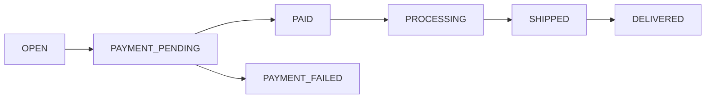

## Overview

Orders capture purchase transactions from creation through fulfillment. They support multiple payment methods (Stripe, x402, embedded wallet, Coinbase), shipping integration via Shippo, and point-based discounts.

## Endpoints

| Method | Path | Description |
|--------|------|-------------|
| `GET` | `/order/{id}` | Get order details |
| `GET` | `/order/{id}/shipping/quote` | Get shipping rate quotes |
| `POST` | `/user/{id}/order/{orderId}/checkout` | Stripe payment checkout |
| `POST` | `/user/{id}/order/{orderId}/checkout/coinbase` | Coinbase checkout |
| `POST` | `/user/{id}/order/{orderId}/checkout/embedded-wallet` | Embedded wallet checkout |
| `POST` | `/user/{id}/order/{orderId}/discount` | Apply discount code |
| `POST` | `/user/{id}/order/{orderId}/points` | Apply points discount |
| `POST` | `/user/{id}/order/{orderId}/payment-failed` | Record payment failure |
| `GET` | `/guest/{guestId}/order/{orderId}` | Guest order details |

## Order Status Flow

| Status | Description |
|--------|-------------|
| `OPEN` | Order created, items being added |
| `PAYMENT_PENDING` | Checkout initiated, awaiting payment |
| `PAID` | Payment confirmed |
| `PAYMENT_FAILED` | Payment attempt failed |
| `PROCESSING` | Being prepared for shipping |
| `SHIPPED` | Shipping label created, in transit |
| `DELIVERED` | Delivered to customer |

## Order Model

| Field | Type | Description |
|-------|------|-------------|
| `id` | string | CUID2 identifier |
| `status` | enum | Order status |
| `shippingStatus` | enum | Shipping lifecycle status |
| `pointsApplied` | integer | Points used as discount |
| `total` | integer | Total in cents |

## Shipping

Podium integrates with Shippo for shipping rate calculation and label generation:

- `GET /order/{id}/shipping/quote` — returns available shipping rates
- `POST /creator/id/{creatorId}/order/{orderId}/shipping/label` — generates a shipping label

Creators connect their Shippo account via OAuth (`/shippo/install` and `/shippo/callback`).

## Guest Checkout

Anonymous buyers can place orders without creating an account. Guest orders are tracked through the `Guest` model with email and shipping information.
