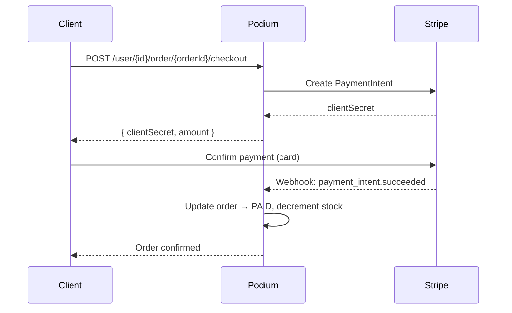
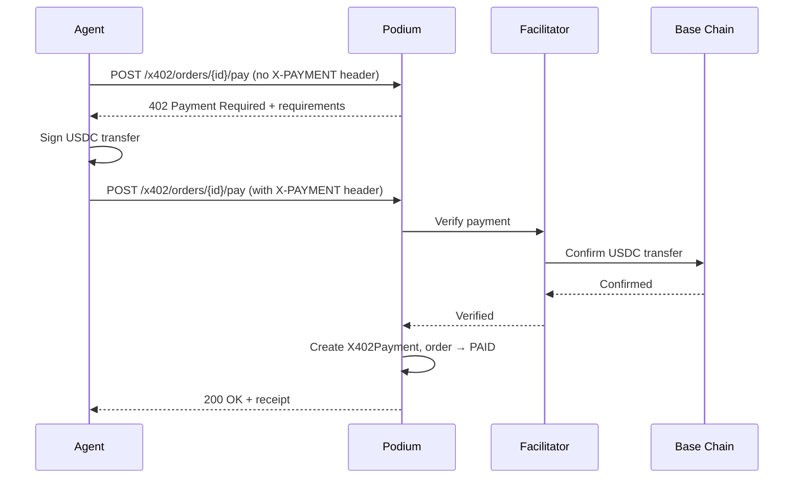

Podium supports four payment methods. This page covers how each one works, the webhook events that drive them, and how creators get paid through Stripe Connect.

## Payment Methods at a Glance

| Method | Flow | Settlement | When to Use |
|--------|------|------------|-------------|
| **Stripe** | PaymentIntent → card → webhook confirms | Fiat (USD) | Consumer web/mobile apps |
| **x402** | HTTP 402 → signed USDC transfer → on-chain verify | USDC on Base | Agent-to-agent, autonomous |
| **Embedded Wallet** | Server-side USDC transfer → txHash submitted | USDC on Base | Automated checkout via Privy |
| **Coinbase** | Coinbase Commerce charge → webhook confirms | Multi-token | Crypto-native consumers |

---

## Stripe Payments

### Payment Intent Flow



### Creating a PaymentIntent

```bash
curl -X POST https://api.podiumcommerce.xyz/api/v1/user/{userId}/order/{orderId}/checkout \
  -H "Authorization: Bearer YOUR_API_KEY" \
  -H "Content-Type: application/json" \
  -d '{ "points": 0 }'
```

**Response:**

```json
{
  "intentId": "pi_3abc123",
  "clientSecret": "pi_3abc123_secret_xyz",
  "status": "requires_payment_method",
  "amount": 2500
}
```

The `amount` reflects the order total minus any points discount, plus shipping fees. If a PaymentIntent already exists for this order and the points amount hasn't changed, the existing intent is returned. If points changed, the old intent is cancelled and replaced.

### Frontend Integration

Use the `clientSecret` with Stripe.js or Stripe Elements:

```typescript
import { loadStripe } from "@stripe/stripe-js";

const stripe = await loadStripe("pk_live_...");

const { error } = await stripe.confirmCardPayment(clientSecret, {
  payment_method: {
    card: cardElement,
    billing_details: { name: "Jane Doe" },
  },
});
```

### Shipping + Payment Amount Updates

When a shipping quote is requested, the shipping fee is added to the order and the Stripe PaymentIntent amount is updated automatically:

```bash
# This updates both the order shippingFee AND the Stripe PaymentIntent amount
curl -X POST https://api.podiumcommerce.xyz/api/v1/order/{orderId}/shipping/quote \
  -H "Authorization: Bearer YOUR_API_KEY" \
  -H "Content-Type: application/json" \
  -d '{ "firstName": "Jane", "lastName": "Doe", "address": { ... } }'
```

---

## Stripe Webhooks

Podium listens for these Stripe webhook events:

| Endpoint | Stripe Event | What Happens |
|----------|-------------|--------------|
| `/webhooks/stripe/payment-intent/succeeded` | `payment_intent.succeeded` | Order → `PAID`, stock decremented, confirmation email sent |
| `/webhooks/stripe/payment-intent/processing` | `payment_intent.processing` | Order → `PAYMENT_PENDING` |
| `/webhooks/stripe/payment-intent/payment-failed` | `payment_intent.payment_failed` | Order → `PAYMENT_FAILED` |
| `/webhooks/stripe/transfer/created` | `transfer.created` | Creator payout recorded |
| `/webhooks/stripe/account/updated` | `account.updated` | Connect account status updated |

All webhook endpoints verify the Stripe signature before processing.

---

## Stripe Connect (Creator Payouts)

Creators receive their share of each sale through Stripe Connect. The platform retains an application fee (`STRIPE_PLATFORM_APPLICATION_FEE_BPS`) on each transaction.

### Onboarding a Creator

```bash
curl -X POST https://api.podiumcommerce.xyz/api/v1/creator/id/{creatorId}/stripe/account \
  -H "Authorization: Bearer YOUR_API_KEY"
```

Creates a Stripe Connect account for the creator. Returns an account link URL for the creator to complete onboarding (identity verification, bank details).

### Payout Flow

<Steps>
  <Step title="Payment Received">
    When a customer's payment succeeds, Stripe holds the funds.
  </Step>
  <Step title="Application Fee Deducted">
    The platform fee (configurable in BPS) is automatically deducted.
  </Step>
  <Step title="Transfer to Creator">
    Stripe creates a transfer to the creator's Connect account. The `transfer.created` webhook records this in Podium as a `CreatorPayout`.
  </Step>
  <Step title="Creator Payout">
    Funds are deposited to the creator's bank account on Stripe's standard payout schedule.
  </Step>
</Steps>

---

## x402 Payments (USDC on Base)

Machine-native payments using the HTTP 402 protocol. Agents pay with USDC — no authentication, no card entry, no human interaction. See [x402 Protocol Deep Dive](/agentic/x402-payments) for the full specification.

### Payment Flow



### Payment Requirements Response (402)

When called without an `X-PAYMENT` header:

```json
{
  "x402Version": 1,
  "schemes": ["exact"],
  "network": "base",
  "payTo": "0x742d35Cc6634C0532925a3b844Bc9e7595f2bD1e",
  "maxAmountRequired": "25000000",
  "asset": "0x833589fCD6eDb6E08f4c7C32D4f71b54bdA02913",
  "resource": "https://api.podiumcommerce.xyz/api/v1/x402/orders/clx9order001/pay"
}
```

| Field | Description |
|-------|-------------|
| `payTo` | The organization's x402 receiving address |
| `maxAmountRequired` | Amount in USDC atomic units (6 decimals, so `25000000` = $25.00) |
| `asset` | USDC contract address on Base |
| `network` | `base` |

### X402Payment Model

| Field | Type | Description |
|-------|------|-------------|
| `id` | integer | Auto-increment ID |
| `orderId` | string | Linked order (unique) |
| `txHash` | string? | On-chain transaction hash (unique) |
| `network` | string | Network (e.g., `base`) |
| `asset` | string | Token contract address |
| `amount` | string | USDC amount (string for precision) |
| `payTo` | string | Receiving address |
| `status` | enum | `PENDING` → `VERIFIED` → `SETTLED` or `FAILED` |
| `settlementData` | object? | Facilitator settlement metadata |

---

## Embedded Wallet Checkout

For automated crypto checkout using Privy server-managed wallets:

```bash
curl -X PATCH https://api.podiumcommerce.xyz/api/v1/user/{userId}/order/{orderId}/checkout/embedded-wallet \
  -H "Authorization: Bearer YOUR_API_KEY" \
  -H "Content-Type: application/json" \
  -d '{
    "txHash": "0xabc123...",
    "amount": "25.00",
    "email": "user@example.com",
    "shippingAddress": null,
    "walletAddress": "0x1234567890abcdef...",
    "chain": "BASE",
    "asset": "USDC"
  }'
```

### How It Works

1. Your backend uses the Privy SDK to initiate a USDC transfer from the user's embedded wallet
2. Wait for on-chain confirmation
3. Submit the `txHash` to this endpoint
4. Podium creates a `CryptoPaymentIntent` (status `CONFIRMED`), moves order to `PAID`, decrements stock
5. `OrderConfirmationEvent` fires if email is provided

### Request Schema

| Field | Type | Required | Description |
|-------|------|----------|-------------|
| `txHash` | string | Yes | On-chain transaction hash |
| `amount` | string | Yes | Payment amount |
| `email` | string | Yes | Notification email |
| `shippingAddress` | object? | No | Shipping address (nullable for digital goods) |
| `walletAddress` | string | Yes | Ethereum address (validated) |
| `chain` | enum | Yes | `BASE` |
| `asset` | enum | Yes | `USDC` |

---

## Coinbase Commerce

Multi-token crypto checkout via Coinbase Commerce:

```bash
curl -X PATCH https://api.podiumcommerce.xyz/api/v1/user/{userId}/order/{orderId}/checkout/coinbase \
  -H "Authorization: Bearer YOUR_API_KEY" \
  -H "Content-Type: application/json" \
  -d '{
    "callsId": "coinbase_charge_abc123",
    "amount": "25.00",
    "customer": {
      "email": "user@example.com",
      "physicalAddress": {
        "address1": "123 Main St",
        "address2": null,
        "city": "San Francisco",
        "state": "CA",
        "postalCode": "94102",
        "countryCode": "US",
        "name": {
          "firstName": "Jane",
          "familyName": "Doe"
        }
      }
    }
  }'
```

Creates a `CoinbasePayment` record (status `PENDING`), updates order to `PAID`, decrements stock, and sends confirmation.

---

## Payment Models

| Model | Purpose | Status Values |
|-------|---------|---------------|
| `StripePaymentIntent` | Links Stripe intents to orders | Stripe-managed (`requires_payment_method`, `succeeded`, etc.) |
| `X402Payment` | x402 protocol payment records | `PENDING` → `VERIFIED` → `SETTLED` / `FAILED` |
| `CryptoPaymentIntent` | Embedded wallet payments | `PENDING` → `CONFIRMED` |
| `CoinbasePayment` | Coinbase Commerce records | `PENDING` → `COMPLETED` |
| `StripeAccount` | Creator Stripe Connect accounts | Stripe-managed |
| `StripeCustomer` | User Stripe customer mappings | — |
| `CreatorPayout` | Transfer records for creator payouts | Created on `transfer.created` webhook |

---

## Endpoint Summary

| Method | Path | Description |
|--------|------|-------------|
| `POST` | `/user/{id}/order/{orderId}/checkout` | Stripe checkout (returns clientSecret) |
| `PATCH` | `/user/{id}/order/{orderId}/checkout/embedded-wallet` | Embedded wallet checkout |
| `PATCH` | `/user/{id}/order/{orderId}/checkout/coinbase` | Coinbase checkout |
| `POST` | `/x402/orders/{id}/pay` | x402 USDC payment |
| `POST` | `/guest/order/{id}/checkout` | Guest Stripe checkout |
| `PATCH` | `/guest/order/{id}/checkout/coinbase` | Guest Coinbase checkout |
| `POST` | `/creator/id/{creatorId}/stripe/account` | Create Stripe Connect account |
| `POST` | `/webhooks/stripe/payment-intent/succeeded` | Payment success webhook |
| `POST` | `/webhooks/stripe/payment-intent/processing` | Payment processing webhook |
| `POST` | `/webhooks/stripe/payment-intent/payment-failed` | Payment failure webhook |
| `POST` | `/webhooks/stripe/transfer/created` | Creator payout webhook |
| `POST` | `/webhooks/stripe/account/updated` | Connect account webhook |
