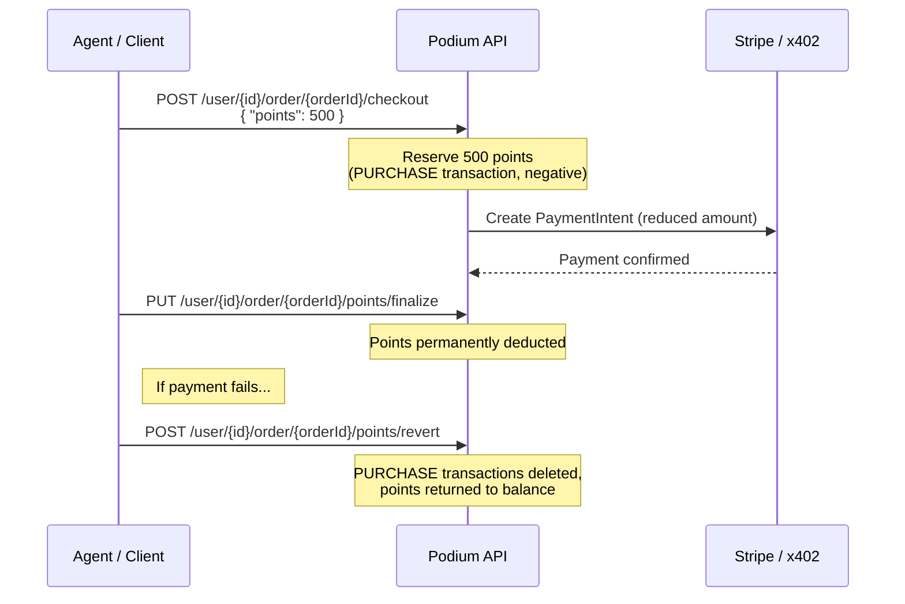

## Overview

Podium includes a programmable points ledger. Points are earned through purchases, campaign participation, API grants, and reward interactions. They can be spent on order discounts, reward redemption, and token presales.

Points are scoped to your organization and optionally to a specific creator within it. This lets brands offer creator-specific loyalty programs while maintaining a unified points balance.

## Earning Points

### Via API (Agent/Programmatic)

Grant or deduct points directly. This is the primary method for companion agents and backend automations.

<CodeGroup>

```bash cURL
curl -X POST https://api.podiumcommerce.xyz/api/v1/user/clxyz1234567890/points \
  -H "Authorization: Bearer $PODIUM_API_KEY" \
  -H "Content-Type: application/json" \
  -d '{
    "amount": 100,
    "creatorId": "clcreator_abc",
    "details": {
      "source": "beauty-companion",
      "action": "survey-completed",
      "campaignId": "clcamp_xyz"
    }
  }'
```

```typescript SDK
await podium.points.grant("clxyz1234567890", {
  amount: 100,
  creatorId: "clcreator_abc",
  details: {
    source: "beauty-companion",
    action: "survey-completed"
  }
});
```

</CodeGroup>

| Field | Type | Required | Description |
|-------|------|----------|-------------|
| `amount` | integer | Yes | Non-zero integer. Positive = earn, negative = deduct |
| `creatorId` | string | No | Scope to a specific creator |
| `details` | object | No | Arbitrary metadata stored with the transaction |

The `details` object is stored verbatim with the `PointTransaction` record for audit and analytics. A `points-received` QStash event is published on successful grants.

### Via Purchase

When a product has `pointEligible: true`, purchases automatically earn points based on the creator's `pointsPerDollar` configuration. The earning happens as part of the `purchase-processed` event handler.

### Via Campaign Completion

Campaign rewards are configured per-campaign via the `CampaignReward` model (see [Campaigns](/api-reference/campaigns)). Points are awarded automatically when a user completes their `CampaignJourney` — after voting, submitting a survey, or completing UGC.

## Transaction Types

| Type | Direction | Source |
|------|-----------|--------|
| `API` | Earn or Spend | Programmatic grants/deductions via the API |
| `CAMPAIGN` | Earn | Campaign participation rewards |
| `PURCHASE` | Earn | Purchase rewards (based on creator's `pointsPerDollar`) |
| `NFT_REDEMPTION` | Spend | Redeeming on-chain rewards |
| `PRESALE` | Spend | Token presale purchases |

## Spending Points at Checkout

Points can be applied as a discount during the checkout flow using a **two-phase commit** pattern that prevents points from being spent on failed orders.



### Step 1: Apply Points During Checkout

```bash
curl -X POST https://api.podiumcommerce.xyz/api/v1/user/clxyz1234567890/order/clord_xyz/checkout \
  -H "Authorization: Bearer $PODIUM_API_KEY" \
  -H "Content-Type: application/json" \
  -d '{ "points": 500 }'
```

This reserves 500 points against the order and reduces the payment amount accordingly. The points value is deducted from the order total before creating the PaymentIntent.

### Step 2a: Finalize (Payment Succeeded)

```bash
curl -X PUT https://api.podiumcommerce.xyz/api/v1/user/clxyz1234567890/order/clord_xyz/points/finalize \
  -H "Authorization: Bearer $PODIUM_API_KEY"
```

Commits the point reservation. After this call, the points are permanently deducted and cannot be reverted.

### Step 2b: Revert (Payment Failed)

```bash
curl -X POST https://api.podiumcommerce.xyz/api/v1/user/clxyz1234567890/order/clord_xyz/points/revert \
  -H "Authorization: Bearer $PODIUM_API_KEY"
```

Deletes the `PURCHASE` point transactions for the order and returns the points to the user's balance. This only works on orders in `OPEN` status.

<Warning>
  Always finalize or revert points after payment completes. Leaving points in a reserved state causes balance inconsistencies.
</Warning>

## Get Points Balance

<CodeGroup>

```bash cURL
curl https://api.podiumcommerce.xyz/api/v1/user/clxyz1234567890/points \
  -H "Authorization: Bearer $PODIUM_API_KEY"
```

```typescript SDK
const balance = await podium.points.getBalance("clxyz1234567890");
```

</CodeGroup>

```json
{
  "balance": 2500,
  "creatorBalances": [
    { "creatorId": "clcreator_abc", "balance": 1500 },
    { "creatorId": "clcreator_def", "balance": 1000 }
  ]
}
```

Optionally scope to a single creator: `?creatorId=clcreator_abc`.

## Points Transaction History

<CodeGroup>

```bash cURL
curl "https://api.podiumcommerce.xyz/api/v1/user/clxyz1234567890/points/history?page=1&limit=20" \
  -H "Authorization: Bearer $PODIUM_API_KEY"
```

```typescript SDK
const history = await podium.points.getHistory("clxyz1234567890", {
  page: 1,
  limit: 20,
  creatorId: "clcreator_abc"
});
```

</CodeGroup>

### Query Parameters

| Param | Type | Description |
|-------|------|-------------|
| `page` | integer | Page number (1-indexed) |
| `limit` | integer | Items per page |
| `creatorId` | string | Filter to a specific creator |

### Response

```json
{
  "data": [
    {
      "id": 1234,
      "userId": "clxyz1234567890",
      "amount": 100,
      "type": "API",
      "creatorId": "clcreator_abc",
      "createdAt": "2026-03-07T12:00:00.000Z",
      "details": {
        "source": "beauty-companion",
        "action": "survey-completed"
      }
    },
    {
      "id": 1235,
      "userId": "clxyz1234567890",
      "amount": -500,
      "type": "PURCHASE",
      "creatorId": null,
      "createdAt": "2026-03-07T14:30:00.000Z",
      "orderId": "clord_xyz"
    }
  ],
  "pagination": {
    "page": 1,
    "limit": 20,
    "total": 47
  }
}
```

## PointTransaction Model

| Field | Type | Description |
|-------|------|-------------|
| `id` | integer | Auto-increment ID |
| `userId` | string | User CUID |
| `amount` | integer | Points amount (positive = earn, negative = spend) |
| `type` | enum | `API`, `CAMPAIGN`, `PURCHASE`, `NFT_REDEMPTION`, `PRESALE` |
| `creatorId` | string \| null | Creator scope (null = org-wide) |
| `createdAt` | datetime | Transaction timestamp |
| `organizationId` | string | Parent organization |

### Linked Transaction Records

Each `PointTransaction` may have one linked detail record depending on the source:

| Linked Model | Transaction Type | Contains |
|-------------|-----------------|----------|
| `ApiPointTransaction` | `API` | `details` metadata object |
| `CampaignRewardTransaction` | `CAMPAIGN` | `journeyId`, campaign reference |
| `UserOrderTransaction` | `PURCHASE` | `orderId`, order reference |
| `NftRedemptionTransaction` | `NFT_REDEMPTION` | reward reference |
| `PresaleRewardTransaction` | `PRESALE` | presale reference |

## Endpoint Summary

| Method | Path | Description |
|--------|------|-------------|
| `GET` | `/user/{id}/points` | Get balance (optional `?creatorId=`) |
| `POST` | `/user/{id}/points` | Grant/deduct points |
| `GET` | `/user/{id}/points/history` | Transaction history (paginated) |
| `POST` | `/user/{id}/order/{orderId}/checkout` | Apply points at checkout |
| `PUT` | `/user/{id}/order/{orderId}/points/finalize` | Commit point spend |
| `POST` | `/user/{id}/order/{orderId}/points/revert` | Revert point spend |
