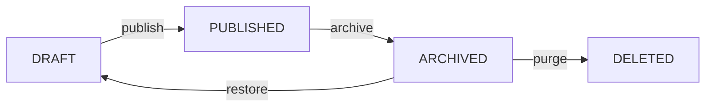

Products are the core commerce entity. They support configurable attribute variants (size, color, etc.), media attachments, category organization, and per-creator assignment. All products belong to a creator's storefront and go through a `DRAFT → PUBLISHED → ARCHIVED` lifecycle.

## Base Path

Creator product endpoints use `/api/v1/creator/id/{creatorId}/product`. Public listing uses `/api/v1/products`.

## Create a Product

<CodeGroup>

```bash cURL
curl -X POST https://api.podiumcommerce.xyz/api/v1/creator/id/{creatorId}/product \
  -H "Authorization: Bearer YOUR_API_KEY" \
  -H "Content-Type: application/json" \
  -d '{
    "name": "Organic Face Serum",
    "slug": "organic-face-serum",
    "description": "Lightweight hydrating serum with hyaluronic acid and vitamin C",
    "price": 2500,
    "maxDiscount": 500,
    "media": [
      {
        "url": "https://cdn.example.com/serum-front.jpg",
        "type": "IMAGE",
        "order": 0
      },
      {
        "url": "https://cdn.example.com/serum-texture.jpg",
        "type": "IMAGE",
        "order": 1
      }
    ]
  }'
```

```typescript SDK
import { createPodiumClient } from '@podiumcommerce/node-sdk'

const client = createPodiumClient({ apiKey: process.env.PODIUM_API_KEY })

const product = await client.merchantProducts.create({
  creatorId,
  requestBody: {
    name: "Organic Face Serum",
    slug: "organic-face-serum",
    description: "Lightweight hydrating serum with hyaluronic acid and vitamin C",
    price: 2500,
    maxDiscount: 500,
    media: [
      { url: "https://cdn.example.com/serum-front.jpg", type: "IMAGE", order: 0 },
      { url: "https://cdn.example.com/serum-texture.jpg", type: "IMAGE", order: 1 },
    ],
  },
})
```

</CodeGroup>

**Response:**

```json
{
  "id": "clx9prod001",
  "name": "Organic Face Serum",
  "slug": "organic-face-serum",
  "description": "Lightweight hydrating serum with hyaluronic acid and vitamin C",
  "price": 2500,
  "currency": "USD",
  "supply": null,
  "maxDiscount": 500,
  "status": "DRAFT",
  "pointEligibility": "ELIGIBLE",
  "media": [
    { "id": 1, "url": "https://cdn.example.com/serum-front.jpg", "type": "IMAGE", "order": 0 },
    { "id": 2, "url": "https://cdn.example.com/serum-texture.jpg", "type": "IMAGE", "order": 1 }
  ],
  "attributes": [],
  "createdAt": "2026-03-07T10:00:00Z"
}
```

### Create Product Schema

| Field | Type | Required | Description |
|-------|------|----------|-------------|
| `name` | string | Yes | Product name |
| `slug` | string | Yes | URL-friendly identifier (unique per creator) |
| `description` | string | Yes | Product description |
| `price` | integer | Yes | Price in **cents** (e.g., `2500` = $25.00) |
| `maxDiscount` | integer | Yes | Maximum discount in cents (0–10000) |
| `allowedPointSources` | string[]? | No | Point source types allowed for discounts |
| `media` | array | Yes | 1–5 media items (see Media below) |

---

## Update a Product

`PATCH` merges the provided fields into the existing product. This endpoint also handles attributes, media, supply, shipping config, and point eligibility.

```bash
curl -X PATCH https://api.podiumcommerce.xyz/api/v1/creator/id/{creatorId}/product/{productId} \
  -H "Authorization: Bearer YOUR_API_KEY" \
  -H "Content-Type: application/json" \
  -d '{
    "description": "Updated description with new ingredients list",
    "supply": 200,
    "pointEligibility": "ELIGIBLE",
    "shippingType": "STANDARD",
    "attributes": [
      {
        "name": "Size",
        "type": "VARIANT",
        "variants": [
          { "value": "30ml", "price": 2500, "supply": 100, "order": 0 },
          { "value": "50ml", "price": 3500, "supply": 50, "order": 1 },
          { "value": "100ml", "price": 5000, "supply": 50, "order": 2 }
        ]
      }
    ]
  }'
```

### Update Schema (all fields optional)

| Field | Type | Description |
|-------|------|-------------|
| `name` | string | Product name |
| `description` | string | Product description |
| `price` | integer | Base price in cents |
| `supply` | integer | Total inventory (`null` for unlimited) |
| `logo` | string | Product logo/thumbnail URL |
| `pointEligibility` | enum | `ELIGIBLE` or `INELIGIBLE` |
| `shippingType` | enum | Shipping method |
| `subcategoryId` | integer | Category assignment |
| `attributes` | array | Attribute variants (replaces existing) |
| `media` | array | Media items (replaces existing) |

---

## Media

Each product requires 1–5 media items. The first item (order `0`) is the hero image.

| Field | Type | Required | Description |
|-------|------|----------|-------------|
| `url` | string | Yes | Media URL |
| `type` | enum | Yes | `IMAGE` or `VIDEO` |
| `order` | integer | Yes | Display order (0-indexed, must be unique) |

---

## Attribute Variants

Products support configurable attributes for variant selection. Each attribute has a name, type, and array of variants with independent pricing and inventory.

```json
{
  "attributes": [
    {
      "name": "Size",
      "type": "VARIANT",
      "variants": [
        { "value": "30ml", "price": 2500, "supply": 100, "order": 0 },
        { "value": "50ml", "price": 3500, "supply": 50, "order": 1 },
        { "value": "100ml", "price": 5000, "supply": 50, "order": 2 }
      ]
    },
    {
      "name": "Color",
      "type": "VARIANT",
      "variants": [
        { "value": "Natural", "price": 2500, "supply": 50, "order": 0 },
        { "value": "Fair", "price": 2500, "supply": 30, "order": 1 }
      ]
    }
  ]
}
```

Each variant has its own `price` (in cents, replaces the base price when selected) and independent `supply` tracking. When a user selects variants at checkout, the `selectedAttributes` are stored on the order item.

### Variant Schema

| Field | Type | Required | Description |
|-------|------|----------|-------------|
| `value` | string | Yes | Display value (e.g., "30ml", "Red") |
| `price` | integer | Yes | Price in cents when this variant is selected |
| `supply` | integer | No | Inventory for this variant |
| `order` | integer | Yes | Display order |

---

## Product Lifecycle

Products move through three statuses:



### Publish a Product

Transitions a `DRAFT` product to `PUBLISHED`, making it visible in public listings.

```bash
curl -X POST https://api.podiumcommerce.xyz/api/v1/creator/id/{creatorId}/product/{productId}/publish \
  -H "Authorization: Bearer YOUR_API_KEY"
```

### Restore an Archived Product

Returns an `ARCHIVED` product to `DRAFT` status.

```bash
curl -X POST https://api.podiumcommerce.xyz/api/v1/creator/id/{creatorId}/product/{productId}/restore \
  -H "Authorization: Bearer YOUR_API_KEY"
```

### Purge a Product

Permanently deletes an `ARCHIVED` product. This is irreversible.

```bash
curl -X POST https://api.podiumcommerce.xyz/api/v1/creator/id/{creatorId}/product/{productId}/purge \
  -H "Authorization: Bearer YOUR_API_KEY"
```

---

## Get and List Products

### Get a Single Product

```bash
curl https://api.podiumcommerce.xyz/api/v1/creator/id/{creatorId}/product/{productId} \
  -H "Authorization: Bearer YOUR_API_KEY"
```

Returns the product with all attributes, media, and variant details. Works for products in any status (`DRAFT`, `PUBLISHED`, `ARCHIVED`).

### Get Product by Slug

```bash
curl https://api.podiumcommerce.xyz/api/v1/creator/id/{creatorId}/product/slug/{slug} \
  -H "Authorization: Bearer YOUR_API_KEY"
```

### List Creator Products

```bash
curl https://api.podiumcommerce.xyz/api/v1/creator/id/{creatorId}/products \
  -H "Authorization: Bearer YOUR_API_KEY"
```

Returns all products for a creator with aggregated sales counts.

### List Published Products (Public)

```bash
curl "https://api.podiumcommerce.xyz/api/v1/products?categories=serum,moisturizer&limit=20&cursor=clx9prod050"
```

Public endpoint — no authentication required. Returns only `PUBLISHED` products. Supports cursor-based pagination and category filtering.

### Delete (Archive) a Product

```bash
curl -X DELETE https://api.podiumcommerce.xyz/api/v1/creator/id/{creatorId}/product/{productId} \
  -H "Authorization: Bearer YOUR_API_KEY"
```

Moves the product to `ARCHIVED` status. Use `/restore` to bring it back, or `/purge` to permanently delete.

---

## Buy Now

A shortcut endpoint that creates an order and optionally initiates Stripe checkout in a single request:

```bash
curl -X POST https://api.podiumcommerce.xyz/api/v1/product/{productId}/buy-now \
  -H "Content-Type: application/json" \
  -d '{
    "quantity": 1,
    "variantIds": ["clx9var001"],
    "shouldUseStripe": true
  }'
```

| Field | Type | Default | Description |
|-------|------|---------|-------------|
| `quantity` | integer | — | Number of items (min 1) |
| `variantIds` | string[] | `[]` | Selected variant IDs |
| `shouldUseStripe` | boolean | `true` | If true, creates Stripe PaymentIntent |

---

## Analytics

### Product Analytics

```bash
curl https://api.podiumcommerce.xyz/api/v1/creator/id/{creatorId}/product/{productId}/analytics \
  -H "Authorization: Bearer YOUR_API_KEY"
```

### Aggregate Product Analytics

```bash
curl https://api.podiumcommerce.xyz/api/v1/creator/id/{creatorId}/products/analytics \
  -H "Authorization: Bearer YOUR_API_KEY"
```

### Sales Data

```bash
curl https://api.podiumcommerce.xyz/api/v1/creator/id/{creatorId}/products/sales \
  -H "Authorization: Bearer YOUR_API_KEY"
```

---

## Categories

```bash
curl https://api.podiumcommerce.xyz/api/v1/categories
```

Returns all product categories. No authentication required.

---

## Product Model

| Field | Type | Description |
|-------|------|-------------|
| `id` | string | CUID2 identifier |
| `name` | string | Product name |
| `description` | string | Product description |
| `price` | integer | Base price in cents |
| `supply` | integer? | Inventory count (`null` for unlimited) |
| `maxDiscount` | integer | Maximum applicable discount in cents |
| `status` | enum | `DRAFT`, `PUBLISHED`, `ARCHIVED` |
| `slug` | string | URL-friendly identifier |
| `pointEligibility` | enum | `ELIGIBLE` or `INELIGIBLE` |
| `shippingType` | enum? | Shipping method |
| `logo` | string? | Product thumbnail URL |
| `subcategoryId` | integer? | Category reference |
| `shopifyProductId` | string? | Linked Shopify product (if synced) |
| `media` | array | Attached media items |
| `attributes` | array | Configurable attribute variants |
| `createdAt` | datetime | Creation timestamp |
| `updatedAt` | datetime | Last update timestamp |

## Endpoint Summary

| Method | Path | Description |
|--------|------|-------------|
| `POST` | `/creator/id/{creatorId}/product` | Create a product |
| `GET` | `/creator/id/{creatorId}/product/{productId}` | Get product by ID |
| `PATCH` | `/creator/id/{creatorId}/product/{productId}` | Update product |
| `DELETE` | `/creator/id/{creatorId}/product/{productId}` | Archive product |
| `POST` | `/creator/id/{creatorId}/product/{productId}/publish` | Publish product |
| `POST` | `/creator/id/{creatorId}/product/{productId}/restore` | Restore archived |
| `POST` | `/creator/id/{creatorId}/product/{productId}/purge` | Permanently delete |
| `GET` | `/creator/id/{creatorId}/product/slug/{slug}` | Get by slug |
| `GET` | `/creator/id/{creatorId}/products` | List creator products |
| `GET` | `/creator/id/{creatorId}/product/{productId}/analytics` | Product analytics |
| `GET` | `/creator/id/{creatorId}/products/analytics` | Aggregate analytics |
| `GET` | `/creator/id/{creatorId}/products/sales` | Sales data |
| `GET` | `/products` | List published products (public) |
| `POST` | `/product/{productId}/buy-now` | Buy now shortcut |
| `GET` | `/categories` | List all categories |
