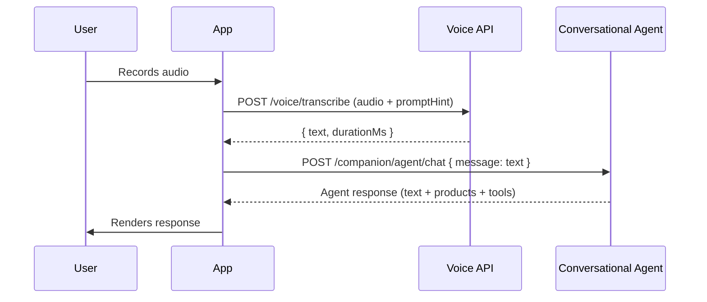

Voice transcription gives your agent or app the ability to accept spoken input and convert it to text. Audio is processed in real time and **never stored** -- a privacy-first design that makes it safe for sensitive conversations.

## Endpoint

<ParamField path="POST" query="/api/v1/voice/transcribe">
  Accepts `multipart/form-data` with an audio file and returns a text transcript.
</ParamField>

## Request

Send a `multipart/form-data` request with the following fields:

| Field | Type | Required | Description |
|---|---|---|---|
| `userId` | string (cuid2) | Yes | The Podium user ID for rate-limit tracking |
| `audio` | File (binary) | Yes | Audio recording blob. Max **10 MB** |
| `promptHint` | string | No | Domain-specific vocabulary hint (max 500 chars). Improves accuracy for product names, technical terms, or industry jargon |
| `language` | string | No | ISO 639-1 language code. Defaults to `"en"` |

### Supported Audio Formats

| MIME Type | Extension | Common Source |
|---|---|---|
| `audio/webm` | `.webm` | Browser MediaRecorder (Chrome, Firefox) |
| `audio/mp4` | `.mp4` | Safari MediaRecorder, native iOS |
| `audio/mpeg` | `.mp3` | Pre-recorded files |
| `audio/ogg` | `.ogg` | Firefox MediaRecorder |
| `audio/wav` | `.wav` | Desktop recording tools |
| `audio/m4a` | `.m4a` | iOS voice memos |

## Response

```json
{
  "text": "I'm looking for a gentle moisturizer for sensitive skin",
  "durationMs": 1240
}
```

| Field | Type | Description |
|---|---|---|
| `text` | string | The transcribed text from the audio |
| `durationMs` | number | Server-side processing time in milliseconds |

## Rate Limits

Voice transcription is rate-limited per user to prevent abuse:

- **20 requests per user per hour** (fixed window)
- On limit exceeded, the endpoint returns `429` with a clear message
- If the rate-limit service is temporarily unavailable, requests are **allowed through** (fail-open)

## Error Responses

| Status | Condition |
|---|---|
| `400` | Missing `userId`, invalid cuid format, missing audio file, or unsupported MIME type |
| `413` | Audio file exceeds the 10 MB size limit |
| `429` | Rate limit exceeded (20 requests/hour per user) |
| `500` | Transcription service error |

## SDK Example

```typescript
import { createPodiumClient } from '@podium-sdk/node-sdk';

const client = createPodiumClient({ apiKey: process.env.PODIUM_API_KEY });

// Voice transcription uses multipart/form-data, so call via fetch
const formData = new FormData();
formData.append('userId', userId);
formData.append('audio', audioBlob, 'recording.webm');
formData.append('promptHint', 'skincare, retinol, niacinamide, hyaluronic acid');
formData.append('language', 'en');

const response = await fetch(
  'https://api.podium.build/api/v1/voice/transcribe',
  {
    method: 'POST',
    headers: { Authorization: `Bearer ${process.env.PODIUM_API_KEY}` },
    body: formData,
  }
);

const { text, durationMs } = await response.json();
// Feed the transcript into the conversational agent
const agentResponse = await client.companion.chat({
  userId,
  message: text,
});
```

## Using `promptHint` for Accuracy

The `promptHint` field lets you supply domain-specific vocabulary that improves transcription quality. This is especially useful when users mention product names, brand names, or technical terms that may not be in the default vocabulary.

```typescript
// Beauty / skincare context
formData.append('promptHint', 'CeraVe, La Roche-Posay, tretinoin, ceramides, salicylic acid');

// Wellness / supplements context
formData.append('promptHint', 'ashwagandha, rhodiola, lion\'s mane, magnesium glycinate');

// Fashion context
formData.append('promptHint', 'Jacquemus, Bottega Veneta, bias-cut, raw-edge denim');
```

<Tip>
Keep prompt hints under 500 characters. Focus on proper nouns and technical terms that the transcription model might otherwise misspell or misinterpret.
</Tip>

## Voice-to-Chat Pipeline

Voice transcription is designed to feed directly into the [Conversational Agent](/agentic/conversational-agent). A typical integration looks like:



<Info>
Audio is processed in a single pass and **never persisted** to disk or object storage. The API receives the file, transcribes it, and discards the binary data immediately.
</Info>
