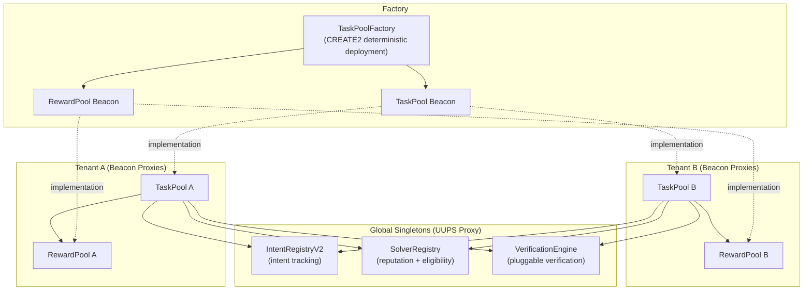

## Overview

Podium's smart contracts handle the trust-critical settlement layer — USDC escrow, task lifecycle, solver reputation, and reward distribution. They're deployed on **Base** (mainnet and Sepolia testnet) and **Arc Testnet**.

The contract system has two generations:

| Generation | Architecture | Contracts | Use Case |
|-----------|-------------|-----------|----------|
| **V1** | Non-upgradeable, single-tenant | IntentRegistry, PodiumOriginSettler, PodiumDestinationSettler | Intent-based reward settlement |
| **V2** | Upgradeable (UUPS + Beacon), multi-tenant | IntentRegistryV2, SolverRegistry, VerificationEngine, TaskPoolFactory, TaskPoolImplementation, RewardPoolImplementation | Task Pool bounty system |

V2 is the active system. V1 contracts remain deployed for backward compatibility.

## V2 Architecture



### Design Principles

**Multi-tenant isolation**: Each Podium organization gets its own `TaskPool + RewardPool` pair, completely isolated. Shared singletons (SolverRegistry, VerificationEngine, IntentRegistryV2) are global.

**Beacon proxy pattern**: All tenant pools share a single implementation via `UpgradeableBeacon`. Upgrading the beacon atomically upgrades every tenant's pool — no per-tenant migration needed.

**CREATE2 determinism**: Tenant pool addresses are computable off-chain before deployment via `computeTaskPoolAddress(tenantId)` and `computeRewardPoolAddress(tenantId)`. This enables pre-funded deployment flows.

**EIP-7201 storage namespacing**: All upgradeable contracts use manually computed storage slots to prevent collisions across proxy upgrades.

**Pull-based payouts**: Rewards are queued via `queuePayout` and claimed by the solver. This avoids push-payment failures and gives solvers control over when they withdraw.

## Proxy Patterns

### UUPS (Universal Upgradeable Proxy Standard)

Used for global singletons that exist once per deployment:

- `IntentRegistryV2`
- `SolverRegistry`
- `VerificationEngine`

Upgrade authorization is in the implementation contract (`_authorizeUpgrade` restricted to owner). Only the contract owner can trigger upgrades.

### Beacon Proxies

Used for per-tenant contracts that share implementation:

- `TaskPoolImplementation` — deployed per-tenant via `TaskPoolFactory`
- `RewardPoolImplementation` — deployed per-tenant alongside TaskPool

The `TaskPoolFactory` owns both `UpgradeableBeacon` instances. Calling `factory.upgradeTaskPool(newImpl)` atomically upgrades all tenant TaskPools.

## Supported Networks

| Network | Chain ID | USDC Address | Use Case |
|---------|----------|-------------|----------|
| **Base Mainnet** | 8453 | `0x833589fCD6eDb6E08f4c7C32D4f71b54bdA02913` | Production |
| **Base Sepolia** | 84532 | MockUSDC (deployed per-environment) | Testnet |
| **Arc Testnet** | — | `0x3600000000000000000000000000000000000000` | Development |

On testnets, a `MockUSDC` contract is deployed with an unrestricted `mint()` function for test setup.

## Contract Inheritance

```
Non-Upgradeable (V1):
├── IntentRegistry         → Ownable
├── PodiumOriginSettler    → Ownable, ReentrancyGuard
└── PodiumDestinationSettler → Ownable, ReentrancyGuard

UUPS Singletons (V2):
├── IntentRegistryV2       → Initializable, OwnableUpgradeable, UUPSUpgradeable
├── SolverRegistry         → Initializable, OwnableUpgradeable, UUPSUpgradeable
└── VerificationEngine     → Initializable, OwnableUpgradeable, UUPSUpgradeable

Beacon Implementations (V2):
├── TaskPoolImplementation   → Initializable, OwnableUpgradeable, ReentrancyGuard
└── RewardPoolImplementation → Initializable, OwnableUpgradeable, ReentrancyGuard

Factory (V2):
└── TaskPoolFactory          → Ownable (owns both UpgradeableBeacons)
```

All V2 contracts are built with **Solidity 0.8.24**, **OpenZeppelin v5.5.0**, and target the **Cancun** EVM version.

## Repository

```
smart-contracts-podium/
├── src/                    # Solidity contracts
│   ├── HelloArchitect.sol  # Smoke test contract
│   ├── MockUSDC.sol        # Testnet ERC-20
│   ├── IntentRegistry.sol  # V1 registry
│   ├── PodiumOriginSettler.sol     # V1 origin
│   ├── PodiumDestinationSettler.sol # V1 destination
│   ├── IntentRegistryV2.sol        # V2 upgradeable registry
│   ├── SolverRegistry.sol          # V2 solver reputation
│   ├── VerificationEngine.sol      # V2 verification oracle
│   ├── TaskPoolImplementation.sol  # V2 per-tenant escrow
│   ├── RewardPoolImplementation.sol # V2 per-tenant rewards
│   └── TaskPoolFactory.sol         # V2 multi-tenant factory
├── test/                   # 12 test files, comprehensive coverage
├── script/                 # Deployment scripts (Deploy.s.sol, DeployV2.s.sol, Upgrade.s.sol)
├── circle-sdk/             # Circle SDK integration for Arc Testnet
└── foundry.toml            # Foundry config (optimizer: 200 runs)
```

<Info>
  Source code: [github.com/kiki-world-01/smart-contracts-podium](https://github.com/kiki-world-01/smart-contracts-podium)
</Info>
