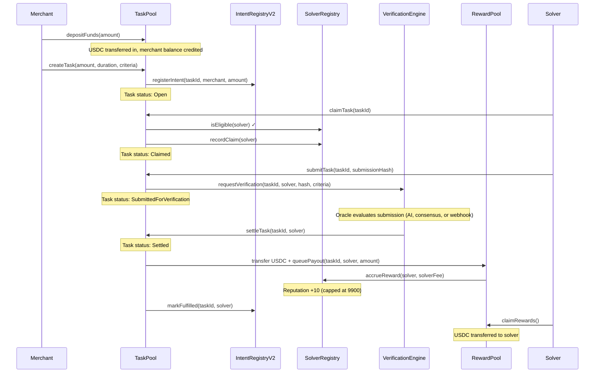
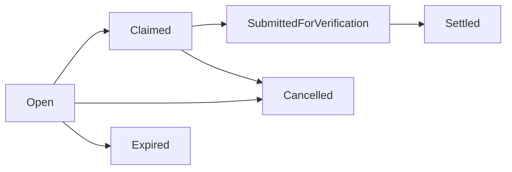

## Overview

The Task Pool V2 system enables on-chain bounty management: merchants deposit USDC, create tasks with acceptance criteria, solvers claim and complete tasks, verification happens through a pluggable engine, and rewards are distributed with a transparent fee structure.

Every Podium organization gets its own `TaskPool + RewardPool` contract pair, deployed as Beacon Proxies through the `TaskPoolFactory`. Global singletons (`SolverRegistry`, `VerificationEngine`, `IntentRegistryV2`) are shared across all tenants.

## Settlement Flow



## Task Lifecycle



| Status | Description |
|--------|-------------|
| `Open` | Task created, accepting solver claims |
| `Claimed` | A solver has committed to completing the task |
| `SubmittedForVerification` | Solver submitted work, awaiting verification |
| `Settled` | Verification passed, reward distributed |
| `Cancelled` | Merchant or platform cancelled the task (funds refunded) |
| `Expired` | Task deadline passed without completion |

### Duration Constraints

- **Minimum**: 5 minutes
- **Maximum**: 7 days

### Task ID Generation

Task IDs are deterministically computed from the creation parameters:

```solidity
keccak256(abi.encodePacked(
    tenantId, merchant, amount,
    block.timestamp, campaignId, totalTasksCreated
))
```

## TaskPoolFactory

The factory deploys per-tenant `TaskPool + RewardPool` pairs using CREATE2 for deterministic addressing.

### Creating Tenant Pools

```solidity
function createTenantPools(
    bytes32 tenantId,     // keccak256(organizationId)
    TenantConfig config   // protocolFeeRecipient, protocolFeeBps, solverFeeBps
) external onlyOwner
```

This deploys two Beacon Proxies:

1. **TaskPool** — initialized with references to USDC, VerificationEngine, SolverRegistry, IntentRegistry, and the RewardPool
2. **RewardPool** — initialized with references to USDC, SolverRegistry, IntentRegistry, the TaskPool, and fee configuration

### Deterministic Addresses

Pre-compute pool addresses before deployment:

```solidity
address taskPool = factory.computeTaskPoolAddress(tenantId);
address rewardPool = factory.computeRewardPoolAddress(tenantId);
```

Salt derivation:
```solidity
taskSalt   = keccak256(abi.encodePacked(tenantId, "task", uint256(0)))
rewardSalt = keccak256(abi.encodePacked(tenantId, "reward", uint256(0)))
```

### Atomic Upgrades

Upgrading the beacon atomically upgrades all tenant pools:

```solidity
factory.upgradeTaskPool(newImplementation);   // All TaskPools upgraded
factory.upgradeRewardPool(newImplementation); // All RewardPools upgraded
```

## TaskPoolImplementation

Per-tenant escrow and task lifecycle contract.

### Key Functions

| Function | Access | Description |
|----------|--------|-------------|
| `depositFunds(amount)` | Any merchant | Transfer USDC in, credit merchant balance |
| `withdrawFunds(amount)` | Merchant | Withdraw from merchant balance |
| `createTask(merchant, amount, duration, campaignId, method, criteria)` | Owner (Podium API) | Create task, register with IntentRegistry |
| `claimTask(taskId)` | Eligible solver | Check SolverRegistry eligibility, record claim |
| `submitTask(taskId, submissionHash)` | Assigned solver | Submit work, route to VerificationEngine |
| `settleTask(taskId, solver)` | VerificationEngine only | Transfer USDC to RewardPool, queue payout |
| `cancelTask(taskId)` | Merchant or owner | Refund escrowed amount to merchant balance |
| `setPaused(bool)` | Owner | Emergency pause: blocks deposits and task creation |

### Merchant Balances

Merchants deposit USDC before creating tasks. Task creation debits the merchant's balance (escrow). Cancellation credits the balance back. This prevents tasks from being created without sufficient funds.

## RewardPoolImplementation

Per-tenant reward distribution with a three-way fee split.

### Fee Structure

| Fee | Default | Recipient | Purpose |
|-----|---------|-----------|---------|
| Protocol fee | 1% (100 bps) | Platform fee recipient | Platform revenue |
| Solver fee | 0.1% (10 bps) | SolverRegistry | Reputation accrual |
| Net payout | 98.9% | Solver | Solver compensation |

Combined fee cap: 10% maximum (enforced on `setFees`).

### Payout Flow

When `TaskPool.settleTask()` is called:

1. USDC is transferred from TaskPool to RewardPool
2. `queuePayout(taskId, solver, grossAmount)` computes the fee split
3. Protocol fee is credited to the fee recipient's pending balance
4. Solver fee is sent to SolverRegistry via `accrueReward()` (updates reputation)
5. Net payout is credited to the solver's pending balance

Solvers and fee recipients call `claimRewards()` to withdraw their accumulated payouts.

### Key Functions

| Function | Access | Description |
|----------|--------|-------------|
| `queuePayout(taskId, solver, grossAmount)` | TaskPool only | Compute fee split, queue pending payout |
| `claimRewards()` | Solver or fee recipient | Withdraw all pending payouts |
| `setFees(protocolFeeBps, solverFeeBps)` | Owner | Update fee structure (capped at 10% combined) |
| `setProtocolFeeRecipient(address)` | Owner | Update fee recipient address |

## SolverRegistry

Global singleton tracking solver identity, eligibility, and reputation.

### Solver Profile

```solidity
struct SolverProfile {
    address solver;
    uint256 registeredAt;
    uint256 totalTasksClaimed;
    uint256 totalTasksCompleted;
    uint256 totalRewardsEarned;
    uint256 reputationScore;  // 0–10000 scale
    bool active;
    bytes metadata;           // IPFS hash of solver credentials
}
```

### Reputation System

- Starts at **5000** on registration
- **+10** per completed task (via `accrueReward`)
- Capped at **9900** (cannot reach 10000)
- No decay mechanism currently — reputation only increases

### Key Functions

| Function | Access | Description |
|----------|--------|-------------|
| `register(metadata)` | Self-registration | Create profile with reputation 5000 |
| `isEligible(solver, taskId)` | View | Active, registered, and not banned |
| `accrueReward(solver, amount)` | Authorized RewardPools | Increment completed tasks, rewards, reputation |
| `recordClaim(solver)` | Any caller | Increment claim count |
| `banSolver(solver)` | Owner | Permanently ban and deactivate |
| `deactivateSolver(solver)` | Owner | Deactivate without banning |

## VerificationEngine

Global singleton routing task completion verification through pluggable strategies.

### Verification Methods

| Method | Description |
|--------|-------------|
| `Consensus` | Multiple parties agree on task completion |
| `Oracle` | Authorized oracle evaluates and resolves |
| `AIEval` | AI oracle evaluates submission against acceptance criteria |

All three methods resolve through the same `resolveVerification(taskId, approved)` callback. The method enum is recorded for provenance but doesn't change the on-chain resolution flow — the intelligence is off-chain in the Podium API backend.

### Flow

1. **TaskPool** calls `requestVerification(taskId, solver, submissionHash, criteria, method)`
2. **Off-chain oracle** (the Podium API) evaluates the submission
3. **Oracle** calls `resolveVerification(taskId, approved)`
4. If approved, VerificationEngine calls `TaskPool.settleTask(taskId, solver)`
5. If rejected, the task remains claimable or can be cancelled

### Key Functions

| Function | Access | Description |
|----------|--------|-------------|
| `requestVerification(taskId, solver, hash, criteria, method)` | Authorized TaskPools | Create pending verification request |
| `resolveVerification(taskId, approved)` | AI oracle or authorized oracles | Resolve request, trigger settlement if approved |
| `addOracle(address)` / `removeOracle(address)` | Owner | Manage authorized oracle addresses |
| `authorizeTaskPool(address)` / `revokeTaskPool(address)` | Owner | Manage which TaskPools can request verification |

## IntentRegistryV2

Global singleton tracking all intents across tenants for observability and analytics.

### Key Differences from V1

- **UUPS upgradeable** (V1 was non-upgradeable)
- **Multiple authorized callers** instead of single `originSettler`
- **Custom errors** instead of require strings
- **EIP-7201 namespaced storage**

### Functions

| Function | Access | Description |
|----------|--------|-------------|
| `registerIntent(intentId, merchant, recipient, amount)` | Authorized callers | Record a new intent |
| `markFulfilled(intentId, solver)` | Authorized callers | Mark intent as fulfilled |
| `addAuthorizedCaller(address)` | Owner | Whitelist a new caller (e.g., new TaskPool) |
| `getAllIntents(offset, limit)` | View | Paginated intent listing |
| `getMerchantIntents(merchant)` | View | Intents by merchant address |
