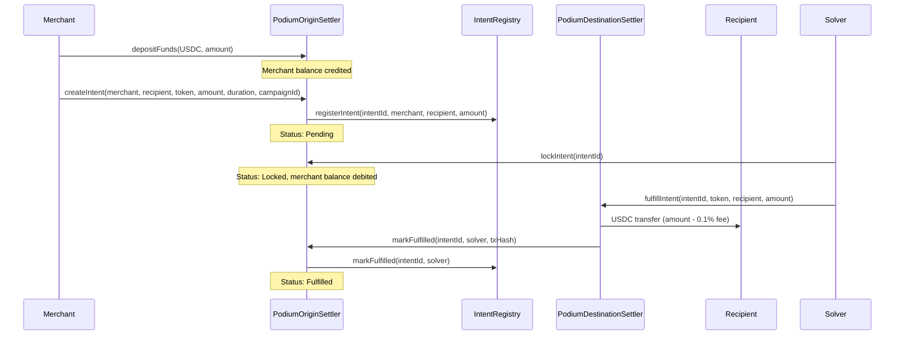

## Overview

The V1 contracts implement an intent-based reward settlement flow. A merchant deposits USDC, the platform creates a reward intent, a solver locks and fulfills it, and the recipient receives funds minus a small solver fee.

V1 contracts are **non-upgradeable** and **single-tenant**. They remain deployed for backward compatibility, but new deployments use the [V2 Task Pool system](/contracts/task-pool).

## Settlement Flow



## IntentRegistry

Central observability ledger tracking all reward intents.

| Function | Access | Description |
|----------|--------|-------------|
| `setOriginSettler(address)` | Owner | Set the authorized writer |
| `registerIntent(intentId, merchant, recipient, amount)` | Origin settler only | Register a new intent |
| `markFulfilled(intentId, solver)` | Origin settler only | Mark as fulfilled |
| `getIntent(intentId)` | View | Get intent details |
| `getMerchantIntents(merchant)` | View | All intents by merchant |
| `getRecipientIntents(recipient)` | View | All intents by recipient |
| `getSolverIntents(solver)` | View | All intents fulfilled by solver |
| `getAllIntents(offset, limit)` | View | Paginated listing |

### IntentRecord

```solidity
struct IntentRecord {
    bytes32 intentId;
    address merchant;
    address recipient;
    uint256 amount;
    uint256 createdAt;
    uint256 fulfilledAt;
    address solver;
    bool fulfilled;
}
```

## PodiumOriginSettler

Manages merchant deposits, intent creation, fund locking, and the origin side of settlement.

### Intent Lifecycle

| Status | Description |
|--------|-------------|
| `Pending` | Created, waiting for solver |
| `Locked` | Solver committed, funds debited from merchant |
| `Fulfilled` | Settlement complete |
| `Expired` | Deadline passed without fulfillment |
| `Cancelled` | Merchant or platform cancelled |

### Duration Constraints

- **Minimum**: 5 minutes
- **Maximum**: 24 hours

### Key Functions

| Function | Access | Description |
|----------|--------|-------------|
| `depositFunds(token, amount)` | Any merchant | Transfer ERC-20 in, credit balance |
| `withdrawFunds(token, amount)` | Merchant | Withdraw from balance |
| `createIntent(...)` | Owner | Create intent with deterministic ID |
| `lockIntent(intentId)` | Any solver | Lock intent, debit merchant balance |
| `markFulfilled(intentId, solver, txHash)` | Destination settler | Mark as fulfilled |
| `cancelIntent(intentId)` | Merchant or owner | Cancel and refund |

### Intent ID Generation

```solidity
keccak256(abi.encodePacked(merchant, recipient, token, amount, block.timestamp, campaignId))
```

## PodiumDestinationSettler

Handles the destination side: solver fulfills the intent by transferring funds to the recipient.

### Fee Structure

- **Solver fee**: 0.1% (10 basis points) — `SOLVER_FEE_BPS = 10`
- Recipient receives: `amount - (amount × 10 / 10000)`

### Key Functions

| Function | Access | Description |
|----------|--------|-------------|
| `fulfillIntent(intentId, token, recipient, amount)` | Any solver | Transfer to recipient, keep fee, create proof |
| `verifyProof(intentId)` | Owner | Post-hoc proof attestation |
| `claimRewards(token)` | Solver | Withdraw accumulated fees |

### FulfillmentProof

```solidity
struct FulfillmentProof {
    bytes32 intentId;
    address solver;
    bytes32 txHash;
    uint256 fulfilledAt;
    bool verified;
}
```
