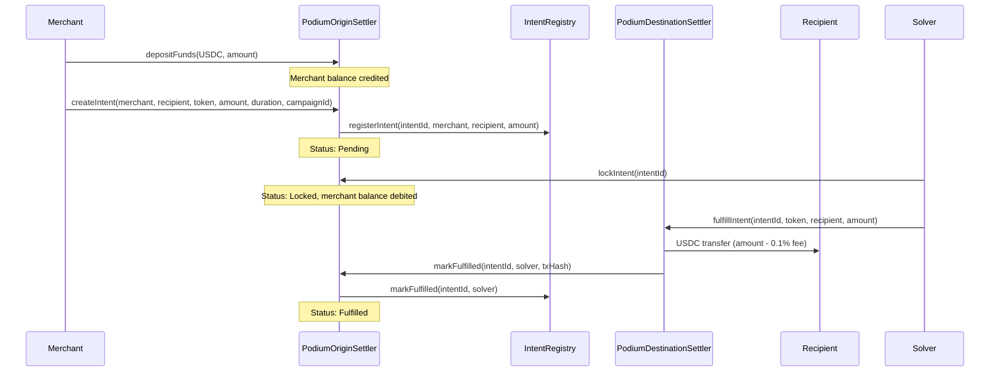
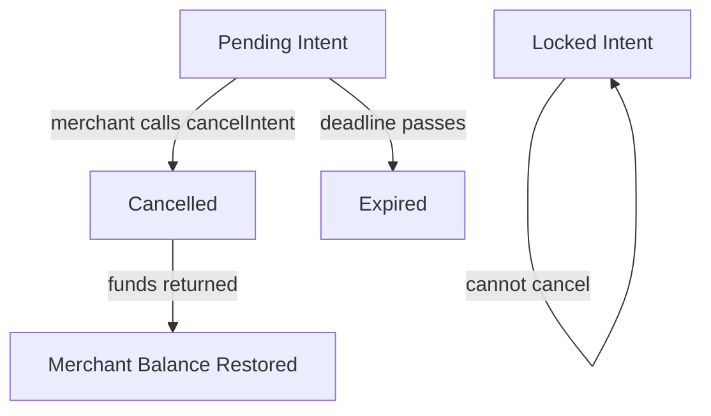

## Overview

The V1 contracts implement an intent-based reward settlement flow. A merchant deposits USDC, the platform creates a reward intent, a solver locks and fulfills it, and the recipient receives funds minus a small solver fee.

V1 contracts are **non-upgradeable** and **single-tenant**. They remain deployed for backward compatibility, but new deployments use the [V2 Task Pool system](/contracts/task-pool).

## Settlement Flow



## IntentRegistry

Central observability ledger tracking all reward intents across the system.

### Functions

| Function | Access | Description |
|----------|--------|-------------|
| `setOriginSettler(address)` | Owner | Set the authorized origin settler |
| `registerIntent(intentId, merchant, recipient, amount)` | Origin settler only | Register a new intent |
| `markFulfilled(intentId, solver)` | Origin settler only | Mark as fulfilled |
| `getIntent(intentId)` | View | Get intent details |
| `getMerchantIntents(merchant)` | View | All intents by merchant |
| `getRecipientIntents(recipient)` | View | All intents by recipient |
| `getSolverIntents(solver)` | View | All intents fulfilled by solver |
| `getTotalIntents()` | View | Total intent count |
| `getAllIntents(offset, limit)` | View | Paginated intent listing |

### IntentRecord Struct

```solidity
struct IntentRecord {
    bytes32 intentId;      // Deterministic keccak256 hash
    address merchant;      // Funding merchant
    address recipient;     // Reward recipient
    uint256 amount;        // USDC amount (6 decimals)
    uint256 createdAt;     // Block timestamp of creation
    uint256 fulfilledAt;   // Block timestamp of fulfillment (0 if pending)
    address solver;        // Address that fulfilled (zero if pending)
    bool fulfilled;        // Whether the intent has been fulfilled
}
```

### Events

```solidity
event IntentRegistered(
    bytes32 indexed intentId,
    address indexed merchant,
    address indexed recipient,
    uint256 amount
);

event IntentFulfilled(
    bytes32 indexed intentId,
    address indexed solver,
    uint256 fulfilledAt
);
```

## PodiumOriginSettler

Manages merchant deposits, intent creation, fund locking, and the origin side of settlement.

### Intent Lifecycle

| Status | Description |
|--------|-------------|
| `Pending` | Created, waiting for solver to lock |
| `Locked` | Solver committed, funds debited from merchant balance |
| `Fulfilled` | Settlement complete, solver has been paid |
| `Expired` | Deadline passed without fulfillment |
| `Cancelled` | Merchant or platform cancelled |

### Duration Constraints

- **Minimum**: 5 minutes
- **Maximum**: 24 hours

### Functions

| Function | Access | Description |
|----------|--------|-------------|
| `depositFunds(token, amount)` | Any merchant | Transfer ERC-20 in, credit balance |
| `withdrawFunds(token, amount)` | Merchant | Withdraw from balance |
| `createIntent(merchant, recipient, token, amount, duration, campaignId)` | Owner | Create intent with deterministic ID |
| `lockIntent(intentId)` | Any solver | Lock intent, debit merchant balance |
| `markFulfilled(intentId, solver, txHash)` | Destination settler | Mark as fulfilled |
| `cancelIntent(intentId)` | Merchant or owner | Cancel and refund |
| `setDestinationSettler(address)` | Owner | Set destination settler address |
| `setRegistry(address)` | Owner | Set registry address |
| `getIntent(intentId)` | View | Get intent details |
| `getMerchantBalance(merchant)` | View | Check merchant's deposited balance |

### RewardIntent Struct

```solidity
struct RewardIntent {
    bytes32 intentId;          // Deterministic hash
    address merchant;          // Funding address
    address recipient;         // Reward recipient
    address token;             // ERC-20 token (USDC)
    uint256 amount;            // Amount in token units
    uint256 createdAt;         // Block timestamp
    uint256 deadline;          // Expiry timestamp
    bytes32 campaignId;        // Associated campaign
    IntentStatus status;       // Current lifecycle status
}
```

### Intent ID Generation

Intent IDs are deterministic — the same inputs always produce the same ID:

```solidity
bytes32 intentId = keccak256(
    abi.encodePacked(merchant, recipient, token, amount, block.timestamp, campaignId)
);
```

### Events

```solidity
event IntentCreated(
    bytes32 indexed intentId,
    address indexed merchant,
    address indexed recipient,
    address token,
    uint256 amount,
    uint256 deadline,
    bytes32 campaignId
);

event IntentLocked(bytes32 indexed intentId, uint256 lockedAmount);

event IntentFulfilled(
    bytes32 indexed intentId,
    address indexed solver,
    bytes32 fulfillmentTxHash
);

event IntentCancelled(bytes32 indexed intentId, address indexed merchant);

event FundsDeposited(address indexed merchant, uint256 amount);

event FundsWithdrawn(address indexed merchant, uint256 amount);
```

### Cancel Flow

Cancellation is available for intents that haven't been locked by a solver:



1. Only `Pending` intents can be cancelled
2. The merchant (or contract owner) calls `cancelIntent(intentId)`
3. Status is set to `Cancelled`
4. The escrowed amount is returned to the merchant's balance
5. `IntentCancelled` event is emitted

Locked intents cannot be cancelled — once a solver commits, the intent must be fulfilled or expire.

## PodiumDestinationSettler

Handles the destination side: solver fulfills the intent by transferring funds to the recipient and collecting proof.

### Fee Structure

- **Solver fee**: 0.1% (10 basis points) — `SOLVER_FEE_BPS = 10`
- Recipient receives: `amount - (amount × 10 / 10000)`
- Solver keeps the fee as payment for fulfillment

### Functions

| Function | Access | Description |
|----------|--------|-------------|
| `fulfillIntent(intentId, token, recipient, amount)` | Any solver | Transfer to recipient, keep fee, create proof |
| `verifyProof(intentId)` | Owner | Post-hoc proof attestation |
| `claimRewards(token)` | Solver | Withdraw accumulated fees |
| `setOriginSettler(address)` | Owner | Update origin settler reference |
| `getProof(intentId)` | View | Get fulfillment proof |
| `getSolverRewards(solver)` | View | Check solver's accumulated rewards |

### FulfillmentProof Struct

```solidity
struct FulfillmentProof {
    bytes32 intentId;      // Intent being fulfilled
    address solver;        // Fulfilling solver address
    bytes32 txHash;        // On-chain transaction hash
    uint256 fulfilledAt;   // Block timestamp
    bool verified;         // Whether proof has been attested
}
```

### Events

```solidity
event IntentFulfilled(
    bytes32 indexed intentId,
    address indexed solver,
    address indexed recipient,
    uint256 amount,
    bytes32 txHash
);

event ProofVerified(bytes32 indexed intentId, address indexed verifier);

event SolverRewardClaimed(address indexed solver, uint256 amount);
```

### Fulfillment Flow

1. Solver calls `fulfillIntent(intentId, token, recipient, amount)`
2. Contract transfers `amount - fee` to recipient via `IERC20.transferFrom`
3. Fee (0.1%) is retained in the contract, credited to solver
4. `FulfillmentProof` is created and stored
5. Contract calls `OriginSettler.markFulfilled()` to update origin status
6. `IntentFulfilled` event emitted with full details
7. Solver can later call `claimRewards(token)` to withdraw accumulated fees

## Deployed Networks

| Network | Chain ID | Deployment |
|---------|----------|------------|
| Base Mainnet | 8453 | Production — uses canonical USDC |
| Base Sepolia | 84532 | Testnet — uses MockUSDC |

V1 contracts use canonical USDC on mainnet (`0x833589fCD6eDb6E08f4c7C32D4f71b54bdA02913`) and a deployed MockUSDC on testnets.

## V1 vs V2 Comparison

| Feature | V1 (Intent Settlers) | V2 (Task Pool) |
|---------|---------------------|----------------|
| Upgradeability | None | UUPS + Beacon proxy |
| Multi-tenancy | Single-tenant | Multi-tenant via factory |
| Verification | Solver self-reports | Consensus / Oracle / AI |
| Fee model | Fixed 0.1% solver fee | Configurable protocol + solver fees |
| Cancel flow | Merchant-initiated | Merchant or admin |
| Task metadata | Campaign ID only | Acceptance criteria, submission hash |

For new integrations, use the [V2 Task Pool system](/contracts/task-pool).
