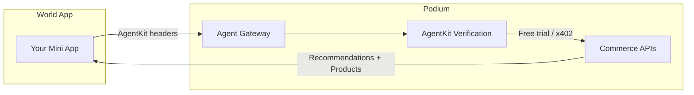

The World Agent Kit integration lets you build Mini Apps on the World platform that access Podium's commerce intelligence -- personalized recommendations, product interactions, and enriched catalog data -- with built-in human verification and usage metering.

## Overview

World Mini Apps run inside the World App, where every user has a verified human identity (via World ID). The Agent Gateway bridges World's verification layer with Podium's commerce APIs, giving your mini app:

- **Human-verified access** -- every request is backed by a real, unique human identity
- **Free-trial metering** -- new users get a configurable number of free interactions before payment is required
- **Multi-chain payments** -- when the free trial expires, the gateway returns a `402` response with facilitator details for USDC payment on World Chain or Base
- **Replay protection** -- nonce-based request deduplication prevents double-spending



## Agent Gateway Endpoints

The gateway exposes a subset of Podium's commerce APIs through a dedicated route group. All requests must include AgentKit authentication headers.

### Get Recommendations

```
GET /api/v1/agent/recommendations/:userId
```

| Parameter | Type | Description |
|---|---|---|
| `userId` | path | The user's Podium ID |
| `count` | query | Number of recommendations (1--50, default 10) |
| `category` | query | Filter by product category |
| `domain` | query | Filter by domain (beauty, wellness, fashion, home) |

Returns personalized product recommendations enriched with top ingredients, purchase URLs, and the full [ranking intelligence](/agentic/ranking-intelligence) pipeline.

### Record Interaction

```
POST /api/v1/agent/interactions
```

```json
{
  "userId": "clxyz1234567890",
  "productId": "prod_abc123",
  "action": "RANK_UP"
}
```

Supported actions: `VIEW`, `RANK_UP`, `RANK_DOWN`, `PURCHASED`, `PURCHASE_INTENT`, `NUDGE_OPENED`.

Recording interactions feeds the [ranking model](/agentic/ranking-intelligence) and updates the user's preference embeddings. High-signal interactions (rank-up, rank-down, purchase) trigger an automatic recomputation of the user's ingredient affinity cache.

### List User Interactions

```
GET /api/v1/agent/interactions/:userId
```

Returns the user's interaction history with enriched product data (including top ingredients).

## Authentication Flow

The Agent Gateway uses the World AgentKit SDK for authentication. Your mini app sends AgentKit headers with each request, and the gateway verifies the human identity server-side.

### Request Flow

1. Your mini app includes AgentKit authentication headers on every request to `/api/v1/agent/*`
2. The gateway validates the headers through the AgentKit verification layer
3. If the user has free-trial credits remaining, access is granted immediately
4. If the free trial is exhausted, the gateway returns `402 Payment Required` with facilitator details

### Free Trial Metering

Each verified human gets a configurable number of free API calls. Usage is tracked atomically per human identity via the `AgentUsage` table. The `AgentNonce` table provides replay protection, ensuring each request is counted exactly once.

### Payment Required (402)

When free-trial credits are exhausted, the gateway returns:

```json
{
  "error": "Payment required",
  "facilitator": "https://facilitator.worldchain.example/pay",
  "accepts": ["USDC"],
  "networks": ["eip155:480", "eip155:8453"]
}
```

| Field | Description |
|---|---|
| `facilitator` | The x402 facilitator URL for payment processing |
| `accepts` | Accepted payment tokens |
| `networks` | Supported chains -- World Chain (`eip155:480`) and Base (`eip155:8453`) |

Your mini app can then complete payment via the [x402 protocol](/agentic/x402-payments) on either chain.

## Enabling the Gateway

The Agent Gateway is feature-flagged on your organization's settings. To enable it:

1. Set `agentGatewayEnabled: true` in your organization settings
2. Optionally configure `x402FacilitatorUrl` for a custom payment facilitator
3. Set the `AGENT_GATEWAY_ORG_ID` environment variable to your org ID

<Warning>
The Agent Gateway is designed for server-to-server or verified-agent access. It should not be called directly from untrusted client-side code without AgentKit header verification.
</Warning>

## Multi-Chain Support

The gateway supports payment processing on two networks:

| Network | Chain ID | Use Case |
|---|---|---|
| **World Chain** | `eip155:480` | Primary chain for World Mini Apps |
| **Base** | `eip155:8453` | Fallback / cross-chain support |

The facilitator URL is resolved dynamically based on the network and your org's configuration, enabling seamless multi-chain payment routing.

## Integration Example

```typescript
// World Mini App — calling the Agent Gateway

const GATEWAY_BASE = 'https://api.podium.build/api/v1/agent';

async function getRecommendations(userId: string, agentKitHeaders: Headers) {
  const response = await fetch(
    `${GATEWAY_BASE}/recommendations/${userId}?count=10&domain=beauty`,
    { headers: agentKitHeaders }
  );

  if (response.status === 402) {
    const payment = await response.json();
    // Prompt user to pay via x402
    return handlePaymentRequired(payment);
  }

  return response.json();
}

async function recordInteraction(
  userId: string,
  productId: string,
  action: string,
  agentKitHeaders: Headers
) {
  await fetch(`${GATEWAY_BASE}/interactions`, {
    method: 'POST',
    headers: {
      ...Object.fromEntries(agentKitHeaders),
      'Content-Type': 'application/json',
    },
    body: JSON.stringify({ userId, productId, action }),
  });
}
```

## Related

- [x402 Payments](/agentic/x402-payments) -- the payment protocol used when free trials expire
- [Ranking Intelligence](/agentic/ranking-intelligence) -- how recommendations are personalized
- [Enrichment Pipeline](/agentic/enrichment-pipeline) -- the data enriching product recommendations
- [Product Feed](/agentic/product-feed) -- the feed system powering recommendations
