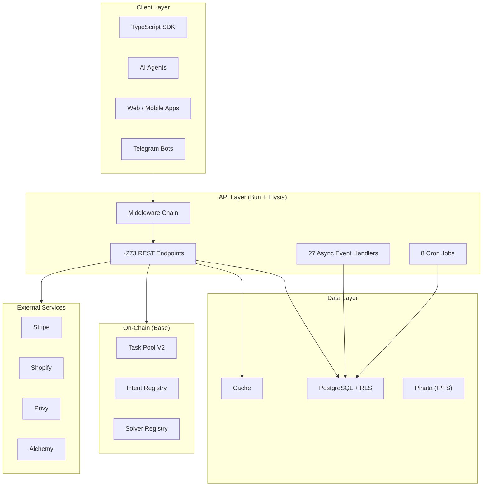

## System Overview

Podium is a multi-tenant API platform built on Bun and the Elysia web framework, backed by PostgreSQL with Row-Level Security, a high-performance caching layer, and a reliable async event system. Smart contracts on Base handle on-chain settlement.



## Multi-Tenancy via Row-Level Security

Every tenant-scoped table in PostgreSQL includes an `organizationId` column that defaults to the current session variable:

```sql
organizationId VARCHAR(191) DEFAULT current_setting('app.org_id', TRUE)
```

Before every database query, the ORM middleware calls `SET set_config('app.org_id', ...)` to set the session context. PostgreSQL RLS policies then filter every `SELECT`, `INSERT`, `UPDATE`, and `DELETE` to only rows belonging to that organization.

This means:

- **No cross-tenant data leaks** — the database enforces isolation at the row level, not the application level
- **Transparent to application code** — services don't need to add `WHERE organizationId = ?` to every query

The organization context flows through the entire request lifecycle via `AsyncLocalStorage`, so all database queries inside a request handler are automatically scoped to the authenticated organization.

## Request Lifecycle

Every request passes through a carefully ordered middleware chain before reaching the route handler:

<Steps>
  <Step title="Stripe Parser">
    Captures raw request body for Stripe webhook signature verification. Must run before any body parsing.
  </Step>
  <Step title="Org Resolver">
    Extracts the `Authorization: Bearer <api-key>` header, SHA-256 hashes the key, and looks up the organization. Results are cached with a jittered TTL (60–150s) to prevent thundering herd.
  </Step>
  <Step title="App Config Resolver">
    Loads the organization's app-specific configuration (blockchain network, reward mode, feature flags).
  </Step>
  <Step title="Public Access Filter">
    Allows unauthenticated access for designated public paths: `/webhooks/*`, `/agentic/*`, `/solver/*`, and OAuth callbacks.
  </Step>
  <Step title="Rate Limiter">
    Per-organization rate limiting determined by subscription tier. Tracks requests per second with sliding window.
  </Step>
  <Step title="Access Control">
    Checks the organization's subscription tier against endpoint allowlists/blocklists. Higher tiers unlock additional API surface.
  </Step>
  <Step title="x402 Middleware">
    For endpoints behind a crypto paywall, negotiates HTTP 402 payment requirements and verifies USDC payment proofs.
  </Step>
  <Step title="Route Handler">
    Executes within `runWithOrgId()` — all database queries are automatically scoped to the authenticated organization.
  </Step>
  <Step title="Usage Logging">
    Tracks per-request API usage for analytics and billing.
  </Step>
</Steps>

## Technology Stack

| Layer | Technology | Purpose |
|-------|-----------|---------|
| **Runtime** | Bun | JavaScript/TypeScript execution, package management, test runner |
| **Framework** | Elysia | Type-safe HTTP framework with built-in validation and OpenAPI generation |
| **Database** | PostgreSQL 15 | Primary data store with Row-Level Security |
| **Validation** | Zod | Runtime schema validation on every endpoint |
| **Payments** | Stripe | Card payments, Connect payouts, webhook processing |
| **Crypto** | x402 + viem + ethers | USDC payments on Base, smart contract interactions |
| **Wallets** | Privy | Embedded wallet creation, server wallet operations |
| **Storage** | Pinata | IPFS for reward metadata and media |
| **Search** | PostgreSQL tsvector | Full-text search with custom ranking |
| **AI** | Proprietary | Product intelligence, attribute extraction, recommendations |

## Async Event System

Podium uses a reliable event bus for operations that should not block the API response. Events are published as HTTP callbacks to queue-specific handlers with at-least-once delivery and automatic retries.

**27 event types** including: `purchase-processed`, `campaign-published`, `nft-received`, `follow`, `points-received`, `shopify-products-sync`, `task-verification-requested`, `enrichment-crawl`, `enrichment-extract`, and more.

**8 cron jobs** run on schedule: airdrop monitor, campaign monitor, contract monitor, enrichment baseline recompute, mint queue processor, payouts sweep, Stripe onboarding reminder, and token presale monitor.

All events are authenticated via signature verification and are idempotent — safe to retry on failure.

## Project Structure

The Podium API server is organized as follows:

```
src/
│   ├── index.ts              # Server bootstrap, middleware chain
│   ├── api/v1/               # Route handlers (thin, delegate to services)
│   ├── services/             # Business logic (36 service files)
│   ├── model/                # Data access (40+ model files)
│   ├── middleware/            # Auth, rate limiting, x402, access control
│   ├── lib/                  # Internal libraries (events, wallets)
│   │   └── event/            # 27+ async event classes
│   ├── enrichment/           # Product intelligence pipeline
│   │   ├── sources/          # Data source connectors
│   │   ├── extractors/       # AI attribute extraction, entity resolution
│   │   └── pipeline/         # Ingest, normalize, baseline compute
│   ├── contracts/abis/       # Smart contract ABIs
│   ├── utils/                # Config, logging, blockchain helpers
│   └── validation/           # Shared Zod schemas
sdk/                          # Generated TypeScript SDK
prisma/schema.prisma          # Database schema (80+ models)
scripts/                      # Build tools, OpenAPI generation
```
