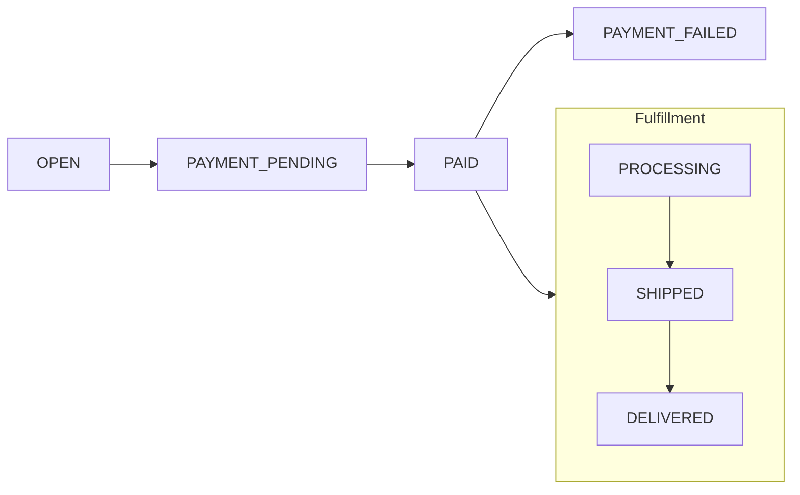

## Organizations

An organization is the root tenant in Podium. Everything — products, users, orders, campaigns, API keys — belongs to an organization. PostgreSQL Row-Level Security ensures complete data isolation between organizations.

Organizations have:
- A **subscription tier** (BUILDER, GROWTH, PRO, ADMIN) controlling rate limits and endpoint access
- **Settings** including blockchain network configuration, x402 preferences, and reward modes
- **App configurations** for per-application behavior customization

## Creators

Creators are merchants or brands within an organization. They have public-facing storefronts and manage products, orders, and payouts.

| Field | Purpose |
|-------|---------|
| `slug` | URL-friendly unique identifier (e.g., `tatcha`, `the-ordinary`) |
| `displayName` | Brand name shown to consumers |
| `heroImageUrl` | Storefront banner |
| `shippingSettings` | Default shipping configuration |
| `pointsConfig` | Per-creator points earning rules |

Creators connect to **Stripe Connect** for payment processing and receive payouts through the platform's payout sweep system. The `CreatorUser` model links a `User` to their `Creator` identity — a user can be both a consumer and a merchant.

## Users

Users are end consumers who browse, interact, and purchase within the platform.

| Field | Purpose |
|-------|---------|
| `username` | Unique handle |
| `email` | Contact and order notifications |
| `avatarUrl` | Profile image |
| `bio`, `city`, `state` | Profile details |

Users link to external identity providers through `PrivyUser` and `DynamicUser` mapping tables. Wallets are tracked in `UserWallet` — each user can have multiple wallets (Privy embedded, self-custodied, or platform-managed).

### Social Graph

Users can follow creators (`CreatorFollow`) and other users (`Follow`). Creators can organize followers into `Group` membership for segmented engagement.

## Products

Products represent items available for purchase. They support configurable attributes (size, color, etc.) through a variant system.

| Model | Purpose |
|-------|---------|
| `Product` | Core product: name, price, supply, status, shipping type, point eligibility |
| `ProductAttribute` | Configurable option (e.g., "Color") |
| `ProductAttributeVariant` | Specific value (e.g., "Rose Gold") with optional price modifier and supply |
| `ProductMedia` | Images and videos |
| `CreatorProduct` | Maps products to creators |

Products go through a lifecycle: `DRAFT` → `PUBLISHED` → `ARCHIVED`. Published products appear in search, discovery feeds, and the agentic product feed.

## Orders

An order captures a purchase transaction from creation through fulfillment:

| Model | Purpose |
|-------|---------|
| `Order` | Order header: status, shipping status, points applied, total |
| `OrderItem` | Line items with quantity, price, selected attribute variants |
| `UserOrder` | Links authenticated users to orders |
| `GuestOrder` | Links anonymous buyers to orders |

### Payment Methods

Orders can be paid through multiple channels:
- **Stripe** — Credit card via PaymentIntents
- **x402** — USDC on Base via HTTP 402 protocol
- **Embedded wallet** — Privy server wallet for automated agent purchases
- **Coinbase Commerce** — Crypto checkout

### Creator Payouts

When an order is paid, the platform tracks a `CreatorPayout` record that moves through `PENDING` → `ELIGIBLE` → `TRANSFERRED`. A scheduled payout sweep cron job processes eligible payouts via Stripe Connect transfers.

## Points & Loyalty

Podium includes a programmable points ledger with double-entry bookkeeping:

| Transaction Type | Source |
|-----------------|--------|
| `API` | Programmatic grants via the API |
| `CAMPAIGN` | Earned through campaign participation |
| `PURCHASE` | Earned from purchases (based on creator's points-per-dollar config) |
| `NFT_REDEMPTION` | Spent when redeeming on-chain rewards |
| `PRESALE` | Spent on token presale purchases |

Points are tracked per-user with full transaction history. The ledger supports both earning and spending with atomic balance checks.

## Campaigns

Campaigns are structured engagement mechanics that capture user intent:

| Type | Mechanic |
|------|---------|
| `SWIPE` | Binary preference selection (like Tinder for products) |
| `MULTIVARIANT` | Vote between multiple attribute options |
| `SURVEY` | Structured question/answer collection |
| `UGC` | User-generated content submission |

Campaigns follow a lifecycle: `DRAFT` → `SUBMITTED` → `APPROVED` → `PUBLISHED` → `ENDED`. Each participation generates a `CampaignJourney` record, and associated rewards are tracked through `CampaignReward` and `CampaignRewardTransaction`.

## Rewards & Airdrops

Podium supports on-chain reward minting and redemption:

| Model | Purpose |
|-------|---------|
| `NftContract` | Deployed smart contract (name, symbol, proxy/implementation addresses, chain, max supply) |
| `Nft` | Individual minted token with owner address |
| `NftReward` | Reward program definition |
| `NftRedemption` | Tracks when a reward is redeemed |
| `QueuedMint` | Mint queue for batched minting via Privy server wallets |
| `Airdrop` | Scheduled bulk reward distribution |

Rewards support six types: `POINTS`, `FREE_PRODUCT`, `DISCOUNT_CODE`, `EVENT_PASS`, `CUSTOM`, and `EXCLUSIVE_ACCESS`.

## Intents & Settlement

The intent layer bridges off-chain commerce with on-chain settlement:

| Model | Purpose |
|-------|---------|
| `IntentSettlement` | On-chain reward intent lifecycle (PENDING → LOCKED → FULFILLED / EXPIRED / CANCELLED) |
| `MerchantTreasury` | Per-organization USDC treasury with on-chain balance tracking |
| `SolverPerformance` | Solver fulfillment metrics and reputation data |

## Agent Memory

Structured memory that evolves through conversation. As a user interacts with a companion agent, the platform extracts and maintains a rich understanding of their attributes, goals, concerns, avoidances, products tried, and category-aware price ranges. See [Memory & Intelligence](/agentic/memory-intelligence) for the full schema, domain taxonomy, and scoring details.

| Dimension | Example |
|-----------|---------|
| Attributes | Skin type, hair texture, body type |
| Goals | "Looking for anti-aging routine", "Building a capsule wardrobe" |
| Concerns | Sensitivity to fragrance, budget constraints |
| Avoidances | Specific ingredients, brands, or categories |
| Products tried | Items the user has purchased or reviewed |
| Price ranges | Per-category budget preferences (e.g., "$20–40 for serums, up to $100 for treatments") |

Memory extraction runs for all users regardless of [subscription tier](/platform/subscriptions). For subscribers, the accumulated memory is loaded into the agent's system prompt on every conversation turn, enabling deeply personalized responses.

<Note>
  Memory is additive — it grows richer with every interaction. Users who upgrade from free to paid immediately benefit from all intelligence accumulated during their free usage.
</Note>

## Companion Subscription

Subscription state for companion agent monetization. Each subscription tracks the user's billing tier, payment provider IDs, trial configuration, and current billing period.

| Field | Purpose |
|-------|---------|
| `tier` | Current subscription tier: `FREE`, `TRIALING`, `ACTIVE`, `PAST_DUE`, `CANCELED` |
| `externalCustomerId` | Stripe customer ID |
| `externalSubscriptionId` | Stripe subscription ID |
| `trialEndsAt` | Trial expiry timestamp (configurable, default 14 days) |
| `currentPeriodEnd` | End of current billing period |

Tier transitions are managed automatically via Stripe webhooks. See [Subscriptions](/platform/subscriptions) for the full billing lifecycle and API endpoints.

## Companion Usage

Monthly usage tracking per user, used for free-tier gating.

| Field | Purpose |
|-------|---------|
| `messageCount` | Messages sent in the current billing period |
| `recCount` | Recommendation requests in the current billing period |
| `periodStart` | Start of the current tracking period |

Usage counters reset at the start of each billing period. The [subscription status endpoint](/platform/subscriptions#subscription-status) returns both current counts and configured limits.

## Creator Persona

A creator persona represents a creator-curated shopping identity — used by apps like [Clone Agents (Familiar)](/agentic/beauty-companion#clone-agents-familiar) to let users shop through the lens of a creator's taste.

| Field | Purpose |
|-------|---------|
| `handle` | Unique identifier (e.g., `janedoe`) |
| `displayName` | Creator's public name |
| `platform` | Affiliate platform: ShopMy, LTK, Amazon Influencer |
| `avatarUrl` | Creator profile image |
| `seedProfile` | Taste data (brands, price ranges, concerns) used to seed user profiles |
| `resolvedProductIds` | Product catalog IDs resolved from the creator's affiliate links |
| `status` | `ACTIVE`, `PENDING`, or `INACTIVE` |

Developers can query active creator personas and their resolved product catalogs via the [Creator Products](/api-reference/companion#creator-products) endpoint. User profiles can be bootstrapped from a creator's taste data via [Profile Seeding](/api-reference/companion#profile-seeding-from-creator).

## Agent Conversation & Agent Message

Durable chat history for companion agents. Conversations are scoped per user and per surface (web, Telegram, etc.), with messages stored as an ordered sequence.

**AgentConversation:**

| Field | Purpose |
|-------|---------|
| `id` | Conversation identifier |
| `userId` | The user this conversation belongs to |
| `surface` | Where the conversation is happening (`web`, `telegram`, etc.) |
| `createdAt` | When the conversation started |
| `lastMessageAt` | Timestamp of the most recent message |

**AgentMessage:**

| Field | Purpose |
|-------|---------|
| `id` | Message identifier (used as pagination cursor) |
| `role` | `user` or `assistant` |
| `content` | Message text |
| `products` | Product cards shown with this message (assistant messages only) |
| `timestamp` | When the message was sent |

Chat history is retrieved via the [Chat History](/api-reference/companion#chat-history) endpoint with cursor-based pagination.

## Task Pool (V2)

The Task Pool system enables on-chain bounty distribution:

| Model | Purpose |
|-------|---------|
| `TenantContractPool` | Per-organization deployed TaskPool + RewardPool contract addresses |
| `Task` | Generalized task definition (solver-agnostic, human or AI) |
| `VerificationRequest` | Task completion verification tracking |

See [Smart Contracts](/contracts/overview) for the on-chain architecture.
