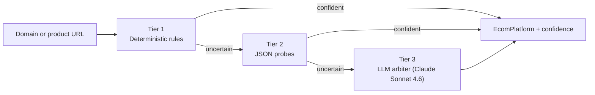

## Overview

Merchant Intelligence is the system that decides which storefronts your agent can transact against. It classifies external merchant domains by ecommerce platform, persists the classification on a per-domain registry, and feeds the result back into the [Universal Checkout](/agentic/universal-checkout) adapter selection so coverage expands without code changes.

When a domain reaches high confidence as a Shopify-class storefront, Universal Checkout becomes eligible to transact on URLs from that domain (subject to org settings and user cohort). When confidence drops or classification drifts, the system re-classifies on a schedule.

You read the result through:

- `buyableInChat` on every [ProductCard](/agentic/product-feed#buyableinchat).
- The adapter selection outcome on every `POST /checkout-intents` call.

## The three-tier classifier

Classification runs in three tiers, from cheapest to most expensive. The first tier that returns a confident answer wins.

| Tier | Cost | What it does |
|---|---|---|
| **Deterministic rules** | Free | Pattern-matches known platform fingerprints (CDN domains, response headers, URL structure). |
| **JSON probes** | One HTTP fetch | Hits well-known platform-specific JSON endpoints to confirm or deny the suspected platform. |
| **LLM arbiter** | One model call | Last-resort classifier for ambiguous domains. Reads collected signals and assigns a platform with a calibrated confidence score. |

Every classification is written to the `BrandProfile` registry with the tier that arbitrated it (`rules`, `active-probe`, or `claude-arbiter`) so the system can audit which tier is carrying the load and refine the rules where the LLM is being called too often.

## The `BrandProfile` data model

Each classified storefront has a `BrandProfile` row. Fields you care about as a developer:

| Field | Type | Description |
|---|---|---|
| `apexDomain` | string | The classified domain (e.g. `example.com`). Unique. |
| `canonicalUrl` | string | The canonical storefront URL. |
| `brandName` | string | Human-readable brand name. |
| `ecomPlatform` | enum | One of `SHOPIFY`, `SHOPIFY_HYDROGEN`, `WOOCOMMERCE`, `BIGCOMMERCE`, `MAGENTO`, `SALESFORCE_COMMERCE_CLOUD`, `SQUARESPACE_COMMERCE`, `WIX_STORES`, `WEBFLOW_ECOMMERCE`, `CENTRA`, `COMMERCETOOLS`, `CUSTOM`, `UNKNOWN`. |
| `ecomPlatformConfidence` | float (0-1) | Confidence in the current classification. |
| `routingHost` | string? | Resolved host used for adapter routing when the canonical and apex differ. |
| `categoryHints` | string[] | Brand category hints derived from discovery context. |
| `reclassifyAfter` | timestamp? | When to re-run classification next. |

The full schema includes audit and classification-history columns; the fields above are what's stable for integrators reasoning about coverage.

<Info>
The admin endpoints under `/admin/brand-profiles/*` and `/admin/brand-discovery/*` are internal-only and intentionally not part of the public API. The platform manages discovery, classification, and drift on its own.
</Info>

## Coverage auto-expansion

You can opt your org into automatic coverage expansion. When a domain reaches the configured confidence threshold on a target platform, agentic-checkout adapters become eligible for URLs from that domain without manual onboarding.

<Note>
The org setting that controls this is `OrgSettings.ryeAutoCoverageThreshold` (`Float?`, nullable, 0 to 1).

- **When set:** a `BrandProfile` with `ecomPlatform: SHOPIFY` and `ecomPlatformConfidence` at or above this threshold becomes coverage-eligible for that org. Setting the threshold high keeps coverage tight; lowering it expands coverage faster at the cost of more failed intent attempts on edge cases.
- **When `null` (the default):** auto-expansion is off for that org. Coverage falls back to the explicit Shopify-onboarded allow-list. Merchants that are not explicitly enabled return `422 merchant_unsupported`.
</Note>

In product copy we call this the "coverage auto-expansion threshold." The field name on `OrgSettings` is `ryeAutoCoverageThreshold` for historical reasons; it controls Universal Checkout coverage broadly, not a single adapter.

## Reading the signal

You don't query Merchant Intelligence directly. The platform surfaces the result on the data you already consume.

### `buyableInChat` on ProductCard

Companion [ProductCard](/agentic/product-feed#buyableinchat) responses include a server-derived `buyableInChat: boolean`. It's `true` when the product URL would be picked up by a Universal Checkout adapter at intent-create time given the current org settings, user cohort, and Merchant Intelligence classification.

**Server-derived. Do not re-derive on the client.** `buyableInChat` mirrors live adapter selection. See [Product Feed](/agentic/product-feed#buyableinchat) for the full contract.

### `POST /checkout-intents` outcome

When you create an intent, the adapter selection has already consulted Merchant Intelligence. Unsupported merchants return `422 merchant_unsupported`; supported merchants return an `awaiting_confirmation` intent with the resolved offer. See [Checkout Intents](/api-reference/checkout-intents) for the response shapes.

## Drift and re-classification

Storefronts re-platform. A site that ran on Shopify last year may have migrated. Merchant Intelligence detects drift via two mechanisms:

1. **Scheduled re-classification.** Each `BrandProfile` has a `reclassifyAfter` timestamp. The platform re-runs the three-tier classifier when the timestamp elapses.
2. **Production feedback.** When a `CheckoutIntent` reaches a terminal state on a classified domain, the outcome is recorded against the `PlatformClassificationOutcome` table. Recurring failures on a "classified-as-Shopify" domain trigger early re-classification.

This is how the system stays calibrated. You don't have to do anything.

## Related

<CardGroup cols={2}>
  <Card title="Universal Checkout" icon="cart-shopping" href="/agentic/universal-checkout">
    The two-phase checkout primitive that consumes Merchant Intelligence at adapter-selection time.
  </Card>
  <Card title="Checkout Intents API" icon="code" href="/api-reference/checkout-intents">
    Request and response schemas for the API surface.
  </Card>
  <Card title="Product Feed" icon="grid" href="/agentic/product-feed">
    The `buyableInChat` signal on every product card.
  </Card>
  <Card title="Enrichment Pipeline" icon="layer-group" href="/agentic/enrichment-pipeline">
    How Podium discovers, enriches, and classifies merchants and products.
  </Card>
</CardGroup>
