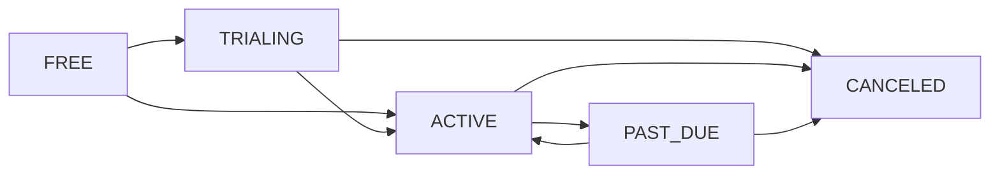

<Note>
The companion message-counter API (`incrementMessageCount`) is deprecated. Newer apps use a metered credit-grant model based on `Session.recordChatTurn()` (documented separately for the apps that adopt it). The endpoints described below remain supported for existing integrations.
</Note>

## Overview

Podium provides a built-in subscription system for companion agents, enabling developers to monetize their AI experiences with freemium gating, usage tracking, and Stripe-powered billing.

The system handles the full lifecycle: free users hit configurable limits, see upgrade prompts, check out via Stripe, and immediately unlock premium capabilities. All subscription state is managed server-side. Your agent just checks the gate.

## Subscription Tiers

Every companion user starts on `FREE` and moves through a standard billing lifecycle:

| Tier | Description |
|------|-------------|
| `FREE` | Default tier with usage limits |
| `TRIALING` | Trial period (configurable, default 14 days) |
| `ACTIVE` | Paid subscriber |
| `PAST_DUE` | Payment failed, grace period active |
| `CANCELED` | Subscription ended |



## Usage Gating

Free-tier users have configurable monthly limits. These defaults can be adjusted per organization:

| Limit | Default | Description |
|-------|---------|-------------|
| Monthly messages | 25 | Total agent messages per billing period |
| Monthly recommendations | 5 | Personalized recommendation requests |
| Soft nudge threshold | 20 messages | "You're almost at your limit" prompt |
| Halfway milestone | 50% of message limit | Progress notification |

### Gate Check

Before processing a user action, call the status endpoint and evaluate the gate result:

```typescript
type GateResult =
  | { allowed: true; nearLimit: boolean; milestone?: string }
  | { allowed: false; reason: 'messages' | 'recs' }
```

When `allowed` is `true`, the action proceeds normally. Use `nearLimit` to show soft upgrade prompts before the user hits the wall. When `allowed` is `false`, `reason` tells you which limit was hit so you can show the appropriate upgrade CTA.

<Note>
  Subscribers (`ACTIVE` and `TRIALING` tiers) bypass all usage gates. The gate check always returns `allowed: true` for paying users.
</Note>

## Memory Gating

Memory extraction runs for **all users** regardless of tier. Free users still have their behavioral patterns, preferences, and conversation history analyzed and stored. The difference is in how that intelligence is used:

- **Free users**. Receive standard recommendations based on their intent profile and interactions
- **Subscribers**. Receive personalized, memory-aware recommendations where the agent's accumulated understanding of the user is loaded into every conversation turn

This means upgrading immediately unlocks all accumulated intelligence. There's no "cold start" when a free user converts to paid. The agent already knows them.

<Info>
  This design creates a strong conversion mechanic: the longer a free user engages, the more valuable upgrading becomes, because the agent has been building their memory the entire time.
</Info>

## API Endpoints

All subscription endpoints are prefixed with `/api/v1/companion/subscription`.

### Create Checkout Session

```bash
curl -X POST https://api.podium.build/api/v1/companion/subscription/checkout \
  -H "Authorization: Bearer YOUR_API_KEY" \
  -H "Content-Type: application/json" \
  -d '{
    "userId": "clxyz1234567890",
    "email": "user@example.com"
  }'
```

**Response:**

```json
{
  "url": "https://checkout.stripe.com/c/pay_cs_..."
}
```

Redirect the user to the returned `url` to complete payment. On success, Stripe sends a webhook that automatically upgrades the user's tier to `ACTIVE`.

### Customer Portal

```bash
curl -X POST https://api.podium.build/api/v1/companion/subscription/portal \
  -H "Authorization: Bearer YOUR_API_KEY" \
  -H "Content-Type: application/json" \
  -d '{
    "userId": "clxyz1234567890"
  }'
```

**Response:**

```json
{
  "url": "https://billing.stripe.com/p/session/..."
}
```

Opens the Stripe customer portal where the user can update payment methods, view invoices, and cancel their subscription.

### Subscription Status

```bash
curl https://api.podium.build/api/v1/companion/subscription/{userId}/status \
  -H "Authorization: Bearer YOUR_API_KEY"
```

**Response:**

```json
{
  "status": "ACTIVE",
  "currentPeriodEnd": 1711929600,
  "trialEndsAt": null,
  "isSubscribed": true,
  "usage": {
    "messageCount": 12,
    "recCount": 3,
    "messageLimit": 25,
    "recLimit": 5
  }
}
```

| Field | Type | Description |
|-------|------|-------------|
| `status` | string | Current tier: `FREE`, `TRIALING`, `ACTIVE`, `PAST_DUE`, or `CANCELED` |
| `currentPeriodEnd` | number | Unix timestamp of current billing period end |
| `trialEndsAt` | number? | Unix timestamp of trial expiry (null if not trialing) |
| `isSubscribed` | boolean | `true` if user has an active or trialing subscription |
| `usage.messageCount` | number | Messages sent this period |
| `usage.recCount` | number | Recommendations requested this period |
| `usage.messageLimit` | number | Message limit for current tier |
| `usage.recLimit` | number | Recommendation limit for current tier |

### Webhook

```
POST /api/v1/webhooks/stripe/subscription
```

The platform automatically processes these Stripe webhook events:

| Event | Effect |
|-------|--------|
| `checkout.session.completed` | User tier set to `ACTIVE` (or `TRIALING` if trial configured) |
| `customer.subscription.updated` | Tier and period end synced |
| `customer.subscription.deleted` | User tier set to `CANCELED` |
| `invoice.payment_failed` | User tier set to `PAST_DUE` |

<Warning>
  You don't need to handle these webhooks yourself. The platform processes them automatically. Only configure a webhook endpoint in Stripe if you need to react to subscription changes in your own application logic.
</Warning>

### Endpoint Summary

| Method | Path | Description |
|--------|------|-------------|
| `POST` | `/companion/subscription/checkout` | Create a Stripe checkout session |
| `POST` | `/companion/subscription/portal` | Open Stripe customer portal |
| `GET` | `/companion/subscription/{userId}/status` | Get subscription status and usage |

## Integration Example

Here's a typical flow for gating a message behind the subscription check:

```typescript
const apiKey = process.env.PODIUM_API_KEY

// 1. Check subscription status and usage
const status = await fetch(
  `https://api.podium.build/api/v1/companion/subscription/${userId}/status`,
  { headers: { Authorization: `Bearer ${apiKey}` } }
).then(r => r.json())

if (status.isSubscribed) {
  // Subscriber: full memory-aware experience.
  await sendAgentMessage(userId, message)
} else if (status.usage.messageCount < status.usage.messageLimit) {
  // Free user within limits: standard experience.
  await sendAgentMessage(userId, message)

  if (status.usage.messageCount >= 20) {
    // Near limit: show a soft nudge.
    showUpgradePrompt('You\'re almost at your free message limit')
  }
} else {
  // Free user at limit: trigger upgrade flow.
  const checkout = await fetch(
    'https://api.podium.build/api/v1/companion/subscription/checkout',
    {
      method: 'POST',
      headers: {
        Authorization: `Bearer ${apiKey}`,
        'Content-Type': 'application/json',
      },
      body: JSON.stringify({ userId, email: userEmail }),
    }
  ).then(r => r.json())

  // Redirect user to checkout.url
  redirectToCheckout(checkout.url)
}
```

## Best Practices

- **Check status before every gated action**. Don't cache subscription state client-side for longer than a single session
- **Use soft nudges before hard gates**. The `nearLimit` flag and milestone notifications reduce churn by warning users before they hit the wall
- **Surface the value of upgrading**. When a free user hits a gate, remind them that their accumulated intelligence is waiting. For example: "Your companion has been learning your preferences. Upgrade to unlock personalized recommendations."
- **Handle `PAST_DUE` gracefully**. Consider a short grace period before downgrading the experience, as many payment failures resolve automatically
