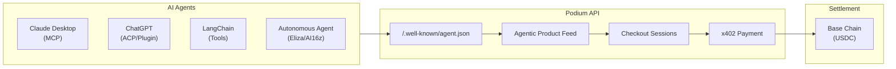

Build a tool layer that lets AI agents — Claude Desktop, ChatGPT, LangChain chains, or autonomous agents — discover products, execute purchases, and settle payments in USDC. No human in the loop required.

## What You'll Build



## Prerequisites

```bash
npm install @podium-sdk/node-sdk
```

```typescript
import { createPodiumClient, ApiError } from '@podium-sdk/node-sdk';

const client = createPodiumClient({
  apiKey: process.env.PODIUM_API_KEY,
});
```

## Pattern 1: Build an MCP Server

Expose Podium operations as [Model Context Protocol](https://modelcontextprotocol.io/) tools that Claude Desktop (or any MCP client) can call.

```typescript
import { McpServer } from '@modelcontextprotocol/sdk/server/mcp.js';
import { StdioServerTransport } from '@modelcontextprotocol/sdk/server/stdio.js';
import { createPodiumClient } from '@podium-sdk/node-sdk';
import { z } from 'zod';

const client = createPodiumClient({ apiKey: process.env.PODIUM_API_KEY });
const server = new McpServer({ name: 'podium-commerce', version: '1.0.0' });

server.tool(
  'search_products',
  { query: z.string(), limit: z.number().optional() },
  async ({ query, limit }) => {
    const feed = await client.agentic.listProductsFeed({
      limit: limit ?? 10,
      categories: query,
    });
    return { content: [{ type: 'text', text: JSON.stringify(feed.products) }] };
  }
);

server.tool(
  'create_checkout',
  {
    productId: z.string(),
    quantity: z.number(),
    email: z.string(),
  },
  async ({ productId, quantity, email }) => {
    const session = await client.agentic.createCheckoutSessions({
      requestBody: {
        items: [{ id: productId, quantity }],
      },
    });

    await client.agentic.updateCheckoutSessions({
      id: session.id,
      requestBody: { email },
    });

    return { content: [{ type: 'text', text: JSON.stringify(session) }] };
  }
);

server.tool(
  'get_recommendations',
  { userId: z.string(), count: z.number().optional() },
  async ({ userId, count }) => {
    const recs = await client.companion.listRecommendations({
      userId,
      count: count ?? 5,
    });
    return { content: [{ type: 'text', text: JSON.stringify(recs) }] };
  }
);

server.tool(
  'check_points',
  { userId: z.string() },
  async ({ userId }) => {
    const points = await client.user.listPoints({ id: userId });
    return { content: [{ type: 'text', text: JSON.stringify(points) }] };
  }
);

const transport = new StdioServerTransport();
await server.connect(transport);
```

### Claude Desktop Configuration

Add to `~/Library/Application Support/Claude/claude_desktop_config.json`:

```json
{
  "mcpServers": {
    "podium": {
      "command": "node",
      "args": ["path/to/your/mcp-server.js"],
      "env": {
        "PODIUM_API_KEY": "podium_live_..."
      }
    }
  }
}
```

## Pattern 2: A2A Discovery

Expose your commerce capabilities via the [Agent-to-Agent protocol](https://google.github.io/A2A/) discovery endpoint.

Create `/.well-known/agent.json`:

```json
{
  "name": "Podium Commerce Agent",
  "description": "Search products, create checkouts, manage loyalty points, and execute USDC purchases",
  "url": "https://your-agent.example.com",
  "version": "1.0.0",
  "capabilities": {
    "streaming": false,
    "pushNotifications": false
  },
  "skills": [
    {
      "id": "product-search",
      "name": "Product Search",
      "description": "Search the product catalog with filters",
      "inputModes": ["text/plain"],
      "outputModes": ["application/json"]
    },
    {
      "id": "create-checkout",
      "name": "Create Checkout",
      "description": "Create a checkout session for products",
      "inputModes": ["application/json"],
      "outputModes": ["application/json"]
    },
    {
      "id": "pay-x402",
      "name": "USDC Payment",
      "description": "Pay for an order using x402 USDC protocol",
      "inputModes": ["application/json"],
      "outputModes": ["application/json"]
    }
  ]
}
```

## Pattern 3: Agentic Product Feed + Checkout

The agentic endpoints are designed for agent consumption — no session management, no auth cookies, just API key + structured responses.

### Browse Products

```typescript
const feed = await client.agentic.listProductsFeed({
  page: 1,
  limit: 20,
  categories: 'skincare,wellness',
});

for (const product of feed.products) {
  console.log(`${product.name} — $${product.price}`);
  console.log(`  Intent Score: ${product.intentScore}`);
  console.log(`  Categories: ${product.categories.join(', ')}`);
}
```

### Create a Checkout Session

```typescript
const session = await client.agentic.createCheckoutSessions({
  requestBody: {
    items: [
      { id: 'prod_abc', quantity: 1 },
      { id: 'prod_def', quantity: 2 },
    ],
    shippingAddress: {
      firstName: 'Jane',
      lastName: 'Doe',
      address: {
        line1: '123 Main St',
        line2: null,
        city: 'San Francisco',
        state: 'CA',
        postalCode: '94102',
        countryCode: 'US',
      },
    },
  },
});

console.log(`Session: ${session.id}`);
console.log(`Total: $${session.total}`);
console.log(`Status: ${session.status}`);
```

### Update Session (Add Email, Change Address)

```typescript
await client.agentic.updateCheckoutSessions({
  id: session.id,
  requestBody: {
    email: 'buyer@example.com',
  },
});
```

### Check Session Status

```typescript
const status = await client.agentic.getCheckoutSessions({
  id: session.id,
});
```

## Pattern 4: x402 USDC Payment

The x402 protocol enables machine-native payments. The agent pays with USDC — no card, no human approval.

```typescript
import { createPodiumClient } from '@podium-sdk/node-sdk';

const client = createPodiumClient({ apiKey: process.env.PODIUM_API_KEY });

async function payWithX402(orderId: string) {
  try {
    const result = await client.x402.createOrderPay({ id: orderId });
    return result; // { receipt, txHash, status: 'VERIFIED' }
  } catch (err) {
    if (err.status === 402) {
      // First call returns payment requirements
      const requirements = err.body;
      // requirements.payTo — USDC receiving address
      // requirements.maxAmountRequired — amount in atomic units (6 decimals)
      // requirements.asset — USDC contract address on Base

      // Sign USDC transfer using your wallet (viem, ethers, etc.)
      const signedPayment = await signUSDCTransfer(requirements);

      // Retry with X-PAYMENT header (handled by SDK in future)
      const response = await fetch(
        `https://api.podiumcommerce.xyz/api/v1/x402/order/${orderId}/pay`,
        {
          method: 'POST',
          headers: {
            'Authorization': `Bearer ${process.env.PODIUM_API_KEY}`,
            'X-PAYMENT': signedPayment,
          },
        }
      );

      return response.json();
    }
    throw err;
  }
}
```

## Pattern 5: LangChain Tools

Wrap the SDK as typed LangChain tools for reliable agent chains:

```typescript
import { tool } from '@langchain/core/tools';
import { z } from 'zod';
import { createPodiumClient } from '@podium-sdk/node-sdk';

const client = createPodiumClient({ apiKey: process.env.PODIUM_API_KEY });

const searchProducts = tool(
  async ({ query, limit }) => {
    const feed = await client.agentic.listProductsFeed({
      categories: query,
      limit,
    });
    return JSON.stringify(feed.products.map(p => ({
      id: p.id, name: p.name, price: p.price, brand: p.brand,
    })));
  },
  {
    name: 'search_products',
    description: 'Search the Podium product catalog',
    schema: z.object({
      query: z.string().describe('Product category or search term'),
      limit: z.number().default(10).describe('Max results'),
    }),
  }
);

const createCheckout = tool(
  async ({ productId, quantity }) => {
    const session = await client.agentic.createCheckoutSessions({
      requestBody: { items: [{ id: productId, quantity }] },
    });
    return JSON.stringify(session);
  },
  {
    name: 'create_checkout',
    description: 'Create a checkout session for a product purchase',
    schema: z.object({
      productId: z.string().describe('Product ID to purchase'),
      quantity: z.number().default(1).describe('Quantity'),
    }),
  }
);

export const podiumTools = [searchProducts, createCheckout];
```

## Related

- [Agentic Product Feed](/agentic/product-feed) — discovery endpoint architecture
- [x402 Payments](/agentic/x402-payments) — full protocol specification
- [SDK Setup](/sdk/setup) — client configuration and namespaces
- [API Reference](/api-reference/introduction) — complete endpoint catalog
