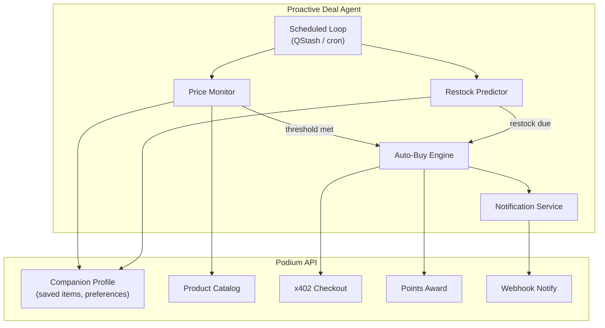

Build the ultimate personal shopping agent — an autonomous system that watches saved items for price drops, tracks purchase history to predict restock needs, and executes auto-buy via x402 USDC when conditions are met. This is proactive intelligence: the agent acts on the user's behalf, then reports what it did.

## What You'll Build



## How It Works

1. **Cron loop** runs every hour (or on a schedule you choose)
2. **Price monitor** checks each user's saved items against current catalog prices
3. **Restock predictor** analyzes purchase history to estimate when consumables run out
4. **Auto-buy engine** executes x402 USDC purchases when thresholds are met
5. **Notification** tells the user what the agent did (and lets them undo within a grace period)

## Prerequisites

```bash
npm install @podium-sdk/node-sdk
```

```typescript
import { createPodiumClient } from '@podium-sdk/node-sdk';

const client = createPodiumClient({
  apiKey: process.env.PODIUM_API_KEY,
});
```

## Step 1: User Preferences & Saved Items

The companion profile stores what the user cares about — saved items, price targets, and auto-buy rules.

```typescript
interface DealPreferences {
  savedItems: Array<{
    productId: string;
    targetPrice: number;
    autoBuy: boolean;
    maxQuantity: number;
  }>;
  restockItems: Array<{
    productId: string;
    usageDays: number;
    lastPurchased: string;
    autoBuy: boolean;
  }>;
  spendingLimit: number;
  notifyVia: 'webhook' | 'email';
}

async function getUserDealPreferences(userId: string): Promise<DealPreferences> {
  const profile = await client.companion.listProfile({ userId });

  return {
    savedItems: profile.savedItems ?? [],
    restockItems: profile.restockItems ?? [],
    spendingLimit: profile.preferences?.monthlySpendLimit ?? 200,
    notifyVia: profile.preferences?.notifyVia ?? 'webhook',
  };
}
```

## Step 2: Price Monitor

Check every saved item against the current catalog price. Flag items that hit the target.

```typescript
interface PriceDrop {
  productId: string;
  productName: string;
  currentPrice: number;
  targetPrice: number;
  savedPrice: number;
  savings: number;
  autoBuy: boolean;
}

async function checkPriceDrops(userId: string): Promise<PriceDrop[]> {
  const prefs = await getUserDealPreferences(userId);
  const drops: PriceDrop[] = [];

  for (const item of prefs.savedItems) {
    const product = await client.product.get({ id: item.productId });
    const currentPrice = product.price;

    if (currentPrice <= item.targetPrice) {
      drops.push({
        productId: item.productId,
        productName: product.name,
        currentPrice,
        targetPrice: item.targetPrice,
        savedPrice: product.originalPrice ?? currentPrice,
        savings: (product.originalPrice ?? currentPrice) - currentPrice,
        autoBuy: item.autoBuy,
      });
    }
  }

  return drops;
}
```

## Step 3: Restock Predictor

Estimate when a consumable product will run out based on purchase history and average usage.

```typescript
interface RestockAlert {
  productId: string;
  productName: string;
  daysRemaining: number;
  lastPurchased: string;
  usageDays: number;
  autoBuy: boolean;
}

async function checkRestockNeeds(userId: string): Promise<RestockAlert[]> {
  const prefs = await getUserDealPreferences(userId);
  const alerts: RestockAlert[] = [];
  const now = new Date();

  for (const item of prefs.restockItems) {
    const lastPurchased = new Date(item.lastPurchased);
    const daysSincePurchase = Math.floor(
      (now.getTime() - lastPurchased.getTime()) / (1000 * 60 * 60 * 24)
    );
    const daysRemaining = item.usageDays - daysSincePurchase;

    if (daysRemaining <= 7) {
      const product = await client.product.get({ id: item.productId });
      alerts.push({
        productId: item.productId,
        productName: product.name,
        daysRemaining: Math.max(0, daysRemaining),
        lastPurchased: item.lastPurchased,
        usageDays: item.usageDays,
        autoBuy: item.autoBuy,
      });
    }
  }

  return alerts;
}
```

## Step 4: Auto-Buy Engine

When thresholds are met and auto-buy is enabled, execute the purchase via x402 USDC.

```typescript
interface AutoBuyResult {
  productId: string;
  productName: string;
  amount: number;
  txHash: string;
  orderId: string;
  reason: 'price_drop' | 'restock';
}

async function executePurchase(
  userId: string,
  productId: string,
  reason: 'price_drop' | 'restock'
): Promise<AutoBuyResult | null> {
  const product = await client.product.get({ id: productId });

  const session = await client.agentic.createCheckoutSessions({
    requestBody: {
      items: [{ id: productId, quantity: 1 }],
    },
  });

  const payment = await client.x402.createOrderPay({
    requestBody: {
      sessionId: session.id,
      walletAddress: process.env.AGENT_WALLET_ADDRESS,
    },
  });

  return {
    productId,
    productName: product.name,
    amount: product.price,
    txHash: payment.txHash,
    orderId: session.orderId,
    reason,
  };
}
```

## Step 5: Notification Service

Always tell the user what the agent did. Include an undo/cancel window for auto-buy actions.

```typescript
async function notifyUser(
  userId: string,
  actions: AutoBuyResult[],
  alerts: { priceDrops: PriceDrop[]; restockAlerts: RestockAlert[] }
) {
  const payload = {
    userId,
    timestamp: new Date().toISOString(),
    purchases: actions,
    priceDrops: alerts.priceDrops.filter(d => !d.autoBuy),
    restockAlerts: alerts.restockAlerts.filter(a => !a.autoBuy),
    undoWindow: '2 hours',
    undoUrl: `${process.env.APP_URL}/agent/undo`,
  };

  await fetch(process.env.USER_WEBHOOK_URL!, {
    method: 'POST',
    headers: { 'Content-Type': 'application/json' },
    body: JSON.stringify(payload),
  });
}
```

### Example Notification Payload

```json
{
  "userId": "usr_abc123",
  "timestamp": "2026-03-07T14:00:00Z",
  "purchases": [
    {
      "productId": "prod_xyz",
      "productName": "CeraVe Moisturizing Cream",
      "amount": 12.99,
      "txHash": "0xabc...",
      "orderId": "ord_456",
      "reason": "restock"
    }
  ],
  "priceDrops": [
    {
      "productId": "prod_qrs",
      "productName": "La Roche-Posay Sunscreen",
      "currentPrice": 18.99,
      "targetPrice": 20.00,
      "savings": 6.01,
      "autoBuy": false
    }
  ],
  "restockAlerts": [],
  "undoWindow": "2 hours",
  "undoUrl": "https://app.example.com/agent/undo"
}
```

## Step 6: The Main Loop

Wire everything together in a scheduled job. This runs on QStash, a cron service, or any scheduler.

```typescript
async function runDealAgent(userId: string) {
  const prefs = await getUserDealPreferences(userId);

  const [priceDrops, restockAlerts] = await Promise.all([
    checkPriceDrops(userId),
    checkRestockNeeds(userId),
  ]);

  const autoBuyItems = [
    ...priceDrops.filter(d => d.autoBuy).map(d => ({ id: d.productId, reason: 'price_drop' as const })),
    ...restockAlerts.filter(a => a.autoBuy).map(a => ({ id: a.productId, reason: 'restock' as const })),
  ];

  let totalCost = 0;
  const purchases: AutoBuyResult[] = [];

  for (const item of autoBuyItems) {
    const product = await client.product.get({ id: item.id });
    if (totalCost + product.price > prefs.spendingLimit) {
      console.log(`Spending limit reached, skipping ${product.name}`);
      continue;
    }

    const result = await executePurchase(userId, item.id, item.reason);
    if (result) {
      purchases.push(result);
      totalCost += result.amount;
    }
  }

  await notifyUser(userId, purchases, { priceDrops, restockAlerts });

  if (purchases.length > 0) {
    await client.user.awardPoints({
      id: userId,
      requestBody: {
        amount: purchases.length * 25,
        reason: 'Proactive deal agent purchase',
      },
    });
  }

  return {
    userId,
    priceDropsFound: priceDrops.length,
    restockAlertsFound: restockAlerts.length,
    purchasesMade: purchases.length,
    totalSpent: totalCost,
  };
}
```

### QStash Scheduled Trigger

```typescript
import { Hono } from 'hono';

const app = new Hono();

app.post('/agent/deal-check', async (c) => {
  const { userId } = await c.req.json();
  const result = await runDealAgent(userId);
  return c.json(result);
});
```

Schedule it via QStash:

```bash
curl -X POST "https://qstash.upstash.io/v2/schedules" \
  -H "Authorization: Bearer $QSTASH_TOKEN" \
  -H "Content-Type: application/json" \
  -d '{
    "destination": "https://your-app.com/agent/deal-check",
    "body": "{\"userId\": \"usr_abc123\"}",
    "cron": "0 */4 * * *"
  }'
```

## Safety Guardrails

A proactive agent that spends real money needs strict controls:

| Guardrail | Implementation |
|-----------|---------------|
| **Spending limit** | Monthly cap per user, checked before every purchase |
| **Undo window** | 2-hour cancellation period after auto-buy |
| **Notification always** | User is always informed, even when not auto-buying |
| **Opt-in only** | Auto-buy requires explicit `autoBuy: true` per item |
| **Price floor** | Never buy above the user's target price |
| **Rate limiting** | Max 3 auto-buy actions per day per user |

## Architecture: Why This Matters

This recipe demonstrates the core Podium thesis: **agents that act on behalf of users, transparently and with accountability**.

The deal agent combines:
- **Intent profiles** (companion) — knows what the user wants
- **Commerce execution** (checkout + x402) — can actually buy things
- **Transparent settlement** (on-chain USDC) — proves what happened
- **Notification + undo** — maintains user trust and control

This is the pattern for any proactive agent — swap "price drops" for "flight deals," "restock" for "subscription renewal," or "product catalog" for "service marketplace."

## Related

- [Build a Personal Shopping Agent](/recipes/shopping-agent) — interactive (not proactive) agent
- [x402 Payments](/agentic/x402-payments) — machine-native USDC payment protocol
- [Companion API](/api-reference/companion) — intent profiles and saved items
- [SDK Examples](/sdk/examples) — more workflow patterns
