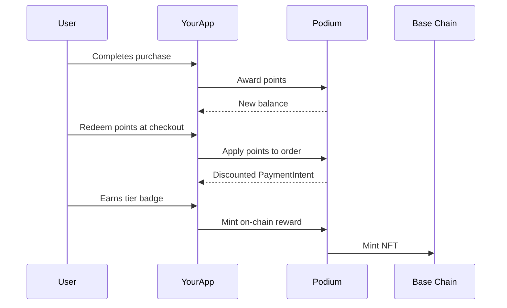

Add a loyalty program to any site that already uses Stripe or Shopify. Podium handles the points ledger, reward minting, and redemption logic — you integrate at the API layer.

## What You'll Build



## Prerequisites

```bash
npm install @podiumcommerce/node-sdk
```

```typescript
import { createPodiumClient, ApiError } from '@podiumcommerce/node-sdk';

const client = createPodiumClient({
  apiKey: process.env.PODIUM_API_KEY,
});
```

## Step 1: Award Points on Purchase

When a customer completes a purchase, award loyalty points. The points ledger is double-entry — every earn has an audit trail.

```typescript
async function awardPurchasePoints(userId: string, orderId: string, orderTotal: number) {
  const pointsToAward = Math.floor(orderTotal * 10); // 10 points per dollar

  const result = await client.user.createPoints({
    id: userId,
    requestBody: {
      amount: pointsToAward,
      type: 'EARN',
      description: `Purchase reward for order ${orderId}`,
    },
  });

  return result;
}
```

For the companion flow, you can also award points for engagement actions:

```typescript
await client.companion.createProfilePoints({
  userId,
  requestBody: {
    amount: 50,
    details: { reason: 'quiz_completion', step: 'skin_type' },
  },
});
```

## Step 2: Check Points Balance

Display the user's current balance in your loyalty dashboard.

```typescript
const points = await client.user.listPoints({ id: userId });
// points.balance — current spendable balance
// points.totalEarned — lifetime earned
// points.totalSpent — lifetime redeemed
```

## Step 3: Redeem Points at Checkout

When the user wants to apply points to an order, check the maximum discount first, then create the PaymentIntent with points applied.

```typescript
async function checkoutWithPoints(userId: string, orderId: string, pointsToSpend: number) {
  const discount = await client.userOrder.getDiscount({
    id: userId,
    orderId,
  });
  // discount.maxPoints — maximum points the user can apply
  // discount.maxDiscount — maximum dollar discount

  const safePoints = Math.min(pointsToSpend, discount.maxPoints);

  const checkout = await client.userOrder.checkout({
    id: userId,
    orderId,
    requestBody: { points: safePoints },
  });

  return checkout; // { clientSecret, amount, intentId }
}
```

The returned `amount` reflects the order total minus the points discount. If points change, the old PaymentIntent is cancelled and a new one is created.

### Handling Failed Payments

If a payment fails after points were reserved, the points are automatically reverted via the `payment_intent.payment_failed` webhook. If you need to manually trigger a revert:

```typescript
await client.userOrder.createPaymentFailed({
  id: userId,
  orderId,
});
```

## Step 4: Create On-Chain Rewards

Reward high-value customers with on-chain collectibles. Podium supports 6 reward types.

```typescript
async function createTierBadge(creatorId: string) {
  const reward = await client.nftRewards.createNftReward({
    requestBody: {
      type: 'EVENT_PASS',
      creatorId,
    },
  });

  await client.nftRewards.replace({
    id: reward.id,
    requestBody: {
      name: 'Gold Tier Badge',
      description: 'Awarded to customers who reach Gold tier (5,000+ lifetime points)',
      imageUrl: 'https://your-cdn.com/badges/gold.png',
      points: 5000,
    },
  });

  await client.nftRewards.publish({ id: reward.id });

  return reward;
}
```

### Grant a Reward to a User

```typescript
await client.nftRewards.createNftRewardGrant({
  id: rewardId,
  requestBody: {
    userId,
    creatorId,
  },
});
```

The mint is queued and processed by Podium's mint queue (runs every minute). The user receives the on-chain collectible in their Privy-managed wallet on Base.

## Step 5: Track Reward Analytics

```typescript
const growth = await client.earnedReward.getGrowth({
  id: rewardId,
  timeRange: '1M',
});

const redemptions = await client.earnedReward.getRedemption({
  id: rewardId,
  timeRange: '1M',
});

const delivered = await client.earnedReward.getDelivered({
  id: rewardId,
});
```

## Putting It Together

Here's a complete loyalty webhook handler that listens for purchases and awards points + checks for tier upgrades:

```typescript
import { createPodiumClient } from '@podiumcommerce/node-sdk';
import { Hono } from 'hono';
import { Receiver } from '@upstash/qstash';

const client = createPodiumClient({ apiKey: process.env.PODIUM_API_KEY });
const receiver = new Receiver({
  currentSigningKey: process.env.QSTASH_CURRENT_SIGNING_KEY!,
  nextSigningKey: process.env.QSTASH_NEXT_SIGNING_KEY!,
});

const GOLD_TIER_THRESHOLD = 5000;
const GOLD_BADGE_REWARD_ID = process.env.GOLD_BADGE_REWARD_ID!;

const app = new Hono();

app.post('/webhooks/purchase-processed', async (c) => {
  const signature = c.req.header('upstash-signature');
  const body = await c.req.text();
  const isValid = await receiver.verify({ signature: signature!, body });
  if (!isValid) return c.json({ error: 'Invalid signature' }, 401);

  const event = JSON.parse(body);
  const { userId, orderId, amount, creatorId } = event;

  const pointsToAward = Math.floor(amount * 10);
  await client.user.createPoints({
    id: userId,
    requestBody: {
      amount: pointsToAward,
      type: 'EARN',
      description: `Purchase reward for order ${orderId}`,
    },
  });

  const balance = await client.user.listPoints({ id: userId });
  if (balance.totalEarned >= GOLD_TIER_THRESHOLD) {
    try {
      await client.nftRewards.createNftRewardGrant({
        id: GOLD_BADGE_REWARD_ID,
        requestBody: { userId, creatorId },
      });
    } catch (err) {
      // Already granted — one per wallet enforced on-chain
    }
  }

  return c.json({ ok: true, pointsAwarded: pointsToAward });
});

export default app;
```

## Related

- [Points API Reference](/api-reference/points) — full endpoint documentation
- [Rewards & Airdrops API](/api-reference/nfts) — reward types and minting
- [Webhooks](/api-reference/webhooks) — Event handling patterns
- [Payments](/api-reference/payments) — Stripe checkout with points redemption
