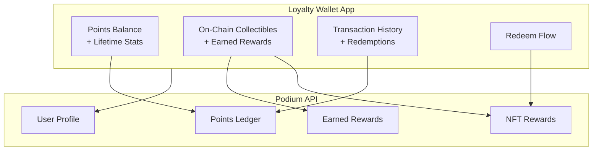

Build the canonical loyalty surface — a web or native app where users see their points, browse earned rewards, redeem collectibles, and track their engagement history. Everything reads from Podium's points ledger and reward APIs.

## What You'll Build



## Prerequisites

```bash
npm install @podiumcommerce/node-sdk
```

```typescript
import { createPodiumClient } from '@podiumcommerce/node-sdk';

const client = createPodiumClient({
  apiKey: process.env.PODIUM_API_KEY,
});
```

## Step 1: Points Dashboard

The points ledger is double-entry — every earn and spend is tracked with full audit trail.

```typescript
async function getWalletDashboard(userId: string) {
  const points = await client.user.listPoints({ id: userId });

  return {
    balance: points.balance,
    totalEarned: points.totalEarned,
    totalSpent: points.totalSpent,
    transactions: points.transactions,
  };
}
```

### React Component

```tsx
function PointsDashboard({ userId }: { userId: string }) {
  const { data, isLoading } = useQuery({
    queryKey: ['points', userId],
    queryFn: () => getWalletDashboard(userId),
  });

  if (isLoading) return <Skeleton />;

  return (
    <div className="rounded-2xl bg-gradient-to-br from-indigo-600 to-purple-700 p-6 text-white">
      <p className="text-sm opacity-80">Available Points</p>
      <p className="text-4xl font-bold">{data.balance.toLocaleString()}</p>
      <div className="mt-4 flex gap-6 text-sm">
        <div>
          <p className="opacity-60">Earned</p>
          <p className="font-medium">{data.totalEarned.toLocaleString()}</p>
        </div>
        <div>
          <p className="opacity-60">Redeemed</p>
          <p className="font-medium">{data.totalSpent.toLocaleString()}</p>
        </div>
      </div>
    </div>
  );
}
```

## Step 2: On-Chain Collectibles

Users earn on-chain rewards (collectibles, event passes, tier badges) through campaigns, purchases, and engagement. Display them in a gallery.

```typescript
async function getUserCollectibles(userId: string) {
  const nfts = await client.userNfts.list({ id: userId });
  return nfts;
}
```

### Collectible Card Component

```tsx
function CollectibleCard({ nft }: { nft: any }) {
  return (
    <div className="overflow-hidden rounded-xl border">
      
      <div className="p-3">
        <h3 className="font-semibold">{nft.name}</h3>
        <p className="text-sm text-gray-500">{nft.type}</p>
        {nft.redeemable && (
          <button className="mt-2 w-full rounded-lg bg-indigo-600 py-2 text-sm text-white">
            Redeem
          </button>
        )}
      </div>
    </div>
  );
}

function CollectiblesGrid({ userId }: { userId: string }) {
  const { data } = useQuery({
    queryKey: ['collectibles', userId],
    queryFn: () => getUserCollectibles(userId),
  });

  return (
    <div className="grid grid-cols-2 gap-4 sm:grid-cols-3">
      {data?.nfts?.map((nft: any) => (
        <CollectibleCard key={nft.id} nft={nft} />
      ))}
    </div>
  );
}
```

## Step 3: Earned Rewards

Track all rewards a user has earned — including those pending delivery.

```typescript
async function getUserRewards(userId: string) {
  const rewards = await client.user.listEarnedRewards({ id: userId });
  return rewards;
}
```

### Reward Analytics (Merchant View)

If you're building the merchant-facing side, track reward performance:

```typescript
async function getRewardAnalytics(rewardId: string) {
  const [growth, redemptions, delivered] = await Promise.all([
    client.earnedReward.getGrowth({ id: rewardId, timeRange: '1M' }),
    client.earnedReward.getRedemption({ id: rewardId, timeRange: '1M' }),
    client.earnedReward.getDelivered({ id: rewardId }),
  ]);

  return { growth, redemptions, delivered };
}
```

## Step 4: Transaction History

Show a feed of all points activity — earns, spends, and pending transactions.

```tsx
function TransactionFeed({ transactions }: { transactions: any[] }) {
  return (
    <div className="divide-y">
      {transactions.map((tx: any) => (
        <div key={tx.id} className="flex items-center justify-between py-3">
          <div>
            <p className="font-medium">{tx.description}</p>
            <p className="text-sm text-gray-500">
              {new Date(tx.createdAt).toLocaleDateString()}
            </p>
          </div>
          <span className={tx.type === 'EARN' ? 'text-green-600' : 'text-red-500'}>
            {tx.type === 'EARN' ? '+' : '-'}{tx.amount}
          </span>
        </div>
      ))}
    </div>
  );
}
```

## Step 5: Redeem at Checkout

When a user wants to spend points, check the maximum discount and apply it.

```typescript
async function redeemPoints(userId: string, orderId: string, points: number) {
  const discount = await client.userOrder.getDiscount({
    id: userId,
    orderId,
  });

  const safePoints = Math.min(points, discount.maxPoints);

  const checkout = await client.userOrder.checkout({
    id: userId,
    orderId,
    requestBody: { points: safePoints },
  });

  return {
    clientSecret: checkout.clientSecret,
    amount: checkout.amount,
    pointsApplied: safePoints,
    saved: discount.maxDiscount,
  };
}
```

## Optional: iOS Widget (WidgetKit)

For native iOS apps, expose a simple JSON endpoint that WidgetKit can poll:

```typescript
// API route: GET /api/widget/points/:userId
import { Hono } from 'hono';

const app = new Hono();

app.get('/api/widget/points/:userId', async (c) => {
  const userId = c.req.param('userId');
  const points = await client.user.listPoints({ id: userId });

  return c.json({
    balance: points.balance,
    lastEarned: points.transactions?.[0]?.amount ?? 0,
    lastEarnedAt: points.transactions?.[0]?.createdAt ?? null,
  });
});
```

The WidgetKit timeline provider fetches this endpoint and renders a compact balance display on the home screen.

## Putting It Together

```tsx
function LoyaltyWallet({ userId }: { userId: string }) {
  return (
    <div className="mx-auto max-w-md space-y-6 p-4">
      <PointsDashboard userId={userId} />

      <section>
        <h2 className="mb-3 text-lg font-bold">My Collectibles</h2>
        <CollectiblesGrid userId={userId} />
      </section>

      <section>
        <h2 className="mb-3 text-lg font-bold">Recent Activity</h2>
        <TransactionFeed transactions={[]} />
      </section>
    </div>
  );
}
```

## Related

- [Loyalty Program Recipe](/recipes/loyalty-program) — earning and redemption flows
- [Points API Reference](/api-reference/points) — full endpoint documentation
- [Rewards & Airdrops API](/api-reference/nfts) — on-chain reward management
