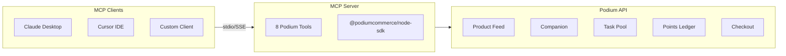

Build a full MCP server that lets Claude (or any MCP client) search products, manage taste profiles, execute purchases, create bounties, and check loyalty balances — all through natural conversation.

## What You'll Build



## Prerequisites

```bash
mkdir podium-mcp-server && cd podium-mcp-server
npm init -y
npm install @modelcontextprotocol/sdk @podiumcommerce/node-sdk zod
npm install -D typescript @types/node
```

```json
// tsconfig.json
{
  "compilerOptions": {
    "target": "ES2022",
    "module": "Node16",
    "moduleResolution": "Node16",
    "outDir": "./dist",
    "strict": true,
    "esModuleInterop": true
  },
  "include": ["src"]
}
```

## The Complete Server

```typescript
// src/index.ts
import { McpServer } from '@modelcontextprotocol/sdk/server/mcp.js';
import { StdioServerTransport } from '@modelcontextprotocol/sdk/server/stdio.js';
import { createPodiumClient } from '@podiumcommerce/node-sdk';
import { z } from 'zod';

const client = createPodiumClient({
  apiKey: process.env.PODIUM_API_KEY!,
});

const server = new McpServer({
  name: 'podium-commerce',
  version: '1.0.0',
});

// --- Product Discovery ---

server.tool(
  'search_products',
  {
    categories: z.string().optional().describe('Comma-separated category filter'),
    limit: z.number().min(1).max(50).default(10),
    page: z.number().min(1).default(1),
  },
  async ({ categories, limit, page }) => {
    const feed = await client.agentic.listProductsFeed({ categories, limit, page });
    const summary = feed.products.map((p: any) => ({
      id: p.id,
      name: p.name,
      brand: p.brand,
      price: p.price,
      intentScore: p.intentScore,
      categories: p.categories,
    }));
    return {
      content: [{
        type: 'text',
        text: JSON.stringify({ products: summary, total: feed.total, page }, null, 2),
      }],
    };
  }
);

server.tool(
  'get_product',
  { productId: z.string().describe('Product ID to look up') },
  async ({ productId }) => {
    const product = await client.product.get({ id: productId });
    return {
      content: [{ type: 'text', text: JSON.stringify(product, null, 2) }],
    };
  }
);

// --- Companion / Taste Profile ---

server.tool(
  'get_profile',
  { userId: z.string().describe('Podium user ID') },
  async ({ userId }) => {
    try {
      const profile = await client.companion.listProfile({ userId });
      return {
        content: [{ type: 'text', text: JSON.stringify(profile, null, 2) }],
      };
    } catch {
      return {
        content: [{ type: 'text', text: 'No profile found for this user.' }],
      };
    }
  }
);

server.tool(
  'update_profile',
  {
    userId: z.string(),
    skinType: z.string().optional(),
    concerns: z.array(z.string()).optional(),
    priceMin: z.number().optional(),
    priceMax: z.number().optional(),
    brands: z.array(z.string()).optional(),
    avoidances: z.array(z.string()).optional(),
  },
  async ({ userId, skinType, concerns, priceMin, priceMax, brands, avoidances }) => {
    const requestBody: Record<string, any> = {};
    if (skinType) requestBody.skinType = skinType;
    if (concerns) requestBody.concerns = concerns;
    if (priceMin !== undefined || priceMax !== undefined) {
      requestBody.priceRange = { min: priceMin ?? 0, max: priceMax ?? 500 };
    }
    if (brands) requestBody.brands = brands;
    if (avoidances) requestBody.avoidances = avoidances;

    const profile = await client.companion.updateProfile({ userId, requestBody });
    return {
      content: [{ type: 'text', text: JSON.stringify(profile, null, 2) }],
    };
  }
);

server.tool(
  'get_recommendations',
  {
    userId: z.string().describe('Podium user ID'),
    count: z.number().min(1).max(20).default(5),
    category: z.string().optional(),
  },
  async ({ userId, count, category }) => {
    const recs = await client.companion.listRecommendations({ userId, count, category });
    return {
      content: [{ type: 'text', text: JSON.stringify(recs, null, 2) }],
    };
  }
);

// --- Points & Loyalty ---

server.tool(
  'check_points',
  { userId: z.string().describe('Podium user ID') },
  async ({ userId }) => {
    const points = await client.user.listPoints({ id: userId });
    return {
      content: [{
        type: 'text',
        text: `Balance: ${points.balance} points\nLifetime earned: ${points.totalEarned}\nLifetime spent: ${points.totalSpent}`,
      }],
    };
  }
);

// --- Checkout ---

server.tool(
  'create_checkout',
  {
    productId: z.string(),
    quantity: z.number().min(1).default(1),
    email: z.string().email(),
    firstName: z.string(),
    lastName: z.string(),
    street: z.string(),
    city: z.string(),
    state: z.string(),
    postalCode: z.string(),
    countryCode: z.string().default('US'),
  },
  async ({ productId, quantity, email, firstName, lastName, street, city, state, postalCode, countryCode }) => {
    const session = await client.agentic.createCheckoutSessions({
      requestBody: {
        items: [{ id: productId, quantity }],
        shippingAddress: {
          firstName,
          lastName,
          address: {
            line1: street,
            line2: null,
            city,
            state,
            postalCode,
            countryCode,
          },
        },
      },
    });

    await client.agentic.updateCheckoutSessions({
      id: session.id,
      requestBody: { email },
    });

    return {
      content: [{
        type: 'text',
        text: JSON.stringify({
          sessionId: session.id,
          total: session.total,
          status: session.status,
          message: 'Checkout session created. Payment can be completed via x402 USDC.',
        }, null, 2),
      }],
    };
  }
);

// --- Tasks ---

server.tool(
  'list_tasks',
  {},
  async () => {
    const tasks = await client.tasks.listTasks();
    return {
      content: [{ type: 'text', text: JSON.stringify(tasks, null, 2) }],
    };
  }
);

// --- Connect and run ---

const transport = new StdioServerTransport();
await server.connect(transport);
```

## Claude Desktop Configuration

Add to `~/Library/Application Support/Claude/claude_desktop_config.json` (macOS) or `%APPDATA%\Claude\claude_desktop_config.json` (Windows):

```json
{
  "mcpServers": {
    "podium": {
      "command": "node",
      "args": ["dist/index.js"],
      "cwd": "/path/to/podium-mcp-server",
      "env": {
        "PODIUM_API_KEY": "podium_live_sk_..."
      }
    }
  }
}
```

## Build and Test

```bash
npx tsc
node dist/index.js
```

Restart Claude Desktop after updating the config. You should see "podium" in the MCP tools panel.

### Example Conversations

**Product Discovery:**
> "Search for skincare products under $30 that are good for dry skin"

Claude calls `search_products` with categories, then `get_recommendations` with the user's profile.

**Purchase Flow:**
> "Buy the CeraVe Moisturizing Cream for me, ship to 123 Main St, SF CA 94102"

Claude calls `get_product` to confirm details, then `create_checkout` with the shipping info.

**Loyalty Check:**
> "How many points do I have? What can I redeem?"

Claude calls `check_points` and presents the balance.

## Adding More Tools

The pattern is consistent — wrap any SDK method as an MCP tool:

```typescript
server.tool(
  'record_interaction',
  {
    userId: z.string(),
    productId: z.string(),
    action: z.enum(['RANK_UP', 'RANK_DOWN', 'SKIP', 'PURCHASE_INTENT']),
  },
  async ({ userId, productId, action }) => {
    await client.companion.createInteractions({
      requestBody: { userId, productId, action },
    });
    return { content: [{ type: 'text', text: `Recorded ${action} for product ${productId}` }] };
  }
);
```

## Related

- [Agent-to-Agent Commerce](/recipes/agent-commerce) — MCP, A2A, and LangChain patterns
- [Agentic Product Feed](/agentic/product-feed) — the discovery endpoint agents use
- [SDK Setup](/sdk/setup) — client configuration reference
