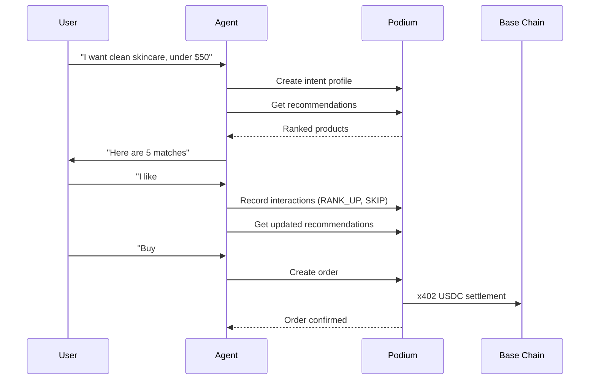

Build an agent that learns what a user wants through structured preferences, delivers personalized product recommendations, and can purchase on their behalf. The [Beauty Companion](/agentic/beauty-companion) is a live implementation of this pattern.

## What You'll Build



## Prerequisites

```bash
npm install @podium-sdk/node-sdk
```

```typescript
import { createPodiumClient, ApiError } from '@podium-sdk/node-sdk';

const client = createPodiumClient({
  apiKey: process.env.PODIUM_API_KEY,
});
```

## Step 1: Create an Intent Profile

The intent profile is the agent's understanding of what the user wants. Build it from a quiz, conversation, or any structured input.

```typescript
async function createUserProfile(userId: string, preferences: {
  skinType: string;
  concerns: string[];
  priceRange: { min: number; max: number };
  brands: string[];
  avoidances: string[];
}) {
  const profile = await client.companion.createProfile({
    userId,
    requestBody: preferences,
  });

  return profile;
}

await createUserProfile('user_abc', {
  skinType: 'combination',
  concerns: ['acne', 'dark spots', 'texture'],
  priceRange: { min: 15, max: 50 },
  brands: ['CeraVe', 'The Ordinary', 'Paula\'s Choice'],
  avoidances: ['parabens', 'fragrance', 'sulfates'],
});
```

### Incremental Profile Updates

For step-by-step quiz flows, use `PATCH` to add fields without overwriting the full profile:

```typescript
await client.companion.updateProfile({
  userId: 'user_abc',
  requestBody: {
    skinType: 'combination',
  },
});

// Later, add concerns
await client.companion.updateProfile({
  userId: 'user_abc',
  requestBody: {
    concerns: ['acne', 'dark spots'],
  },
});
```

## Step 2: Get Personalized Recommendations

The recommendation engine uses the intent profile, interaction history, and enrichment baselines to rank products.

```typescript
const recs = await client.companion.listRecommendations({
  userId: 'user_abc',
  count: 5,
  category: 'skincare',
});

for (const product of recs.recommendations) {
  console.log(`${product.name} by ${product.brand} — $${product.price}`);
  console.log(`  Score: ${product.relevanceScore}`);
  console.log(`  Reason: ${product.matchReason}`);
}
```

## Step 3: Record Interactions

Every interaction signal improves future recommendations. The agent records explicit feedback — not passive tracking.

```typescript
type InteractionAction = 'RANK_UP' | 'RANK_DOWN' | 'SKIP' | 'PURCHASED' | 'PURCHASE_INTENT' | 'NUDGE_OPENED';

async function recordInteraction(
  userId: string,
  productId: string,
  action: InteractionAction,
  score?: number
) {
  await client.companion.createInteractions({
    requestBody: {
      userId,
      productId,
      action,
      score, // optional 0-1 normalized relevance score
    },
  });
}

await recordInteraction('user_abc', 'prod_serum_01', 'RANK_UP');
await recordInteraction('user_abc', 'prod_cream_02', 'SKIP');
await recordInteraction('user_abc', 'prod_serum_01', 'PURCHASE_INTENT');
```

### Retrieve Interaction History

```typescript
const interactions = await client.companion.listInteractions({
  userId: 'user_abc',
});
```

## Step 4: Browse the Product Catalog

The companion has its own product catalog with filtering:

```typescript
const products = await client.companion.listProducts({
  category: 'skincare',
  minPrice: 15,
  maxPrice: 50,
  inStock: true,
  search: 'retinol',
  limit: 20,
  offset: 0,
});
```

## Step 5: Place an Order

When the user confirms a purchase, create a concierge order. The order starts in `PENDING_PAYMENT` and must be settled via x402 USDC.

```typescript
async function placeOrder(
  userId: string,
  productId: string,
  email: string,
  shippingAddress: { street: string; city: string; state: string; zip: string }
) {
  const order = await client.companion.createOrders({
    requestBody: {
      userId,
      productId,
      shippingAddress,
      email,
    },
  });

  await recordInteraction(userId, productId, 'PURCHASED');

  return order;
}
```

### Track Order Status

```typescript
const orders = await client.companion.listOrders({
  userId: 'user_abc',
});

for (const order of orders.orders) {
  console.log(`${order.id}: ${order.status}`);
  // PENDING_PAYMENT → PAID → FULFILLING → SHIPPED → DELIVERED
}
```

### Update Order Status (Admin)

```typescript
await client.companion.updateOrders({
  orderId: 'order_xyz',
  requestBody: {
    status: 'SHIPPED',
    fulfillmentNotes: 'Tracking: 1Z999AA10123456784',
  },
});
```

## Step 6: Award Engagement Points

Reward users for interacting with the agent — quiz completions, swipe sessions, purchases.

```typescript
await client.companion.createProfilePoints({
  userId: 'user_abc',
  requestBody: {
    amount: 100,
    details: { reason: 'quiz_completion', step: 'full_profile' },
  },
});
```

## Putting It Together

Here's a complete agent loop — the core of what a Telegram bot, MCP server, or mobile app would run:

```typescript
import { createPodiumClient } from '@podium-sdk/node-sdk';

const client = createPodiumClient({ apiKey: process.env.PODIUM_API_KEY });

async function agentLoop(userId: string) {
  let profile = await client.companion.listProfile({ userId }).catch(() => null);

  if (!profile) {
    profile = await client.companion.createProfile({
      userId,
      requestBody: {
        skinType: 'combination',
        concerns: ['hydration'],
        priceRange: { min: 10, max: 40 },
        brands: [],
        avoidances: ['fragrance'],
      },
    });
  }

  const recs = await client.companion.listRecommendations({
    userId,
    count: 5,
  });

  // Present to user, collect feedback
  for (const rec of recs.recommendations) {
    const userAction = await getUserFeedback(rec); // your UI layer

    await client.companion.createInteractions({
      requestBody: {
        userId,
        productId: rec.productId,
        action: userAction, // 'RANK_UP', 'SKIP', etc.
      },
    });

    if (userAction === 'PURCHASE_INTENT') {
      const order = await client.companion.createOrders({
        requestBody: {
          userId,
          productId: rec.productId,
          shippingAddress: await getShippingAddress(userId),
          email: await getUserEmail(userId),
        },
      });
      console.log(`Order created: ${order.id}`);
    }
  }

  await client.companion.createProfilePoints({
    userId,
    requestBody: { amount: 25, details: { reason: 'session_complete' } },
  });
}
```

## Related

- [Companion API Reference](/api-reference/companion) — full endpoint documentation
- [Beauty Companion](/agentic/beauty-companion) — live Telegram bot implementation
- [Enrichment Pipeline](/agentic/enrichment-pipeline) — how product intelligence feeds recommendations
- [Agentic Product Feed](/agentic/product-feed) — the agent-native discovery surface
