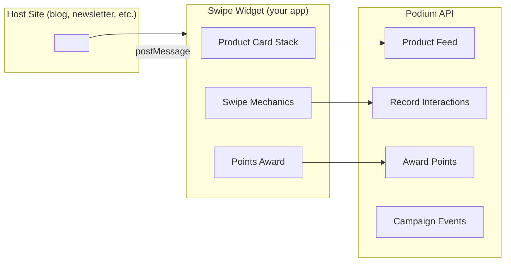

Build a Tinder-style product swipe widget that can be embedded on any site — a newsletter, a blog, an email landing page, a creator's Substack. Each swipe captures intent signals and awards points for engagement.

## What You'll Build



## Prerequisites

```bash
npx create-vite swipe-widget --template react-ts
cd swipe-widget
npm install @podium-sdk/node-sdk framer-motion
```

## Step 1: Fetch Products for the Stack

Load products from the agentic product feed, personalized if you have a user ID.

```typescript
import { createPodiumClient } from '@podium-sdk/node-sdk';

const client = createPodiumClient({
  apiKey: import.meta.env.VITE_PODIUM_API_KEY,
});

async function loadProductStack(userId?: string, category?: string) {
  if (userId) {
    const recs = await client.companion.listRecommendations({
      userId,
      count: 20,
      category,
    });
    return recs.recommendations;
  }

  const feed = await client.agentic.listProductsFeed({
    categories: category,
    limit: 20,
  });
  return feed.products;
}
```

## Step 2: Swipe Card Component

Each card is a full-bleed product image with name and price. Swipe right = interested, left = skip.

```tsx
import { motion, useMotionValue, useTransform } from 'framer-motion';

interface SwipeCardProps {
  product: any;
  onSwipe: (direction: 'left' | 'right') => void;
}

function SwipeCard({ product, onSwipe }: SwipeCardProps) {
  const x = useMotionValue(0);
  const rotate = useTransform(x, [-200, 200], [-15, 15]);
  const rightOpacity = useTransform(x, [0, 100], [0, 1]);
  const leftOpacity = useTransform(x, [-100, 0], [1, 0]);

  function handleDragEnd(_: any, info: { offset: { x: number } }) {
    if (Math.abs(info.offset.x) > 100) {
      onSwipe(info.offset.x > 0 ? 'right' : 'left');
    }
  }

  return (
    <motion.div
      drag="x"
      dragConstraints={{ left: 0, right: 0 }}
      style={{ x, rotate }}
      onDragEnd={handleDragEnd}
      className="absolute inset-0 cursor-grab overflow-hidden rounded-2xl bg-white shadow-xl"
    >
      
      <div className="p-4">
        <h3 className="text-lg font-bold">{product.name}</h3>
        <p className="text-sm text-gray-500">{product.brand}</p>
        <p className="mt-1 text-xl font-semibold">${product.price}</p>
      </div>

      <motion.div
        style={{ opacity: rightOpacity }}
        className="absolute left-4 top-4 rounded-lg bg-green-500 px-3 py-1 text-white"
      >
        LIKE
      </motion.div>
      <motion.div
        style={{ opacity: leftOpacity }}
        className="absolute right-4 top-4 rounded-lg bg-red-500 px-3 py-1 text-white"
      >
        SKIP
      </motion.div>
    </motion.div>
  );
}
```

## Step 3: Record Swipe Interactions

Every swipe is an intent signal. Record it through the companion API and award points.

```typescript
async function recordSwipe(
  userId: string,
  productId: string,
  direction: 'left' | 'right'
) {
  const action = direction === 'right' ? 'RANK_UP' : 'RANK_DOWN';

  await client.companion.createInteractions({
    requestBody: { userId, productId, action },
  });

  if (direction === 'right') {
    await client.user.awardPoints({
      id: userId,
      requestBody: {
        amount: 5,
        reason: 'Product swipe engagement',
      },
    });
  }
}
```

## Step 4: Widget Shell with postMessage

The widget communicates with the parent frame via `postMessage` — reporting completion, swipe counts, and any purchase intent.

```tsx
import { useState, useEffect } from 'react';

function SwipeWidget() {
  const [products, setProducts] = useState<any[]>([]);
  const [currentIndex, setCurrentIndex] = useState(0);
  const [stats, setStats] = useState({ liked: 0, skipped: 0 });

  const params = new URLSearchParams(window.location.search);
  const userId = params.get('userId');
  const category = params.get('category');
  const campaignId = params.get('campaignId');

  useEffect(() => {
    loadProductStack(userId ?? undefined, category ?? undefined)
      .then(setProducts);
  }, []);

  async function handleSwipe(direction: 'left' | 'right') {
    if (userId) {
      await recordSwipe(userId, products[currentIndex].id, direction);
    }

    const newStats = {
      liked: stats.liked + (direction === 'right' ? 1 : 0),
      skipped: stats.skipped + (direction === 'left' ? 1 : 0),
    };
    setStats(newStats);

    if (currentIndex >= products.length - 1) {
      window.parent.postMessage({
        type: 'podium:swipe-complete',
        stats: newStats,
        campaignId,
      }, '*');
    } else {
      setCurrentIndex(currentIndex + 1);
    }
  }

  if (!products.length) return <div className="flex h-full items-center justify-center">Loading...</div>;

  const product = products[currentIndex];
  if (!product) {
    return (
      <div className="flex h-full flex-col items-center justify-center p-6 text-center">
        <p className="text-2xl font-bold">All done!</p>
        <p className="mt-2 text-gray-500">
          You liked {stats.liked} products and earned {stats.liked * 5} points.
        </p>
      </div>
    );
  }

  return (
    <div className="relative h-full w-full">
      <SwipeCard product={product} onSwipe={handleSwipe} />
      <div className="absolute bottom-4 left-0 right-0 text-center text-sm text-gray-400">
        {currentIndex + 1} / {products.length}
      </div>
    </div>
  );
}
```

## Step 5: Embed on Any Site

Build and host the widget, then embed it anywhere with a single iframe.

```html
<!-- Embed on a blog, newsletter, Substack, etc. -->
<iframe
  src="https://swipe.yourdomain.com/?userId=usr_abc123&category=skincare&campaignId=camp_xyz"
  width="320"
  height="480"
  style="border: none; border-radius: 16px; box-shadow: 0 4px 24px rgba(0,0,0,0.12);"
  allow="clipboard-write"
></iframe>
```

### Listen for Completion on the Parent

```javascript
window.addEventListener('message', (event) => {
  if (event.data?.type === 'podium:swipe-complete') {
    console.log('User completed swipe session:', event.data.stats);
    // Show CTA, redirect, update UI, etc.
  }
});
```

## Step 6: Campaign Integration

Tie the swipe widget to a campaign for structured engagement tracking.

```typescript
async function recordCampaignEngagement(
  userId: string,
  campaignId: string,
  swipeStats: { liked: number; skipped: number }
) {
  await client.campaign.createVote({
    id: campaignId,
    requestBody: {
      userId,
      metadata: {
        liked: swipeStats.liked,
        skipped: swipeStats.skipped,
        completedAt: new Date().toISOString(),
      },
    },
  });
}
```

## Architecture Notes

- **No auth required for anonymous users** — the widget works without a `userId`, using the general product feed instead of personalized recommendations
- **Points only award for authenticated users** — anonymous swipes still capture aggregate signals
- **postMessage API** — keeps the widget decoupled from the host site; no shared state or cookies needed
- **Campaign tracking** — optional but recommended for measuring engagement across different embed locations

## Related

- [Agentic Product Feed](/agentic/product-feed) — the discovery API powering the card stack
- [Companion API](/api-reference/companion) — interaction recording and recommendations
- [Campaigns API](/api-reference/campaigns) — structured engagement tracking
- [Points API](/api-reference/points) — points award and balance
