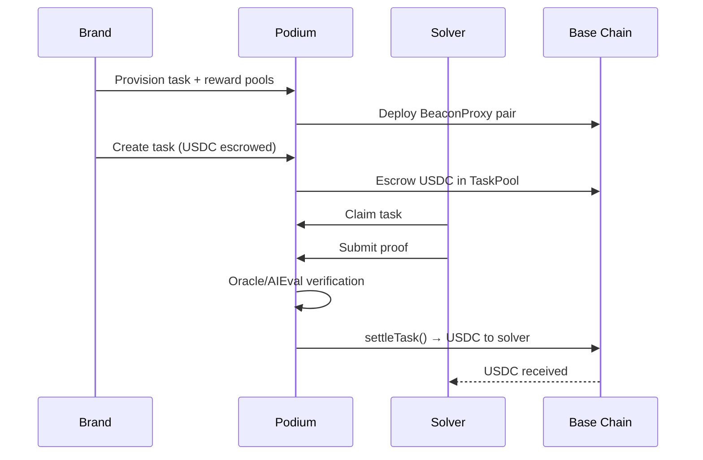

Build a bounty board where brands post USDC-rewarded tasks and solvers (humans or AI agents) claim, complete, and get paid. All escrow and settlement happen on-chain via Podium's Task Pool V2 contracts on Base.

## What You'll Build



## Prerequisites

```bash
npm install @podiumcommerce/node-sdk
```

```typescript
import { createPodiumClient, ApiError } from '@podiumcommerce/node-sdk';

const client = createPodiumClient({
  apiKey: process.env.PODIUM_API_KEY,
});
```

## Step 1: Provision Task Pools

Every organization needs a TaskPool + RewardPool pair deployed on-chain. This is idempotent — calling it again returns existing pools.

```typescript
const pools = await client.tasks.provisionTenantPools();
// pools.taskPoolAddress — on-chain TaskPool contract
// pools.rewardPoolAddress — on-chain RewardPool contract
```

### Check Pool Status

```typescript
const poolInfo = await client.tasks.getTenantPools();
console.log(`Task Pool: ${poolInfo.taskPoolAddress}`);
console.log(`Reward Pool: ${poolInfo.rewardPoolAddress}`);
console.log(`USDC Balance: ${poolInfo.usdcBalance}`);
console.log(`Pending Rewards: ${poolInfo.pendingRewards}`);
```

## Step 2: Create a Task

Each task escrows USDC on-chain. The brand must have sufficient treasury balance.

<CodeGroup>

```typescript SDK
const task = await client.tasks.createTask();
```

```bash cURL
curl -X POST https://api.podium.build/api/v1/tasks \
  -H "Authorization: Bearer $PODIUM_API_KEY" \
  -H "Content-Type: application/json" \
  -d '{
    "title": "Write a product review for CeraVe Moisturizer",
    "description": "Write a 200+ word review covering texture, effectiveness, and value. Include a photo of the product.",
    "rewardAmount": "10.00",
    "deadline": "2026-04-01T00:00:00Z",
    "verificationType": "AI_EVAL",
    "campaignId": "clcamp_xyz",
    "maxSolvers": 5,
    "requirements": {
      "minWordCount": 200,
      "requirePhoto": true
    }
  }'
```

</CodeGroup>

### Task Lifecycle

| Status | Meaning |
|--------|---------|
| `OPEN` | Available for solvers to claim |
| `CLAIMED` | Solver has claimed, working on it |
| `SUBMITTED` | Proof submitted, awaiting verification |
| `PENDING_REVIEW` | Oracle flagged for manual review (low confidence) |
| `COMPLETED` | Verified and USDC settled to solver |
| `CANCELLED` | Brand cancelled, USDC refunded |
| `EXPIRED` | Deadline passed without completion |

## Step 3: Solver Claims a Task

Solvers browse available tasks and claim one. The public solver feed doesn't require authentication.

```bash
curl https://api.podium.build/api/v1/solver/tasks \
  -H "Content-Type: application/json"
```

```bash
curl -X POST https://api.podium.build/api/v1/solver/tasks/{taskId}/claim \
  -H "Authorization: Bearer $SOLVER_API_KEY"
```

## Step 4: Submit Proof

The solver submits proof of completion. The format depends on the task's verification type.

```bash
curl -X POST https://api.podium.build/api/v1/solver/tasks/{taskId}/submit \
  -H "Authorization: Bearer $SOLVER_API_KEY" \
  -H "Content-Type: application/json" \
  -d '{
    "proofUrl": "https://example.com/my-review",
    "proofText": "Full review text here...",
    "proofImageUrl": "https://example.com/product-photo.jpg"
  }'
```

## Step 5: Verification

Podium supports three verification methods:

| Method | How It Works | Best For |
|--------|-------------|----------|
| **Oracle** | External oracle service evaluates and signs | High-value tasks needing trusted evaluation |
| **AI Eval** | AI evaluates submission against criteria | Content tasks, reviews, UGC |
| **Consensus** | Multiple judges vote on quality | Community-driven verification |

When an AI Eval or Oracle returns low confidence, the task is flagged for manual admin review:

```typescript
const pendingReview = await client.admin.getTasksPendingReview();

for (const task of pendingReview.tasks) {
  console.log(`Task ${task.id}: confidence ${task.confidence}`);
  
  // Approve or reject manually
  await client.admin.resolveTaskManually();
}
```

## Step 6: Settlement

On successful verification, the `VerificationEngine` contract calls `TaskPool.settleTask()`, releasing escrowed USDC to the solver's wallet via the RewardPool.

### Monitor Task Status

```typescript
const task = await client.tasks.getTask();
// task.status — current lifecycle state
// task.settlementTxHash — on-chain settlement transaction
// task.solverAddress — who completed it
```

### Cancel a Task

If a task needs to be withdrawn before completion:

```typescript
await client.tasks.cancelTask();
```

Cancellation calls the on-chain `cancelTask()` function, refunding escrowed USDC to the brand's treasury.

## Step 7: List Tasks

```typescript
const tasks = await client.tasks.listTasks();

for (const task of tasks.tasks) {
  console.log(`${task.title}: ${task.status} — $${task.rewardAmount} USDC`);
}
```

## Intent-Based Settlement

Tasks can be linked to reward intents for campaign-driven settlement:

```typescript
const intents = await client.intent.list();

await client.intent.create();
// Creates a USDC reward intent on-chain

await client.intent.update();
// Toggle intent-based settlement on/off for campaigns
```

## Putting It Together

Here's a complete task management flow for a brand dashboard:

```typescript
import { createPodiumClient } from '@podiumcommerce/node-sdk';

const client = createPodiumClient({ apiKey: process.env.PODIUM_API_KEY });

async function setupBountyBoard() {
  const pools = await client.tasks.provisionTenantPools();
  console.log(`Pools ready: ${pools.taskPoolAddress}`);

  const task = await client.tasks.createTask();
  console.log(`Task created: ${task.id}`);

  // Monitor task progress
  const interval = setInterval(async () => {
    const updated = await client.tasks.getTask();

    if (updated.status === 'COMPLETED') {
      console.log(`Task settled! TX: ${updated.settlementTxHash}`);
      clearInterval(interval);
    }

    if (updated.status === 'PENDING_REVIEW') {
      console.log('Task flagged for review — check admin dashboard');
    }
  }, 30_000);
}

async function adminReviewLoop() {
  const pending = await client.admin.getTasksPendingReview();

  for (const task of pending.tasks) {
    const shouldApprove = await reviewSubmission(task);
    await client.admin.resolveTaskManually();
  }
}
```

## Related

- [Task Pool API Reference](/api-reference/task-pool-api) — full endpoint documentation
- [Task Pool Contracts](/contracts/task-pool) — on-chain architecture
- [Smart Contract Reference](/contracts/reference) — function signatures and events
- [x402 Payments](/agentic/x402-payments) — USDC settlement protocol
