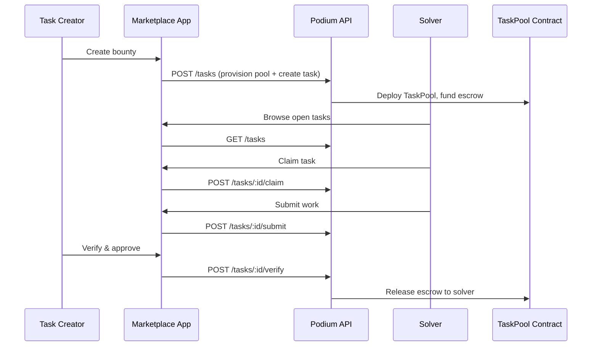
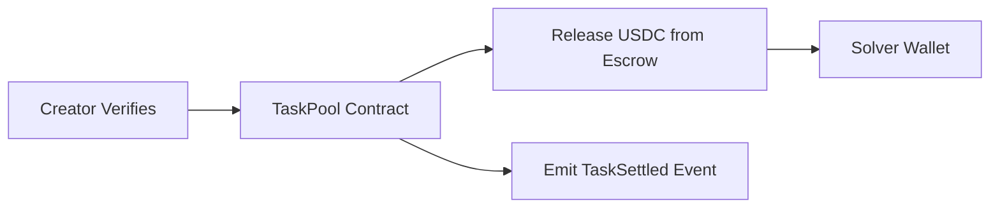

Build a full task marketplace — a web app where merchants or users create bounties (data labeling, product reviews, content creation), solvers claim and complete them, and settlement flows through Podium's task pool contracts.

## What You'll Build



## Prerequisites

```bash
npm install @podium-sdk/node-sdk
```

```typescript
import { createPodiumClient } from '@podium-sdk/node-sdk';

const client = createPodiumClient({
  apiKey: process.env.PODIUM_API_KEY,
});
```

## Step 1: Create a Task Pool

Before creating tasks, provision a task pool. This deploys the on-chain escrow contract.

```typescript
async function createTaskPool(params: {
  name: string;
  description: string;
  totalBudget: number;
  maxSolvers: number;
}) {
  const pool = await client.tasks.createTaskPools({
    requestBody: {
      name: params.name,
      description: params.description,
      totalBudget: params.totalBudget,
      maxSolvers: params.maxSolvers,
    },
  });

  return pool;
}
```

## Step 2: Create Individual Tasks

Each task within a pool has its own reward amount and requirements.

```typescript
async function createTask(poolId: string, params: {
  title: string;
  description: string;
  reward: number;
  deadline: string;
  requirements: string[];
}) {
  const task = await client.tasks.createTasks({
    requestBody: {
      poolId,
      title: params.title,
      description: params.description,
      reward: params.reward,
      deadline: params.deadline,
      requirements: params.requirements,
    },
  });

  return task;
}

// Create a batch of bounties
const pool = await createTaskPool({
  name: 'Q1 Product Reviews',
  description: 'Honest product reviews with photos',
  totalBudget: 5000,
  maxSolvers: 100,
});

await createTask(pool.id, {
  title: 'Review: CeraVe Moisturizing Cream',
  description: 'Write 200+ word review with before/after photos. Must show 2+ weeks of usage.',
  reward: 50,
  deadline: '2026-04-01T00:00:00Z',
  requirements: ['200+ words', 'Photos required', '2-week usage minimum'],
});
```

## Step 3: Public Task Feed

Build the browsing experience for solvers. List open tasks with filters.

```typescript
async function listOpenTasks(filters?: {
  poolId?: string;
  minReward?: number;
  status?: string;
}) {
  const tasks = await client.tasks.listTasks();

  let filtered = tasks.tasks ?? [];

  if (filters?.poolId) {
    filtered = filtered.filter((t: any) => t.poolId === filters.poolId);
  }
  if (filters?.minReward) {
    filtered = filtered.filter((t: any) => t.reward >= filters.minReward);
  }
  if (filters?.status) {
    filtered = filtered.filter((t: any) => t.status === filters.status);
  }

  return filtered;
}
```

### Task Card Component

```tsx
function TaskCard({ task, onClaim }: { task: any; onClaim: (id: string) => void }) {
  return (
    <div className="rounded-xl border p-5">
      <div className="flex items-start justify-between">
        <div>
          <h3 className="font-semibold">{task.title}</h3>
          <p className="mt-1 text-sm text-gray-500">{task.description}</p>
        </div>
        <span className="rounded-full bg-green-100 px-3 py-1 text-sm font-medium text-green-800">
          ${task.reward}
        </span>
      </div>

      <div className="mt-3 flex flex-wrap gap-2">
        {task.requirements?.map((req: string, i: number) => (
          <span key={i} className="rounded-md bg-gray-100 px-2 py-1 text-xs">
            {req}
          </span>
        ))}
      </div>

      <div className="mt-4 flex items-center justify-between">
        <span className="text-sm text-gray-400">
          Due {new Date(task.deadline).toLocaleDateString()}
        </span>
        {task.status === 'OPEN' && (
          <button
            onClick={() => onClaim(task.id)}
            className="rounded-lg bg-indigo-600 px-4 py-2 text-sm text-white"
          >
            Claim Bounty
          </button>
        )}
      </div>
    </div>
  );
}
```

## Step 4: Solver Claim Flow

When a solver claims a task, they commit to completing it. Podium's task pool tracks the assignment.

```typescript
async function claimTask(taskId: string) {
  const response = await fetch(
    `${process.env.PODIUM_BASE_URL}/api/v1/task-pools/${taskId}/claim`,
    {
      method: 'POST',
      headers: {
        Authorization: `Bearer ${process.env.PODIUM_API_KEY}`,
        'Content-Type': 'application/json',
      },
    }
  );

  if (!response.ok) throw new Error('Failed to claim task');
  return response.json();
}
```

<Note>
Solver-specific routes (claim, submit, verify) may not be available in the generated SDK yet. Use direct HTTP calls for these endpoints as shown above.
</Note>

## Step 5: Submit and Verify

After completing the work, the solver submits evidence. The task creator then verifies and approves settlement.

```typescript
async function submitWork(taskId: string, submission: {
  content: string;
  proofUrl: string;
  metadata?: Record<string, string>;
}) {
  const response = await fetch(
    `${process.env.PODIUM_BASE_URL}/api/v1/task-pools/${taskId}/submit`,
    {
      method: 'POST',
      headers: {
        Authorization: `Bearer ${process.env.PODIUM_API_KEY}`,
        'Content-Type': 'application/json',
      },
      body: JSON.stringify(submission),
    }
  );

  return response.json();
}

async function verifyAndSettle(taskId: string, approved: boolean) {
  const response = await fetch(
    `${process.env.PODIUM_BASE_URL}/api/v1/task-pools/${taskId}/verify`,
    {
      method: 'POST',
      headers: {
        Authorization: `Bearer ${process.env.PODIUM_API_KEY}`,
        'Content-Type': 'application/json',
      },
      body: JSON.stringify({ approved }),
    }
  );

  return response.json();
}
```

## Step 6: Settlement Dashboard

Track the lifecycle of all tasks in a pool.

```tsx
function PoolDashboard({ poolId }: { poolId: string }) {
  const { data: tasks } = useQuery({
    queryKey: ['pool-tasks', poolId],
    queryFn: () => listOpenTasks({ poolId }),
  });

  const stats = {
    open: tasks?.filter((t: any) => t.status === 'OPEN').length ?? 0,
    claimed: tasks?.filter((t: any) => t.status === 'CLAIMED').length ?? 0,
    submitted: tasks?.filter((t: any) => t.status === 'SUBMITTED').length ?? 0,
    settled: tasks?.filter((t: any) => t.status === 'SETTLED').length ?? 0,
  };

  return (
    <div>
      <div className="grid grid-cols-4 gap-4">
        <StatCard label="Open" value={stats.open} color="blue" />
        <StatCard label="In Progress" value={stats.claimed} color="yellow" />
        <StatCard label="Review" value={stats.submitted} color="purple" />
        <StatCard label="Settled" value={stats.settled} color="green" />
      </div>

      <div className="mt-6 space-y-4">
        {tasks?.map((task: any) => (
          <TaskCard key={task.id} task={task} onClaim={() => {}} />
        ))}
      </div>
    </div>
  );
}
```

## On-Chain Settlement

Under the hood, when a task is verified, the TaskPool smart contract releases USDC from escrow to the solver's wallet. The settlement is fully on-chain.



For more on the contract internals, see the [TaskPool Contract Reference](/contracts/task-pool).

## Related

- [Task Bounty Board Recipe](/recipes/task-bounty-board) — simpler task lifecycle example
- [Task Pool API Reference](/api-reference/task-pool-api) — full endpoint docs
- [TaskPool Smart Contract](/contracts/task-pool) — on-chain escrow and settlement
