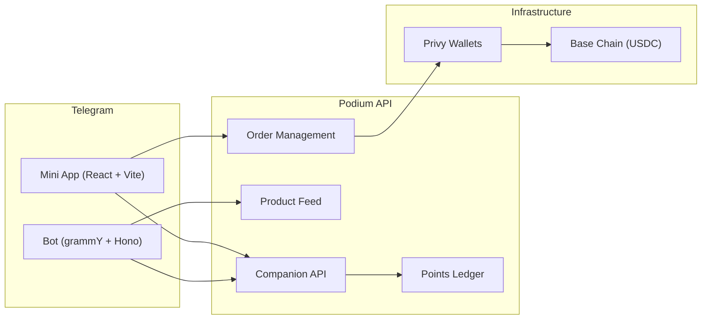

Build a Telegram bot that acts as a personal shopping agent and a Mini App for rich product browsing. The [Beauty Companion](/agentic/beauty-companion) is a production implementation of this pattern — a personal skincare advisor deployed as a Telegram bot + Mini App on Podium infrastructure.

## What You'll Build



## Architecture

| Component | Stack | Role |
|-----------|-------|------|
| Bot | grammY + Hono on Bun | Webhook-based bot for commands and conversation |
| Mini App | React + Vite + Tailwind CSS | Rich UI for browsing, swiping, and purchasing |
| Backend | Podium SDK + Privy server SDK | Wallet management, order creation, points |
| Payments | x402 protocol | USDC settlement on Base |

## Prerequisites

```bash
mkdir my-shopping-bot && cd my-shopping-bot
npm init -y
npm install grammy hono @podiumcommerce/node-sdk @privy-io/server-auth
```

## Step 1: Bot Setup with grammY

```typescript
import { Bot, webhookCallback } from 'grammy';
import { Hono } from 'hono';
import { createPodiumClient } from '@podiumcommerce/node-sdk';

const bot = new Bot(process.env.TELEGRAM_BOT_TOKEN!);
const client = createPodiumClient({ apiKey: process.env.PODIUM_API_KEY });

const userMap = new Map<number, string>(); // telegramId → podiumUserId

bot.command('start', async (ctx) => {
  const telegramId = ctx.from!.id.toString();

  const user = await client.companion.listUser({ telegramId });
  userMap.set(ctx.from!.id, user.userId);

  await ctx.reply(
    `Welcome! I'm your personal shopping companion.\n\n` +
    `Commands:\n` +
    `/profile — View your taste profile\n` +
    `/recommend — Get personalized picks\n` +
    `/points — Check your points balance\n` +
    `/shop — Open the Mini App`,
    {
      reply_markup: {
        inline_keyboard: [[
          { text: '🛍 Open Shop', web_app: { url: process.env.MINI_APP_URL! } }
        ]]
      }
    }
  );
});

bot.command('profile', async (ctx) => {
  const userId = userMap.get(ctx.from!.id);
  if (!userId) return ctx.reply('Please /start first.');

  try {
    const profile = await client.companion.listProfile({ userId });
    await ctx.reply(
      `Your Profile:\n` +
      `Skin type: ${profile.skinType ?? 'Not set'}\n` +
      `Concerns: ${profile.concerns?.join(', ') ?? 'None'}\n` +
      `Budget: $${profile.priceRange?.min ?? '?'}–$${profile.priceRange?.max ?? '?'}\n` +
      `Brands: ${profile.brands?.join(', ') ?? 'None'}`
    );
  } catch {
    await ctx.reply('No profile yet. Take the quiz in the Mini App!');
  }
});

bot.command('recommend', async (ctx) => {
  const userId = userMap.get(ctx.from!.id);
  if (!userId) return ctx.reply('Please /start first.');

  const recs = await client.companion.listRecommendations({
    userId,
    count: 3,
  });

  for (const rec of recs.recommendations) {
    await ctx.reply(
      `*${rec.name}*\n${rec.brand} — $${rec.price}\n_${rec.matchReason}_`,
      {
        parse_mode: 'Markdown',
        reply_markup: {
          inline_keyboard: [
            [
              { text: '👍', callback_data: `rank_up:${rec.productId}` },
              { text: '👎', callback_data: `rank_down:${rec.productId}` },
              { text: '🛒 Buy', callback_data: `buy:${rec.productId}` },
            ],
          ],
        },
      }
    );
  }
});

bot.on('callback_query:data', async (ctx) => {
  const userId = userMap.get(ctx.from!.id);
  if (!userId) return;

  const [action, productId] = ctx.callbackQuery.data.split(':');

  if (action === 'rank_up' || action === 'rank_down') {
    await client.companion.createInteractions({
      requestBody: {
        userId,
        productId,
        action: action === 'rank_up' ? 'RANK_UP' : 'RANK_DOWN',
      },
    });
    await ctx.answerCallbackQuery({ text: 'Noted!' });
  }

  if (action === 'buy') {
    await ctx.answerCallbackQuery({ text: 'Opening checkout...' });
    await ctx.reply('Enter your shipping address in the Mini App:', {
      reply_markup: {
        inline_keyboard: [[
          { text: '🛍 Complete Purchase', web_app: { url: `${process.env.MINI_APP_URL}/checkout/${productId}` } }
        ]]
      }
    });
  }
});

const app = new Hono();
app.post('/bot', webhookCallback(bot, 'hono'));

export default { port: 3000, fetch: app.fetch };
```

## Step 2: Mini App (React + Vite)

### Project Setup

```bash
npm create vite@latest mini-app -- --template react-ts
cd mini-app
npm install @tanstack/react-query
```

### Product Browser Component

```tsx
import { useQuery, useMutation } from '@tanstack/react-query';

const API_BASE = import.meta.env.VITE_API_BASE;
const API_KEY = import.meta.env.VITE_PODIUM_API_KEY;

async function podiumFetch(path: string, options?: RequestInit) {
  const res = await fetch(`${API_BASE}${path}`, {
    ...options,
    headers: {
      'Authorization': `Bearer ${API_KEY}`,
      'Content-Type': 'application/json',
      ...options?.headers,
    },
  });
  return res.json();
}

function Recommendations({ userId }: { userId: string }) {
  const { data, isLoading } = useQuery({
    queryKey: ['recommendations', userId],
    queryFn: () => podiumFetch(`/companion/recommendations/${userId}?count=10`),
  });

  const interact = useMutation({
    mutationFn: (vars: { productId: string; action: string }) =>
      podiumFetch('/companion/interactions', {
        method: 'POST',
        body: JSON.stringify({ userId, ...vars }),
      }),
  });

  if (isLoading) return <div className="animate-pulse">Loading picks...</div>;

  return (
    <div className="space-y-4 p-4">
      {data?.recommendations?.map((rec: any) => (
        <div key={rec.productId} className="rounded-xl border p-4">
          
          <h3 className="mt-2 font-semibold">{rec.name}</h3>
          <p className="text-sm text-gray-500">{rec.brand} — ${rec.price}</p>
          <div className="mt-3 flex gap-2">
            <button
              onClick={() => interact.mutate({ productId: rec.productId, action: 'RANK_UP' })}
              className="flex-1 rounded-lg bg-green-500 py-2 text-white"
            >
              Love it
            </button>
            <button
              onClick={() => interact.mutate({ productId: rec.productId, action: 'SKIP' })}
              className="flex-1 rounded-lg bg-gray-200 py-2"
            >
              Skip
            </button>
          </div>
        </div>
      ))}
    </div>
  );
}
```

### Quiz Component (Profile Builder)

```tsx
const SKIN_TYPES = ['oily', 'dry', 'combination', 'sensitive', 'normal'];
const CONCERNS = ['acne', 'aging', 'dark spots', 'texture', 'redness', 'dehydration'];

function SkinQuiz({ userId, onComplete }: { userId: string; onComplete: () => void }) {
  const [step, setStep] = useState(0);
  const [answers, setAnswers] = useState<Record<string, any>>({});

  const updateProfile = useMutation({
    mutationFn: (data: any) =>
      podiumFetch(`/companion/profile/${userId}`, {
        method: 'PATCH',
        body: JSON.stringify(data),
      }),
  });

  async function handleSkinType(type: string) {
    setAnswers(prev => ({ ...prev, skinType: type }));
    await updateProfile.mutateAsync({ skinType: type });
    setStep(1);
  }

  async function handleConcerns(selected: string[]) {
    setAnswers(prev => ({ ...prev, concerns: selected }));
    await updateProfile.mutateAsync({ concerns: selected });

    await podiumFetch(`/companion/profile/${userId}/points`, {
      method: 'POST',
      body: JSON.stringify({ amount: 50, details: { reason: 'quiz_completion' } }),
    });

    onComplete();
  }

  if (step === 0) {
    return (
      <div className="p-4">
        <h2 className="text-lg font-bold">What's your skin type?</h2>
        <div className="mt-4 grid grid-cols-2 gap-2">
          {SKIN_TYPES.map(type => (
            <button
              key={type}
              onClick={() => handleSkinType(type)}
              className="rounded-lg border p-3 text-center capitalize hover:bg-indigo-50"
            >
              {type}
            </button>
          ))}
        </div>
      </div>
    );
  }

  return (
    <ConcernPicker concerns={CONCERNS} onSubmit={handleConcerns} />
  );
}
```

## Step 3: Wallet + Payments

Use Privy for embedded wallet management. The user gets a wallet without leaving Telegram.

```typescript
import { PrivyClient } from '@privy-io/server-auth';

const privy = new PrivyClient(
  process.env.PRIVY_APP_ID!,
  process.env.PRIVY_APP_SECRET!,
);

async function getOrCreateWallet(telegramId: string) {
  const user = await privy.getUserByTelegramId(telegramId);
  if (user?.wallet) return user.wallet.address;

  const newUser = await privy.createUser({
    linkedAccounts: [{ type: 'telegram', telegramUserId: telegramId }],
    createEmbeddedWallet: true,
  });

  return newUser.wallet!.address;
}
```

### Create an Order

```typescript
async function purchaseProduct(userId: string, productId: string, email: string) {
  const order = await client.companion.createOrders({
    requestBody: {
      userId,
      productId,
      shippingAddress: {
        street: '123 Main St',
        city: 'San Francisco',
        state: 'CA',
        zip: '94102',
      },
      email,
    },
  });

  return order;
}
```

## Step 4: Deploy

### Bot Webhook Registration

```bash
curl -X POST "https://api.telegram.org/bot${BOT_TOKEN}/setWebhook" \
  -H "Content-Type: application/json" \
  -d '{"url": "https://your-server.com/bot"}'
```

### Environment Variables

```bash
TELEGRAM_BOT_TOKEN=your_bot_token
PODIUM_API_KEY=podium_live_...
PRIVY_APP_ID=your_privy_app_id
PRIVY_APP_SECRET=your_privy_secret
MINI_APP_URL=https://your-mini-app.vercel.app
```

## Related

- [Beauty Companion](/agentic/beauty-companion) — production reference implementation
- [Companion API Reference](/api-reference/companion) — full endpoint documentation
- [Shopping Agent Recipe](/recipes/shopping-agent) — the core agent loop
- [x402 Payments](/agentic/x402-payments) — USDC settlement for orders
